# CSS

Cascading Style Sheets 层叠样式表；定义网页中的东西长什么样子。

---

## 术语解释

```css
h1 {
	color: red;
	background-color: lightblue;
	text-align: center;
}
```

CSS 规则 = 选择器 + 声明块

### 选择器

选择器: 选中元素

1. ID 选择器: 选中的是对应 id 值的元素
2. 元素选择器
3. 类选择器

### 声明块

出现在大括号中

声明块中包含很多声明（属性），每一个声明（属性）表达了某一方面的样式。

### CSS 代码书写位置

1. 内部样式表

书写在 style 元素中

2. 内联样式表，元素样式表

直接书写在元素的 style 属性中

3. 外部样式表[推荐]

将样式书写到独立的 css 文件中。

1. 外部样式可以解决多页面样式重复的问题
2. 有利于浏览器缓存，从而提高页面响应速度
3. 有利于代码分离（HTML 和 CSS），更容易阅读和维护

## 常见样式声明

-   **color**

    > 元素内部的文字颜色

    **预设值**: 定义好的单词

    **三原色，色值**: 光学三原色（红、绿、蓝），每个颜色可以使用 0-255 之间的数字来表达，色值。

    rgb 表示法:
    rgb(0, 255, 0)
    hex（16 进制）表示法: #红绿蓝

    > 淘宝红: #ff4400, #f40
    > 黑色: #000000，#000
    > 白色: #ffffff, #fff
    > 红: #ff0000, #f00
    > 绿: #00ff00, #0f0
    > 蓝: #0000ff, #00f
    > 紫: #f0f
    > 青: #0ff
    > 黄: #ff0
    > 灰色: #ccc

    在颜色位置设置 alpha 通道(rgba )

    > rgba(0, 255, 0, 0)

    ```css
    .alpha {
    /* 一个完全透明的颜色，等同于 transparent */
    color: rgba(0, 0, 0, 0);
    /* 一个完全不透明的颜色，等同于rgb */
    color: rgba(0, 0, 0, 1);
    /* 一个半透明的颜色 */
    color: rgba(0, 0, 0, 0.5);
    }

    /* 函数语法 */
    rgba(51, 170, 51, .1) /* 10% 不透明的绿色 */
    rgba(51, 170, 51, .4) /* 40% 不透明的绿色 */
    rgba(51, 170, 51, .7) /* 70% 不透明的绿色 */
    rgba(51, 170, 51, 1) /* 完全不透明的绿色 */

    /* 空格语法 */
    rgba(51 170 51 / 0.4) /* 40% 不透明的绿色 */
    rgba(51 170 51 / 40%) /* 40% 不透明的绿色 */
    ```

    -   **transparent** 关键字

    > transparent 关键字表示一个完全透明的颜色，即该颜色看上去将是背景色。从技术上说，它是带有阿尔法通道为最小值的黑色，是 rgba(0,0,0,0) 的简写。

-   **opacity**

    > 它设置的是 **整个元素(背景文字)** 的透明，它的取值是 0 ~ 1

-   **display**

    > none，不生成盒子

-   **visibility**

    > hidden，生成盒子，只是从视觉上移除盒子，盒子仍然占据空间。

-   **background**

    > [background 是一种 CSS 简写属性，用于一次性集中定义各种背景属性，包括 color, image, origin 与 size, repeat 方式等等。](https://developer.mozilla.org/zh-CN/docs/Web/CSS/background)

    img 元素是属于 HTML 的概念

    背景图属于 css 的概念

    1.  当图片属于网页内容时，必须使用 img 元素
    2.  当图片仅用于美化页面时，必须使用背景图

    -   **background-image**

    -   **background-repeat**

        > background-repeat CSS 属性定义背景图像的重复方式。背景图像可以沿着水平轴，垂直轴，两个轴重复，或者根本不重复。 默认情况下，背景图会在横坐标和纵坐标中进行重复

    -   **background-size**

        > [`background-size` 设置背景图片大小。图片可以保有其原有的尺寸，或者拉伸到新的尺寸，或者在保持其原有比例的同时缩放到元素的可用空间的尺寸。](https://developer.mozilla.org/zh-CN/docs/Web/CSS/background-size)
        >
        > 预设值: **contain**、**cover**，类似于 ==[object-fit](#图像内容适应)==

        取值

        -   **cover**

            > 缩放背景图片以完全覆盖背景区，可能背景图片部分看不见。和 contain 值相反，==cover 值尽可能大的缩放背景图像并保持图像的宽高比例（图像不会被压扁）==。该背景图以它的全部宽或者高覆盖所在容器。当容器和背景图大小不同时，背景图的 左/右 或者 上/下 部分会被裁剪。

        -   **contain**

            > 缩放背景图片以完全装入背景区，可能背景区部分空白。contain 尽可能的缩放背景并保持图像的宽高比例（图像不会被压缩）。该背景图会填充所在的容器。当背景图和容器的大小的不同时，容器的空白区域（上/下或者左/右）会显示由 background-color 设置的背景颜色。

        -   **数值或百分比**

            -   如果仅有**一个数值**被给定，这个数值将作为**宽度值**大小，高度值将被设定为 auto。
            -   如果有**两个数值**被给定，第一个将作为**宽度**值大小，第二个作为**高度**值大小。

        **背景图片大小计算**

        1.  **如果指定了 background-size 的两个值并且不是 auto:**

            > 背景图片按指定大小渲染。

        2.  **contain 或 cover:**

            > 保留固有比例，最大的包含或覆盖背景区。如果图像没有固有比例，则按背景区大小。

        3.  **auto 或 auto auto:**

            > 图像如果有两个长度，则按这个尺寸。如果没有固有尺寸与固有比例，则按背景区的大小。如果没有固有尺寸但是有固有比例，效果同 contain。如果有一个长度与比例，则由此长度与比例计算大小。如果有一个长度但是没有比例，则使用此长度与背景区相应的长度。

        4.  **一个为 auto 另一个不是 auto:**
            > 如果图像有固有比例，则指定的长度使用指定值，未指定的长度由指定值与固有比例计算。如果图像没有固有比例，则指定的长度使用指定值，未指定的长度使用图像相应的固有长度，若没有固有长度，则使用背景区相应的长度。

    -   **background-position**

        > 设置背景图的位置。

        预设值: left、bottom、right、top、center

        数值或百分比

        雪碧图（精灵图）（spirit）

    -   **background-attachment**

        > `background-attachment` CSS 属性决定背景图像的位置是在视口内固定，或者随着包含它的区块滚动

        取值

        -   **fixed**

            > 此关键属性值表示背景相对于视口固定。即使一个元素拥有滚动机制，背景也不会随着元素的内容滚动。

        -   **local**

            > 此关键属性值表示背景相对于元素的内容固定。如果一个元素拥有滚动机制，背景将会随着元素的内容滚动，并且背景的绘制区域和定位区域是相对于可滚动的区域而不是包含他们的边框。

        -   **scroll**
            > 此关键属性值表示背景相对于元素本身固定，而不是随着它的内容滚动（对元素边框是有效的）。

    -   **background-color**

        > 元素背景颜色

    **速写（简写）background**

    ```css
    background: url(imgs/main_bg.jpg) no-repeat center/100% fixed #000;
    ```

-   **font-size**

    > 元素内部文字的尺寸大小

    1）px: 像素，绝对单位，简单的理解为文字的高度占多少个像素
    2）em: 相对单位，相对于父元素的字体大小
    每个元素必须有字体大小，如果没有声明，则直接使用父元素的字体大小，如果没有父元素（html），则使用基准字号。

    user agent，UA，用户代理（浏览器）

-   **font-weight**

    > 文字粗细程度，可以取值数字，可以取值为预设值

    > strong，默认加粗。

-   **font-family**

    > 文字类型

    必须用户计算机中存在的字体才会有效。

    使用多个字体，以匹配不同环境

    -   **sans-serif，非衬线字体**

-   **font-style**

    > 字体样式，通常用它设置斜体

    -   i 元素，em 元素

        > 默认样式，是倾斜字体; 实际使用中，通常用它表示一个图标（icon）

-   **text-decoration**

    > 文本修饰，给文本加线。

    -   a 元素

        > 默认

    -   del 元素

        > 错误的内容

    -   s 元素

        > 过期的内容

-   **text-indent**

    > 首行文本缩进

-   **line-height**

    > 每行文本的高度，该值越大，每行文本的距离越大。

    设置行高为容器的高度，可以让单行文本垂直居中

    **行高可以设置为纯数字，表示相对于当前元素的字体大小**

-   **width**

    > 宽度

-   **height**

    > 高度

    -   **尺寸的百分比**

        > 绝大部分可以书写尺寸的地方，都可以书写百分比
        > 百分比是一个相对单位，其相对于元素的**参考系**

        -   普通元素的参考系为**父元素的内容区域 (内容盒 content-box)**
        -   绝对（固定）定位元素的参考系为父元素中第一个定位元素的 **padding 区域 (填充盒 padding-box)**

        下面罗列常见的百分比情况:

        | css 属性 | 百分比相对于      | 备注                                 |
        | -------- | ----------------- | ------------------------------------ |
        | width    | 参考系的 **宽度** |                                      |
        | height   | 参考系的 **高度** | 参考系高度受本身宽度影响时，设置无效 |
        | padding  | 参考系的 **宽度** |                                      |
        | border   | 参考系的 **宽度** |                                      |
        | margin   | 参考系的 **宽度** |                                      |

-   **max-width**

    > 最大宽度

-   **max-height**

    > 最大高度

-   **min-width**

    > 最小宽度

-   **min-height**

    > 最小高度

    当一个元素的尺寸会自动变化时，设置最大最小宽高，可以让它不至于变得过小或过大。

    又或者，我们会为页面中的所有图片设置一个最大宽度，让其不至于超过容器

    ```css
    img {
    	max-width: 100%;
    }
    ```

-   **letter-space**

    > 文字间隙

-   **text-align**

    > 元素内部文字的水平排列方式

## 选择器

选择器: 帮助你精准的选中想要的元素

> CSS 选择器是 CSS 规则的第一部分。它是元素和其他部分组合起来告诉浏览器哪个 HTML 元素应当是被选为应用规则中的 CSS 属性值的方式。选择器所选择的元素，叫做“选择器的对象”。

### 简单选择器

-   **ID 选择器**
-   **元素选择器**
-   **类选择器**
-   **通配符选择器**

    \*，选中所有元素

-   **属性选择器**

    > 根据属性名和属性值选中元素

    ```css
    input[type='text'],
    textarea,
    select {
    	border: 1px solid #999;
    }

    input[type='text']:focus,
    textarea:focus,
    select:focus {
    	border: 1px solid #008c8c;
    }
    ```

-   **伪类选择器**

    > [伪类是选择器的一种，它用于选择处于特定状态的元素，比如当它们是这一类型的第一个元素时，或者是当鼠标指针悬浮在元素上面的时候。它们表现得会像是你向你的文档的某个部分应用了一个类一样，帮你在你的标记文本中减少多余的类，让你的代码更灵活、更易于维护。](https://developer.mozilla.org/zh-CN/docs/Learn/CSS/Building_blocks/Selectors/Pseudo-classes_and_pseudo-elements)

    -   用户行为伪类

        > 一些伪类只会在用户以某种方式和文档交互的时候应用。这些用户行为伪类，有时叫做动态伪类，表现得就像是一个类在用户和元素交互的时候加到了元素上一样

        -   **:link**

            > 超链接未访问时的状态

        -   **:visited**

            > 超链接访问过后的状态

        -   **:hover**

            > 鼠标悬停状态

        -   **:active**
            > 激活状态，鼠标按下状态

        ==必须按照顺序(1-4) 不然不生效 ---- 爱恨法则: love hate==

        -   **:focus**

            > 只会在用户使用键盘控制，选定元素的时候激活。

        -   **:first-child**

            > 选择第一个子元素

        -   **:first-of-type**

            > 选中子元素中第一个指定类型的元素

        -   **:last-child**

            ```css
            /* 选中a元素，并且a元素必须是第一个子元素 */
            a:first-child {
            	color: red;
            }
            /* 选中的是子元素中第一个a元素 */
            a:first-of-type {
            	color: red;
            }
            /* 必须是a元素，必须是最后一个子元素 */
            a:last-child {
            	color: green;
            }

            /* 选中子元素中最后一个a元素 */
            a:last-of-type {
            	color: green;
            }
            ```

        -   **[:nth-child(an+b)](https://developer.mozilla.org/zh-CN/docs/Web/CSS/:nth-child)**

            > 这个 CSS 伪类首先找到所有当前元素的兄弟元素，然后按照位置先后顺序从 1 开始排序，选择的结果为 CSS 伪类:nth-child 括号中表达式（an+b）匹配到的元素集合（n=0，1，2，3...）。

            示例:

            -   `0n+3` 或简单的 3 匹配第三个元素。

            -   `1n+0` 或简单的 n 匹配每个元素。（兼容性提醒: 在 Android 浏览器 4.3 以下的版本 n 和 1n 的匹配方式不一致。1n 和 1n+0 是一致的，可根据喜好任选其一来使用。）

            -   `2n+0` 或简单的 2n 匹配位置为 2、4、6、8...的元素（n=0 时，2n+0=0，第 0 个元素不存在，因为是从 1 开始排序)。你可以使用关键字 **even** 来替换此表达式。

            -   `2n+1` 匹配位置为 1、3、5、7...的元素。你可以使用关键字 **odd** 来替换此表达式。

            -   `3n+4` 匹配位置为 4、7、10、13...的元素。

            `a` 和 `b` 都必须为整数，并且元素的第一个子元素的下标为 1。换言之就是，该伪类匹配所有下标在集合 { an + b; n = 0, 1, 2, ...} 中的子元素。另外需要特别注意的是，an 必须写在 b 的前面，不能写成 b+an 的形式。

            ```css
            /* 选择器示例 */
            tr:nth-child(2n+1)
            /* 表示 HTML 表格中的奇数行。 */
            tr:nth-child(odd)
            /* 表示 HTML 表格中的奇数行。 */
            tr:nth-child(2n)
            /* 表示 HTML 表格中的偶数行。 */
            tr:nth-child(even)
            /* 表示 HTML 表格中的偶数行。 */
            span:nth-child(0n+1)
            /* 表示子元素中第一个且为 span 的元素，与 :first-child 选择器作用相同。 */
            span:nth-child(1)
            /* 表示父元素中子元素为第一的并且名字为 span 的标签被选中 */
            span:nth-child(-n+3)
            /* 匹配前三个子元素中的 span 元素。 */
            ```

-   **伪元素选择器**

    > 伪元素以类似方式表现，不过表现得是像你往标记文本中加入全新的 HTML 元素一样，而不是向现有的元素上应用类。伪元素开头为双冒号::

    -   **::before**

    -   **::after**
        > 由 ::before 和::after 生成的伪元素包含在元素格式框内，因此不能应用在替换元素上，比如 \ 或 \<br> 元素。
    -   **::first-letter (:first-letter)**

        > 会选中某 block-level element（块级元素）第一行的第一个字母，并且文字所处的行之前没有其他内容（如图片和内联的表格）

        ::before 伪元素 和 content 属性结合起来有可能会在元素前面注入一些文本。如此，::first-letter 将会匹配到 content 文本的首字母

    -   **::first-line**

        > 伪元素选择器会值得信赖地做到这件事——即使单词/字符的数目改变，它也只会选中第一行。

    -   **::selection**

        > 选中被用户框选的文字

-   **关系选择器**

    -   **后代元素**: **空格**

        > 后代选择器——典型用单个空格（" "）字符——组合两个选择器，比如，第二个选择器匹配的元素被选择，如果他们有一个祖先（父亲，父亲的父亲，父亲的父亲的父亲，等等）元素匹配第一个选择器。选择器利用后代组合符被称作后代选择器。

    -   **子元素**: **>**

        > 子代关系选择器是个大于号（>），只会在选择器选中直接子元素的时候匹配。继承关系上更远的后代则不会匹配。

    -   **相邻兄弟元素**: **+**

        > 邻接兄弟选择器（+）用来选中恰好处于另一个在继承关系上同级的元素旁边的物件

    -   **后面出现的所有兄弟元素**: **~**

        > 如果你想选中一个元素的兄弟元素，即使它们不直接相邻，你还是可以使用通用兄弟关系选择器（~）。

    -   **并且**

        > 并且

    如果我们想选中为\<ul>的直接子元素的带有“a”类(class)的列表项的话，我可以用下面的代码。

    ```css
    ul > li[class='a'] {
    }
    ```

### 选择器的并列

    多个选择器, 用逗号分隔
    
    语法糖

## 层叠

声明冲突: 同一个样式，多次应用到同一个元素

### 层叠

> 解决声明冲突的过程，浏览器自动处理（权重计算）

-   比较重要性

    重要性从高到底:

    > 作者样式表: 开发者书写的样式
    > 权重

    -   作者样式表中的!important 样式
    -   作者样式表中的普通样式
    -   浏览器默认样式表中的样式

-   比较特殊性

    -   看选择器

        -   总体规则

        > 选择器选中的范围越窄，越特殊

        -   具体规则

        <font color=#00c8c8>通过选择器，计算出一个 4 位数（x x x x）

        > 千位: 如果是内联样式，记 1，否则记 0
        >
        > 百位: 等于选择器中所有 id 选择器的数量
        >
        > 十位: 等于选择器中所有类选择器、属性选择器、伪类选择器的数量
        > 个位: 等于选择器中所有元素选择器、伪元素选择器的数量</font>

-   比较源次序

    代码书写**靠后**的**胜出**

### 应用

-   重置样式表

    > 书写一些作者样式，覆盖浏览器的默认样式
    >
    > 重置样式表 -> 浏览器的默认样式

    常见的重置样式表

    > normalize.css、reset.css、meyer.css

-   爱恨法则

    link > visited > hover > active

## 继承

> [在默认情况下，一些 css 属性继承当前元素的父元素上设置的值，有些则不继承。这也可能导致一些和期望不同的结果。](https://developer.mozilla.org/zh-CN/docs/Learn/CSS/Building_blocks/Cascade_and_inheritance#%E7%90%86%E8%A7%A3%E7%BB%A7%E6%89%BF)

通常，跟文字内容相关的属性都能被继承

## 属性值的计算过程

> 一个元素一个元素依次渲染，顺序按照页面文档的树形目录结构进行

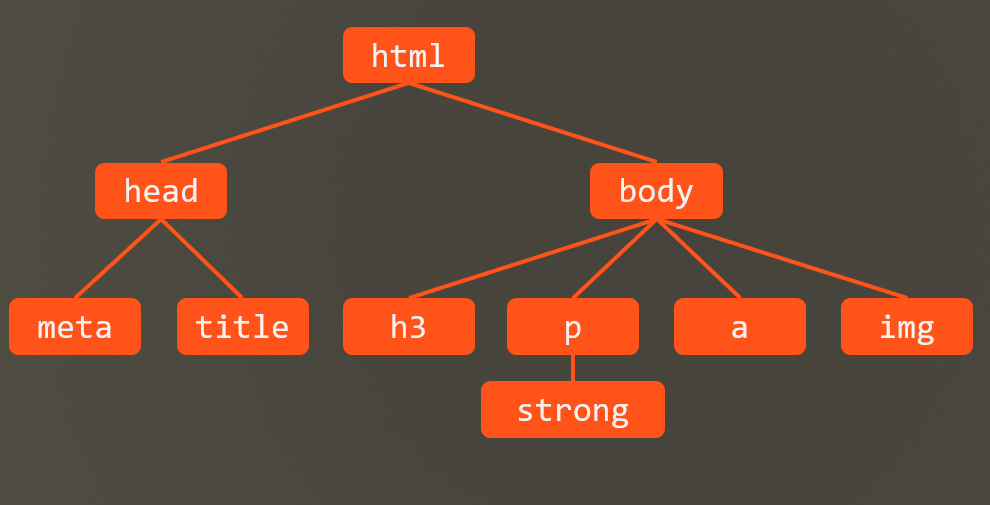

渲染每个元素的前提条件: 该元素的**所有 CSS 属性必须有值**

一个元素，从所有属性都没有值，到所有的属性都有值，这个计算过程，叫做属性值计算过程

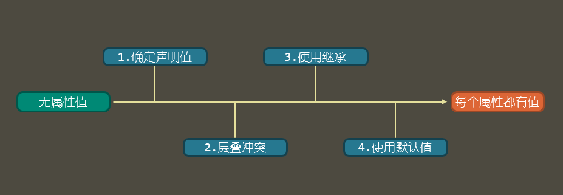

特殊的两个 CSS 取值:

-   **inherit: 手动（强制）继承，将父元素的值取出应用到该元素**
-   **initial: 初始值，将该属性设置为默认值**

---

### CSS 属性计算过程详解

你是否了解 CSS 的属性计算过程呢？

有的同学可能会讲，CSS 属性我倒是知道，例如:

```css
p {
	color: red;
}
```

上面的 CSS 代码中，p 是元素选择器，color 就是其中的一个 CSS 属性。

但是要说 CSS 属性的计算过程，还真的不是很清楚。

没关系，通过此篇文章，能够让你彻底明白什么是 CSS 属性的计算流程。

首先，不知道你有没有考虑过这样的一个问题，假设在 HTML 中有这么一段代码:

```html
<body>
	<h1>这是一个h1标题</h1>
</body>
```

上面的代码也非常简单，就是在 body 中有一个 h1 标题而已，该 h1 标题呈现出来的外观是如下:

<body>
	<h1>这是一个h1标题</h1>
</body>

目前我们没有设置该 h1 的任何样式，但是却能看到该 h1 有一定的默认样式，例如有默认的字体大小、默认的颜色。

那么问题来了，我们这个 h1 元素上面除了有默认字体大小、默认颜色等属性以外，究竟还有哪些属性呢？

答案是**该元素上面会有 CSS 所有的属性。**你可以打开浏览器的开发者面板，选择【元素】，切换到【计算样式】，之后勾选【全部显示】，此时你就能看到在此 h1 上面所有 CSS 属性对应的值。

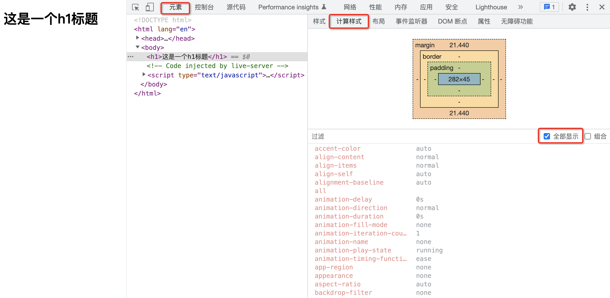

换句话说，**我们所书写的任何一个 HTML 元素，实际上都有完整的一整套 CSS 样式**。这一点往往是让初学者比较意外的，因为我们平时在书写 CSS 样式时，往往只会书写必要的部分，例如前面的:

```css
p {
	color: red;
}
```

这往往会给我们造成一种错觉，认为该 p 元素上面就只有 color 属性。而真实的情况确是，任何一个 HTML 元素，都有一套完整的 CSS 样式，只不过你没有书写的样式，**大概率可能**会使用其默认值。例如上图中 h1 一个样式都没有设置，全部都用的默认值。

但是注意，我这里强调的是“大概率可能”，难道还有我们“没有设置值，但是不使用默认值”的情况么？

嗯，确实有的，所以我才强调你要了解“CSS 属性的计算过程”。

总的来讲，属性值的计算过程，分为如下这么 _4_ 个步骤:

> 1.  确定声明值
> 2.  层叠冲突
> 3.  使用继承
> 4.  使用默认值

#### **<font color=$00c8c8>确定声明值</font>**

首先第一步，是确定声明值。所谓声明值就是作者自己所书写的 CSS 样式，例如前面的:

```css
p {
	color: red;
}
```

这里我们声明了 p 元素为红色，那么就会应用此属性设置。

当然，除了作者样式表，一般浏览器还会存在“用户代理样式表”，简单来讲就是浏览器内置了一套样式表。

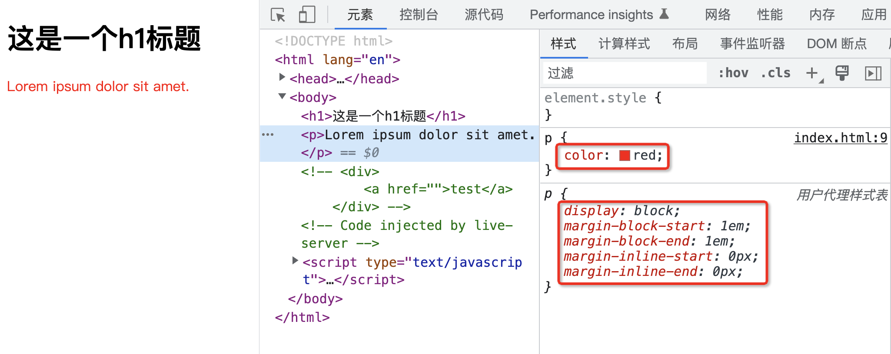

> 在上面的示例中，作者样式表中设置了 color 属性，而用户代理样式表（浏览器提供的样式表）中设置了诸如 display、margin-block-start、margin-block-end、margin-inline-start、margin-inline-end 等属性对应的值。

这些值目前来讲也没有什么冲突，因此最终就会应用这些属性值。

#### **<font color=$00c8c8>层叠冲突</font>**

> 在确定声明值时，可能出现一种情况，那就是声明的样式规则发生了**冲突**。

此时会进入解决层叠冲突的流程。
[而这一步又可以细分为下面这三个步骤:](#)

> 1.  比较源的重要性
> 2.  比较优先级
> 3.  比较次序

-   **[比较源的重要性](https://developer.mozilla.org/zh-CN/docs/Web/CSS/Cascade)**

    > 当不同的 CSS 样式来源拥有相同的声明时，此时就会根据样式表来源的重要性来确定应用哪一条样式规则。

    -   **样式表的源**

        -   网页的作者可以定义文档的样式，这是最常见的样式表，称之为**页面作者样式**。

        -   浏览器的用户，可以使用自定义样式表定制使用体验，称之为**用户样式**。

        -   浏览器会有一个基本的样式表来给任何网页设置默认样式。这些样式统称**用户代理样式**。

    **==_对应的重要性顺序依次为: 页面作者样式 > 用户样式 > 用户代理样式_==**

    例如
    现在有**页面作者样式表**和**用户代理样式表**中存在属性的冲突，那么会以作者样式表优先。

    ```css
    p {
    	color: red;
    	display: inline-block;
    }
    ```

    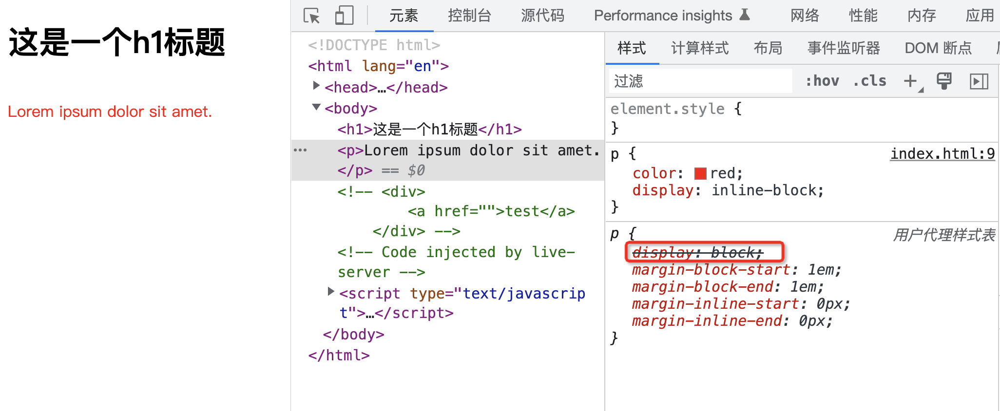

    > 可以明显的看到，作者样式表和用户代理样式表中同时存在的 display 属性的设置，最终作者样式表干掉了用户代理样式表中冲突的属性。这就是第一步，根据不同源的重要性来决定应用哪一个源的样式。

-   **比较优先级**

    那么接下来，如果是在在同一个源中有样式声明冲突怎么办呢？此时就会进行样式声明的优先级比较。

    例如:

    ```html
    <div class="test">
    	<h1>test</h1>
    </div>
    ```

    ```css
    .test h1 {
    	font-size: 50px;
    }

    h1 {
    	font-size: 20px;
    }
    ```

    在上面的代码中，同属于**页面作者样式**，源的重要性是相同的，此时会以[选择器的权重](https://developer.mozilla.org/en-US/docs/Web/CSS/Specificity)来比较重要性。

    很明显，上面的选择器的权重要大于下面的选择器，因此最终标题呈现为 _50px_。

    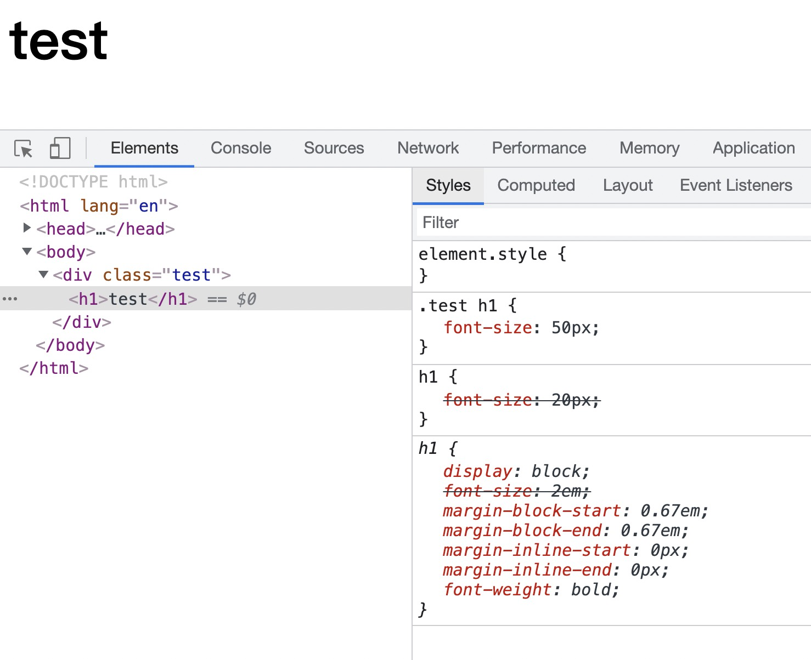

    可以看到，落败的作者样式在 _Elements>Styles_ 中会被划掉。

-   **比较次序**

    经历了上面两个步骤，大多数的样式声明能够被确定下来。但是还剩下最后一种情况，那就是样式声明既是同源，权重也相同。

    此时就会进入第三个步骤，比较样式声明的次序。

    举个例子:

    ```css
    h1 {
    	font-size: 50px;
    }
    
    h1 {
    	font-size: 20px;
    }
    ```

    在上面的代码中，同样都是**页面作者样式**，**选择器的权重也相同**，此时位于下面的样式声明会层叠掉上面的那一条样式声明，最终会应用 _20px_ 这一条属性值。

#### **<font color=#00c8c8>使用继承</font>**

> 层叠冲突这一步完成后，解决了相同元素被声明了多条样式规则究竟应用哪一条样式规则的问题。

那么如果没有声明的属性呢？ 那就是使用继承而来的值。

例如:

```html
<div>
	<p>Lorem ipsum dolor sit amet.</p>
</div>
```

```css
div {
	color: red;
}
```

在上面的代码中，我们针对 div 设置了 color 属性值为红色，而针对 p 元素我们没有声明任何的属性，但是由于 color 是可以继承的，因此 p 元素从**最近的** div 身上继承到了 color 属性的值。

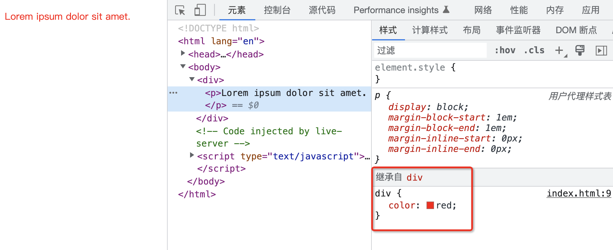

这里有两个点需要同学们注意一下。

首先第一个是我强调了是**最近的** div 元素，看下面的例子:

```html
<div class="test">
	<div>
		<p>Lorem ipsum dolor sit amet.</p>
	</div>
</div>
```

```css
div {
	color: red;
}
.test {
	color: blue;
}
```

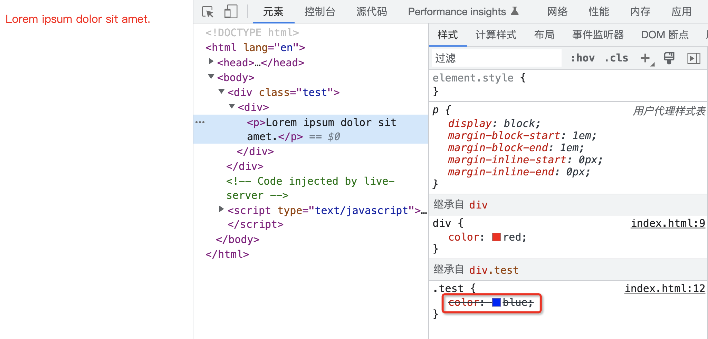

因为这里并不涉及到选中 p 元素声明 color 值，而是从父元素上面继承到 color 对应的值，因此这里是**谁近就听谁**的，初学者往往会产生混淆，又去比较权重，但是这里根本不会涉及到权重比较，因为压根儿就没有选中到 p 元素。

#### **<font color=#00c8c8>使用默认值</font>**

好了，目前走到这一步，如果属性值都还不能确定下来，那么就只能是使用默认值了。

如下图所示:
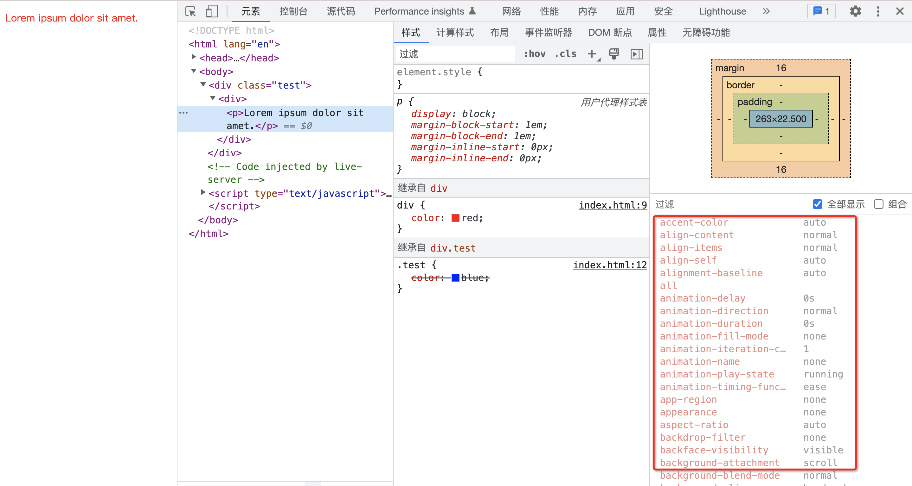

前面我们也说过，一个 HTML 元素要在浏览器中渲染出来，必须具备所有的 CSS 属性值，但是绝大部分我们是不会去设置的，用户代理样式表里面也不会去设置，也无法从继承拿到，因此最终都是用默认值。

### 一道面试题

好了，学习了今天的内容，让我来用一道面试题测试测试大家的理解程度。

下面的代码，最终渲染出来的效果，a 元素是什么颜色？p 元素又是什么颜色？

```html
<div>
	<a href="">test</a>
	<p>test</p>
</div>
```

```css
div {
	color: red;
}
```

大家能说出为什么会呈现这样的结果么？

解答如下:
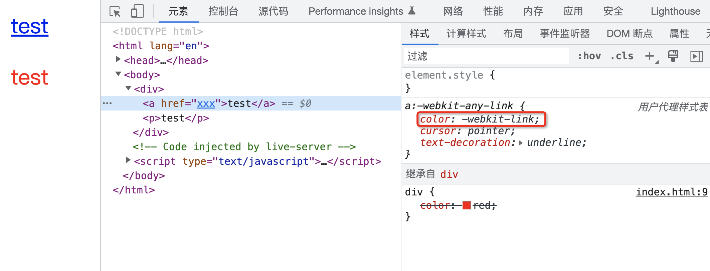

> 实际上原因很简单，因为 a 元素在用户代理样式表中已经设置了 color 属性对应的值，因此会应用此**声明值**。而在 p 元素中无论是作者样式表还是用户代理样式表，都没有对此属性进行声明，然而由于 color 属性是可以继承的，因此最终 p 元素的 color 属性值通过继承来自于父元素。

但是 可以设置如下

```html
<div>
	<a href="">test</a>
	<p>test</p>
</div>
```

```css
div {
	color: red;
}
a {
	/**强制继承父元素color属性  页面作者样式 > 用户样式 > 用户代理样式 */
	color: inherit;
}
```

强制继承父元素 color 属性 这样在第二步层叠冲突中:

> 页面作者样式 > 用户样式 > 用户代理样式

就会应用父元素的颜色

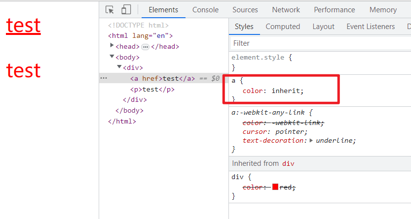

## 盒模型

> [box: 盒子，每个元素在页面中都会生成一个矩形区域（盒子）](https://developer.mozilla.org/zh-CN/docs/Learn/CSS/Building_blocks/The_box_model)

盒子类型:

1. 行盒

    > display 等于 inline 的元素

    - 盒子不会产生换行。
    - width 和 height 属性将不起作用。
    - 垂直方向的内边距、外边距以及边框会被应用但是不会把其他处于 inline 状态的盒子推开。
    - 水平方向的内边距、外边距以及边框会被应用且会把其他处于 inline 状态的盒子推开。

2. 块盒

    > display 等于 block 的元素

    - 盒子会在内联的方向上扩展并占据父容器在该方向上的所有可用空间，在绝大数情况下意味着盒子会和父容器一样宽
    - 每个盒子都会换行
    - width 和 height 属性可以发挥作用
    - 内边距（padding）, 外边距（margin）和 边框（border）会将其他元素从当前盒子周围“推开”

display 默认值为 inline

浏览器默认样式表设置的块盒: 容器元素、h1~h6、p

常见的行盒: span、a、img、video、audio

### 盒子的组成部分

> 无论是行盒、还是块盒，都由下面几个部分组成，从内到外分别是:

1.  **内容 content**

    width、height，设置的是盒子内容的宽高

    内容部分通常叫做整个盒子的**内容盒 content-box**

2.  **填充(内边距) padding**

    盒子边框到盒子内容的距离

    padding-left、padding-right、padding-top、padding-bottom

    padding: 简写属性

    padding: 上 右 下 左

    填充区+内容区 = **填充盒 padding-box**

3.  **边框 border**

    边框 = 边框宽度 + 边框样式 +边框颜色

    边框宽度: border-width
    边框样式: border-style
    边框颜色: border-color

    边框+填充区+内容区 = **边框盒 border-box**

4.  **外边距 margin**

    边框到其他盒子的距离

    margin-top、margin-left、margin-right、margin-bottom

    速写属性 margin

<br/>

  <style>
	.margin-container {
		width:500px;
		height:100px;
		border: 2px solid #00c8c8;
	}
	.margin-box {
		margin-top: -20px;
		margin-right: 20px;
		margin-bottom: 20px;
		margin-left: 4em;
		border: 4px solid red;
	}
</style>
<div class="margin-container">
	<div class="margin-box">Change my margin.</div>
</div>

<br/>

**外边距折叠**

> 理解外边距的一个关键是外边距折叠的概念。如果你有两个外边距相接的元素，这些外边距将合并为一个外边距，即最大的单个外边距的大小。

### 盒模型应用

#### 改变宽高范围

默认情况下，width 和 height 设置的是内容盒宽高。

> 页面重构师: 将 psd 文件（设计稿）制作为静态页面

衡量设计稿尺寸的时候，往往使用的是边框盒，但设置 width 和 height，则设置的是内容盒

1.  精确计算
2.  CSS3: `box-sizing` 属性改变盒模型()

    > [CSS 中的 box-sizing 属性定义了 user agent 应该如何计算一个元素的总宽度和总高度。](https://developer.mozilla.org/zh-CN/docs/Web/CSS/box-sizing)

    -   **`content-box`**

        > 是默认值。如果你设置一个元素的宽为 100px，那么这个元素的内容区会有 100px 宽，并且任何边框和内边距的宽度都会被增加到最后绘制出来的元素宽度中。

        尺寸计算公式:

        -   width = 内容的宽度
        -   height = 内容的高度
            宽度和高度的计算值都不包含内容的边框（border）和内边距（padding）。

    -   **`border-box`**

        > 告诉浏览器: 你想要设置的边框和内边距的值是包含在 width 内的。也就是说，如果你将一个元素的 width 设为 100px，那么这 100px 会包含它的 border 和 padding，内容区的实际宽度是 width 减去 (border + padding) 的值。大多数情况下，这使得我们更容易地设定一个元素的宽高。

        尺寸计算公式:

        -   width = border + padding + 内容的宽度
        -   height = border + padding + 内容的高度

    **==border-box 不包含 margin==**

    ```css
    .box {
    	box-sizing: border-box;
    }
    ```

    如果你希望所有元素都使用替代模式，而且确实很常用，设置 box-sizing 在 <html> 元素上，然后设置所有元素继承该属性，正如下面的例子

    ```css
    html {
    	box-sizing: border-box;
    }
    *,
    *::before,
    *::after {
    	box-sizing: inherit;
    }
    ```

#### 改变背景覆盖范围

默认情况下，背景覆盖边框盒

可以通过 `background-clip` 进行修改

#### 溢出处理

`overflow`，控制内容溢出边框盒后的处理方式

#### 断词规则

`word-break`

> 会影响文字在什么位置被截断换行

-   normal

    > 普通。CJK(中日韩)字符（文字位置截断），非 CJK 字符（单词位置截断）

-   break-all

    > 截断所有。所有字符都在文字处截断

-   keep-all
    > 保持所有。所有文字都在单词之间截断

#### 空白处理

`white-space: nowrap` // 不换行

单行文本不换行溢出部分 **...** 代替

```css
white-space: nowrap;
overflow: hidden;
text-overflow: ellipsis;
```

如下

<style>
	.li{
		border-bottom: 1px dashed #ccc;
		line-height: 2;
		border-left: 3px solid #008c8c;
		padding-left: 10px;
		margin: 1em 0;
		width: 200px;
		white-space: nowrap;
		overflow: hidden;
		text-overflow: ellipsis;
	}
</style>
<ul>
	<li class="li">Deserunt voluptas numquam doloremque beatae!</li>
	<li class="li">Repudiandae deserunt temporibus tempora quaerat?</li>
	<li class="li">Explicabo perspiciatis aspernatur maiores. Accusantium?</li>
</ul>

```css
/* 核心作用
white-space: nowrap;
overflow: hidden;
text-overflow: ellipsis;
 */
<style>
	li{
		border-bottom: 1px dashed #ccc;
		line-height: 2;
		border-left: 3px solid #008c8c;
		padding-left: 10px;
		margin: 1em 0;
		width: 200px;
		white-space: nowrap;
		overflow: hidden;
		text-overflow: ellipsis;
	}
</style>
<ul>
	<li>Deserunt voluptas numquam doloremque beatae!</li>
	<li>Repudiandae deserunt temporibus tempora quaerat?</li>
	<li>Explicabo perspiciatis aspernatur maiores. Accusantium?</li>
</ul>
```

## 行盒的盒模型

常见的行盒: 包含具体内容的元素

span、strong、em、i、img、video、audio

### 显著特点

1. 盒子沿着内容沿伸
2. 行盒不能设置宽高

    调整行盒的宽高，应该使用字体大小、行高、字体类型，间接调整。

3. padding 内边距（填充区）

    水平方向有效，垂直方向不会实际占据空间。

4. border 边框

    水平方向有效，垂直方向不会实际占据空间。

5. margin 外边距

    水平方向有效，垂直方向不会实际占据空间。

### 行块盒

`display: inline-block` 的盒子

1. 不独占一行
2. 盒模型中所有尺寸都有效

### 空白折叠

> 空白折叠，发生在行盒（行块盒）内部 或 行盒（行块盒）之间

### 可替换元素 和 非可替换元素

大部分元素，页面上显示的结果，取决于元素内容，称为**非可替换元素**

**<font color=#00c8c8>少部分元素，页面上显示的结果，取决于元素属性，称为可替换元素**</font>

可替换元素: img、video、audio

绝大部分可替换元素均为行盒。

可替换元素类似于行块盒，盒模型中所有尺寸都有效。

## 常规流

-   **盒模型**

    > 规定单个盒子的规则

-   **视觉格式化模型（布局规则）**

    > 页面中的多个盒子排列规则

[CSS 视觉格式化模型（*visual formatting model）*是用来处理和在视觉媒体上显示文档时使用的计算规则。该模型是 CSS 的基础概念之一。](https://developer.mozilla.org/zh-CN/docs/Web/CSS/Visual_formatting_model)

视觉格式化模型，大体上将页面中盒子的排列分为三种方式:

-   **常规流**
-   **浮动**
-   **定位**

### 常规流布局

常规流、文档流、普通文档流、常规文档流

所有元素，默认情况下，都属于常规流布局

总体规则:

> 块盒独占一行
> 行盒水平依次排列

**包含块（containing block）**

> 每个盒子都有它的包含块，**==包含块决定了盒子的排列区域(活动范围)。==**

**绝大部分情况下: 盒子的包含块，为其父元素的 _内容盒_**

#### 块盒

#####　 <font color=#00c8c8>每个块盒的总宽度，必须刚好等于包含块的宽度</font>
所以设置 margin 为负数时内容会超过包含快

宽度的默认值是 auto

margin 的取值也可以是 auto，**默认值 0**

auto

> 将剩余空间吸收掉

width 吸收能力强于 margin （**width、margin 都为 auto 时 width 全部吸收**）

若宽度、边框、内边距、外边距计算后，仍然有剩余空间，该剩余空间被 margin-right 全部吸收

> 在常规流中，块盒在其包含块中水平居中，可以定宽、然后左右 margin 设置为 auto。

#####　 <font color=#00c8c8>每个块盒垂直方向上的 auto 值</font>

height:auto， 适应**内容**的高度

margin:auto， 表示 0

#####　 <font color=#00c8c8>百分比取值</font>

_padding、width、margin_ 可以取值为百分比

**以上的所有百分比相对于 _包含块的宽度_**。

高度的百分比:

1. 包含块的高度取决于子元素的高度，设置百分比无效
2. 包含块的高度不取决于子元素的高度，百分比相对于父元素高度

#####　 <font color=#00c8c8>外边距折叠</font>

两个**常规流**块盒，上下**外边距相邻**，会进行合并。两个外边距取最大值。

> 在规范中提到，块级元素之间的外边距会发生折叠。这意味着，如果一个具有上边距的元素排在在一个具有下边距的元素之下时，他们之间的间距不会是这两个外边距的和，即外边距会发生折叠，简单来说就是，间距与两个外边距中的较大者一样大。

### CSS 之包含块

> [一个元素的尺寸和位置经常受其包含块（containing block）的影响。大多数情况下，包含块就是这个元素最近的祖先块元素的内容区域，但也不是总是这样。](https://developer.mozilla.org/zh-CN/docs/Web/CSS/Containing_block)

包含块英语全称为**containing block**，实际上平时你在书写 CSS 时，大多数情况下你是感受不到它的存在，因此你不知道这个知识点也是一件很正常的事情。但是这玩意儿是确确实实存在的，在 CSS 规范中也是明确书写了的:

*https://drafts.csswg.org/css2/#containing-block-details*

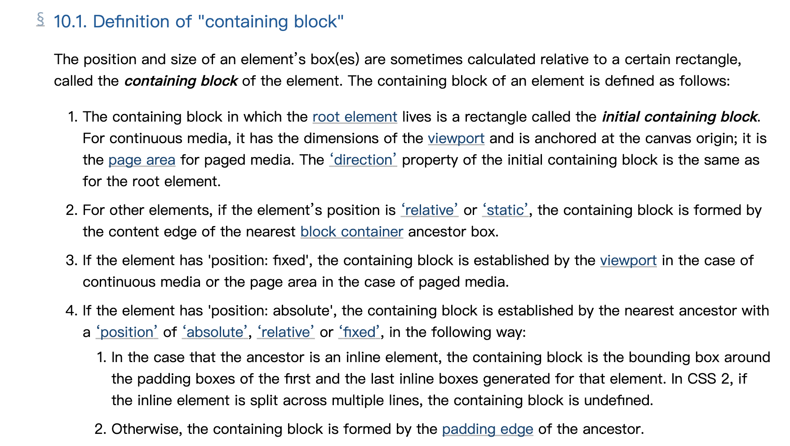

并且，如果你不了解它的运作机制，有时就会出现一些你认为的莫名其妙的现象。

那么，这个包含块究竟说了什么内容呢？

说起来也简单，**就是元素的尺寸和位置，会受它的包含块所影响。对于一些属性，例如 width, height, padding, margin，绝对定位元素的偏移值（比如 position 被设置为 absolute 或 fixed），当我们对其赋予百分比值时，这些值的计算值，就是通过元素的包含块计算得来。**

```html
<style>
	.container-1 {
		width: 500px;
		height: 300px;
		background-color: skyblue;
	}
	.item-1 {
		width: 50%;
		height: 50%;
		background-color: red;
	}
</style>
<body>
	<div class="container-1">
		<div class="item-1"></div>
	</div>
</body>
```

请仔细阅读上面的代码，然后你认为 div.item-1 这个盒子的宽高是多少？

<style>
	.container-1 {
		width: 500px;
		height: 300px;
		background-color: skyblue;
		/* padding:0 20px */
	}
	.item-1 {
		width: 50%;
		height: 50%;
		background-color: red;
	}
</style>
<body>

    <div class="container-1">
    	<div class="item-1"></div>
    </div>

</body>

相信你能够很自信的回答这个简单的问题，div.item-1 盒子的 width 为 250px，height 为 150px。

这个答案确实是没有问题的，但是如果我追问你是怎么得到这个答案的，我猜不了解包含块的你大概率会说，因为它的父元素 div.container-1 的 width 为 500px，50% 就是 250px，height 为 300px，因此 50% 就是 150px。

这个答案实际上是不准确的。正确的答案应该是，**div.item-1 的宽高是根据它的包含块来计算的**，而这里包含块的大小，正是这个元素最近的祖先块元素的内容区。

因此正如我前面所说，**很多时候你都感受不到包含块的存在。**

包含块分为两种

1.  ==一种是根元素（HTML 元素）所在的包含块，被称之为初始包含块（**initial containing block**）。==

    > ==对于浏览器而言，初始包含块的的大小等于视口 viewport 的大小，基点在画布的原点（视口左上角）。它是作为元素绝对定位和固定定位的参照物。==

2.  ==另外一种是对于**非根元素**==

    -   ==如果元素的 positiion 是 relative 或 static ，那么包含块由离它最近的**块容器**（block container）的**内容区**域（content area）的边缘建立。==
    -   ==如果 position 属性是 fixed，那么包含块由视口建立。==
    -   ==如果元素使用了 absolute 定位，则包含块由它的最近的 position 的值不是 static （也就是值为 fixed、absolute、relative 或 sticky）的祖先元素的**内边距区**的边缘组成。==

前面两条实际上都还比较好理解，第三条往往是初学者容易比较忽视的，我们来看一个示例:

```html
<style>
	.container-2 {
		width: 500px;
		height: 300px;
		background-color: skyblue;
		position: relative;
	}
	.item-2 {
		width: 300px;
		height: 150px;
		border: 5px solid;
		margin-left: 100px;
	}
	.item2-2 {
		width: 100px;
		height: 100px;
		background-color: red;
		position: absolute;
		left: 10px;
		top: 10px;
	}
</style>
<body>
	<div class="container-2">
		<div class="item-2">
			<div class="item2-2"></div>
		</div>
	</div>
</body>
```

首先阅读上面的代码，然后你能在脑海里面想出其大致的样子么？或者用笔和纸画一下也行。

公布正确答案:

<style>
	.container-2 {
		width: 500px;
		height: 300px;
		background-color: skyblue;
		position: relative;
	}
	.item-2 {
		width: 300px;
		height: 150px;
		border: 5px solid;
		margin-left: 100px;
	}
	.item2-2 {
		width: 100px;
		height: 100px;
		background-color: red;
		position: absolute;
		left: 10px;
		top: 10px;
	}
</style>
<body>
	<div class="container-2">
		<div class="item-2">
			<div class="item2-2"></div>
		</div>
	</div>
</body>

其实原因也非常简单，根据上面的第三条规则，对于 div.item2-2 来讲，它的包含块应该是 div.container-2，而非 div.item-2。

实际上对于非根元素来讲，包含块还有一种可能:

==那就是如果 position 属性是 absolute 或 fixed，包含块也可能是由满足以下条件的**最近父级元素的内边距区**的边缘组成的==

-   **transform** 或 **perspective** 的值不是 none
-   **will-change** 的值是 transform 或 perspective
-   **filter** 的值不是 none 或 will-change 的值是 filter(只在 Firefox 下生效).
-   **contain** 的值是 paint (例如: contain: paint;)

我们还是来看一个示例:

```html
<body>
	<div class="container">
		<div class="item">
			<div class="item2"></div>
		</div>
	</div>
</body>
```

```css
.container {
	width: 500px;
	height: 300px;
	background-color: skyblue;
	position: relative;
}
.item {
	width: 300px;
	height: 150px;
	border: 5px solid;
	margin-left: 100px;
	transform: rotate(0deg); /* 新增代码 */
}
.item2 {
	width: 100px;
	height: 100px;
	background-color: red;
	position: absolute;
	left: 10px;
	top: 10px;
}
```

我们对于上面的代码只新增了一条声明，那就是 transform: rotate(0deg)，此时的渲染效果却发生了改变，如下图所示:

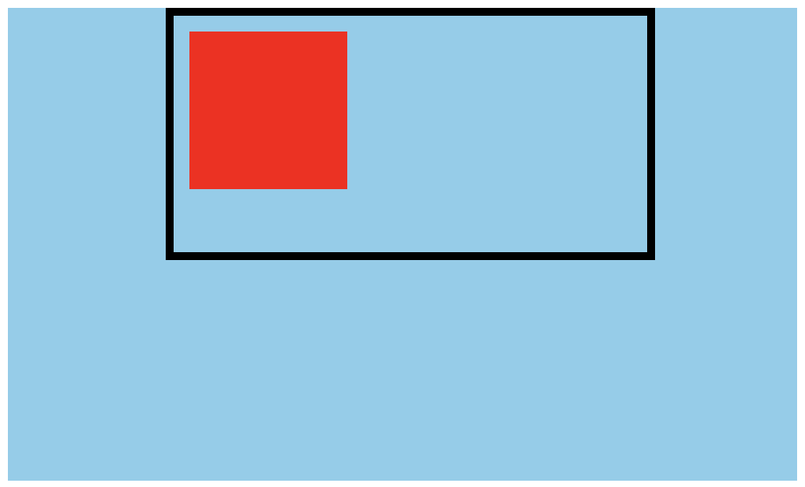

可以看到，此时对于 div.item2 来讲，包含块就变成了 div.item。

我们再把 CSS 规范中所举的例子来看一下。

```html
<html>
	<head>
		<title>Illustration of containing blocks</title>
	</head>
	<body id="body">
		<div id="div1">
			<p id="p1">This is text in the first paragraph...</p>
			<p id="p2">
				This is text
				<em id="em1">
					in the
					<strong id="strong1">second</strong>
					paragraph.
				</em>
			</p>
		</div>
	</body>
</html>
```

上面是一段简单的 HTML 代码，在没有添加任何 CSS 代码的情况下，你能说出各自的包含块么？

对应的结果如下:

| 元素    | 包含块                      |
| ------- | --------------------------- |
| html    | initial C.B. (UA-dependent) |
| body    | html                        |
| div1    | body                        |
| p1      | div1                        |
| p2      | div1                        |
| em1     | p2                          |
| strong1 | p2                          |

首先 HTML 作为根元素，对应的包含块就是前面我们所说的初始包含块，而对于 body 而言，这是一个 static 定位的元素，因此该元素的包含块参照第一条为 html，以此类推 div1、p1、p2 以及 em1 的包含块也都是它们的父元素。

不过 strong1 比较例外，它的包含块确实 p2，而非 em1。为什么会这样？建议你再把非根元素的第一条规则读一下:

-   如果元素的 positiion 是 relative 或 static ，那么包含块由离它最近的**块容器**（block container）的**内容区域**（content area）的边缘建立。

没错，因为 em1 不是块容器，而包含块是**离它最近的块容器**的内容区域，所以是 p2。

接下来添加如下的 CSS:

```css
#div1 {
	position: absolute;
	left: 50px;
	top: 50px;
}
```

上面的代码我们对 div1 进行了定位，那么此时的包含块会发生变化么？你可以先在自己思考一下。

答案如下:

| 元素    | 包含块                      |
| ------- | --------------------------- |
| html    | initial C.B. (UA-dependent) |
| body    | html                        |
| div1    | initial C.B. (UA-dependent) |
| p1      | div1                        |
| p2      | div1                        |
| em1     | p2                          |
| strong1 | p2                          |

可以看到，这里 div1 的包含块就发生了变化，变为了初始包含块。这里你可以参考前文中的这两句话:

-   初始包含块（**initial containing block**）。对于浏览器而言，初始包含块的的大小等于视口 viewport 的大小，基点在画布的原点（视口左上角）。它是作为元素绝对定位和固定定位的参照物。
-   如果元素使用了 absolute 定位，则包含块由它的最近的 position 的值不是 static （也就是值为 fixed、absolute、relative 或 sticky）的祖先元素的内边距区的边缘组成。

是不是一下子就理解了。没错，因为我们对 div1 进行了定位，因此它会应用非根元素包含块计算规则的第三条规则，寻找离它最近的 position 的值不是 static 的祖先元素，不过显然 body 的定位方式为 static，因此 div1 的包含块最终就变成了初始包含块。

接下来我们继续修改我们的 CSS:

```css
#div1 {
	position: absolute;
	left: 50px;
	top: 50px;
}
#em1 {
	position: absolute;
	left: 100px;
	top: 100px;
}
```

这里我们对 em1 同样进行了 absolute 绝对定位，你想一想会有什么样的变化？

没错，聪明的你大概应该知道，em1 的包含块不再是 p2，而变成了 div1，而 strong1 的包含块也不再是 p2 了，而是变成了 em1。

如下表所示:

| 元素    | 包含块                                                           |
| ------- | ---------------------------------------------------------------- |
| html    | initial C.B. (UA-dependent)                                      |
| body    | html                                                             |
| div1    | initial C.B. (UA-dependent)                                      |
| p1      | div1                                                             |
| p2      | div1                                                             |
| em1     | div1（因为定位了，参阅非根元素包含块确定规则的第三条）           |
| strong1 | em1（因为 em1 变为了块容器，参阅非根元素包含块确定规则的第一条） |

## 浮动

> [浮动曾被用来实现整个网站页面的布局，它使信息列得以横向排列（默认的设定则是按照这些列在源代码中出现的顺序纵向排列）。](https://developer.mozilla.org/zh-CN/docs/Learn/CSS/CSS_layout/Floats)

视觉格式化模型，大体上将页面中盒子的排列分为三种方式:

-   **常规流**
-   **浮动**
-   **定位**

### 应用场景

1. 文字环绕
2. 横向排列

### 浮动的基本特点

修改 `float` 属性值

-   left
    > 左浮动，元素靠上靠左
-   right
    > 右浮动，元素靠上靠右

默认值为 `none`

-   当一个元素**浮动后，元素必定为块盒**(更改 display 属性为 block)
-   浮动元素的包含块，和常规流一样，为父元素的内容盒

### 盒子尺寸

-   宽度为 auto 时，适应内容宽度
-   高度为 auto 时，与常规流一致，适应内容的高度
-   margin 为 auto，为 0.
-   边框、内边距、百分比设置与常规流一样

### 盒子排列 规则

-   左浮动的盒子靠上靠左排列

-   右浮动的盒子考上靠右排列

-   浮动盒子在包含块中排列时，会避开常规流块盒

-   常规流块盒在排列时，无视浮动盒子(个人谬论 浮动飞起来了常规连块盒就看不到了)

-   行盒在排列时，会避开浮动盒子 （文字环绕效果）

    > 如果文字没有在行盒中，浏览器会自动生成一个行盒包裹文字，该行盒叫做匿名行盒。

    > 匿名行盒、匿名块盒是为了满足:
    >
    > > -   内容必须在行盒
    > > -   行盒和块盒不能相邻

-   外边距合并不会发生

-   浮动盒子的顶边不得高于上一个盒子的顶边

-   若剩余空间无法放下浮动的盒子，则该盒子向下移动，直到具备足够的空间能容纳盒子，然后再向左或向右移动

### 高度坍塌

高度坍塌的根源: 常规流盒子的自动高度，在计算时，不会考虑浮动盒子(**因为脱离文档流了(浮动:飘起来了)**)

**css 属性:`clear`**

-   **默认值: none**
-   **left**
    > 清除左浮动，该元素必须出现在前面所有左浮动盒子的下方
-   **right**
    > 清除右浮动，该元素必须出现在前面所有右浮动盒子的下方
-   **both**
    > 清除左右浮动，该元素必须出现在前面所有浮动盒子的下方

**清除浮动**

-   **clearfix 小技巧**

    > 传统上，这个问题通常由所谓的 "clearfix 小技巧" 解决，其过程为: 先向包含浮动内容及其本身的盒子后方插入一些生成的内容，并将生成的内容清除浮动。

    **常用方法是<font color=#00c8c8>浮动元素的父级元素设置如下样式</font>**

    ```css
    .clearfix::after {
    	content: '';
    	display: block;
    	clear: both;
    }
    ```

-   **使用 overflow (创建 BFC)**
    > 一个替代的方案是将包裹元素的 overflow 属性设置为除 visible 外的其他值

<!DOCTYPE html>
<html lang="en">
	<head>
		<meta charset="UTF-8" />
		<meta name="viewport" content="width=device-width, initial-scale=1.0" />
		<meta http-equiv="X-UA-Compatible" content="ie=edge" />
		<title>Document</title>
		<style>
			.float-container {
				background: lightblue;
				padding: 30px;
			}
    		.float-item {
    			width: 100px;
    			height: 100px;
    			background: red;
    			margin: 6px;
    			float: left;
				text-align:center;
				line-height : 100px;
			}
    		.float-last {
    			width: 220px;
    			height: 220px;
    			background: lightpink;
    			margin: 6px;
    		}
    		.clearfix::after {
    			content: '';
    			display: block;
    			clear: both;
    		}
			.float-last {
    			content: '';
    			display: block;
    			clear: both;
    		}
    	</style>
    </head>
    <body>
    	<div class="float-container clearfix">
    		<div class="float-item">1</div>
    		<div class="float-item">2</div>
    		<div class="float-item">3</div>
    		<div class="float-item">4</div>
    		<div class="float-item">5</div>
    		<div class="float-item">6</div>
    		<div class="float-item">7</div>
    		<div class="float-last">last</div>
    	</div>
    </body>
</html>

```html
<!DOCTYPE html>
<html lang="en">
	<head>
		<meta charset="UTF-8" />
		<meta name="viewport" content="width=device-width, initial-scale=1.0" />
		<meta http-equiv="X-UA-Compatible" content="ie=edge" />
		<title>Document</title>
		<style>
			.float-container {
				background: lightblue;
				padding: 30px;
			}
			.float-item {
				width: 100px;
				height: 100px;
				background: red;
				margin: 6px;
				float: left;
				text-align: center;
				line-height: 100px;
			}
			.float-last {
				width: 220px;
				height: 220px;
				background: lightpink;
				margin: 6px;
			}
			.clearfix::after {
				content: '';
				display: block;
				clear: both;
			}
			.float-last {
				content: '';
				display: block;
				clear: both;
			}
		</style>
	</head>
	<body>
		<div class="float-container clearfix">
			<div class="float-item">1</div>
			<div class="float-item">2</div>
			<div class="float-item">3</div>
			<div class="float-item">4</div>
			<div class="float-item">5</div>
			<div class="float-item">6</div>
			<div class="float-item">7</div>
			<div class="float-last">last</div>
		</div>
	</body>
</html>
```

## 定位

> [定位允许你从正常的文档流布局中取出元素，并使它们具有不同的行为，例如放在另一个元素的上面，或者始终保持在浏览器视窗内的同一位置。](https://developer.mozilla.org/zh-CN/docs/Learn/CSS/CSS_layout/Positioning)

视觉格式化模型，大体上将页面中盒子的排列分为三种方式:

-   **常规流**
-   **浮动**
-   **定位**

定位: 手动控制元素在包含块中的精准位置

涉及的 CSS 属性: position

### position 属性

-   默认值: **static** ，静态定位（不定位）

    > 静态定位是每个元素获取的默认值——它只是意味着“将元素放入它在文档布局流中的正常位置 ——这里没有什么特别的。

-   **relative**: 相对定位 (相对自己之前的位置)

    > 它与静态定位非常相似，占据在正常的文档流中，除了你仍然可以修改它的最终位置，包括让它与页面上的其他元素重叠。

-   **absolute**: 绝对定位 (相对祖先定位元素的位置)

    -   **定位上下文**

        > [哪个元素是绝对定位元素的“包含元素“？这取决于绝对定位元素的父元素的 position 属性。](https://developer.mozilla.org/zh-CN/docs/Web/CSS/Containing_block#identifying_the_containing_block).

        如果所有的父元素都没有显式地定义 position 属性，那么所有的父元素默认情况下 position 属性都是 static。结果，绝对定位元素会被包含在初始块容器中。这个初始块容器有着和浏览器视口一样的尺寸，并且\<html>元素也被包含在这个容器里面。**简单来说，绝对定位元素会被放在\<html>元素的外面，并且根据浏览器视口来定位。**

-   **fixed**: 固定定位 (相对视口的位置)

    > 绝对定位将元素固定在相对于其位置最近的祖先。（如果没有，则为初始包含它的块）而固定定位固定元素则是相对于浏览器视口本身。

-   **sticky**: 基本上是相对位置和固定位置的混合体

    > 它允许被定位的元素表现得像相对定位一样，直到它滚动到某个阈值点（例如，从视口顶部起 10 像素）为止，此后它就变得固定了。例如，它可用于使导航栏随页面滚动直到特定点，然后粘贴在页面顶部。

一个元素，只要 position 的取值不是 static，认为该元素是一个定位元素。

**<font color=#00c8c8>定位元素会脱离文档流（相对定位除外）</font>**

**一个脱离了文档流的元素:**

> 文档流中的元素摆放时，会忽略脱离了文档流的元素
> 文档流中元素计算自动高度时，会忽略脱离了文档流的元素 **<font color=#00c8c8>(高度坍塌)</font>**

### 相对定位

不会导致元素脱离文档流，只是让元素在原来位置上进行偏移。

可以通过四个 CSS 属性对设置其位置:

-   left
-   right
-   top
-   bottom

盒子的偏移不会对其他盒子造成任何影响。

### 绝对定位

1. 宽高为 auto，适应内容
2. 包含块变化: 找祖先中第一个定位元素，该元素的 **==填充盒为其包含块==**。若找不到，则它的包含块为整个网页（初始化包含块）

### 固定定位

其他情况和绝对定位完全一样。

包含块不同: 固定为视口（浏览器的可视窗口）

### 定位下的居中

某个方向居中:

1. 定宽（高）
2. 将左右（上下）距离设置为 0
3. 将左右（上下）margin 设置为 auto

**绝对定位和固定定位中，margin 为 auto 时，会自动吸收剩余空间**

### 多个定位元素重叠时

堆叠上下文

设置 z-index，通常情况下，该值越大，越靠近用户

**只有定位元素设置 z-index 有效**

z-index 可以是负数，如果是负数，则遇到常规流、浮动元素，则会被其覆盖

### 补充

-   绝对定位、固定定位元素的 一定是块盒 （相对定位不会改变 display）
-   绝对定位、固定定位元素的 一定不是浮动
-   没有外边距合并

## @规则

at-rule: @规则、@语句、CSS 语句、CSS 指令

1. import

```css
@import '路径';
```

导入另外一个 css 文件

2. charset

@charset "utf-8";

告诉浏览器该 CSS 文件，使用的字符编码集是 utf-8，必须写到第一行

```css
@charset "utf-8";
@import 'reset.css';

h1 {
	text-align: center;
	font-size: 3em;
}
```

## web 字体和图标

### web 字体

用户电脑上没有安装相应字体，强制让用户下载该字体

**[@font-face](https://developer.mozilla.org/zh-CN/docs/Web/CSS/@font-face)**

> @font-face CSS at-rule 指定一个用于显示文本的自定义字体；字体能从远程服务器或者用户本地安装的字体加载。如果提供了 local() 函数，从用户本地查找指定的字体名称，并且找到了一个匹配项，本地字体就会被使用。否则，字体就会使用 url() 函数下载的资源。通过允许作者提供他们自己的字体，@font-face 让设计内容成为了一种可能，同时并不会被所谓的"网络 - 安全"字体所限制 (字体如此普遍以至于它们能被广泛的使用). 指定查找和使用本地安装的字体名称可以让字体的自定义化程度超过基本字体，同时在不依赖网络情况下实现此功能。在同时使用 url() 和 local() 功能时，为了用户已经安装的字体副本在需要使用时被使用，如果在用户本地没有找到字体副本就会去使用户下载的副本查找字体。@font-face 规则不仅仅使用在 CSS 的顶层，还可以用在任何 CSS 条件组规则中。

```css
@font-face {
	font-family: 'Open Sans';
	src: url('/fonts/OpenSans-Regular-webfont.woff2') format('woff2'), url('/fonts/OpenSans-Regular-webfont.woff') format('woff');
}
```

这是一个叫做@font-face 的 CSS @规则 ，它允许网页开发者为其网页指定在线字体。通过这种作者自备字体的方式，@font-face 可以消除对用户电脑字体的依赖。

**[font-family](https://developer.mozilla.org/zh-CN/docs/Web/CSS/@font-face/font-family)**

> font-family 属性允许我们为页面上的字体指定一个由 @font-face 规则定义的字体族

```css
/* <string> values */
font-family: 'font family';
font-family: 'another font family';

/* <IDENT> value */
font-family: examplefont;
```

### 字体图标

iconfont.cn

## 块级格式化上下文

[全称 Block Formatting Context，简称 BFC](https://developer.mozilla.org/zh-CN/docs/Web/Guide/CSS/Block_formatting_context)

### 它是一块<font color=#00c8c8>‘独立的’ ‘渲染区域’</font>，它规定了在该区域中，<font color=#00c8c8>‘常规流块盒的布局’</font>

-   **独立的**

    不同的 BFC 区域，它们进行渲染时互不干扰

    > 创建 BFC 的元素，隔绝了它内部和外部的联系，内部的渲染不会影响到外部
    > 具体规则:
    >
    > > 1.  创建 BFC 的元素，它的自**动高度需要计算浮动元素**
    > >     解决高度坍塌 .clearfix{ overflow: hidden; }
    > > 2.  创建 BFC 的元素，它的**边框盒不会与浮动元素重叠**
    > >     创建了 BFC 就躲开浮动元素 不会再浮动元素下面(Z 轴)
    > >     **用于布局: 侧边栏固定宽度 内容区宽度自适应**
    > > 3.  创建 BFC 的元素，**不会和它的子元素进行外边距合并**
    > >     处在不同的 BFC 中的元素 不会外边距折叠

-   **渲染区域**

    > 这个区域由某个 HTML 元素创建

    下元素会在其内部 **创建 BFC 区域** :

    -   **根元素** 意味着，\<html>元素创建的 BFC 区域，覆盖了网页中所有的元素
    -   **浮动** 和 **绝对定位** 元素
    -   **overflow 不等于 visible 的块盒**
    -   **display** 为 `inline-block`、`table-cell`、`table-caption`、`flex`、`inline-flex`、`grid`、`inline-grid` 的元素
    -   **contain** 值为 `layout`、`content` 或 `paint` 的元素

-   **常规流块盒的布局**

    > • 常规流块盒在水平方向上，必须撑满包含块
    > • 常规流块盒在包含块的垂直方向上依次摆放
    > • 常规流块盒若外边距无缝相邻，则进行外边距合并
    > • 常规流块盒的自动高度和摆放位置，无视浮动元素

## 布局

### 多栏布局

两栏布局

-   三栏布局

    -   [双飞翼](../布局练习/双飞翼.html)

        > 利用的是浮动元素 margin 负值的应用
        > 主体内容可以优先加载，HTML 代码结构稍微复杂点

        ```html
        <!DOCTYPE html>
        <html lang="en">
        	<head>
        		<style>
        			.content {
        				float: left;
        				width: 100%;
        			}
        			.main {
        				height: 200px;
        				margin-left: 110px;
        				margin-right: 220px;
        				background-color: green;
        			}
        			.left {
        				float: left;
        				height: 200px;
        				width: 100px;
        				margin-left: -100%;
        				background-color: red;
        			}
        			.right {
        				width: 200px;
        				height: 200px;
        				float: right;
        				margin-left: -200px;
        				background-color: blue;
        			}
        		</style>
        	</head>
        	<body>
        		<div class="content">
        			<div class="main"></div>
        		</div>
        		<div class="left"></div>
        		<div class="right"></div>
        	</body>
        </html>
        ```

    -   [圣杯布局](../布局练习/圣杯布局.html)

        > 跟双飞翼布局很像，有一些细节上的区别，相对于双飞翼布局来说，HTML 结构相对简单，但是样式定义就稍微复杂，也是优先加载内容主体。

        ```html
        <!DOCTYPE html>
        <html lang="en">
        	<head>
        		<style>
        			.container {
        				margin-left: 120px;
        				margin-right: 220px;
        			}
        			.main {
        				float: left;
        				width: 100%;
        				height: 300px;
        				background-color: red;
        			}
        			.left {
        				float: left;
        				width: 100px;
        				height: 300px;
        				margin-left: -100%;
        				position: relative;
        				left: -120px;
        				background-color: blue;
        			}
        			.right {
        				float: left;
        				width: 200px;
        				height: 300px;
        				margin-left: -200px;
        				position: relative;
        				right: -220px;
        				background-color: green;
        			}
        		</style>
        	</head>
        	<body>
        		<div class="container">
        			<div class="main"></div>
        			<div class="left"></div>
        			<div class="right"></div>
        		</div>
        	</body>
        </html>
        ```

    -   [BFC](./../布局练习/三栏布局-浮动.html)

        > 缺点 主要内容模块无法最先加载，当页面中内容较多时会影响用户体验

        ```html
        <!DOCTYPE html>
        <html lang="en">
        	<head>
        		<style>
        			.left {
        				float: left;
        				height: 200px;
        				width: 100px;
        				margin-right: 20px;
        				background-color: red;
        			}
        			.right {
        				width: 200px;
        				height: 200px;
        				float: right;
        				margin-left: 20px;
        				background-color: blue;
        			}
        			.main {
        				height: 200px;
        				overflow: hidden;
        				background-color: green;
        			}
        		</style>
        	</head>
        	<body>
        		<div class="container">
        			<div class="left"></div>
        			<div class="right"></div>
        			<div class="main"></div>
        		</div>
        	</body>
        </html>
        ```

### 等高

1. CSS3 的弹性盒

2. JS 控制

3. 伪等高

```css
.container {
	width: 90%;
	margin: 0 auto;
	overflow: hidden;
}
.aside {
	float: left;
	background: #008c8c;
	color: #fff;
	width: 300px;
	margin-right: 30px;
	/*尽量写大一点  以下写法真实高度10px*/
	height: 10000px;
	margin-bottom: -9990px;
}

.main {
	overflow: hidden;
	background: gray;
}
```

### 元素书写顺序

### 后台页面的布局

> 最外层高度固定 菜单栏和内容栏可以滚动

## 行高的取值

**line-height**

> [line-height CSS 属性用于设置多行元素的空间量，如多行文本的间距。对于块级元素，它指定元素行盒（line boxes）的最小高度。对于非替代的 inline 元素，它用于计算行盒（line box）的高度。](https://developer.mozilla.org/zh-CN/docs/Web/CSS/line-height)

### 单位

1. px, 像素值

2. 无单位的数字

```css
/* 行高为字体大小的两倍 */
/* 先计算像素值，再继承 */
line-height: 2em;

/* 行高为字体大小的两倍 */
/* 先继承，再计算 */
line-height: 2;
```

3. em、rem 单位

4. 百分比

---

| **单位** | **相对于**                                                                                    |
| -------- | --------------------------------------------------------------------------------------------- |
| em       | 在 font-size 中使用是相对于父元素的字体大小，在其他属性中使用是相对于自身的字体大小，如 width |
| rem      | 根元素的字体大小                                                                              |
| vw       | 视窗宽度的 1%                                                                                 |
| vh       | 视窗高度的 1%                                                                                 |
| lh       | 元素的 line-height                                                                            |
| ex       | 字符“x”的高度                                                                                 |
| ch       | 数字“0”的宽度                                                                                 |
| vmin     | 视窗较小尺寸的 1%                                                                             |
| vmax     | 视图大尺寸的 1%                                                                               |

## 参考线-深入理解字体

font-size、line-height、vertical-align、font-family

### 文字

文字是通过一些文字制作软件制作的，比如 fontforge

制作文字时，会有几根参考线，不同的文字类型，参考线不一样。同一种文字类型，参考线一致。

参考线:
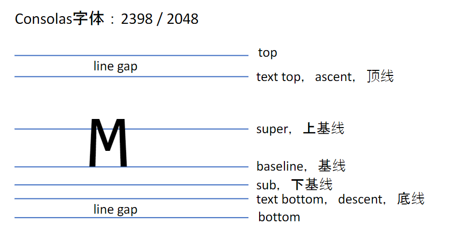

### font-size

字体大小，设置的是文字的相对大小

文字的相对大小: 1000、2048、1024

文字顶线到底线的距离，是文字的实际大小（content-area，内容区）

行盒的背景，覆盖 content-area

### 行高

顶线向上延申的空间，和底线向下延申的空间，两个空间相等，该空间叫做 gap（空隙）

gap 默认情况下，是字体设计者决定

top 到 botoom（看 ppt 图），叫做 virtual-area（虚拟区）

**_行高，就是 virtual-area_**

line-height:normal，默认值，使用文字默认的 gap

> 文字一定出现一行的最中间-----错误
> content-area 一定出现在 virtual-area 的中间(中线重叠)

### **vertical-align**

> [CSS 的属性 vertical-align 用来指定行内元素（inline）或表格单元格（table-cell）元素的垂直对齐方式](https://developer.mozilla.org/zh-CN/docs/Web/CSS/vertical-align)

**<font color=#00c8c8>注意 vertical-align 只对 行内元素、行内块元素 和表格单元格元素生效: 不能用它垂直对齐 块级元素。</font>**

决定参考线: font-size、font-family、line-height

**一个元素如果子元素出现行盒，该元素内部也会产生参考线 <font color=#00c8c8>所以文字必在行盒内（会有匿名行盒 ）这样才会有参考线</font>**

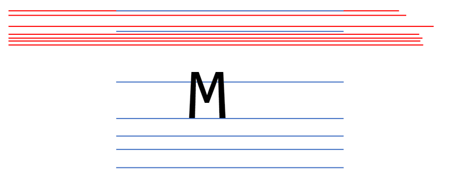

```html
<p>
	M
	<span> M </span>
</p>
```

行盒: inline-box
行框: line-box
行盒组合起来，可以形成多行，每一行的区域叫做 line-box，line-box 的顶边是该行内所有行盒最高顶边，底边是该行行盒的最低底边。

取值:

> 默认基线对齐

-   **baseline**

    > 该元素的基线与父元素的基线对齐

-   **super**

    > 该元素的基线与父元素的上基线对齐

-   **sub**

    > 该元素的基线与父元素的下基线对齐

-   **text-top**

    > 该元素的 virtual-area 的顶边，对齐父元素的 text-top

-   **text-bottom**

    > 该元素的 virtual-area 的底边，对齐父元素的 text-bottom

-   **top**

    > 该元素的 virtual-area 的顶边，对齐 line-box 的顶边（该行中的最高顶边）

-   **bottom**

    > 该元素的 virtual-area 的底边，对齐 line-box 的底边（该行中的最低底边）

-   **middle**
    > 该元素的中线（content-area 的一半），与父元素的 X 字母高度一半的位置对齐

**<font color=#00c8c8>实际，一个元素的实际占用高度（高度自动），高度的计算通过 line-box (行框) 计算。</font>**

数值: 相对于**基线**的偏移量，向上为正数，向下为负数。

百分比: 相对于**基线**的偏移量，百分比是相对于自身 virtual-area(**行高**) 的高度

<font color=#00c8c8>$\underline{line-box 是承载文字内容的必要条件}$</font>，以下情况不生成行框(line-box):

> 1.  某元素内部没有任何行盒
> 2.  某元素字体大小为 0

<style>
	.p {
		background: red;
		font-size: 32px;
		font-family: Arial;
		line-height: normal;
	}
	.span {
		font-size: 200px;
		background: lightblue;
		line-height: normal;
	}
</style>
<p class="p">
	M
	<span class="span"> M </span>
	<span class="span" style="font-size: 5em;"> M </span>
</p>

```html
<style>
	.p {
		background: red;
		font-size: 32px;
		font-family: Arial;
		line-height: normal;
	}
	.span {
		font-size: 200px;
		background: lightblue;
		line-height: normal;
	}
</style>
<p class="p">
	M
	<span class="span"> M </span>
	<span class="span" style="font-size: 5em;"> M </span>
</p>
```

### 可替换元素和行块盒的基线

图片: 基线位置位于图片的下外边距(margin-bottom)

表单元素: 基线位置在内容底边

行块盒:

1. (有文字) 行块盒最后一行有 line-box，用最后一行的基线作为整个行块盒的基线。
2. (没有文字) 如果行块盒内部没有行盒，则使用下外边距(margin-bottom)作为基线

### 图片的底部白边

图片的父元素是一个块盒，块盒高度自动，图片底部和父元素底边之间往往会出现空白。

**解决父元素的参考线**

1. 设置父元素的字体大小为 0
2. 将图片设置为块盒 (推荐)

## body 背景

我们给 body 设置背景色，实际我们看见的未必是 body 上的背景色:

> 当 html 标签没有设置背景色时，我们看见的是作用在浏览器画布上的背景色，不是 body 上的；
> 当 html 标签被设置了背景色时，我们看见的是真正作用在 body 上的背景色。

body 宽高 100px 但是背景覆盖整个视口
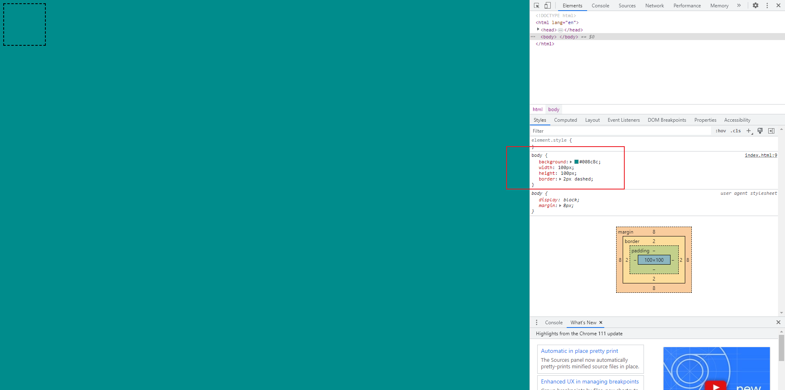

**浏览器画布 canvas**

一块区域

特点:

1. 最小宽度为视口宽度
2. 最小高度为视口高度

**HTML 元素的背景**

覆盖画布

**BODY 元素的背景**

如果 HTML 元素有背景，BODY 元素正常（背景覆盖边框盒）

如果 HTML 元素没有背景，BODY 元素的背景覆盖浏览器画布

**关于浏览器画布背景图**

1. 背景图的 **<font color=#00c8c8>宽度</font>** 百分比，相对于 **<font color=#00c8c8>视口</font>**
2. 背景图的 **<font color=#00c8c8>高度</font>** 百分比，相对于 **<font color=#00c8c8>网页(html)高度</font>**
3. 背景图的 **<font color=#00c8c8>横向</font>** 位置百分比、预设值，相对于 **<font color=#00c8c8>视口</font>**
4. 背景图的 **<font color=#00c8c8>纵向</font>** 位置百分比、预设值，相对于 **<font color=#00c8c8>网页(html)高度</font>**

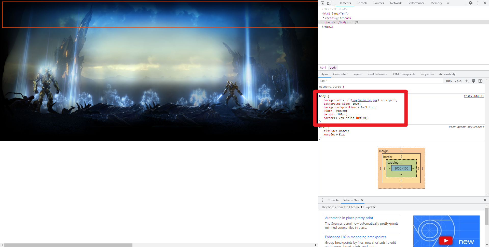

```css
body {
	background: url('img/main_bg.jpg') no-repeat;
	background-size: 100%;
	background-position: left top;
	width: 3000px;
	height: 100px;
	border: 2px solid #f40;
}
```

## 堆叠上下文

堆 heap
栈 the stack

堆叠上下文（stack context），它是一块区域，这块区域由某个元素创建，它规定了该区域中的内容在 Z 轴上排列的先后顺序。

### 创建堆叠上下文的元素

> 1.  html 元素（根元素）
> 2.  设置了 z-index（非 auto）数值的定位元素

### 同一个堆叠上下文（与元素父子级无关）中元素在 Z 轴上的排列

从 后到前（z-index 从小到大） 的排列顺序:

> 1. **创建堆叠上下文的元素**的背景和边框
> 2. 堆叠级别(z-index, stack level)为**负值**的堆叠上下文 (值相同 书写后边的覆盖前边的)
> 3. 常规流非定位 的 **块盒**
> 4. 非定位的**浮动盒子**
> 5. 常规流非定位的 **行盒**
> 6. 任何 z-index 是 auto 的**定位子元素**，以及 z-index 是 0 的堆叠上下文
> 7. 堆叠级别为**正值**的堆叠上下文

每个堆叠上下文（都是一个**整体**），独立于其他堆叠上下文，它们之间不能相互穿插。

## svg

[svg: scalable vector graphics，可缩放的矢量图](https://developer.mozilla.org/zh-CN/docs/Web/SVG)

1. 该图片使用代码书写而成
2. 缩放不会失真
3. 内容轻量

### 怎么使用

svg 可以嵌入浏览器，也可以单独成为一个文件

xml 语言，svg 使用该语言定义

### 书写 svg 代码

默认宽高 300 \* 150

<svg style="background:#ccc;" width="500" height="500" xmlns="http://www.w3.org/2000/svg">
    <path d="M300 300 A150 150 0 0 0 450 150" fill="none" style="stroke:#000; stroke-width:3" />
</svg>

```svg
<svg style="background:#ccc;" width="500" height="500" xmlns="http://www.w3.org/2000/svg">
    <path d="M300 300 A150 150 0 0 0 450 150" fill="none" style="stroke:#000; stroke-width:3" />
</svg>
```

#### 矩形:rect

#### 圆形: circle

#### 椭圆: ellipse

#### 线条: line

#### 折线: polyline

#### 多边形: polygon

#### 路径: path

> M = moveto
> L = lineto
> H = horizontal lineto
> V = vertical lineto
> C = curveto
> S = smooth curveto
> Q = quadratic Belzier curve
> T = smooth quadratic Belzier curveto
> A = elliptical Arc
>
> > A
> > 半径 1  
> > 半径 2  
> > 顺时针旋转角度  
> > 小弧（0）或大弧（1）  
> > 顺时针（1）逆时针（0）
> >
> > ```svg
> > <path d="M300 300 A150 150 0 0 0 450 150" fill="none" style="stroke:#000; stroke-width:3" />
> > ```
> >
> > Z = closepath

#### 例子

画太极图

<svg xmlns="http://www.w3.org/2000/svg" width="500" height="500" style="background:#ccc">
    <path fill="#000" d="M250 50 A100 100 0 0 1 250 250 A100 100 0 0 0 250 450 A200 200 0 0 1 250 50"/>
    <path fill="#fff" d="M250 50 A100 100 0 0 1 250 250 A100 100 0 0 0 250 450 A200 200 0 0 0 250 50"/>
    <circle cx="250" cy="150" r="30" fill="#fff"/>
    <circle cx="250" cy="350" r="30" fill="#000"/>
</svg>

```svg
<svg xmlns="http://www.w3.org/2000/svg" width="500" height="500" style="background:#ccc">
    <path fill="#000" d="M250 50 A100 100 0 0 1 250 250 A100 100 0 0 0 250 450 A200 200 0 0 1 250 50"/>
    <path fill="#fff" d="M250 50 A100 100 0 0 1 250 250 A100 100 0 0 0 250 450 A200 200 0 0 0 250 50"/>
    <circle cx="250" cy="150" r="30" fill="#fff"/>
    <circle cx="250" cy="350" r="30" fill="#000"/>
</svg>

```

## 数据链接

[data url](https://developer.mozilla.org/zh-CN/docs/Web/HTTP/Basics_of_HTTP/Data_URLs)

### 如何书写

数据链接: 将目标文件的数据直接书写到路径位置 例子: base64

语法: data:MIME,数据

### 意义

优点:

1. 减少了浏览器中的请求

请求

响应

减少了请求中浪费的时间

2. 有利于动态生成数据

缺点:

1. 增加了资源的体积

导致了传输内容增加，从而增加了单个资源的传输时间

2. 不利于浏览器的缓存

浏览器通常会缓存图片文件、css 文件、js 文件。

3. 会增加原资源的体积到原来的 4/3

应用场景:

1. 但请求单个图片体积较小，并且该图片因为各种原因，不适合制作雪碧图，可以使用数据链接。

2. 图片由其他代码动态生成，并且图片较小，可以使用数据链接。

### base64

一种编码方式

通常用于将一些二进制数据，用一个可书写的字符串表示。

## 浏览器兼容性

### 问题产生原因

-   市场竞争
-   标准版本的变化

### 浏览器

1. shell: 外壳
2. core: **内核**（JS 执行引擎、渲染引擎）

> IE: Trident
> Firfox: Gecko
> Chrome: Webkit / Blink
> Safari: Webkit
> Opera: Presto / Blink

### 版本和兼容性

HTML5、CSS3

HTML5: 2014 年

CSS3: 目前还没有制定完成。

XHTML: 可以认为是 HTML 的一种一个版本，完全符合 XML 的规范。

### 厂商前缀

> 比如: box-sizing， 谷歌旧版本浏览器中使用-webkit-box-sizing:border-box

-   市场竞争，标准没有发布
-   标准仍在讨论中（草案），浏览器厂商希望先支持

IE: -ms-
Chrome，safari: -webkit-
opera: -o-
firefox: -moz-

> 浏览器在处理样式或元素时，使用如下的方式:
> 当遇到无法识别的代码时，直接略过。

1. 谷歌浏览器的滚动条样式

实际上，在开发中使用自定义的滚动条，往往是使用 div+css+JS 实现的

```css
::-webkit-scrollbar {
	width: 10px;
}
::-webkit-scrollbar-track {
	background: #74c0c0;
}
::-webkit-scrollbar-thumb {
	background: #008c8c;
	border-radius: 8px;
}
::-webkit-scrollbar-button {
	background: red;
}
```

2. 多个背景图中选一个作为背景

```css
div {
	width: 500px;
	height: 500px;
	background-image: -webkit-image-set(url('img/small.jpg') 1x, url('img/big.jpg') 2x);
	background-size: 100%;
}
```

### css hack

根据不同的浏览器（主要针对 IE），设置不同的样式和元素

1. 样式

IE 中，CSS 的特殊符号

> -   \*属性，兼容 IE5、IE6、IE7
> -   \_属性，兼容 IE5~IE6
> -   属性值\9，兼容 IE5~IE11
> -   属性值\0，兼容 IE8~IE11
> -   属性值\9\0，兼容 IE9~IE10

> IE5、6、7 的外边距 bug，浮动元素的左外边距翻倍

2. 条件判断

```html
<body>
	<!--[if IE]>
		<p>这是IE浏览器</p>
	<![endif]-->

	<!--[if !(IE)]><-->
	<p>这是非IE浏览器</p>
	<!--<![endif]-->
</body>
```

### 渐近增强 和 优雅降级

两种解决兼容性问题的思路，会影响代码的书写风格

-   **渐近增强**:先适应大部分浏览器，然后针对新版本浏览器加入新的样式

==书写代码时，先尽量避免书写有兼容性问题的代码，完成之后，再逐步加入新标准中的代码。==

-   **优雅降级**:先制作完整的功能，然后针对低版本浏览器进行特殊处理

==书写代码时，先不用特别在意兼容性，完成整个功能之后，再针对低版本浏览器处理样式。==

### caniuse

查找 css 兼容性

[caniuse.com](https://caniuse.com/)

## 居中总结

[居中: 盒子在其包含块中居中](<(https://juejin.cn/post/6844903919144075278#heading-7)>)

### 行盒（行块盒）水平居中

> 直接设置行盒（行块盒）父元素`text-align:center`

### 常规流块盒水平居中

> 定宽，设置左右 margin 为 auto

### 绝对定位元素的水平居中

> 定宽，设置左右的坐标为 0（left:0, right:0），将左右 margin 设置为 `auto`
> ，固定定位（fixed）是绝对定位（absolute）的特殊情况

### 单行文本的垂直居中

> 设置文本所在元素的行高，为整个区域的高度 `line-hight === height`

### 行块盒或块盒内多行文本的垂直居中

> 没有完美方案

设置盒子上下内边距相同，达到类似的效果。

### 绝对定位的垂直居中

> 定高，设置上下的坐标为 0（top:0, bottom:0），将上下 margin 设置为 `auto`

### Flex 居中

```css
.parent {
	display: flex;
	justify-content: center; /* 水平居中 */
	align-items: center; /* 垂直居中 */
}
```

### Grid 居中

```css
.parent {
	display: grid;
	place-items: center; /* 水平+垂直居中 */
}
```

### transform 居中

> 不需要知道元素的宽高，适合未知尺寸的元素

```css
.child {
	position: absolute;
	top: 50%;
	left: 50%;
	transform: translate(-50%, -50%);
}
```

## 样式补充

### display:list-item

设置为该属性值的盒子，本质上仍然是一个块盒，但同时该盒子会附带另一个盒子

元素本身生成的盒子叫做主盒子，附带的盒子称为次盒子，次盒子和主盒子水平排列

涉及的 css:

1. **`list-style-type`**

设置次盒子中内容的类型（可继承）

> ==\<ul>,\<ol> 默认有此属性== 所以 \<li> 才会有圆点等等。。。

2. **`list-style-position`**

设置次盒子相对于主盒子的位置

3. 速写属性 **`list-style`**

**清空次盒子** 设置 **list-style:none**

> \<ul>,\<ol> 也可以设置这个 重置默认样式

### 图片失效时的宽高问题

如果 img 元素的图片链接无效，img 元素的特性和普通行盒一样，无法设置宽高

### 行盒中包含行块盒或可替换元素

行盒的高度与它内部的行块盒或可替换元素的高度无关 (参考: 参考线-深入理解字体)

**行盒高度与内容 字体大小有关**

```html
<!DOCTYPE html>
<html lang="en">
	<head>
		<meta charset="UTF-8" />
		<meta name="viewport" content="width=device-width, initial-scale=1.0" />
		<meta http-equiv="X-UA-Compatible" content="ie=edge" />
		<title>Document</title>
		<style>
			span {
				border: 2px solid;
			}
		</style>
	</head>
	<body>
		<span>
			
		</span>
	</body>
</html>
```

### text-align:justify

text-align:

-   left: 左对齐
-   right: 右对齐
-   center: 居中
-   justify: 除最后一行外，分散对齐

`justify 例子: `

<head>   
    <style>
        .container{
            width: 500px;
            background: lightblue;
            text-align: justify;
        }
        .container::after{
            content: "";
            display: inline-block;
            width: 100%;
        }
        .container .item{
            width: 150px;
            height: 100px;
            outline: 2px solid;
            display: inline-block;
        }
    </style>

</head>
<body>
    <div class="container">
        <div class="item"></div>
        <div class="item"></div>
        <div class="item"></div>
        <div class="item"></div>
        <div class="item"></div>
    </div>
</body>

```html
<!DOCTYPE html>
<html lang="en">
	<head>
		<style>
			.container {
				width: 500px;
				background: lightblue;
				text-align: justify;
			}

			.container::after {
				content: '';
				display: inline-block;
				width: 100%;
			}

			.container .item {
				width: 150px;
				height: 100px;
				outline: 2px solid;
				display: inline-block;
			}
		</style>
	</head>
	<body>
		<div class="container">
			<div class="item"></div>
			<div class="item"></div>
			<div class="item"></div>
			<div class="item"></div>
			<div class="item"></div>
		</div>
	</body>
</html>
```

### 制作一个三角形

边框画三角形

```css
div {
	width: 0;
	height: 0;
	border: 10px solid transparent;
	border-left-color: red;
}
```

### direction 和 writing-mode

开始 start -> 结束 end
左 left -> 右 end

开始和结束是相对的，不同国家有不同的习惯

左右是绝对的

direction 设置的是开始到结束的方向

writing-mode: 设置文字书写方向

### utf-8 字符

---

# CSS3 补充

## 布局

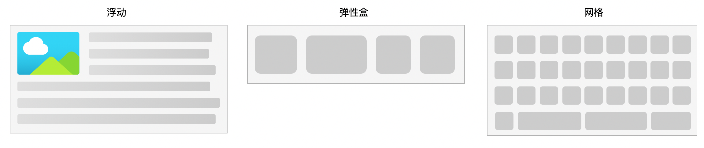

**浮动**：做文字环绕效果

**弹性盒**：单行或单列布局

**网格**：多行多列布局

### 弹性盒

> 详细文档见[MDN](https://developer.mozilla.org/zh-CN/docs/Web/CSS/CSS_Flexible_Box_Layout)
>
> [弹性盒小游戏](https://flexboxfroggy.com/)

#### 生成弹性容器和弹性项目

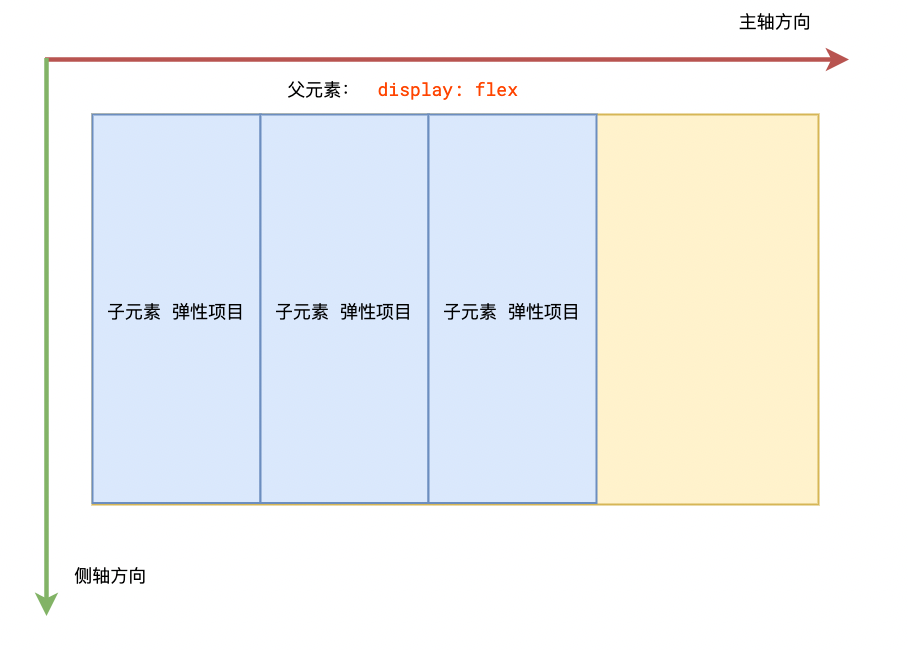

**默认情况下，**弹性项目沿着主轴依次排列，侧轴拉伸

#### 更改方向

通过`flex-direction`可更改主轴方向

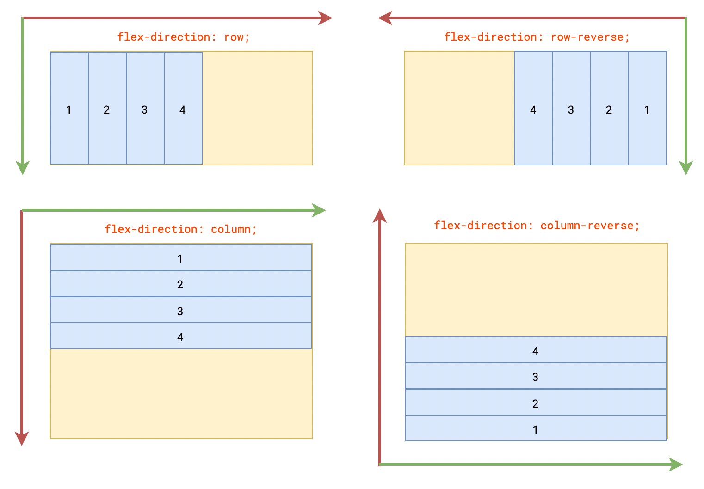

#### 主轴排列

通过`justify-content`属性，可以影响主轴的排列方式

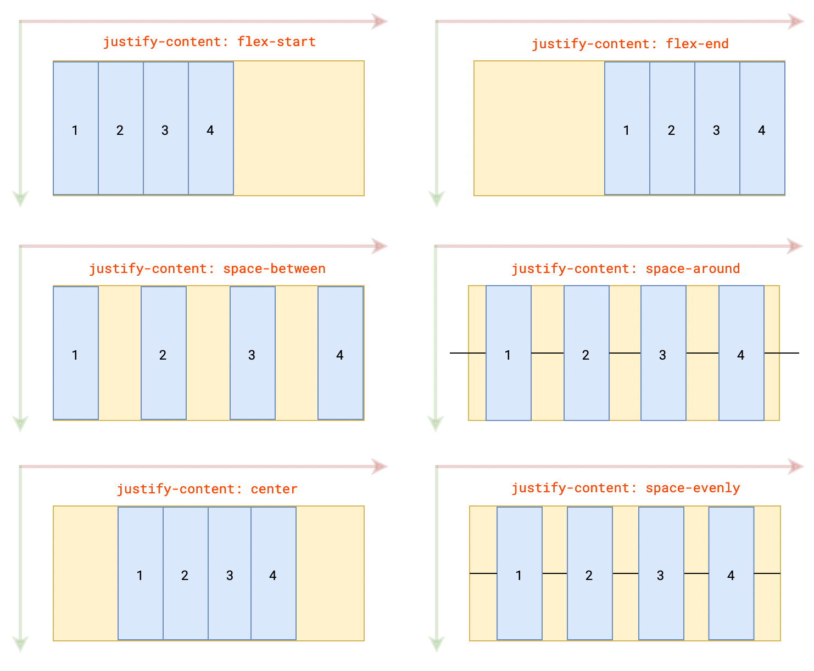

#### 侧轴排列

通过`align-items`属性，可以影响侧轴的排列方式

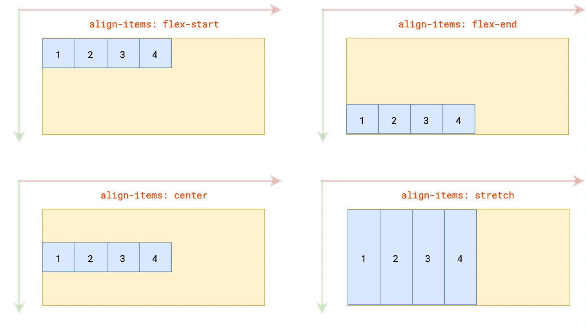

#### 弹性项目伸缩

所谓伸缩，是指在**主轴方向**上，当**弹性容器**有**额外空间**时，是否需要拉伸，当**空间不足**时，是否需要**压缩**

在**弹性项目**上使用`flex`属性，可设置拉伸和压缩比例：

> flex: 拉伸比例 压缩比例 初始尺寸
> flex 属性是 flex-grow, flex-shrink 和 flex-basis 的简写，默认值为 0 1 auto。后两个属性可选。

拉伸示例：

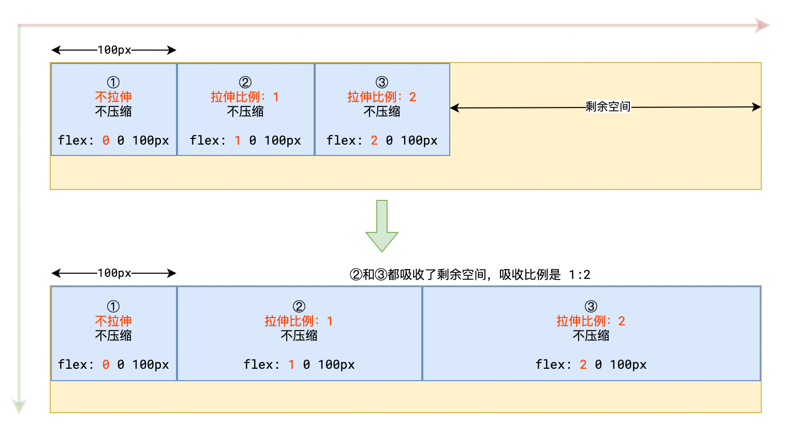

压缩示例：

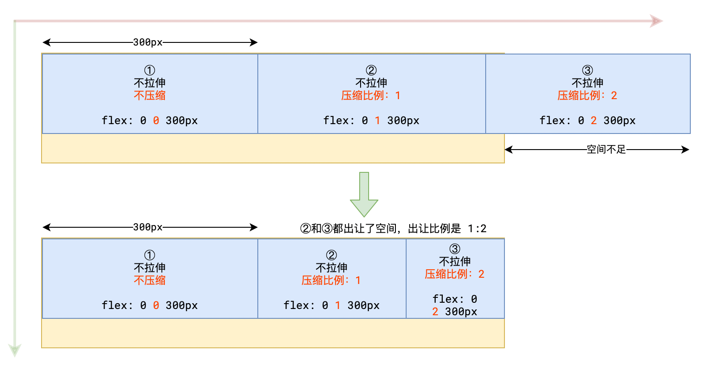

默认情况下，`flex: 0 1 auto`

#### 主轴换行

默认情况，当主轴剩余空间不足时，按照压缩比例进行压缩，但如果设置了主轴换行，则不会压缩，直接换行显示

给**弹性容器**设置`flex-wrap: wrap`，即可主轴换行

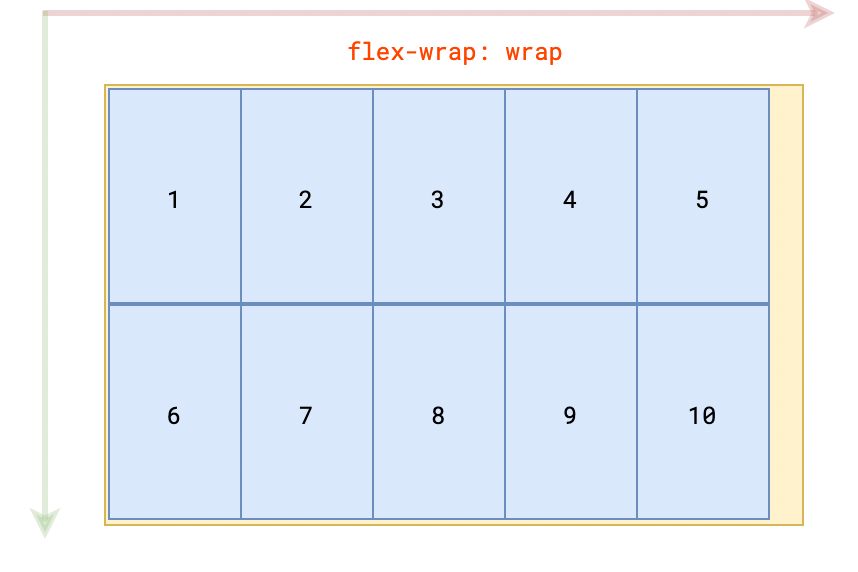

> 尽管如此，多行多列仍然推荐使用网格布局

### 网格

> [MDN 详细文档](https://developer.mozilla.org/zh-CN/docs/Web/CSS/CSS_Grid_Layout)
>
> [阮一峰网格布局教程](http://www.ruanyifeng.com/blog/2019/03/grid-layout-tutorial.html)
>
> [网格布局小游戏](https://cssgridgarden.com/)

**网格布局是多行多列布局的终极解决方案**

#### 生成网格布局

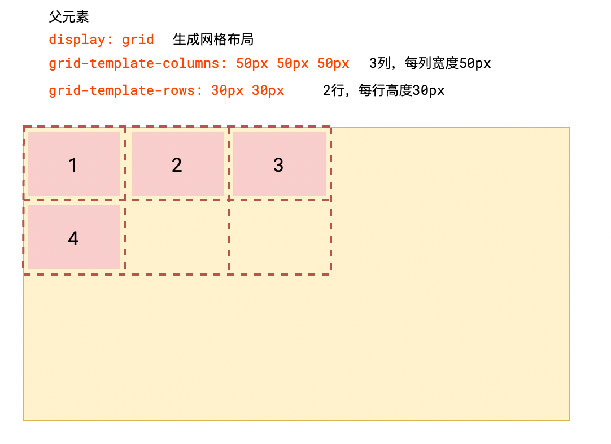

容器生成网格布局后，其所有子元素为**网格项目**

#### 定义行和列

`grid-template-rows`：定义行

`grid-template-columns`：定义列

**它们的语法是相同的**

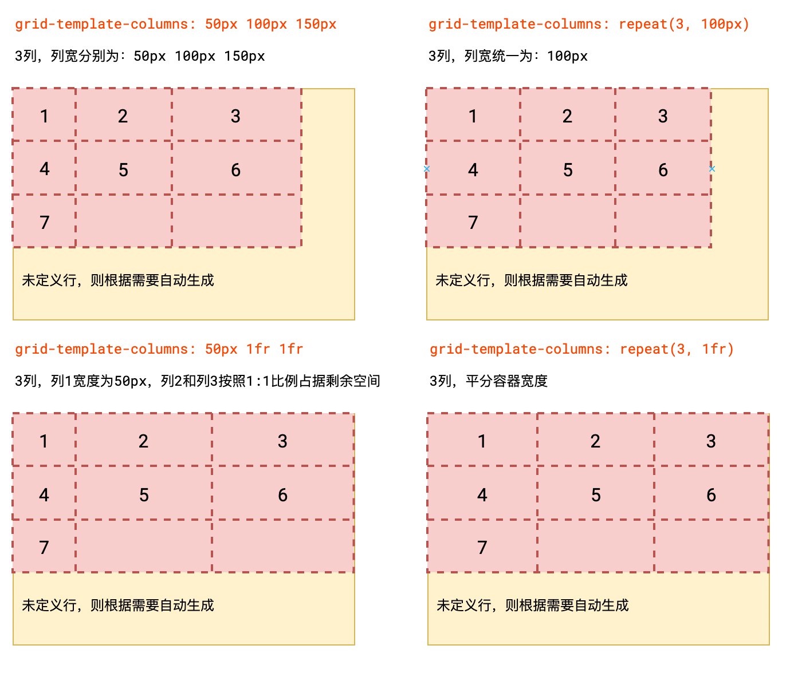

#### 改变排列方向

使用属性`grid-auto-flow: column`，可使子元素按列排放

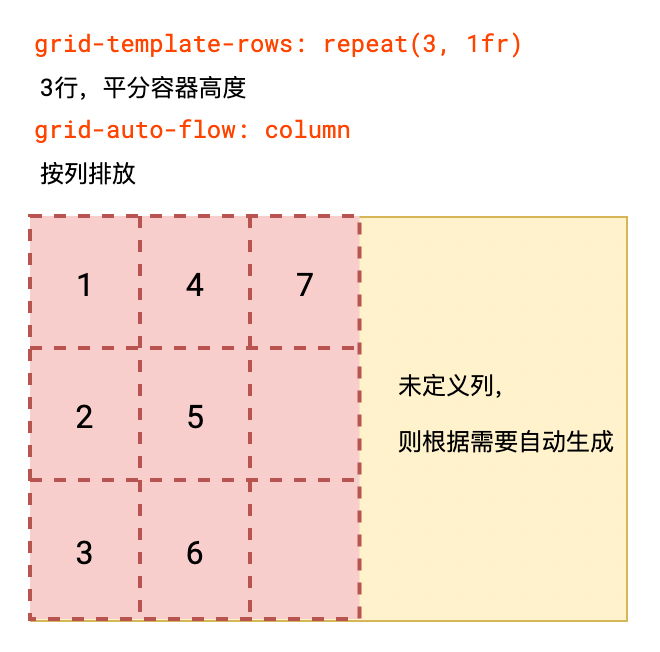

#### 单元格之间的间隙

```css
row-gap: 10px; /* 行间隙为10px */
column-gap: 20px; /* 列间隙为20px */
gap: 10px 20px; /* 行间隙为10px，列间隙为20px */
```

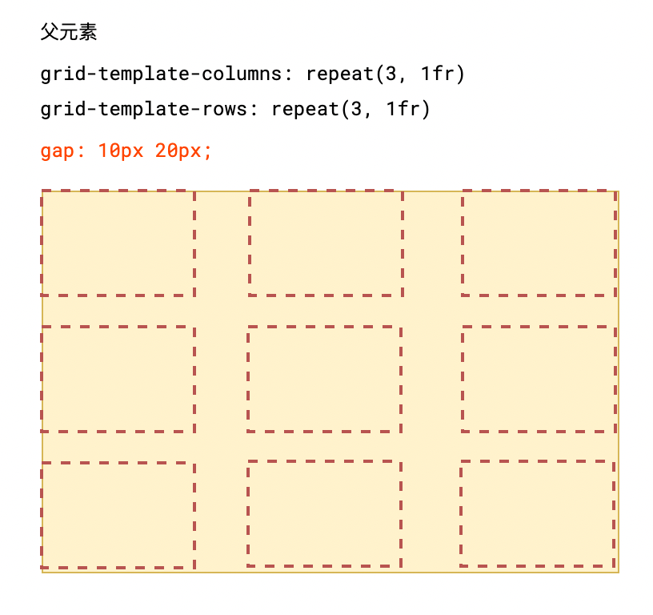

#### 单元格内部的对齐

默认情况下，网格项目在单元格内部水平和垂直拉伸，以撑满单元格

可以使用属性`justify-items`设置**水平方向**的排列方式

可以使用属性`align-items`设置**垂直方向**的排列方式

它们的可取值是相同的：

```css
justify-items: start 左 | end 右 | center 中 | stretch 拉伸;
align-items: start 上 | end 下 | center 中 | stretch 拉伸;
```

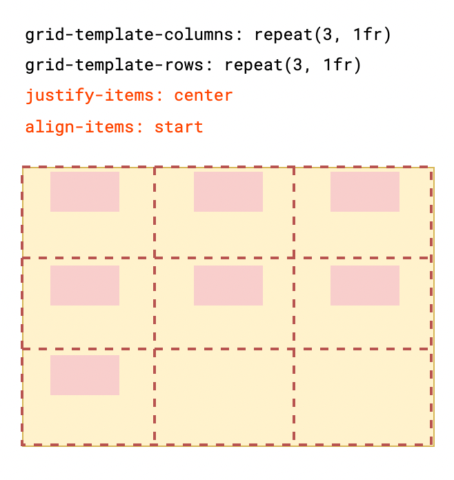

可以使用速写属性`place-items: 垂直对齐方式 水平对齐方式`同时设置这两个值

```css
place-items: start center; /* 垂直靠上，水平居中 */
```

#### 网格项目定位

默认情况下，网格项目依次排列到单元格中，每个网格占据一个单元格

但可以对网格项目设置`grid-area`属性来改变这一行为

使用方式为：

```css
grid-area: 起始行线编号/起始列线编号/结束行线编号/结束列线编号;
```

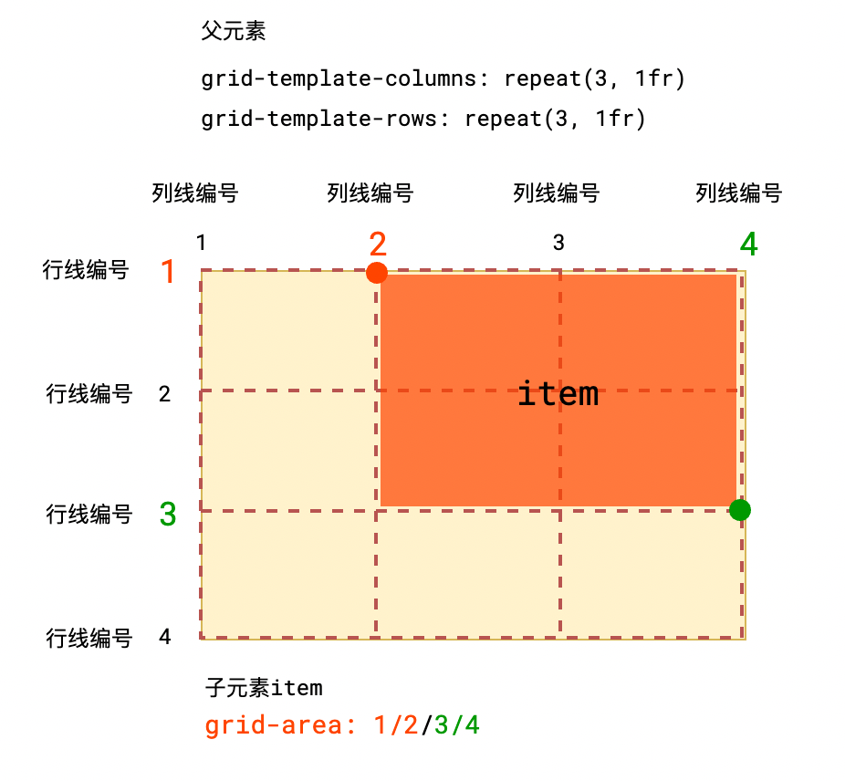

## 视觉

> 所谓视觉类样式，是指不影响盒子位置、尺寸的样式，例如文字颜色、背景颜色、背景图片等

### 阴影

#### 盒子阴影

> [MDN 详细文档](https://developer.mozilla.org/zh-CN/docs/Web/CSS/box-shadow)

通过`box-shadow`属性可以设置整个盒子的阴影

下面是一些示例

<iframe src="http://mdrs.yuanjin.tech/html/css-manual/box-shadow.html?v=2" style="height:900px;width:100% "></iframe>

#### 文字阴影

> [MDN 详细文档](https://developer.mozilla.org/zh-CN/docs/Web/CSS/text-shadow)

通过`text-shadow`可以设置文字阴影

下面是一些示例

<iframe src="http://mdrs.yuanjin.tech/html/css-manual/text-shadow.html?v=3" style="height:500px;width:100% "></iframe>

### 圆角

> [MDN 详细文档](https://developer.mozilla.org/zh-CN/docs/Web/CSS/border-radius)

通过设置`border-radius`，可以设置盒子的圆角

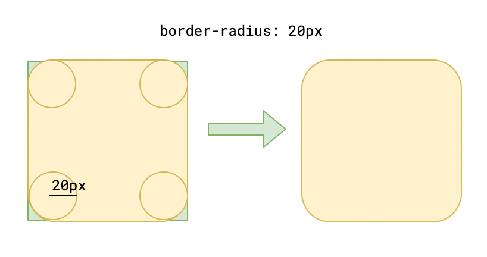

`border-radius`可以有很多灵活的用法，将下面的代码依次粘贴到页面中测试一下

```css
border-radius: 10px; /* 同时设置4个角的圆角，半径为10px */
border-radius: 50%; /* 同时设置4个角的圆角，圆的横向半径为宽度一半，纵向半径为高度一半 */
border-radius: 10px 20px 30px 40px; /* 分别设置左上、右上、右下、左下的圆角 */
```

<iframe src="http://mdrs.yuanjin.tech/html/css-manual/border-raduis.html?v=5" style="height:550px;width:100% "></iframe>

### 背景渐变

> [MDN 详细文档](<https://developer.mozilla.org/zh-CN/docs/Web/CSS/linear-gradient()>)

在设置**背景图片**时，除了可以使用`url()`加载一张背景图，还可以使用`linear-gradient()`函数设置背景渐变

`linear-gradient()`用于创建一张渐变的图片，语法为：

```css
/* 设置渐变背景，方向：从上到下，颜色：从#e66465渐变到#9198e5 */
background: linear-gradient(to bottom, #e66465, #9198e5);
```

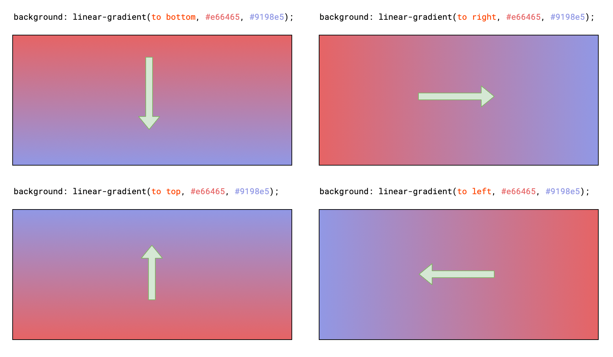

### 变形

> [MDN 详细文档](https://developer.mozilla.org/zh-CN/docs/Web/CSS/transform)

通过`transform`属性，可以使盒子的形态发生变化

该属性支持多种变形方案，常见的有:

-   translate，平移
-   scale，缩放
-   rotate，旋转

**无论是哪一种 transform，都只是视觉效果的变化，不会影响盒子的布局**

**transform 不会导致浏览器 reflow 和 rerender，因此效率极高**

#### translate 平移

使用`translate`可以让盒子在原来位置上产生位移，类似于相对定位

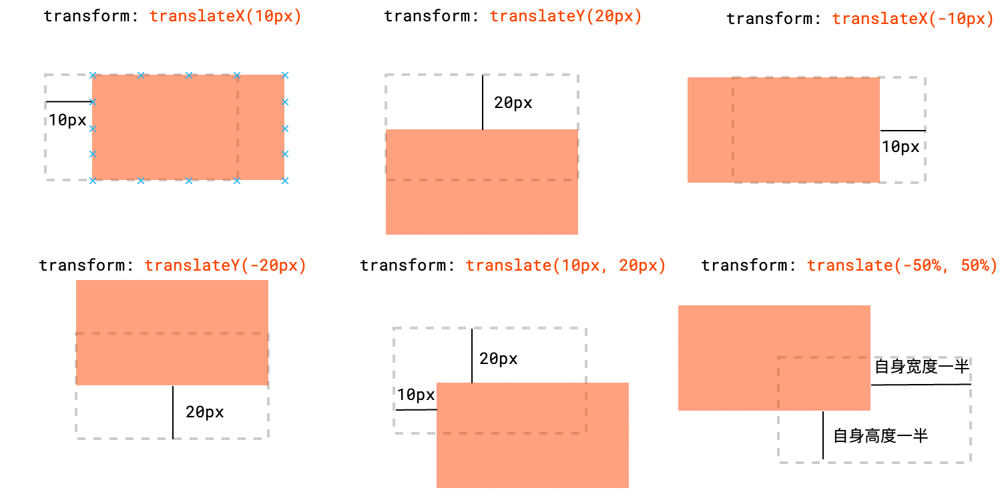

#### scale 缩放

使用`translate`可以让盒子在基于原来的尺寸发生缩放

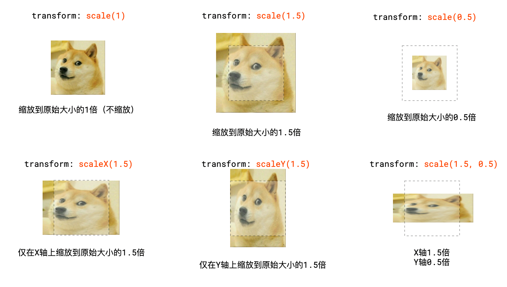

#### rotate 旋转

使用`rotate`属性可以在原图基础上进行旋转

```css
/* 在原图的基础上，顺时针旋转45度角 */
transform: rotate(45deg);
/* 在原图的基础上，顺时针旋转半圈 */
transform: rotate(0.5turn);
```

可以点击下面的按钮试一下旋转效果

<iframe src="http://mdrs.yuanjin.tech/html/css-manual/rotate.html" style="height:400px;width:100% "></iframe>

#### 改变变形原点

> [MDN 详细文档](https://developer.mozilla.org/zh-CN/docs/Web/CSS/transform-origin)

变形原点的位置，会影响到具体的变形行为

默认情况下，变形的原点在盒子中心，你可以通过`transform-origin`来改变它

```css
transform-origin: center; /* 设置原点在盒子中心 */
transform-origin: left top; /* 设置原点在盒子左上角 */
transform-origin: right bottom; /* 设置原点在盒子右下角 */
transform-origin: 30px 60px; /* 设置原点在盒子坐标 (30, 60) 位置 */
```

试一试，先点击设置原点的按钮来设置原点(已在图片中使用红色小点标记)，然后点击变形按钮进行变形

<iframe src="http://mdrs.yuanjin.tech/html/css-manual/transform-origin.html?v2" style="height:600px;width:100% "></iframe>

#### 多种变形叠加

可以一次性设置多种变形效果

```css
/* 先旋转45度，再平移(100,100) */
transform: rotate(45deg) translate(100px, 100px);
/* 先平移(100, 100)，再旋转45度 */
transform: translate(100px, 100px) rotate(45deg);
```

注意：旋转会导致坐标系也跟着旋转，从而可能影响到后续的变形效果

下面的例子可以很好的说明这一点

http://mdrs.yuanjin.tech/html/css-manual/multi-transform.html

> 本来打算把这个效果嵌入到 markdown，但由于嵌入后出现一些未知的 bug，因此只能粘贴效果地址了

## 过渡和动画

使用过渡和动画，可以让 css 属性变化更加丝滑

**过渡和动画无法对所有的 CSS 属性产生影响，能够产生影响的只有数值类属性**，例如：颜色、宽高、字体大小等等

### 过渡

> [MDN 详细文档](https://developer.mozilla.org/zh-CN/docs/Web/CSS/transition)

```css
transition: 过渡属性 持续时间 过渡函数 过渡延迟;
```

-   **过渡属性**

    针对哪个 css 属性应用过渡。例如填写`transform`，则表示仅针对**transform**属性应用过渡。

    若填写`all`或不填写，则表示针对所有 css 属性都应用过渡

-   **持续时间**

    css 属性变化所持续的时间，需要带上单位。例如`3s`表示 3 秒，`0.5s`或`500ms`均表示 500 毫秒

-   **过渡函数**

    本质是 css 属性变化的贝塞尔曲线函数，通常直接使用预设值：

    `ease-in-out`：平滑开始，平滑结束

    `linear`：线性变化

    `ease-in`：仅平滑开始

    `ease-out`：仅平滑结束

-   **过渡延迟**

    书写规则和持续时间一样，表示过渡效果延迟多久后触发，不填则无延迟

    ==**零，一或两个 \<time> 值。可以解析为时间的第一个值被分配给 transition-duration，并且可以解析为时间的第二个值被分配给 transition-delay。**==

**在 JS 中，可以监听元素的`transitionstart`和`transitionend`事件，从而在过渡开始和过渡结束时做一些别的事情**

### 动画

> [MDN 详细文档](https://developer.mozilla.org/zh-CN/docs/Web/CSS/CSS_Animations)

**动画的本质是预先定义的一套 css 变化规则，然后给该规则取个名字**

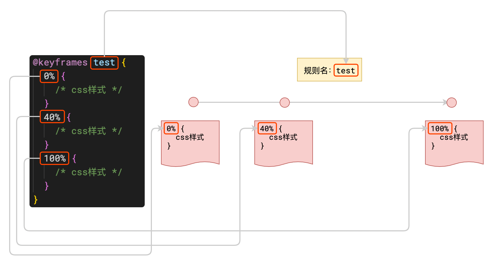

然后，其他元素即可使用这样的规则：

```css
animation: 规则名 持续时间;
```

在应用规则时，还可以指定更多的信息

```css
animation: 规则名 持续时间 重复次数 时间函数 动画方向 延迟时间;
```

一些细节：

-   定义规则时，`0%`可以书写为`from`
-   定义规则时，`100%`可以书写为`to`
-   重复次数为`infinite`时，表示无限重复
-   动画方向为`alternate`时，表示交替反向，第 1 次正向，第 2 次反向，第 3 次正向，第 4 次方向，以此类推

**在 JS 中，可以监听元素的`animationstart`和`animationnend`事件，从而在过渡开始和过渡结束时做一些别的事情**

## 其他

### box-sizing

一图胜千言

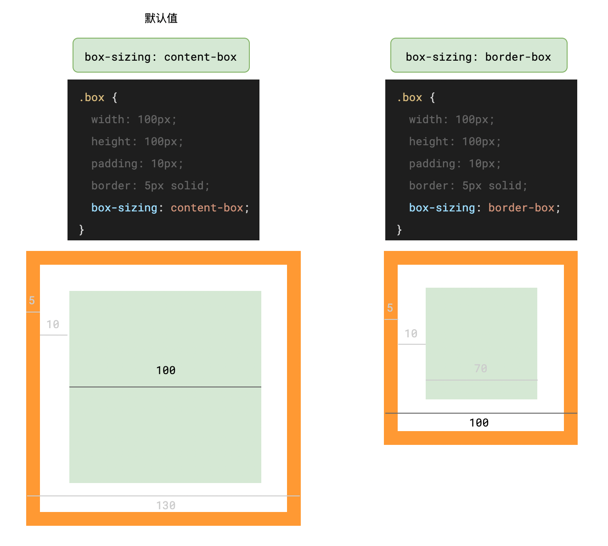

使用`border-box`控制尺寸更加直观，因此，很多网站都会加入下面的代码

```css
* {
	margin: 0;
	padding: 0;
	box-sizing: border-box;
}
```

### 字体图标

> [MDN font-face 指令](https://developer.mozilla.org/zh-CN/docs/Web/CSS/@font-face)

css3 新增了`font-face`指令，该指令可以让我们加载网络字体

其最常见的应用就是字体图标

**字体图标本质上是文字，即通过`color`设置颜色，通过`font-size`设置尺寸**

国内使用最多的字体图标平台是[阿里巴巴矢量图标库](https://www.iconfont.cn/)

登录平台后即可免费使用其所有字体图标

### 图像内容适应

> [MDN 详细文档](https://developer.mozilla.org/zh-CN/docs/Web/CSS/object-fit)

css3 属性`object-fit`可以控制**多媒体内容和与元素**的适应方式，通常应用在`img`或`video`元素中

一图胜千言

下图中的所有`img`元素均被固定了宽高，溢出 img 的部分实际上均不会显示

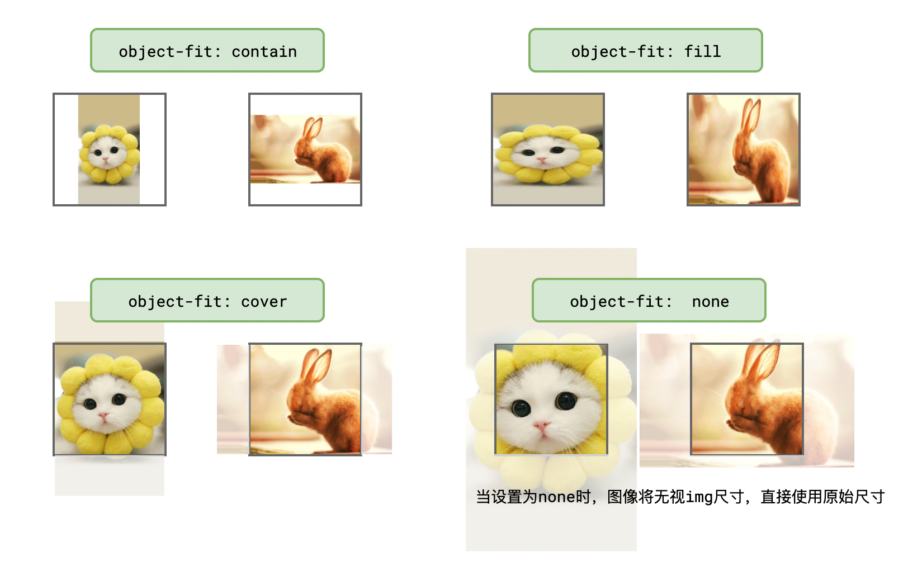

### 视口单位

css3 支持使用`vw`和`vh`作为单位，分别表示`视口宽度`和`视口高度`

例如`1vh`表示视口高度的`1%`，`100vw`表示视口宽度的`100%`

### 伪元素选择器

通过`::before`和`::after`选择器，可以通过 css 给元素生成两个子元素

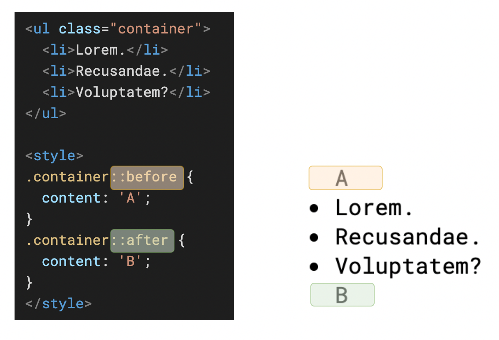

使用伪元素可以避免在 HTML 中使用过多的空元素

**伪元素必须要有`content`属性，否则不能生效，如果不需要有元素内容，设置`content:''`**

### 平滑滚动

> [MDN 详细文档](https://developer.mozilla.org/zh-CN/docs/Web/CSS/scroll-behavior)

使用`scroll-behavior: smooth`，可以让滚动更加丝滑

参见 MDN 效果即可

### CSS 自定义属性（CSS Variables）

> [MDN 详细文档](https://developer.mozilla.org/zh-CN/docs/Web/CSS/Using_CSS_custom_properties)

CSS 自定义属性，也叫 CSS 变量，使用 `--` 前缀定义，通过 `var()` 函数引用。

```css
/* 定义变量（通常在 :root 中定义全局变量） */
:root {
	--primary-color: #409eff;
	--font-size-base: 14px;
	--spacing: 8px;
}

/* 使用变量 */
.button {
	background-color: var(--primary-color);
	font-size: var(--font-size-base);
	padding: var(--spacing) calc(var(--spacing) * 2);
}

/* 提供回退值 */
.text {
	color: var(--text-color, #333); /* 如果 --text-color 未定义，使用 #333 */
}
```

**特点：**

- 自定义属性遵循 CSS 的**层叠和继承**规则
- 可以在媒体查询中重新赋值，实现响应式主题
- 可以通过 JS 动态修改：`element.style.setProperty('--primary-color', '#f00')`

```css
/* 响应式场景示例 */
:root {
	--columns: 4;
}
@media (max-width: 768px) {
	:root {
		--columns: 2;
	}
}
.grid {
	grid-template-columns: repeat(var(--columns), 1fr);
}
```

### 回流（Reflow）与重绘（Repaint）

**回流（Reflow）：** 当元素的几何属性（尺寸、位置、布局）发生变化时，浏览器需要重新计算元素的几何属性并重新构建布局树。

**重绘（Repaint）：** 当元素的外观属性（颜色、背景、阴影等）发生变化，但不影响布局时，浏览器只需重新绘制受影响的部分。

> 回流一定会触发重绘，但重绘不一定触发回流。

**触发回流的操作：**

- 改变元素的尺寸（width、height、padding、margin、border）
- 改变元素的位置（top、left 等）
- 改变元素的 display 属性
- 增删 DOM 元素
- 读取某些属性：`offsetWidth`、`offsetHeight`、`clientWidth`、`scrollTop`、`getComputedStyle()` 等

**仅触发重绘的操作：**

- 改变 `color`、`background-color`、`visibility`、`outline`、`box-shadow` 等

**优化建议：**

1. 避免频繁操作样式，尽量一次性修改（使用 `cssText` 或切换 class）
2. 避免频繁操作 DOM，可以使用 `DocumentFragment`
3. 将需要多次回流的元素设置为 `position: absolute / fixed`，脱离文档流
4. 使用 `transform` 代替 `top/left` 做动画（transform 不会触发回流，在合成线程中完成）

# HTML

Hyper Text Markup Language 超文本标记语言；定义网页中有什么。

## 标准的文档结构

HTML:页面、HTML 文档

```html
<!DOCTYPE html>
```

文档声明，告诉浏览器，当前文档使用的 HTML 标准是 HTML5。

**==不写文档声明，将导致浏览器进入怪异渲染模式。==**

```html
<html lang="en">
</html
```

根元素，一个页面最多只能一个，并且该元素是所有其他元素的父元素或祖先元素。

HTML5 版本中没有强制要求书写该元素

lang 属性:language，全局属性，表示该元素内部使用的文字是使用哪一种自然语言书写而成的。

```html
<head> </head>
```

文档头，文档头内部的内容，不会显示到页面上。

```html
<meta charset="UTF-8" />
```

文档的元数据:附加信息。

有些元素没有结束标记，这样的元素叫做: **空元素**

空元素的两种写法:

1. `<meta charset="UTF-8">`
2. `<meta charset="UTF-8" />`

charset:指定网页内容编码。

计算机中，低压电 (0~2 V) 0，高压电 (2~5 V) 1，表示 2，使用 10

计算机中，只能存储数字

文字和数字进行对应

比如:a —— 97， A —— 64

该字典叫做字符编码表，GB2312，GBK

袁 —— GB2312 —— 100000 —— GBK —— ？？

UTF-8 是 Unicode 编码的一个版本

```html
<title>Document</title>
```

网页标题

```html
<body></body>
```

文档体，页面上所有要参与显示的元素，都应该放置到文档体中。

## 语义化

1.  每一个 HTML 元素都有具体的含义

    如:

    -   a 元素:超链接
    -   p 元素:段落
    -   h1 元素:一级标题

    h5 中:

    -   header : 通常用于表示页头，也可以用于表示文章的头部
    -   footer : 通常用于表示页脚，也可以用于表示文章的尾部
    -   nav : 定义导航链接的容器
    -   section : 通常用于表示文章的章节
    -   article : 通常用于表示整篇文章
    -   summary : 定义 details 元素的标题
    -   aside : 定义内容之外的内容、附加信息 (比如侧栏)

1.  所有元素与展示效果无关

    元素展示到页面中的效果，应该由 CSS 决定。因为浏览器带有默认的 CSS 样式，所以每个元素有一些默认样式。

**==重要:选择什么元素，取决于内容的含义，而不是显示出的效果==**

优点:

1. 为了搜索引擎优化(SEO)

> 搜索引擎:百度、搜搜、Bing、Google 每隔一段时间，搜索引擎会从整个互联网中，抓取页面源代码

2. 为了让浏览器理解网页

> 阅读模式、语音模式

## 文本元素

HTML5 中支持的元素:[HTML5 元素周期表](https://www.xuanfengge.com/funny/html5/element/))

### h

标题:head

h1~h6:表示 1 级标题~6 级标题

### p

段落，paragraphs

> lorem (插件) ，乱数假文，没有任何实际含义的文字

### span【无语义】

没有语义，仅用于设置样式

> 以前:某些元素在显示时会独占一行 (块级元素) ，而某些元素不会 (行级元素)
> 到了 HTML5，已经弃用这种说法。

### pre

预格式化文本元素

空白折叠:在源代码中的连续空白字符 (空格、换行、制表) ，在页面显示时，会被折叠为一个空格

例外:在 pre 元素中的内容不会出现空白折叠

在 pre 元素内部出现的内容，会按照源代码格式显示到页面上。

该元素通常用于在网页中显示一些代码。

==pre 元素功能的本质:它有一个默认的 css 属性 **[white-space:pre](https://developer.mozilla.org/zh-CN/docs/Web/CSS/white-space)**==

> 显示代码时，通常外面套 [\<code> 元素](https://developer.mozilla.org/zh-CN/docs/Web/HTML/Element/code)，\<code> 元素呈现一段计算机代码。

<body>
	<code style="white-space:pre">
		<!-- <pre> -->
		var i = 2; if ( i ) { console.log(i); }
		<!-- </pre> -->
	</code>
</body>

```html
<!-- 代码如下 -->
<body>
	<code style="white-space:pre">
		<!-- <pre> -->
		var i = 2; if ( i ) { console.log(i); }
		<!-- </pre> -->
	</code>
</body>
```

## HTML 实体

实体字符， HTML Entity

实体字符通常用于在页面中显示一些特殊符号。

1. &单词;
2. &#数字;

-   小于符号

    > \&lt; 表示 &lt;

-   大于符号

    > \&gt; 表示 &gt;

-   空格符号

    > \&nbsp; 表示 &nbsp;

-   版权符号

    > \&copy; 表示 &copy;

-   &符号

    > \&amp; 表示 &amp;

## <span id="a">a 元素</span>

> [表示超链接](https://developer.mozilla.org/zh-CN/docs/Web/HTML/Element/a)

属性

-   **href**

    hyper reference:通常表示跳转地址

    1.  普通链接

    2.  锚链接
        > id 属性:全局属性，表示元素在文档中的唯一标志、编号

    ```html
    <a href="#ID">视口跳到指定ID处</a>

    <a href="#">回到顶部</a>

    <!-- a标签可以包含万物 -->
    <a target="_blank" href="https://baike.baidu.com/item/%E5%A4%AA%E9%98%B3%E7%B3%BB/173281?fr=aladdin">
    	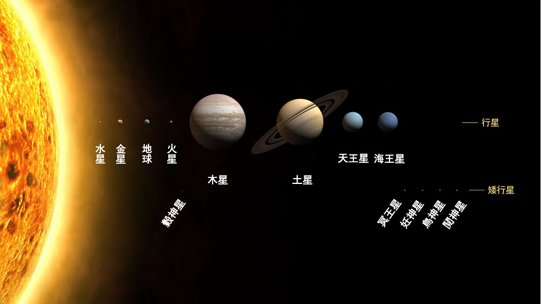
    </a>
    ```

    3.  功能链接

        点击后触发某些功能

        -   执行 JS 代码，`javascript:`
        -   发送邮件，`mailto:`

        要求用户计算机上安装有邮件发送软件:exchange

        -   拨号，`tel:`

        要求用户计算机上安装有拨号软件，或使用的是移动端访问

        ```html
        <a href="javascript:alert('你好！')"> 弹出:你好！ </a>
    
        <a href="mailto:234234324324@qq.com"> 点击给我发送邮件 </a>
    
        <a href="tel:14354663333"> 点击给我拨打电话 </a>
        ```

-   **target**

    表示跳转窗口位置。

    target 的取值:

    -   \_self:在当前页面窗口中打开，默认值
    -   \_blank: 在新窗口中打开

    ```html
    <a href="https://douyu.com" target="_blank" title="斗鱼，每个人的直播平台"> 斗鱼直播 </a>
    ```

## img 元素

> [\ HTML 元素将一张图像嵌入文档](https://developer.mozilla.org/zh-CN/docs/Web/HTML/Element/img)
> image 缩写,空元素 (没有闭合标记)

属性

-   **alt**

    > 当图片资源失效时，将使用该属性的文字替代图片

     alt 属性的值应该清晰、简洁地描述图像的内容。它不应该描述“图像的存在”，或仅仅包含图像的文件名。如果因为图像没有等价的文本描述，alt 属性只得不写或留白，那么可以考虑使用其他方法来呈现图像试图传递的内容。

    > 当图像上没有 alt 属性时，一些屏幕阅读器可能会读出图像的文件名。如果文件名不能代表图像的内容，甚至是一团乱码，这可只能造成令人迷惑的体验。

    ```html
    <!-- bad -->
    
    <!-- good -->
    
    ```

-   **sizes**

    表示资源大小的、以逗号隔开的一个或多个字符串。每一个资源大小包括：

    1.  一个[媒体条件](https://developer.mozilla.org/zh-CN/docs/Web/CSS/CSS_media_queries/Using_media_queries#语法)。最后一项一定是被忽略的。
    2.  一个资源大小的值。

    媒体条件描述*视口*的属性，而不是*图像*的属性。例如，如果*视口*不高于 500px，则建议使用 1000px 宽的资源：`(max-height: 500px) 1000px`。

    资源尺寸的值被用来指定图像的预期尺寸。当 `srcset` 中的资源使用了宽度描述符 `w` 时，[用户代理](https://developer.mozilla.org/zh-CN/docs/Glossary/User_agent)会使用当前图像大小来选择 `srcset` 中合适的一个图像 URL。被选中的尺寸影响图像的[显示大小 (en-US)](https://developer.mozilla.org/en-US/docs/Glossary/Intrinsic_Size)（如果没有影响大小的 [CSS](https://developer.mozilla.org/zh-CN/docs/Glossary/CSS) 样式被应用的话）。如果没有设置 `srcset` 属性，或者没有属性值，那么 `sizes` 属性也将不起作用。

-   **src**

    > 是必须的，它包含了你想嵌入的图片的路径 source 缩写。

-   **srcset**
    以逗号分隔的一个或多个字符串列表表明一系列用户代理使用的可能的图像。每一个字符串由以下组成：

    1. 指向图像的 URL。
    2. 可选地，再加一个空格之后，附加以下的其一：

        - 一个宽度描述符（一个正整数，后面紧跟 w 符号）。该整数宽度除以 sizes 属性给出的资源（source）大小来计算得到有效的像素密度，即换算成和 x 描述符等价的值。

        - **一个像素密度描述符(DPR)（一个正浮点数，后面紧跟 x 符号）。**
          如果没有指定源描述符，那它会被指定为默认的 1x。

    在相同的 srcset 属性中混合使用宽度描述符和像素密度描述符时，会导致该值无效。重复的描述符（比如，两个源在相同的 srcset 两个源都是 2x）也是无效的。

    用户代理自行决定选择任何可用的来源。这位它们提供了一个很大的选择余地，可以根据用户偏好或[带宽](https://developer.mozilla.org/zh-CN/docs/Glossary/Bandwidth)条件等因素来进行选择。有关示例，可以参阅[响应式图像](https://developer.mozilla.org/zh-CN/docs/Learn/HTML/Multimedia_and_embedding/Responsive_images)教程。

**Web 最常用的图像格式是:**

1. APNG (动态可移植网络图形)

    > 无损动画序列的不错选择 (GIF 性能较差) 。

2. AVIF (AV1 图像文件格式)

    > 静态图像或动画的不错选择，其性能较好。

3. GIF (图像互换格式)

    > 简单图像和动画的不错选择。

4. JPEG (联合图像专家组)

    > 有损压缩静态图像的不错选择 (目前最流行的格式) 。

5. PNG (便携式网络图形)

    > 对于无损压缩静态图像而言是不错的选择 (质量略好于 JPEG) 。

6. SVG (可缩放矢量图形)

    > 矢量图像格式。用于必须以不同尺寸准确描绘的图像。

7. WebP (网络图片格式)

    > 图像和动画的绝佳选择。

推荐使用诸如 WebP 和 AVIF 等图像格式，因为它们在静态图像和动画的性能均比 PNG、JPEG、JIF 好得多。

WebP 得到了广泛的支持，而 AVIF 则缺乏 Safari 的支持。

对于必须以不同尺寸准确绘制的图像，则仍然推荐使用 SVG 格式和 a 元素联用

### 和 figure 元素

指代、定义，通常用于把图片、图片标题、描述包裹起来

> HTML \<figure> 元素代表一段独立的内容，可能包含 \<figcaption> 元素定义的说明元素。该插图、标题和其中的内容通常作为一个独立的引用单元。

子元素: \<figcaption>

> HTML \<figcaption> 元素 是与其相关联的图片的说明/标题，用于描述其父节点 \<figure> 元素里的其他数据。这意味着 \<figcaption> 在\<figure> 块里是第一个或最后一个。同时 HTML \<figcaption> 元素是可选的；如果没有该元素，这个父节点的图片只是会没有说明/标题

### 和 map 元素

> [HTML \<map> 属性 与 \<area> 属性一起使用来定义一个图像映射 (一个可点击的链接区域).](https://developer.mozilla.org/zh-CN/docs/Web/HTML/Element/map)

属性:

-   **name**

    > ==name 属性 给 map 一个名字用来查询，这个属性是**必须**的，值必须不能为空并且不能带空格。name 属性不准与同文档中其他 map 元素的值相同，**如果 id 属性也被添加，name 属性和 id 属性的值必须相同**。==

子元素

-   **\<area>**

    > 1. 允许的内容它是一个空的元素不允许嵌套任何子元素或者文本。
    > 2. 标签省略只能允许有开始标签不允许有结束标签。
    > 3. 允许的父元素 \<area>元素必须拥有一个 \<map>元素祖先元素，但不一定是直接的父元素。

    属性

    -   **shape** (形状)

    > 相关联的热点的形状

    -   **coords** (坐标)

    > 给热点区域设定具体的坐标值。这个值的数值和意义取决于这个值所描述的形状属性。
    >
    > -   对于矩形或长方形，这个 coords 值为两个 X,Y 对:左上、右下。
    > -   对于圆形，这个值是 x,y,r，这里的 x,y 是一对确定圆的中心的坐标而 r 则表示的是半径值。
    > -   对于多边形，这个值是用 x,y 对表示的多边形的每一个点:x1,y1,x2,y2,x3,y3 等等。HTML4 里，值可能是像素数量或者百分比，区别是不是有 % 出现; **HTML5 里，只可能是像素的数量**。

衡量坐标时，为了避免衡量误差，需要使用专业的衡量工具:ps、pxcook、cutpro (本人开发)

> **==(\)usemap 与 (\<map>)name 值对应:==** > **==指向一个 <map> 元素的 hash-name 格式为‘#’加 map 元素 name 元素的值。==**

<!DOCTYPE html>
<html lang="en">
	<head>
		<meta charset="UTF-8" />
		<meta name="viewport" content="width=device-width, initial-scale=1.0" />
		<meta http-equiv="X-UA-Compatible" content="ie=edge" />
		<title>太阳系</title>
	</head>
    <body>
	<!-- figure: 指代、定义，通常用于把图片、图片标题、描述包裹起来 -->
    	<figure>
    		<a target="_blank" href="https://baike.baidu.com/item/%E5%A4%AA%E9%98%B3%E7%B3%BB/173281?fr=aladdin">
    			
    		</a>
    		<figcaption>
    			<h2>太阳系</h2>
    		</figcaption>
    		<p>太阳系是以太阳为中心，和所有受到太阳的引力约束天体的集合体。包括八大行星 (由离太阳从近到远的顺序:水星、金星、地球、火星、木星、土星、天王星、海王星) 、以及至少173颗已知的卫星、5颗已经辨认出来的矮行星和数以亿计的太阳系小天体,和哈雷彗星。</p>
    	</figure>
    	<map name="solarMap">
    		<area shape="circle" coords="360,204,48" href="https://baike.baidu.com/item/%E6%9C%A8%E6%98%9F/222105?fr=aladdin" target="_blank" />
    		<area shape="rect" coords="323,282,395,320" href="https://baike.baidu.com/item/%E6%9C%A8%E6%98%9F/222105?fr=aladdin" target="_blank" />
    		<area shape="poly" coords="601,371,645,312,678,338,645,392" href="https://baike.baidu.com/item/%E5%86%A5%E7%8E%8B%E6%98%9F/137498?fr=aladdin" target="_blank" />
    	</map>
    </body>
</html>

```html
<!-- 代码如下 -->
<!DOCTYPE html>
<html lang="en">
	<head>
		<meta charset="UTF-8" />
		<meta name="viewport" content="width=device-width, initial-scale=1.0" />
		<meta http-equiv="X-UA-Compatible" content="ie=edge" />
		<title>Document</title>
	</head>
	<body>
		<figure>
			<a target="_blank" href="https://baike.baidu.com/item/%E5%A4%AA%E9%98%B3%E7%B3%BB/173281?fr=aladdin">
				
			</a>
			<figcaption>
				<h2>太阳系</h2>
			</figcaption>
			<p>太阳系是以太阳为中心，和所有受到太阳的引力约束天体的集合体。包括八大行星 (由离太阳从近到远的顺序:水星、金星、地球、火星、木星、土星、天王星、海王星) 、以及至少173颗已知的卫星、5颗已经辨认出来的矮行星和数以亿计的太阳系小天体,和哈雷彗星。</p>
		</figure>
		<map name="solarMap">
			<area shape="circle" coords="360,204,48" href="https://baike.baidu.com/item/%E6%9C%A8%E6%98%9F/222105?fr=aladdin" target="_blank" />
			<area shape="rect" coords="323,282,395,320" href="https://baike.baidu.com/item/%E6%9C%A8%E6%98%9F/222105?fr=aladdin" target="_blank" />
			<area shape="poly" coords="601,371,645,312,678,338,645,392" href="https://baike.baidu.com/item/%E5%86%A5%E7%8E%8B%E6%98%9F/137498?fr=aladdin" target="_blank" />
		</map>
	</body>
</html>
```

## 多媒体元素

video 视频、audio 音频

### video

某些属性，只有两种状态:1. 不写 2. 取值为属性名，这种属性叫做布尔属性
布尔属性，在 HTML5 中，可以不用书写属性值

属性

-   **controls**

    > 控制控件的显示，取值只能为 controls

-   **autoplay**

    > 布尔属性，自动播放。

-   **muted**

    > 布尔属性，静音播放。

-   **loop**
    > 布尔属性，循环播放

### audio

和视频完全一致

### 兼容性

1. 旧版本的浏览器不支持这两个元素
2. 不同的浏览器支持的音视频格式可能不一致

mp4、webm

```html
<!-- 多个 source 认识哪儿个读取哪儿个 -->
<video controls autoplay muted loop style="width:500px;">
	<source src="media/open.mp4" />
	<source src="media/open.webm" />
	<p>对不起，你的浏览器不支持video元素，请点击这里下载最新版本的浏览器</p>
</video>
```

## 列表元素

### 有序列表 \<ol> \<li>

ol: ordered list
li: list item

> [HTML \<ol> 元素表示有序列表，通常渲染为一个带编号的列表。](https://developer.mozilla.org/zh-CN/docs/Web/HTML/Element/ol)

属性:

-   **type**
    设置编号的类型:

    -   a 表示小写英文字母编号
    -   A 表示大写英文字母编号
    -   i 表示小写罗马数字编号
    -   I 表示大写罗马数字编号
    -   1 表示数字编号 (默认) 编号类型适用于整个列表，除非在 \<ol> 元素的 \<li> 元素中使用不同的 type 属性。

    > 备注: 这个属性在 HTML4 中弃用，但是在 HTML5 中被重新引入。除非列表中序号很重要 (比如，在法律或者技术文件中条目通常被需要所引用) ，否则**请使用 CSS list-style-type 属性替代**。

-   **reversed**
    此布尔值属性指定列表中的条目是否是倒序排列的，即编号是否应从高到低反向标注。

-   **start**
    一个整数值属性，指定了列表编号的起始值。
    **此属性的值应为阿拉伯数字**，尽管列表条目的编号类型 type 属性可能指定为了罗马数字编号等其他类型的编号。比如说，想要让元素的编号从英文字母 "d" 或者罗马数字 "iv" 开始，都应当使用 start="4"。

> 嵌套有序列表和无序列表

<ol type="a" start=3s>
  <li>first item</li>
  <li>second item  <!-- closing </li> tag not here! -->
    <ul>
      <li>second item first subitem</li>
      <li>second item second subitem</li>
      <li>second item third subitem</li>
    </ul>
  </li>            <!-- Here's the closing </li> tag -->
  <li>third item</li>
</ol>

```html
<!-- 代码如下 -->
<ol>
	<li>first item</li>
	<li>
		second item
		<!-- closing </li> tag not here! -->
		<ul>
			<li>second item first subitem</li>
			<li>second item second subitem</li>
			<li>second item third subitem</li>
		</ul>
	</li>
	<!-- Here's the closing </li> tag -->
	<li>third item</li>
</ol>
```

### 无序列表\<ul> \<li>

> [HTML \<ul> 元素表示一系列无序的列表项目，通常渲染为项目符号列表。](https://developer.mozilla.org/zh-CN/docs/Web/HTML/Element/ul)

ul:unordered list

无序列表常用于制作菜单 或 新闻列表。

> 嵌套列表

<ul>
  <li>第一项</li>
  <li>
    第二项
    <!-- 注意，关闭的 </li> 标签没有放置在这里！-->
    <ul>
      <li>第二项第一子项</li>
      <li>
        第二项第二子项
        <!-- 第二个嵌套的无序列表也一样！-->
        <ul>
          <li>第二项第二子项第一子子项</li>
          <li>第二项第二子项第二子子项</li>
          <li>第二项第二子项第三子子项</li>
        </ul>
      </li>
      <!-- 为包含第三个无序列表的 li 关闭 </li> 标签 -->
      <li>第二项第三子项</li>
    </ul>
    <!-- 关闭的 </li> 标签在这里！ -->
  </li>
  <li>第三项</li>
</ul>

```html
<!-- 代码如下 -->
<ul>
	<li>第一项</li>
	<li>
		第二项
		<!-- 注意，关闭的 </li> 标签没有放置在这里！-->
		<ul>
			<li>第二项第一子项</li>
			<li>
				第二项第二子项
				<!-- 第二个嵌套的无序列表也一样！-->
				<ul>
					<li>第二项第二子项第一子子项</li>
					<li>第二项第二子项第二子子项</li>
					<li>第二项第二子项第三子子项</li>
				</ul>
			</li>
			<!-- 为包含第三个无序列表的 li 关闭 </li> 标签 -->
			<li>第二项第三子项</li>
		</ul>
		<!-- 关闭的 </li> 标签在这里！ -->
	</li>
	<li>第三项</li>
</ul>
```

### 定义列表

> [HTML \<dl> 元素 (或 HTML 描述列表元素) 是一个包含术语定义以及描述的列表，通常用于展示词汇表或者元数据 (键 - 值对列表)。](https://developer.mozilla.org/zh-CN/docs/Web/HTML/Element/dl)

通常用于一些术语的定义

dl: definition(定义) list

dt: definition title

dd: definition description

<dl>
  <dt>Name</dt>
  <dd>Godzilla</dd>
  <dt>Born</dt>
  <dd>1952</dd>
  <dt>Birthplace</dt>
  <dd>Japan</dd>
  <dt>Color</dt>
  <dd>Green</dd>
</dl>

```html
<!-- 代码如下 -->
<dl>
	<dt>Name</dt>
	<dd>Godzilla</dd>
	<dt>Born</dt>
	<dd>1952</dd>
	<dt>Birthplace</dt>
	<dd>Japan</dd>
	<dt>Color</dt>
	<dd>Green</dd>
</dl>
```

## 表单元素

一系列元素，主要用于收集用户数据

### input 元素

[输入 (表单输入) 元素](https://developer.mozilla.org/zh-CN/docs/Web/HTML/Element/input)

-   **type** 属性:输入框类型

type: text， 普通文本输入框
type: password，密码框
type: date, 日期选择框，兼容性问题
type: search, 搜索框，兼容性问题
type: number，数字输入框
type: checkbox，多选框
type: radio，单选框

属性

-   **value**

    > 输入框的值

-   **placeholder**

    > 显示提示的文本，文本框没有内容时显示 可以用 css 指定样式

    ```css
    input[type='text']::placeholder,
    input[type='password']::placeholder {
    	color: #ccc;
    }
    ```

-   **autofocus**

    > 一个布尔属性，如果存在，表示当页面加载完毕（或包含该元素的 `<dialog>` 显示完毕）时，该 input 元素应该自动拥有焦点。

如下:

<div style="background:#00c8c8">
	<p>
		<!-- 普通文本输入框 -->
		<input type="text" placeholder="请输入账号">
	</p>
	<p>
		<!-- 密码框 -->
		<input type="password" placeholder="请输入密码">
	</p>
	<p>
		<!-- 日期选择框 -->
		<input type="date">
	</p>
	<p>
		<!-- 搜索框 -->
		<input type="search">
	</p>
	<p>
		<!-- 滑块 -->
		<input type="range" min="0" max="5">
	</p>
	<p>
		<!-- 颜色选择 -->
		<input type="color">
	</p>
	<p>
		<!-- 数字输入框 -->
		<input type="number" min="0" max="100" step="20">
	</p>
	<p>
		<!-- 多选框 -->
		爱好: 
		<input name="loves" type="checkbox">
		音乐
		<input checked name="loves" type="checkbox">
		电影
		<input name="loves" type="checkbox">
		阅读
		<input name="loves" type="checkbox">
		其他
	</p>
	<p>
		<!-- 单选框 -->
		性别: 
		<input name="gender" type="radio">
		男
		<input checked name="gender" type="radio">
		女
	</p>
</div>

```html
<!-- 代码如下 -->
<div style="height:10px;background:#00c8c8">
	<p>
		<!-- 普通文本输入框 -->
		<input type="text" placeholder="请输入账号" />
	</p>
	<p>
		<!-- 密码框 -->
		<input type="password" placeholder="请输入密码" />
	</p>
	<p>
		<!-- 日期选择框 -->
		<input type="date" />
	</p>
	<p>
		<!-- 搜索框 -->
		<input type="search" />
	</p>
	<p>
		<!-- 滑块 -->
		<input type="range" min="0" max="5" />
	</p>
	<p>
		<!-- 颜色选择 -->
		<input type="color" />
	</p>
	<p>
		<!-- 数字输入框 -->
		<input type="number" min="0" max="100" step="20" />
	</p>
	<p>
		<!-- 多选框 -->
		爱好:
		<input name="loves" type="checkbox" />
		音乐
		<input checked name="loves" type="checkbox" />
		电影
		<input name="loves" type="checkbox" />
		阅读
		<input name="loves" type="checkbox" />
		其他
	</p>
	<p>
		<!-- 单选框 -->
		性别:
		<input name="gender" type="radio" />
		男
		<input checked name="gender" type="radio" />
		女
	</p>
</div>
```

input 元素可以制作按钮
当 type 值为 reset、button、submit 时，input 表示按钮。

-   ==**name**==

    > 一个指定输入控件名称的字符串。当表单数据被提交时，这个名字会和控件的值一起提交。

    ```html
    <!-- 多选框 -->
    <div>
    	爱好:
    	<input name="loves" type="checkbox" />
    	音乐
    	<input checked name="music" type="checkbox" />
    	<!-- 单选框 -->
    	性别:
    	<input name="gender" type="radio" />
    	男
    	<input checked name="gender" type="radio" />
    	女
    </div>
    ```

### select 元素

下拉列表选择框

通常和 \<option> 元素配合使用

<select name="select">
	<option value="value1">Value 1</option>
	<option value="value2" selected>Value 2</option>
	<option value="value3">Value 3</option>
</select>

```html
<!-- 第二项会默认选中 -->
<select name="select">
	<option value="value1">Value 1</option>
	<option value="value2" selected>Value 2</option>
	<option value="value3">Value 3</option>
</select>
```

还可以将 \<option> 元素放在 \<optgroup> 元素中以为下拉菜单创建不同的选项分组

属性

-   **multiple**

    > 这个布尔值属性表示列表中的选项是否支持多选。没有声明该值时，一次只能选中一个选项。声明这个属性后，大多数浏览器都会显示一个可滚动的列表框，而非一个下拉菜单。

-   **size**

    > 如果控件显示为滚动列表框 (如声明了 multiple) ，则此属性表示为控件中同时可见的行数。浏览器不需要将选择元素呈现为滚动列表框。默认值为 0。

    <label>
    	Please choose one or more pets:
    	<select name="pets" multiple size="4">
    		<optgroup label="4-legged pets">
    			<option value="dog">Dog</option>
    			<option value="cat">Cat</option>
    			<option value="hamster" disabled>Hamster</option>
    		</optgroup>
    		<optgroup label="Flying pets">
    			<option value="parrot">Parrot</option>
    			<option value="macaw">Macaw</option>
    			<option value="albatross">Albatross</option>
    		</optgroup>
    	</select>
    </label>

    ```html
    <!-- 代码如下 -->
    <label>
    	Please choose one or more pets:
    	<select name="pets" multiple size="4">
    		<optgroup label="4-legged pets">
    			<option value="dog">Dog</option>
    			<option value="cat">Cat</option>
    			<option value="hamster" disabled>Hamster</option>
    		</optgroup>
    		<optgroup label="Flying pets">
    			<option value="parrot">Parrot</option>
    			<option value="macaw">Macaw</option>
    			<option value="albatross">Albatross</option>
    		</optgroup>
    	</select>
    </label>
    ```

### textarea 元素

文本域，多行文本框

属性

-   **cols**

    > 文本域的可视宽度。必须为正数，默认为 20 (HTML5)。

-   **rows**

    > 元素的输入文本的行数 (显示的高度) 。

### button 按钮元素

button

type 属性:reset、submit、button，默认值 submit

### 表单状态

属性

-   **readonly**

    > 尔属性，是否只读，不会改变表单显示样式
    > 当布尔属性 readonly 属性在存在时使元素不可变，这意味着用户无法编辑控件

-   **disabled**

    > 布尔属性，是否禁用，会改变表单显示样式
    > 当布尔属性 disabled 存在时，元素将不可变、不能聚焦或与表单一同提交。用户将不能在表单控件本身或其子控件进行编辑或聚焦操作。

-   **pattern**

    > `pattern` 属性是 [text](https://developer.mozilla.org/zh-CN/docs/Web/HTML/Element/input/text)、[tel](https://developer.mozilla.org/zh-CN/docs/Web/HTML/Element/input/tel)、[email](https://developer.mozilla.org/zh-CN/docs/Web/HTML/Element/input/email)、[url](https://developer.mozilla.org/zh-CN/docs/Web/HTML/Element/input/url)、[password](https://developer.mozilla.org/zh-CN/docs/Web/HTML/Element/input/password) 和 [search](https://developer.mozilla.org/zh-CN/docs/Web/HTML/Element/input/search) 等输入类型的属性。
    >
    > 当指定 `pattern` 属性时，它是一个正则表达式，代表输入的 [`value`](https://developer.mozilla.org/zh-CN/docs/Web/HTML/Global_attributes#value) 必须与之匹配，以便该值能够通过[约束验证](https://developer.mozilla.org/zh-CN/docs/Web/HTML/Constraint_validation)。它必须是一个有效的 JavaScript 正则表达式，它会被 [`RegExp`](https://developer.mozilla.org/zh-CN/docs/Web/JavaScript/Reference/Global_Objects/RegExp) 类型所使用，正如我们的[正则表达式指南](https://developer.mozilla.org/zh-CN/docs/Web/JavaScript/Guide/Regular_expressions)中所述；在编译正则表达式时指定 `'u'` 标志，以便将该模式作为 Unicode 码点序列，而不是 ASCII。模式文本周围不应指定正斜杠。
    >
    > 如果没有指定模式或无效，则不应用正则表达式，此属性被忽略。

### 配合表单元素的其他元素

#### label

普通元素，通常配合单选和多选框使用

属性

-   **for**

    -   显示关联
        ==**可以通过 for 属性，让 label 元素关联某一个表单元素，for 属性书写表单元素 id 的值**==

    > 标签文本不仅与其相应的文本输入元素在视觉上相关联，程序中也是如此。这意味着，当用户聚焦到这个表单输入元素时，屏幕阅读器可以读出标签，让使用辅助技术的用户更容易理解应输入什么数据。
    > 你可以点击关联的标签来聚焦或者激活这个输入元素，就像直接点击输入元素一样。这**扩大了元素的可点击区域**，让包括使用触屏设备在内的用户更容易激活这个元素。
    > 将一个 \<label> 和一个 \<input> 元素匹配在一起，你需要给 \<input> 一个 id 属性。而 \<label> 需要一个 for 属性，其值和 \<input> 的 id 一样。

    如:
    <label for="username">Click me</label> <input type="text" id="username" />

    ```html
    <!-- 代码如下 -->
    <label for="username">Click me</label> <input type="text" id="username" />
    ```

    -   隐式关联
        你也可以将 \<input> 直接放在 \<label> 里，此时则不需要 for 和 id 属性，因为关联已隐含存在
        <label>
        Do you like peas?
        <input type="checkbox" name="peas" />
        </label>

    ```html
    <!-- 代码如下 -->
    <label>
    	Do you like peas?
    	<input type="checkbox" name="peas" />
    </label>
    ```

#### datalist

数据列表

该元素本身不会显示到页面，通常用于和普通文本框配合

> \<datalist> 元素包含了一组 \<option> 元素，这些元素表示其他表单控件可选值

<label>
	请输入你常用的浏览器: 
	<input list="browsers" name="myBrowser" />
</label>
<datalist id="browsers">
	<option value="Chrome">谷歌浏览器</option>
	<option value="IE">IE浏览器</option>
	<option value="Opera">欧鹏浏览器</option>
	<option value="Safari">苹果浏览器</option>
	<option value="Fire fox">火狐浏览器</option>
</datalist>

```html
<!-- 代码如下 -->
<label>
	请输入你常用的浏览器:
	<input list="browsers" name="myBrowser" />
</label>
<datalist id="browsers">
	<option value="Chrome">谷歌浏览器</option>
	<option value="IE">IE浏览器</option>
	<option value="Opera">欧鹏浏览器</option>
	<option value="Safari">苹果浏览器</option>
	<option value="Fire fox">火狐浏览器</option>
</datalist>
```

#### form 元素

> [通常，会将整个表单元素，放置 form 元素的内部，作用是当提交表单时，会将 form 元素内部的表单内容以合适的方式提交到服务器。
> \<form> 元素表示文档中的一个区域，此区域包含交互控件，用于向 Web 服务器提交信息](https://developer.mozilla.org/zh-CN/docs/Web/HTML/Element/form)

属性

-   **action**

    > 处理表单提交的 URL。这个值可被 \<button>、\<input type="submit"> 或 \<input type="image"> 元素上的 formaction 属性覆盖

-   **method**

    > 浏览器使用这种 HTTP 方式来提交 表单。可能的值有:

    -   post: 指的是 HTTP POST 方法；表单数据会包含在表单体内然后发送给服务器。
    -   get: 指的是 HTTP GET 方法；表单数据会附加在 action 属性的 URL 中，并以 '?' 作为分隔符，没有副作用 时使用这个方法。
    -   dialog: 如果表单在 \<dialog> 元素中，提交时关闭对话框。此值可以被 \<button>、\<input type="submit"> 或 \<input type="image"> 元素中的 formmethod 属性覆盖。

-   **target**

    > 表示在提交表单之后，在哪里显示响应信息。在 HTML 4 中，这是一个 frame 的名字/关键字对。在 HTML5 里，这是一个浏览上下文 的名字/关键字 (如标签页、窗口或 iframe) 。

    下述关键字有特别含义:

    -   \_self: 默认值。在相同浏览上下文中加载。
    -   \_blank: 在新的未命名的浏览上下文中加载。
    -   \_parent: 在当前上下文的父级浏览上下文中加载，如果没有父级，则与 \_self 表现一致。
    -   \_top: 在最顶级的浏览上下文中 (即当前上下文的一个没有父级的祖先浏览上下文) ，如果没有父级，则与 \_self 表现一致。此值可以被 \<button>、 \<input type="submit"> 或 \<input type="image"> 元素中的 formtarget 属性覆盖。

<form action="https://www.baidu.com/" method="get" class="form-example">
	<div class="form-example">
		<label for="name">Enter your name: </label>
		<input type="text" name="name" id="name" required />
	</div>
	<div class="form-example">
		<label for="email">Enter your email: </label>
		<input type="email" name="email" id="email" required />
	</div>
	<div class="form-example">
		<label for="email">city: </label>
		<select name="city">
			<option value="1">成都</option>
			<option value="2">重庆</option>
			<option value="3">北京</option>
			<option value="4">哈尔滨</option>
		</select>
	</div>
	<div class="form-example">
		<input type="submit" value="Subscribe!" />
	</div>
</form>

```html
<form action="https://www.baidu.com/" method="get" class="form-example">
	<div class="form-example">
		<label for="name">Enter your name: </label>
		<input type="text" name="name" id="name" required />
	</div>
	<div class="form-example">
		<label for="email">Enter your email: </label>
		<input type="email" name="email" id="email" required />
	</div>
	<div class="form-example">
		<label for="email">city: </label>
		<select name="city">
			<option value="1">成都</option>
			<option value="2">重庆</option>
			<option value="3">北京</option>
			<option value="4">哈尔滨</option>
		</select>
	</div>
	<div class="form-example">
		<input type="submit" value="Subscribe!" />
	</div>
</form>
<!-- 点击按钮页面跳转 
提交数据 
https://www.baidu.com/?name=test&email=test&city=1 -->
```

#### fieldset 元素

表单分组 (语义) field(领域\场地)

> [\<fieldset> \*\*元素用于对表单中的控制元素进行分组 (也包括 label 元素) ](https://developer.mozilla.org/zh-CN/docs/Web/HTML/Element/fieldset)

内置了一个 \<legend> 元素作为 fieldset 的标题。

<div>
        <h1>修改用户信息</h1>
        <fieldset>
            <legend>账号信息</legend>
            <p>
                用户账号: 
                <input type="text" value="aaaaa" readonly>
            </p>
            <p>
                用户密码: 
                <input type="password">
            </p>
        </fieldset>
        <fieldset>
            <legend>基本信息</legend>
            <p>
                用户姓名: 
                <input disabled value="袁进" type="text">
            </p>
            <p>
                城市: 
                <select disabled name="" id="">
                    <option value="">Lorem.</option>
                    <option value="">Vel!</option>
                    <option value="">Dolore?</option>
                    <option value="">Autem?</option>
                    <option value="">Nulla?</option>
                    <option value="">Aliquam?</option>
                    <option value="">Obcaecati!</option>
                    <option value="">Nulla!</option>
                    <option value="">Totam.</option>
                    <option value="">Ipsum.</option>
                </select>
            </p>
        </fieldset>
        <p>
            <button disabled>提交修改</button>
        </p>
    </div>

```html
<!-- 代码如下 -->
<div>
	<h1>修改用户信息</h1>
	<fieldset>
		<legend>账号信息</legend>
		<p>
			用户账号:
			<input type="text" value="aaaaa" readonly />
		</p>
		<p>
			用户密码:
			<input type="password" />
		</p>
	</fieldset>
	<fieldset>
		<legend>基本信息</legend>
		<p>
			用户姓名:
			<input disabled value="袁进" type="text" />
		</p>
		<p>
			城市:
			<select disabled name="" id="">
				<option value="">Lorem.</option>
				<option value="">Vel!</option>
				<option value="">Dolore?</option>
				<option value="">Autem?</option>
				<option value="">Nulla?</option>
				<option value="">Aliquam?</option>
				<option value="">Obcaecati!</option>
				<option value="">Nulla!</option>
				<option value="">Totam.</option>
				<option value="">Ipsum.</option>
			</select>
		</p>
	</fieldset>
	<p>
		<button disabled>提交修改</button>
	</p>
</div>
```

### 美化表单元素

#### 伪类

[伪类是选择器的一种，它用于选择处于特定状态的元素，比如当它们是这一类型的第一个元素时，或者是当鼠标指针悬浮在元素上面的时候。它们表现得会像是你向你的文档的某个部分应用了一个类一样，帮你在你的标记文本中减少多余的类，让你的代码更灵活、更易于维护。](https://developer.mozilla.org/zh-CN/docs/Learn/CSS/Building_blocks/Selectors/Pseudo-classes_and_pseudo-elements)

##### 用户行为伪类

> 一些伪类只会在用户以某种方式和文档交互的时候应用。这些用户行为伪类，有时叫做动态伪类，表现得就像是一个类在用户和元素交互的时候加到了元素上一样

-   **:hover**

    > 只会在用户将指针挪到元素上的时候才会激活，一般就是链接元素。

-   **:focus**

    > 元素聚焦时的样式

    属性

    -   **tabindex** 默认从上到下

    > tabindex 全局属性 指示其元素是否可以聚焦，以及它是否/在何处参与顺序键盘导航 (通常使用 Tab 键，因此得名) 。

    <p>
    	<a tabindex="2" href="https://www.baidu.com">lorem</a>
    </p>
    <p>
    	<input tabindex="1" type="text" />
    </p>
    <p>
    	<button tabindex="3">提交</button>
    </p>

```html
<!-- 代码如下 -->
<p>
	<a tabindex="2" href="https://www.baidu.com">lorem</a>
</p>
<p>
	<input tabindex="1" type="text" />
</p>
<p>
	<button tabindex="3">提交</button>
</p>
```

-   **[:checked](https://developer.mozilla.org/zh-CN/docs/Web/CSS/:checked)**

         :checked CSS 伪类选择器表示任何处于选中状态的 radio(\<input type="radio">), checkbox (\<input type="checkbox">) 或 ("select") 元素中的 option HTML 元素 ("option")。

```css
/* 匹配任意被勾选/选中的 radio(单选按钮),checkbox(复选框),或者 option(select 中的一项)*/
:checked {
	margin-left: 25px;
	border: 1px solid blue;
}
```

#### 常见用法

##### 1.重置表单元素样式

##### 2.设置 textarea 是否允许调整尺寸

css 属性 **resize**:

-   both: 默认值，两个方向都可以调整尺寸

-   none: 不能调整尺寸

-   horizontal: 水平方向可以调整尺寸

-   vertical: 垂直方向可以调整尺寸

##### 3.文本框边缘到内容的距离

-   padding

-   [text-indent](https://developer.mozilla.org/zh-CN/docs/Web/CSS/text-indent)

> text-indent 属性能定义一个块元素首行文本内容之前的缩进量

##### 4.控制单选和多选的样式

**自己画一个单选、多选框**
<font color=#00c8c8>用伪类选择器 **:checked** 找到 input 兄弟元素 span 再设置样式</font>

**[cursor](https://developer.mozilla.org/zh-CN/docs/Web/CSS/cursor)**

> cursor CSS 属性设置光标的类型 (如果有) ，在鼠标指针悬停在元素上时显示相应样式。

<style>
      .radio-item .radio {
        width: 12px;
        height: 12px;
        border: 1px solid #999;
        border-radius: 50%;
        cursor: pointer;
        display: inline-block;
      }
      .radio-item input:checked + .radio {
        border-color: #008c8c;
      }
      .radio-item input:checked ~ span {
        color: #008c8c;
      }
      .radio-item input:checked + .radio::after {
        content: "";
        display: block;
        width: 5px;
        height: 5px;
        background: #008c8c;
        margin-left: 3.5px;
        margin-top: 3.5px;
        border-radius: 50%;
      }
      .radio-item input[type="radio"] {
        /* display: none; */
      }
    </style>
<p>
	请选择性别: 
	<label class="radio-item">
		<input name="gender" type="radio" />
		<span class="radio"></span>
		<span>男</span>
    </label>
   	<label class="radio-item">
		<input name="gender" type="radio" />
		<span class="radio"></span>
		<span>女</span>
	</label>
</p>

```html
<!-- 代码如下 -->
<!DOCTYPE html>
<html lang="en">
	<head>
		<meta charset="UTF-8" />
		<meta name="viewport" content="width=device-width, initial-scale=1.0" />
		<meta http-equiv="X-UA-Compatible" content="ie=edge" />
		<title>Document</title>
		<style>
			.radio-item .radio {
				width: 12px;
				height: 12px;
				border: 1px solid #999;
				border-radius: 50%;
				cursor: pointer;
				display: inline-block;
			}
			.radio-item input:checked + .radio {
				border-color: #008c8c;
			}
			.radio-item input:checked ~ span {
				color: #008c8c;
			}
			.radio-item input:checked + .radio::after {
				content: '';
				display: block;
				width: 5px;
				height: 5px;
				background: #008c8c;
				margin-left: 3.5px;
				margin-top: 3.5px;
				border-radius: 50%;
			}
			.radio-item input[type='radio'] {
				display: none;
			}
		</style>
	</head>

	<body>
		<p>
			请选择性别:
			<label class="radio-item">
				<input name="gender" type="radio" />
				<span class="radio"></span>
				<span>男</span>
			</label>
			<label class="radio-item">
				<input name="gender" type="radio" />
				<span class="radio"></span>
				<span>女</span>
			</label>
		</p>
	</body>
</html>
```

**border 和 outline 很类似，但有如下区别:**

outline 不占据空间，绘制于元素内容周围。 根据规范，outline 通常是矩形，但也可以是非矩形的。

## 表格元素

### \<table>

> [HTML table 元素表示表格数据——即通过二维数据表表示的信息。](https://developer.mozilla.org/zh-CN/docs/Web/HTML/Element/table)

在 css 技术出现之前，网页通常使用表格布局。

后台管理系统中可能会使用表格。

前台: 面向用户

后台: 面向管理员。对界面要求不高，对功能性要求高。

**表格不再适用于网页布局？<font color=#00c8c8>表格的渲染速度过慢。</font>**

关联元素

-   **\<caption>**

> 展示一个表格的标题，它常常作为 \<table> 的第一个子元素出现，同时显示在表格内容的最前面，但是，它同样可以被 CSS 样式化，所以，它同样可以出现在任何一个一个相对于表格的做任意位置。

-   **\<colgroup>**

> HTML 中的 表格列组（Column Group \<colgroup>）标签用来定义表中的一组列表

-   **\<col>**

> HTML \<col> 元素 定义表格中的列，并用于定义所有公共单元格上的公共语义。它通常位于\<colgroup>元素内。

-   **\<tbody>**

> \<tbody> HTML 元素封装了一系列表格的行（\<tr> 元素），代表了它们是表格（\<table>）主要内容的组成部分

-   **\<td>**

> HTML \<td> 元素 定义了一个包含数据的表格单元格。It participates in the table model.

-   **\<tfoot>**

> HTML 元素 \<tfoot> 定义了一组表格中各列的汇总行。

-   **\<th>**

> HTML \<th> 元素定义表格内的表头单元格。这部分特征是由 scope and headers 属性准确定义的

-   **\<thead>**

> HTML 的 \<thead> 元素定义了一组定义表格的列头的行。

-   **\<tr>**

> HTML \<tr> 元素定义表格中的行。同一行可同时出现\<td> 和\<th> 元素。

<table>
    <thead>
        <tr>
            <th colspan="2">The table header</th>
        </tr>
    </thead>
    <tbody>
        <tr>
            <td>The table body</td>
            <td>with two columns</td>
        </tr>
    </tbody>
</table>

```html
<!-- 代码如下 -->
<table>
	<thead>
		<tr>
			<th colspan="2">The table header</th>
		</tr>
	</thead>
	<tbody>
		<tr>
			<td>The table body</td>
			<td>with two columns</td>
		</tr>
	</tbody>
</table>
```

属性

-   **rowspan**

> 这个属性包含一个正整数表示了每单元格中扩展列的数量。默认值为 1. 如果该值被设置为 0, 这个单元格就被扩展为 (<thead>，<tbody> 或<tfoot>) 中表格部分的最后一个元素。

-   **colspan**

> 这个属性包含一个正整数表示了每单元格中扩展列的数量。默认值为 1 。超过 1000 的值被视作 1000。

例子:

<p>Table with colgroup</p>
<table>
	<colgroup span="4" class="columns"></colgroup>
	<thead>
		<tr>
			<th>Countries</th>
			<th>Capitals</th>
			<th>Population</th>
			<th>Language</th>
		</tr>
	</thead>
	<tbody>
		<tr>
			<td>USA</td>
			<td>Washington D.C.</td>
			<td>309 million</td>
			<td>English</td>
		</tr>
		<tr>
			<td>Sweden</td>
			<td>Stockholm</td>
			<td>9 million</td>
			<td>Swedish</td>
		</tr>
	</tbody>
	<tfoot>
		<tr>
			<td colspan="4"> 合计 </td>
		</tr>
	</tfoot>
</table>

```html
<!-- 代码如下 -->
<p>Table with colgroup</p>
<table>
	<colgroup span="4" class="columns"></colgroup>
	<thead>
		<tr>
			<th>Countries</th>
			<th>Capitals</th>
			<th>Population</th>
			<th>Language</th>
		</tr>
	</thead>
	<tbody>
		<tr>
			<td>USA</td>
			<td>Washington D.C.</td>
			<td>309 million</td>
			<td>English</td>
		</tr>
		<tr>
			<td>Sweden</td>
			<td>Stockholm</td>
			<td>9 million</td>
			<td>Swedish</td>
		</tr>
	</tbody>
	<tfoot>
		<tr>
			<td colspan="4">----</td>
		</tr>
	</tfoot>
</table>
```

<!DOCTYPE html>
<html lang="en">
<head>
    <meta charset="UTF-8">
    <meta name="viewport" content="width=device-width, initial-scale=1.0">
    <meta http-equiv="X-UA-Compatible" content="ie=edge">
    <title>Document</title>
    <style>
        table{
            width: 100%;
            border-collapse: collapse;
        }
        table caption{
            font-size: 2em;
            font-weight: bold;
            margin: 1em 0;
        }
        th,td{
            border: 1px solid #999;
            text-align: center;
            padding: 20px 0;
        }
        thead tr{
            background: #008c8c;
            color: #fff;
        }
        tbody tr:nth-child(odd){
            background: #eee;
        }
        tbody tr:hover{
            background: #ccc;
        }
        tbody td:first-child{
            color: chocolate;
        }
        tfoot td{
            text-align: right;
            padding-right: 20px;
        }
    </style>
</head>
<body>
    <table>
        <caption>这是表格标题</caption>
        <thead>
            <!-- table row -->
            <tr>
                <th>列1</th>
                <th>列2</th>
                <th>列3</th>
                <th>列4</th>
                <th>列5</th>
            </tr>
        </thead>
        <tbody>
            <tr>
                <td>数据1</td>
                <td>数据2</td>
                <td>数据3</td>
                <td>数据4</td>
                <td>数据5</td>
            </tr>
            <tr>
                <td>数据1</td>
                <td>数据2</td>
                <td>数据3</td>
                <td>数据4</td>
                <td>数据5</td>
            </tr>
            <tr>
                <td>数据1</td>
                <td>数据2</td>
                <td>数据3</td>
                <td>数据4</td>
                <td>数据5</td>
            </tr>
            <tr>
                <td>数据1</td>
                <td>数据2</td>
                <td>数据3</td>
                <td>数据4</td>
                <td>数据5</td>
            </tr>
            <tr>
                <td>数据1</td>
                <td>数据2</td>
                <td>数据3</td>
                <td>数据4</td>
                <td>数据5</td>
            </tr>
            <tr>
                <td>数据1</td>
                <td>数据2</td>
                <td>数据3</td>
                <td>数据4</td>
                <td>数据5</td>
            </tr>
            <tr>
                <td>数据1</td>
                <td>数据2</td>
                <td>数据3</td>
                <td>数据4</td>
                <td>数据5</td>
            </tr>
            <tr>
                <td>数据1</td>
                <td>数据2</td>
                <td>数据3</td>
                <td>数据4</td>
                <td>数据5</td>
            </tr>
            <tr>
                <td>数据1</td>
                <td>数据2</td>
                <td>数据3</td>
                <td>数据4</td>
                <td>数据5</td>
            </tr>
            <tr>
                <td>数据1</td>
                <td>数据2</td>
                <td>数据3</td>
                <td>数据4</td>
                <td>数据5</td>
            </tr>
        </tbody>
        <tfoot>
            <tr>
                <td colspan="5">合计: XXXX</td>
            </tr>
        </tfoot>
    </table>
</body>
</html>

## 其他元素

-   **abbr** 缩写词

    > <abbr>TP</abbr>

-   **time**

    > 提供给浏览器或搜索引擎阅读的时间

-   **b** （bold） 以前是一个无语义元素，主要用于加粗字体

    > <b>加粗</b>

-   **q** 一小段引用文本

    > <q>一小段引用文本</q>

-   **blockquote** 大段引用的文本

<blockquote cite="https://developer.mozilla.org/zh-CN/docs/Web/HTML/Element/blockquote#%E5%B1%9E%E6%80%A7">
	<p>Avian carriers can provide high delay, low
	throughput, and low altitude service.  The
	connection topology is limited to a single
	point-to-point path for each carrier, used with
	standard carriers, but many carriers can be used
	without significant interference with each other,
	outside of early spring..</p>
</blockquote>

-   cite

    > 是一个标注引用的信息的来源文档或者相关信息的 URL。通常用来描述能够解释引文的上下文或者引用的信息

-   **br**

    > 无语义 主要用于在文本中换行

    换<br>行

-   **hr**

    > 无语义 主要用于分割

     <hr>主要用于分割<hr/>

-   **meta**

    还可以用于搜索引擎优化（SEO）

    ```html
    <head>
    	<meta charset="UTF-8" />
    	<meta name="viewport" content="width=device-width, initial-scale=1.0" />
    	<meta http-equiv="X-UA-Compatible" content="ie=edge" />

    	<meta name="keywords" content="在线商城,美容,微整形" />
    	<meta name="author" content="yuanjin,sdfasdfadf@qq.com" />
    	<meta name="description" content="asdfasdf asfasfasd fasf asd fsd sa f" />
    	<title>Document</title>
    </head>
    ```

-   **link**

    链接外部资源（CSS、图标）

    rel 属性: relation，链接的资源和当前网页的关系

    type 属性: 链接的资源的 MIME 类型

### contenteditable

    该属性是一个布尔属性，可以设置到**任何元素上**，它可以让该元素变为可编辑的状态
    
    在实际开发中，通常用于制作富文本框

-   **true**

    > 表明该元素可编辑。

-   **false**

    > 表明该元素不可编辑。

-   **inherit**

    > 表明该元素继承了其父元素的可编辑状态。

    事例:

    <blockquote contenteditable="true">
    	<p>Edit this content to add your own quote</p>
    </blockquote>

    <cite contenteditable="true">-- Write your own name here</cite>

    ```html
    <blockquote contenteditable="true">
    	<p>Edit this content to add your own quote</p>
    </blockquote>
    
    <cite contenteditable="true">-- Write your own name here</cite>
    ```

## iframe

> [HTML 内联框架元素 (\<iframe>) 表示嵌套的 browsing context。它能够将另一个 HTML 页面嵌入到当前页面中。](https://developer.mozilla.org/zh-CN/docs/Web/HTML/Element/iframe)

属性:

-   **src**

    > 被嵌套的页面的 URL 地址。使用 about:blank 值可以嵌入一个遵从同源策略的空白页。在 Firefox (version 65 及更高版本) 、基于 Chromium 的浏览器、Safari/iOS 中使用代码移除 iframe 的 src 属性 (例如通过 Element.removeAttribute() ) 会导致 about:blank 被载入 frame。

-   **name**

    > 用于定位嵌入的浏览上下文的名称。该名称可以用作 \<a> 标签与 \<form> 标签的 target 属性值，也可以用作 \<input> 标签和 \<button> 标签的 formtarget 属性值，还可以用作 window.open() 方法的 windowName 参数值。

**<font color=#00c8c8> 与 a 标签联动 实现点击跳转对应网页 (\<a>)target 与 (\<iframe>)name 值相等</font>**

<!DOCTYPE html>
<html lang="en">
	<head>
		<meta charset="UTF-8" />
		<meta name="viewport" content="width=device-width, initial-scale=1.0" />
		<meta http-equiv="X-UA-Compatible" content="ie=edge" />
		<title>Document</title>
		<style>
			iframe {
				width: 100%;
				height:400px;
			}
		</style>
	</head>
	<body>
		<a href="https://www.baidu.com" target="myframe">百度</a>
		<a href="https://douyu.com" target="myframe">斗鱼</a>
		<a href="https://www.taobao.com" target="myframe">淘宝</a>
		<iframe name="myframe" src="https://www.taobao.com"></iframe>
		<!-- <iframe src="https://player.bilibili.com/player.html?aid=52736078&cid=92261718&page=1" scrolling="no" frameborder="no" framespacing="0" allowfullscreen="true">
        </iframe> -->
	</body>
</html>

```html
<!-- 代码如下 -->
<!DOCTYPE html>
<html lang="en">
	<head>
		<meta charset="UTF-8" />
		<meta name="viewport" content="width=device-width, initial-scale=1.0" />
		<meta http-equiv="X-UA-Compatible" content="ie=edge" />
		<title>Document</title>
		<style>
			iframe {
				width: 100%;
				height: 400px;
			}
		</style>
	</head>
	<body>
		<a href="https://www.baidu.com" target="myframe">百度</a>
		<a href="https://douyu.com" target="myframe">斗鱼</a>
		<a href="https://www.taobao.com" target="myframe">淘宝</a>
		<iframe name="myframe" src="https://www.taobao.com"></iframe>
	</body>
</html>
```

### 可替换元素

1. 通常行盒
2. 通常显示的内容取决于元素的属性
3. CSS 不能完全控制其中的样式
4. 具有行快盒的特点

## 在页面中使用 flash

### \<object>

> [ HTML \<object> 元素 (或者称作 HTML 嵌入对象元素) 表示引入一个外部资源，这个资源可能是一张图片，一个嵌入的浏览上下文，亦或是一个插件所使用的资源](https://developer.mozilla.org/zh-CN/docs/Web/HTML/Element/object)

属性

-   **data**

    > 一个合法的 URL 作为资源的地址，需要为 data 和 type 中至少一个设置值。

-   **type**

    > data 指定的资源的 MIME(Multipurpose Internet Mail Extensions) 类型，需要为 data 和 type 中至少一个设置值。

### \<embed> 外部内容嵌入元素

> [元素将外部内容嵌入文档中的指定位置。此内容由外部应用程序或其他交互式内容源 (如浏览器插件) 提供。](https://developer.mozilla.org/zh-CN/docs/Web/HTML/Element/embed)

属性

-   **src**

    > 被嵌套的资源的 URL。

-   **type**

    > 用于选择插件实例化的 MIME 类型。

```html
<p>在页面中使用 flash</p>
<object data="./img/example.swf" type="application/x-shockwave-flash">
	<param name="quality" value="high" />
	<embed quality="high" src="./img/example.swf" type="application/x-shockwave-flash" />
</object>
```

兼容写法

```html
<!-- 兼容的写法 -->
<object data="./img/example.swf" type="application/x-shockwave-flash">
	<param name="quality" value="high" />
	<embed quality="high" src="./img/example.swf" type="application/x-shockwave-flash" />
</object>
```

它们都是可替换元素

**MIME(Multipurpose Internet Mail Extensions)**
多用途互联网邮件类型: 比如，资源是一个 jpg 图片，MIME: image/jpeg

## 元素包含关系

以前:块级元素可以包含行级元素，行级元素不可以包含块级元素，a 元素除外

元素的包含关系由元素的内容类别决定。

例如，查看 h1 元素中是否可以包含 p 元素

**[查询 MDN](https://developer.mozilla.org/zh-CN/docs/Web/HTML/Content_categories#phrasing_content)**

总结:

1. 容器元素中可以包含任何元素
2. a 元素中几乎可以包含任何元素
3. 某些元素有固定的子元素 (ul>li，ol>li，dl>dt+dd)
4. 标题元素和段落元素不能相互嵌套，并且不能包含容器元素

---

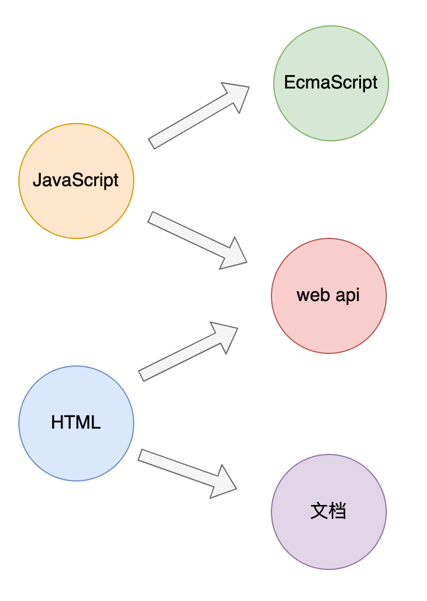

HTML5 包含两个部分的更新，分别是`文档`和`web api`

# 补充 H5 文档

[HTML5 元素表](https://www.xuanfengge.com/funny/html5/element/)

## 元素语义化

元素语义化是指**每个 HTML 元素都代表着某种含义，在开发中应该根据元素含义选择元素**

元素语义化的好处：

1. 利于 SEO（搜索引擎优化）
2. 利于无障碍访问
3. 利于浏览器的插件分析网页

## 新增元素

### 多媒体

可以使用`audio`元素表达一个音频

可以使用`video`元素表达一个视频

它们均具有以下属性

| 属性名   | 含义             | 类型     |
| -------- | ---------------- | -------- |
| src      | 多媒体的文件路径 | 普通属性 |
| controls | 是否显示播放控件 | 布尔属性 |
| autoplay | 是否自动播放     | 布尔属性 |
| loop     | 是否循环播放     | 布尔属性 |
| muted    | 静音播放         | 布尔属性 |

> 新版浏览器不允许「带声音的自动播放」，可能将来甚至不允许自动播放
>
> 浏览器希望播放行为由用户决定

### 文章结构

为了让搜索引擎和浏览器更好的理解文档内容，HTML5 新增了多个元素来表达内容的含义。

下面的示例中，使用了 HTML5 的新增元素来表达一篇文章

```html
<!-- article：一篇文章 -->
<article>
	<!-- header：文章头部信息 -->
	<header>
		<h1>文章标题</h1>
		<!-- blockquote：引用信息 -->
		<blockquote>此文章引用的文献：xxxx</blockquote>
	</header>
	<!-- aside: 文章的其他附加信息 -->
	<aside>
		<span>作者：xxxx</span>
		<span>发布日期：xxx</span>
		<span>浏览量：xxx</span>
	</aside>
	<!-- section：章节 -->
	<section>
		<h2>章节1</h2>
		<p>段落1</p>
		<p>段落2</p>
		<p>段落3</p>
		<p>段落4</p>
	</section>
	<!-- section：章节 -->
	<section>
		<h2>章节2</h2>
		<p>段落1</p>
		<p>段落2</p>
		<p>段落3</p>
		<p>段落4</p>
	</section>
	<!-- section：章节 -->
	<section>
		<h2>章节3</h2>
		<p>段落1</p>
		<p>段落2</p>
		<p>段落3</p>
		<p>段落4</p>
	</section>
	<!-- 页脚 -->
	<footer>
		<p>参考资料</p>
		<!-- cite表示外部站点的引用 -->
		<cite>xxxxxxx</cite>
		<cite>xxxxxxx</cite>
		<cite>xxxxxxx</cite>
		<cite>xxxxxxx</cite>
		<cite>xxxxxxx</cite>
		<cite>xxxxxxx</cite>
	</footer>
</article>
```

## 新增属性

### 自定义数据属性

> [data-\* 全局属性 是一类被称为自定义数据属性的属性，它赋予我们在所有 HTML 元素上嵌入自定义数据属性的能力，并可以通过脚本在 HTML 与 DOM 表现之间进行专有数据的交换。](https://developer.mozilla.org/zh-CN/docs/Web/HTML/Global_attributes/data-*)

<style>
	h1 {
	margin: 0;
}
ul[class='data-id'] {
	margin: 10px 0 0;
}
li[class='data-id']{
	position: relative;
	width: 200px;
	padding-bottom: 10px;
}
li[class='data-id']:after {
	content: 'Data ID: ' attr(data-id);
	position: absolute;
	top: -22px;
	left: 10px;
	background: black;
	color: white;
	padding: 2px;
	border: 1px solid #eee;
	opacity: 0;
	transition: 0.5s opacity;
}
li[class='data-id']:hover:after {
	opacity: 1;
}
</style>
<h1>Secret agents</h1>
<ul class="data-id">
	<li class="data-id" data-id="10784">Jason Walters, 003: Found dead in "A View to a Kill".</li>
	<li class="data-id" data-id="97865">Alex Trevelyan, 006: Agent turned terrorist leader; James' nemesis in "Goldeneye".</li>
	<li class="data-id" data-id="45732">James Bond, 007: The main man; shaken but not stirred.</li>
</ul>

```html
<!-- 代码如下 -->
<style>
	h1 {
		margin: 0;
	}
	ul[class='data-id'] {
		margin: 10px 0 0;
	}
	li[class='data-id'] {
		position: relative;
		width: 200px;
		padding-bottom: 10px;
	}
	li[class='data-id']:after {
		content: 'Data ID: ' attr(data-id);
		position: absolute;
		top: -22px;
		left: 10px;
		background: black;
		color: white;
		padding: 2px;
		border: 1px solid #eee;
		opacity: 0;
		transition: 0.5s opacity;
	}
	li[class='data-id']:hover:after {
		opacity: 1;
	}
</style>
<h1>Secret agents</h1>
<ul class="data-id">
	<li class="data-id" data-id="10784">Jason Walters, 003: Found dead in "A View to a Kill".</li>
	<li class="data-id" data-id="97865">Alex Trevelyan, 006: Agent turned terrorist leader; James' nemesis in "Goldeneye".</li>
	<li class="data-id" data-id="45732">James Bond, 007: The main man; shaken but not stirred.</li>
</ul>
```

[css 中 attr() 理论上能用于所有的 CSS 属性但目前支持的**仅有伪元素的 content 属性**，其他的属性和高级特性目前是实验性的](https://developer.mozilla.org/zh-CN/docs/Web/CSS/attr)

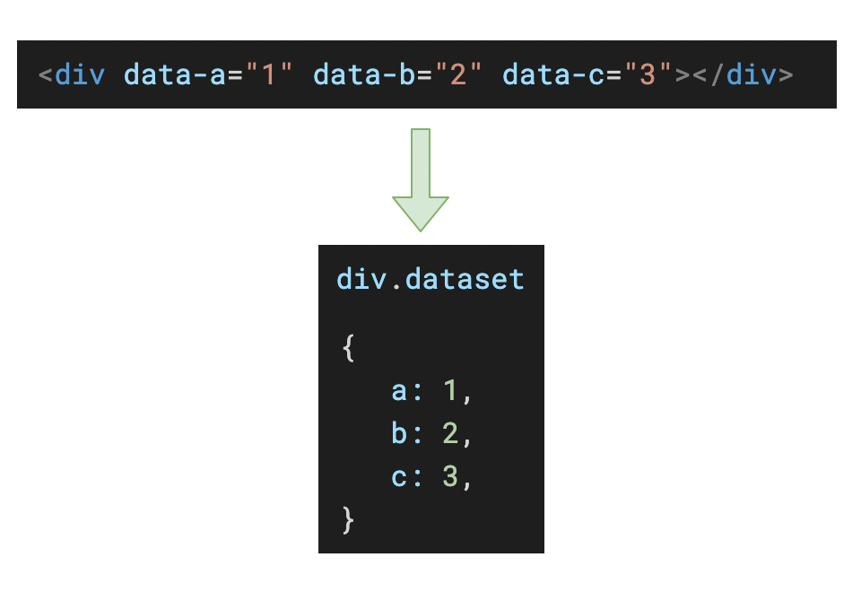

### input 的新增属性

> [MDN input 详细文档](https://developer.mozilla.org/zh-CN/docs/Web/HTML/Element/input)

进入下面的地址查看各种属性及其效果

http://mdrs.yuanjin.tech/html/html-manual/input-property.html

# web api

## 使用 css 选择器选中元素

```js
// 使用css选择器选中匹配的第一个元素
document.querySelector('css选择器');
// 使用css选择器选中匹配的所有元素，返回伪数组
document.querySelectorAll('css选择器');
```

## 控制类样式

```js
// 添加类样式
dom.classList.add('a'); // <div class="a"></div>
dom.classList.add('b'); // <div class="a b"></div>
dom.classList.add('c'); // <div class="a b c"></div>

// 是否包含某个类样式
dom.classList.contains('a'); // true

// 移除类样式
dom.classList.remove('a'); // <div class="b c"></div>

// 切换类样式 有就 加 没有就 减
dom.classList.toggle('a'); // <div class="a b c"></div>
dom.classList.toggle('a'); // <div class="b c"></div>
dom.classList.toggle('a'); // <div class="a b c"></div>
```

## 本地存储

`localStorage`，永久保存到本地

`sessionStorage`，临时保存到本地，关闭浏览器后消失

```js
// 保存一个键值对到本地，值必须是字符串
localStorage.setItem('key', 'value');
// 根据键，读取本地保存的值
localStorage.getItem('key');
// 清除所有保存的内容
localStorage.clear();
// 根据键，清除指定的内容
localStorage.removeItem('key');

// 保存一个键值对到本地，值必须是字符串
sessionStorage.setItem('key', 'value');
// 根据键，读取本地保存的值
sessionStorage.getItem('key');
// 清除所有保存的内容
sessionStorage.clear();
// 根据键，清除指定的内容
sessionStorage.removeItem('key');
```

无论是`localStorage`还是`sessionStorage`，它们都只能保存字符串，如果需要保存对象或数组，可以先将对象和数组转换为`JSON`字符串再进行保存

```js
JSON.stringify(obj); // 将对象或数组转换为JSON搁置
JSON.parse(jsonString); // 将JSON格式的字符串转换为对象或数组
```

## 渲染帧

浏览器会不断的对网页进行渲染，通常情况下的速度为每秒渲染 60 次，每一次渲染称之为**一帧**，因此又可以说：浏览器的渲染速率是 60 帧

但这不是一定的，它会受到各种因素的影响，因此，帧率往往会有浮动

浮动的帧率就导致一个问题，我们在使用`setInterval`等计时器实现某些动画效果时，如何才能保证每一帧只执行一次动画效果呢？

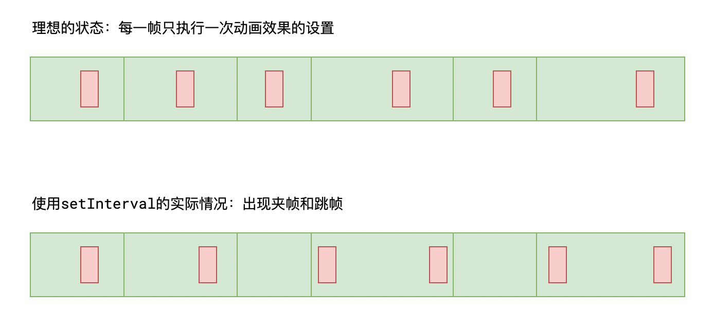

为了解决该问题，HTML5 新增 API **==requestAnimationFrame== **，用于在每一帧渲染**之前**做某些事

```js
requestAnimationFrame(function () {
	// 传入一个回调函数，该函数在下一帧渲染之前自动运行
	// 通常，可以利用该回调函数，在下一帧渲染前改动元素的状态
});
```

**==raq 的回调函数仅执行一次，因此，要实现连贯的动画，通常使用下面的代码结构==**

```js
// 该函数负责在下一帧渲染前，执行一次元素状态变化
function changeOnce() {
	requestAnimationFrame(function () {
		if (动画是否应该停止) {
			return;
		}
		改变元素状态;
		changeOnce(); // 改变完成后，继续注册下一针的变化
	});
}
changeOnce();
```

## 音视频 API

> [MDN 详细文档](https://developer.mozilla.org/zh-CN/docs/Web/API/HTMLMediaElement)

针对`video`和`audio`元素，HTML5 新增了音视频的 API，让开发者可以使用 JS 控制它们

**音视频属性**

| 属性名       | 含义                                                              |
| ------------ | ----------------------------------------------------------------- |
| currentTime  | 当前播放时间，单位为秒。为其赋值将会使媒体跳到一个新的时间。      |
| loop         | 对应 HTML 标签`loop`属性，决定该媒体是否循环播放.                 |
| controls     | 对应 HTML 标签`controls`属性，控制是否显示用户播放界面的控制 HTML |
| src          | 对应 HTML 标签`src`属性，获取和设置播放地址                       |
| volume       | 表示音频的音量。值从 0.0（静音）到 1.0（最大音量）。              |
| playbackRate | 播放倍速。1 为正常。                                              |
| duration     | 总时长，单位为秒。                                                |
| paused       | 当前是否是暂停状态                                                |
| muted        | 是否静音                                                          |

**音视频方法**

| 方法名  | 含义     |
| ------- | -------- |
| play()  | 开始播放 |
| pause() | 暂停播放 |

**事件**

| 事件名     | 含义                                                      |
| ---------- | --------------------------------------------------------- |
| pause      | 暂停时触发                                                |
| ended      | 结束时触发                                                |
| play       | 开始播放时触发                                            |
| timeupdate | 属性`currentTime`变化时触发。会随着播放进度的变化不断触发 |
| loadeddata | 事件在第一帧数据加载完成后触发                            |

# 自适应&响应式

自适应布局：一套布局，自动适配不同屏幕。

响应式布局：根据不同设备或屏幕大小，定义不同的布局。（难）

## 媒体查询

```css
/* 视口宽度 <= 768px */
@media screen and (max-width: 768px) {
  .container { flex-direction: column; }
}

/* 视口宽度 >= 769px 且 <= 1024px */
@media screen and (min-width: 769px) and (max-width: 1024px) {
  .container { flex-direction: row; }
}
```

常见断点：

| 断点 | 设备 |
| --- | --- |
| < 576px | 手机竖屏 |
| 576px ~ 768px | 手机横屏 / 小平板 |
| 768px ~ 992px | 平板 |
| 992px ~ 1200px | 小桌面 |
| > 1200px | 大桌面 |

## 移动端适配方案

### viewport

```html
<meta name="viewport" content="width=device-width, initial-scale=1.0, maximum-scale=1.0, user-scalable=no">
```

### rem 方案

根据屏幕宽度动态设置根元素 `font-size`，所有尺寸使用 `rem` 单位

```js
// 设置根元素 font-size
document.documentElement.style.fontSize = document.documentElement.clientWidth / 10 + 'px';
```

### vw/vh 方案

- `1vw` = 视口宽度的 1%
- `1vh` = 视口高度的 1%

```css
.box {
  width: 50vw;   /* 视口宽度的50% */
  height: 50vh;  /* 视口高度的50% */
  font-size: 4vw;
}
```

---
