<!-- [toc] -->

---

# Vue 2

## 核心概念

### 注入

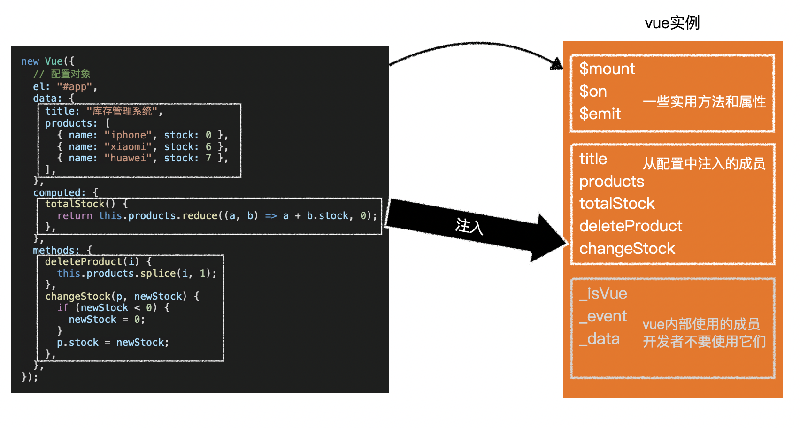

vue 会将以下配置注入到 vue 实例:

-   data: 和界面相关的数据
-   computed: 通过已有数据计算得来的数据，将来详细讲解
-   methods: 方法

> **==模板中可以使用 vue 实例中的成员==**

### 虚拟 DOM 树

直接操作真实的 DOM 会引发严重的效率问题，vue 使用虚拟 DOM（vnode）的方式来描述要渲染的内容

vnode 是一个**普通的**JS 对象，用于描述界面上应该有什么，比如:

```js
let vnode = {
	tag: 'h1',
	children: [{ tag: undefined, text: '第一个vue应用: Hello World' }],
};
```

上面的对象描述了:

```
有一个标签名为h1的节点，它有一个子节点，该子节点是一个文本，内容为「第一个vue应用: Hello World」
```

**vue 模板并不是真实的 DOM，它会被编译为虚拟 DOM**

```html
<div id="app">
	<h1>第一个vue应用: {{title}}</h1>
	<p>作者: {{author}}</p>
</div>
```

上面的模板会被编译为类似下面结构的虚拟 DOM

```js
{
  tag: "div",
  children: [
    { tag: "h1", children: [ { text: "第一个vue应用: Hello World" } ] },
    { tag: "p", children: [ { text: "作者: 袁" } ] }
  ]
}
```

虚拟 DOM 树会最终生成为真实的 DOM 树

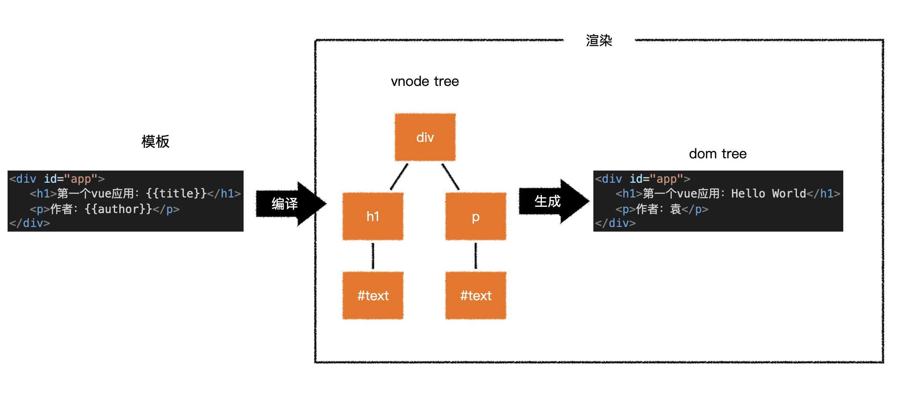

当数据变化后，将引发重新渲染，vue 会比较新旧两棵 vnode tree，找出差异，然后仅把差异部分应用到真实 dom tree 中

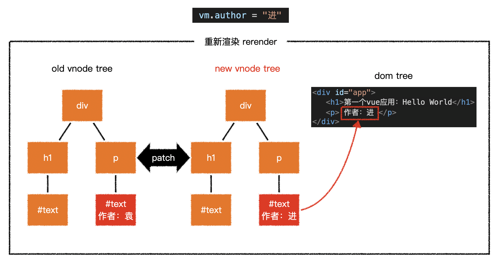

**可见，在 vue 中，要得到最终的界面，必须要生成一个 vnode tree**

vue 通过以下逻辑生成 vnode tree:

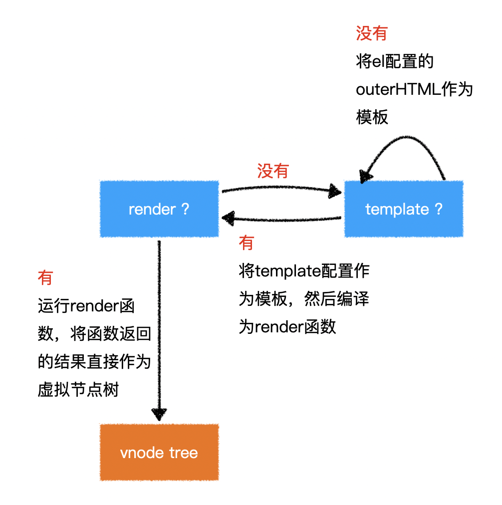

**==注意==**:  

### 挂载

将生成的真实 DOM 树，放置到某个元素位置，称之为**挂载**

挂载的方式:

1. 通过`el:"css选择器"`进行配置
2. 通过　==vue 实例.$mount("css 选择器")==　进行配置

### 完整流程

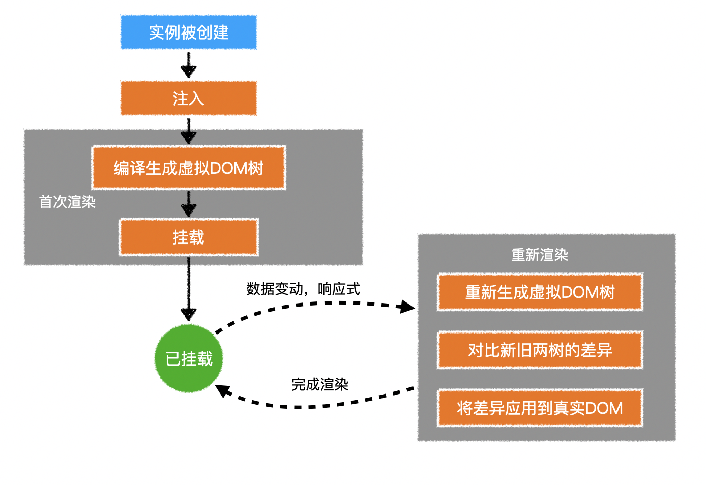

## vue-CLI

> vue-CLI （command line interface 命令行接口）: https://cli.vuejs.org/zh/

### 说明

`vue-cli`是一个脚手架工具，用于搭建`vue`工程

它内部使用了`webpack`，并预置了诸多插件（`plugin`）和加载器（`loader`），以达到开箱即用的效果

除了基本的插件和加载器外，`vue-cli`还预置了:

-   babel
-   webpack-dev-server
-   eslint
-   postcss
-   less-loader

### 步骤

第一步（仅第一次执行）：全局安装@vue/cli。

```sh
npm install -g @vue/cli
```

第二步：**切换到你要创建项目的目录**，然后使用命令创建项目

```sh
vue create xxxx
```

第三步：启动项目

```sh
npm run serve
```

备注：

1. 如出现下载缓慢请配置 npm 淘宝镜像：

    ```sh
    npm config set registry https://registry.npm.taobao.org
    ```

2. **Vue 脚手架隐藏了所有 webpack 相关的配置，若想查看具体的 webpakc 配置**，请执行：

    ```sh
    vue inspect > output.js
    ```

3. **使用 vue.config.js 可以对脚手架进行个性化定制，**详情见：https://cli.vuejs.org/zh

### 项目结构

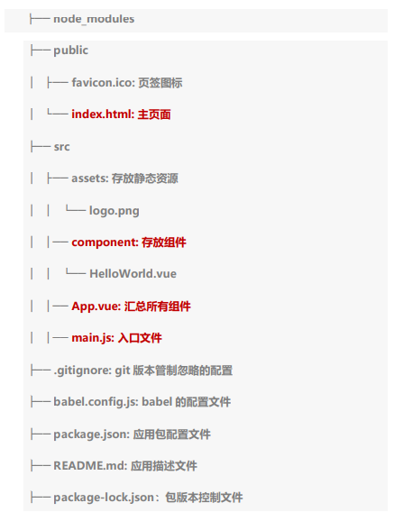

### SFC

单文件组件，Single File Component，即一个文件就包含了一个组件所需的全部代码

```html
<template>
	<!-- 组件模板代码 -->
</template>

<script>
	export default {
		// 组件配置
	};
</script>

<style>
	/* 组件样式 */
</style>
```

### 预编译

当`vue-cli`进行**打包**时，会直接把组件中的模板转换为`render`函数，这叫做模板预编译

这样做的好处在于:

1. 运行时就不再需要编译模板了，提高了运行效率
2. 打包结果中不再需要 vue 的编译代码，减少了打包体积

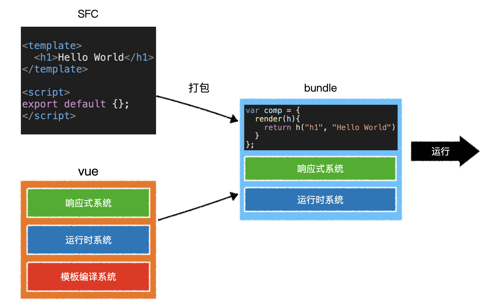

## MVVM 模型

-   **mvvm 模型**

    1.  M：模型（model）：data 中的数据

    2.  V：视图（view）：模板代码 --- Dom

    3.  VM：视图模型（viewModel）：Vue 实例 --- 数据绑定、监听 Dom

-   **观察发现**

    1.  data 中所有的属性，最后都出现在 vm 身上

    2.  **==vm 身上所有的属性 以及 Vue 原型上所有属性，在 Vue 模板中都可以直接使用==**

## 数据代理

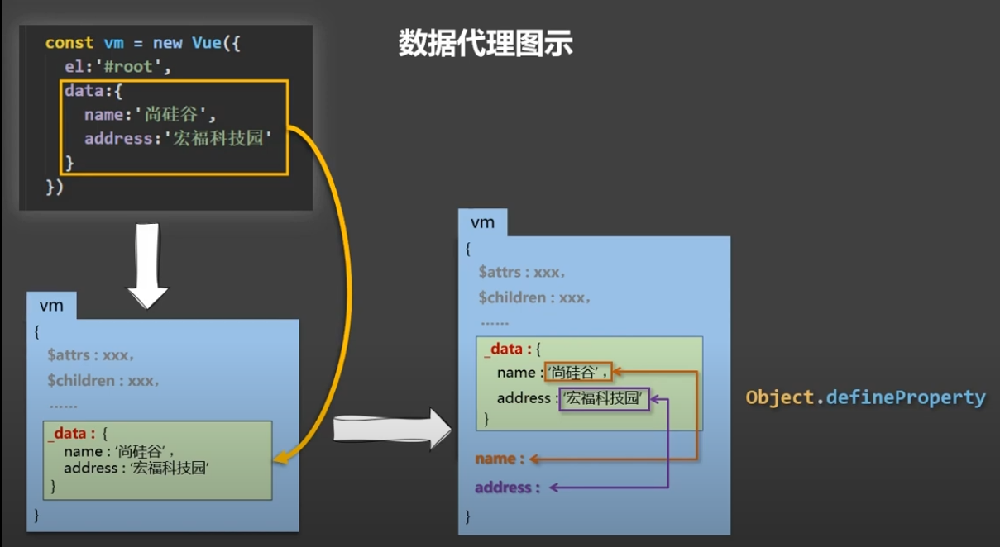

> 当你把一个普通的 JavaScript 对象传入 Vue 实例作为 `data` 选项，Vue 将遍历此对象所有的 property，并使用 [`Object.defineProperty`](https://developer.mozilla.org/zh-CN/docs/Web/JavaScript/Reference/Global_Objects/Object/defineProperty) 把这些 property 全部转为 [getter/setter](https://developer.mozilla.org/zh-CN/docs/Web/JavaScript/Guide/Working_with_Objects#定义_getters_与_setters)。`Object.defineProperty` 是 ES5 中一个无法 shim 的特性，这也就是 Vue 不支持 IE8 以及更低版本浏览器的原因。

-   **Vue 中的数据代理**：通过 vm 对象来代理 data 对象中属性的操作（读/写）

-   **Vue 中数据代理的好处**：更加方便的操作 data 中的数据

-   **基本原理**：

    -   通过 **Object.defineProperty()** 把 data 对象中的所有属性添加到 vm 上。为每一个添加到 vm 上的属性都指定一个 getter/setter。

    在 getter/setter 内部去操作（读/写）data 中对应的属性

### 深入响应式原理

#### 实现双向绑定

先来看看`Vue`中的双向绑定流程

1. `new Vue()`首先执行初始化，对`data`执行响应化处理，这个过程发生`Observe`中
2. 同时对模板执行编译，找到其中动态绑定的数据，从`data`中获取并初始化视图，这个过程发生在`Compile`中
3. 同时定义⼀个更新函数和`Watcher`，将来对应数据变化时`Watcher`会调用更新函数
4. 由于`data`的某个`key`在⼀个视图中可能出现多次，所以每个`key`都需要⼀个管家`Dep`来管理多个`Watcher`
5. 将来 data 中数据⼀旦发生变化，会首先找到对应的`Dep`，通知所有`Watcher`执行更新函数

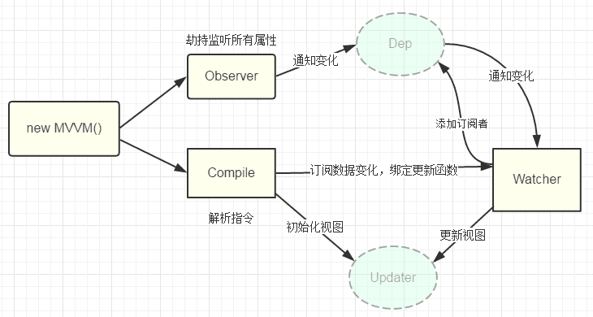

#### 追踪变化

每个组件实例都对应一个 **watcher** 实例，它会在组件渲染的过程中把“接触”过的数据 property 记录为依赖。之后当依赖项的 setter 触发时，会通知 watcher，从而使它关联的组件重新渲染。

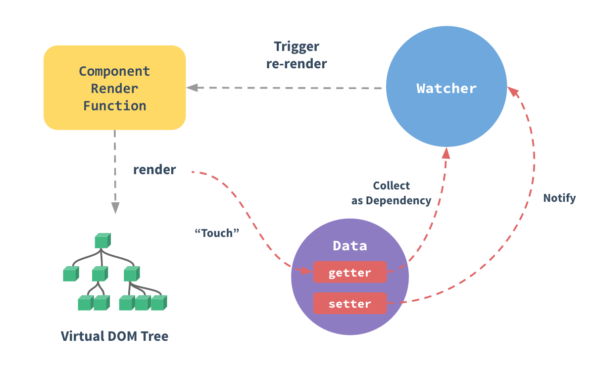

#### 注意事项

##### 对于对象

Vue 无法检测 property 的添加或移除。由于 Vue 会在初始化实例时对 property 执行 getter/setter 转化，所以 property 必须在 `data` 对象上存在才能让 Vue 将它转换为响应式的。例如：

```js
var vm = new Vue({
	data: {
		a: 1,
	},
});

// `vm.a` 是响应式的

vm.b = 2;
// `vm.b` 是非响应式的
```

对于已经创建的实例，**[Vue 不允许动态添加根级别的响应式 property](#声明响应式 property)**。但是，可以使用 `Vue.set(object, propertyName, value)` 方法向嵌套对象添加响应式 property。

例如，对于：

```js
Vue.set(vm.someObject, 'b', 2);
```

您还可以使用 `vm.$set` 实例方法，这也是全局 `Vue.set` 方法的别名：

```js
this.$set(this.someObject, 'b', 2);
```

##### 对于数组

如何监测数组中的数据：

通过包裹数组更新元素的方法实现，本质做了两件事

1.  **调用原生对应的方法对数组进行修改**
2.  **重新解析模板，进而更新页面**

Vue 不能检测以下数组的变动：

1. 当你利用索引直接设置一个数组项时，例如：`vm.items[indexOfItem] = newValue`
2. 当你修改数组的长度时，例如：`vm.items.length = newLength`

举个例子：

```js
var vm = new Vue({
	data: {
		items: ['a', 'b', 'c'],
	},
});
vm.items[1] = 'x'; // 不是响应性的
vm.items.length = 2; // 不是响应性的
```

在 Vue 中修改数组中的某个元素一定要用如下方法：

1. 使用这些 API：

    > **push(), pop(), shift(), unshift(), splice(), sort(), reverse()**

2. **Vue.set() 或者 vm.\$set() **

#### 声明响应式 property

由于 Vue 不允许动态添加根级响应式 property，所以你必须在初始化实例前声明所有根级响应式 property，哪怕只是一个空值：

```js
var vm = new Vue({
	data: {
		// 声明 message 为一个空值字符串
		message: '',
	},
	template: '<div>{{ message }}</div>',
});
// 之后设置 `message`
vm.message = 'Hello!';
```

如果你未在 `data` 选项中声明 `message`，Vue 将警告你渲染函数正在试图访问不存在的 property。

#### 异步更新队列

##### nextTick

> **在下次 DOM 更新循环结束之后执行延迟回调。在修改数据之后立即使用这个方法，获取更新后的 DOM**
>
> 更改完数据后 vue 更更新真实 dom 之后调用回调

**可能你还没有注意到，Vue 在更新 DOM 时是异步执行的。只要侦听到数据变化，Vue 将开启一个队列，并缓冲在同一事件循环中发生的所有数据变更。==如果同一个 watcher 被多次触发，只会被推入到队列中一次==**。这种在缓冲时去除重复数据对于避免不必要的计算和 DOM 操作是非常重要的。然后，**在下一个的事件循环“tick”中，Vue 刷新队列并执行实际 (已去重的) 工作**。

Vue 在内部对异步队列尝试使用原生的 `Promise.then`、`MutationObserver` 和 `setImmediate`，如果执行环境不支持，则会采用 `setTimeout(fn, 0)` 代替。

例如，当你设置 `vm.someData = 'new value'`，该组件不会立即重新渲染。==当刷新队列时，组件会在 **下一个** 事件循环“tick”中更新==。多数情况我们不需要关心这个过程，但是如果你想基于更新后的 DOM 状态来做点什么，这就可能会有些棘手。虽然 Vue.js 通常鼓励开发人员使用“数据驱动”的方式思考，避免直接接触 DOM，但是有时我们必须要这么做。==**为了在数据变化之后等待 Vue 完成更新 DOM，可以在数据变化之后立即使用 Vue.nextTick(callback) 。这样回调函数将在 DOM 更新完成后被调用**==。

```js
<div id="example">{{ message }}</div>;
var vm = new Vue({
	el: '#example',
	data: {
		message: '123',
	},
});
vm.message = 'new message'; // 更改数据
vm.$el.textContent === 'new message'; // false
Vue.nextTick(function () {
	vm.$el.textContent === 'new message'; // true
});
```

在组件内使用 **`vm.$nextTick()`** 实例方法特别方便，因为它不需要全局 `Vue`，并且回调函数中的 `this` 将自动绑定到当前的 Vue 实例上：

```js
Vue.component('example', {
	template: '<span>{{ message }}</span>',
	data: function () {
		return {
			message: '未更新',
		};
	},
	methods: {
		updateMessage: function () {
			this.message = '已更新';
			console.log(this.$el.textContent); // => '未更新'
			this.$nextTick(function () {
				console.log(this.$el.textContent); // => '已更新'
			});
		},
	},
});
```

**因为 $nextTick() 返回一个 Promise 对象**，所以你可以使用新的 [ES2017 async/await](https://developer.mozilla.org/zh-CN/docs/Web/JavaScript/Reference/Statements/async_function) 语法完成相同的事情：

```js
methods: {
  updateMessage: async function () {
    this.message = '已更新'
    console.log(this.$el.textContent) // => '未更新'
    await this.$nextTick()
    console.log(this.$el.textContent) // => '已更新'
  }
}
```

## 计算属性

1. 定义：

    > 要用的属性不存在，要通过**已有的属性**计算得来。

2. 原理：

    > 底层借助了 Object.defineproperty 方法提供的 getter 和 setter。

3. get 函数什么时候执行？

    - 初次读取时会执行一次
    - 当依赖的数据发生变化时会再次调用

4. 优势：

    > 与 methods 实现相比，**==内部有缓存机制（复用），效率更高，调试方便==**。

5. 备注：

    - 计算属性最终会出现在 vm 上，直接读取使用即可。
    - 如果计算属性要被修改，那必须写 set 函数去相应修改，**且 set 中要引起计算时依赖的数据发生改变**。

```html
<div id="example">
	<p>Original message: "{{ message }}"</p>
	<p>Computed reversed message: "{{ reversedMessage }}"</p>
</div>
```

```js
let vm = new Vue({
	el: '#example',
	data: {
		message: 'Hello',
	},
	computed: {
		// 计算属性的 getter
		reversedMessage: function () {
			// `this` 指向 vm 实例
			return this.message.split('').reverse().join('');
		},
	},
});
```

### [计算属性缓存 vs 方法](https://v2.cn.vuejs.org/v2/guide/computed.html#计算属性缓存-vs-方法)

```html
<p>Reversed message: "{{ reversedMessage() }}"</p>
```

```js
// 在组件中
methods: {
  reversedMessage: function () {
    return this.message.split('').reverse().join('')
  }
}
```

我们可以将同一函数定义为一个方法而不是一个计算属性。两种方式的最终结果确实是完全相同的。然而，不同的是**计算属性是基于它们的==响应式依赖进行缓存==的**。**只在相关响应式依赖发生改变时它们才会重新求值**。这就意味着只要 `message` 还没有发生改变，多次访问 `reversedMessage` 计算属性会立即返回之前的计算结果，而 **不必再次执行函数**。

这也同样意味着下面的计算属性将不再更新，因为 `Date.now()` 不是响应式依赖：

```js
computed: {
  now: function () {
    return Date.now()
  }
}
```

相比之下，每当触发重新渲染时，调用方法将**总会**再次执行函数。

我们为什么需要缓存？假设我们有一个性能开销比较大的计算属性 **A**，它需要遍历一个巨大的数组并做大量的计算。然后我们可能有其他的计算属性依赖于 **A**。如果没有缓存，我们将不可避免的多次执行 **A** 的 getter！如果你不希望有缓存，请用方法来替代。

**面试题: 计算属性和方法有什么区别？**

> 计算属性本质上是包含 getter 和 setter 的方法
> 当获取计算属性时，实际上是在调用计算属性的 getter 方法。vue 会收集计算属性的依赖，并缓存计算属性的返回结果。只有当依赖变化后才会重新进行计算。
> 方法没有缓存，每次调用方法都会导致重新执行。
>
> 计算属性的 getter 和 setter 参数固定，getter 没有参数，setter 只有一个参数。而方法的参数不限。
>
> 由于有以上的这些区别，因此计算属性通常是根据已有数据得到其他数据，**并在得到数据的过程中不建议使用异步、当前时间、随机数等副作用操作**。
> 实际上，他们最重要的区别是含义上的区别。**==计算属性含义上也是一个数据，可以读取也可以赋值；方法含义上是一个操作，用于处理一些事情==**。

完整的计算属性书写:

```js
computed: {
  propName: {
      // get什么时候调用：1，初次读取propName 2，所依赖的数据发生变化的时候
    get(){
      // getter `this` 指向 vm Vue实例
    },
      // set什么时候调用：1，当 propName 被修改的时候
    set(val){
      // setter
    }
  }
}
```

只包含 getter 的计算属性简写:

```js
computed: {
  propName(){
    // getter
  }
}
```

## 侦听属性

### 侦听属性 watch

1. 当侦听的属性变化时，回调函数自动调用，进行相关操作
2. 侦听的属性必须存在，才能进行侦听
3. 侦听的两种写法：
    1. new Vue 时传入 watch 配置
    2. 通过 **vm.\$watch** 侦听

```js
watch: {
    data: {
      immediate: true, // 初始化时 调用handler
      handler(newVal,oldVal) {},
    },
  },
```

### 深度侦听

1. Vue 中的 watch 默认不检测对象内部值的变化（一层）
2. 配置 **deep:true** 可以检测对象内部值的变化（多层）

备注：

1. Vue 自身可以检测对象内部值的变化，当 Vue 提供的 watch 默认不可以（提升效率）；
2. 使用 watch 是根据数据的具体结构，决定是否采用深度侦听

```js
watch: {
    data: {
      deep: false, // 是否监听该数据内部属性的变化，默认 false
      immediate: false // 是否立即执行一次 handler，默认 false
      handler(newVal,oldVal) { },
    },
  },
```

### 计算属性 vs 侦听属性

1. computed 能完成的功能 watch 都可以完成。

2. watch 能完成的功能，computed 不一定能完成，例如：watch 可以进行异步操作。

两个重要小原则：

1.  被 Vue 管理的函数，最好写成普通函数，这样 this 的指指向才是 vm 或者 组件实例对象。

2.  所有不被 Vue 管理的函数（定时器的回调函数，Ajax 的回调函数等）。最好写成箭头函数。这样 this 的指向才是 vm 或者 组件实例对象。

细想一下这个例子：

```html
<div id="demo">{{ fullName }}</div>
```

```js
let vm = new Vue({
	el: '#demo',
	data: {
		firstName: 'Foo',
		lastName: 'Bar',
		fullName: 'Foo Bar',
	},
	watch: {
		firstName: function (val) {
			this.fullName = val + ' ' + this.lastName;
		},
		lastName: function (val) {
			this.fullName = this.firstName + ' ' + val;
		},
	},
});
```

上面代码是命令式且重复的。将它与计算属性的版本进行比较：

```js
let vm = new Vue({
	el: '#demo',
	data: {
		firstName: 'Foo',
		lastName: 'Bar',
	},
	computed: {
		fullName: function () {
			return this.firstName + ' ' + this.lastName;
		},
	},
});
```

虽然计算属性在大多数情况下更合适，但有时也需要一个自定义的侦听器。这就是为什么 Vue 通过 `watch` 选项提供了一个更通用的方法，来响应数据的变化。当需要在数据变化时**==执行异步或开销较大==**的操作时，这个方式是最有用的。

## Class 与 Style 绑定

### 绑定 HTML Class

> **:class="xxx" xxx 可以是字符串、对象、数组**

-   **字符串语法**

    > 适用于样式类名不确定，需要动态绑定

-   [**对象语法**](https://v2.cn.vuejs.org/v2/guide/class-and-style.html#对象语法)

    > 适用于样式个数确定，名字也确定，但是动态决定用不用

    ```html
    <div v-bind:class="classObject"></div>
    ```

    ```js
    data: {
      classObject: {
        active: true,
        'text-danger': false
      }
    }
    ```

    我们也可以在这里绑定一个返回对象的[计算属性](https://v2.cn.vuejs.org/v2/guide/computed.html)。这是一个常用且强大的模式：

    ```js
    data: {
      isActive: true,
      error: null
    },
    computed: {
      classObject: function () {
        return {
          active: this.isActive && !this.error,
          'text-danger': this.error && this.error.type === 'fatal'
        }
      }
    }
    ```

-   [**数组语法**](https://v2.cn.vuejs.org/v2/guide/class-and-style.html#数组语法)

    > 适用于要绑定的样式个数不确定，名字也不确定

    ```html
    <div v-bind:class="[activeClass, errorClass]"></div>
    ```

    ```js
    data: {
      activeClass: 'active',
      errorClass: 'text-danger'
    }
    ```

-   [**用在组件上**](https://v2.cn.vuejs.org/v2/guide/class-and-style.html#用在组件上)

### 绑定内联样式

> **:style = "{fontSize: xxx}" 其中 xxx 是动态值。** > **:style = "[a,b]" 其中 a、b 是样式对象。**

-   [**对象语法**](https://v2.cn.vuejs.org/v2/guide/class-and-style.html#对象语法-1)

    ```html
    <div v-bind:style="{ color: activeColor, fontSize: fontSize + 'px' }"></div>
    ```

    ```js
    data: {
      activeColor: 'red',
      fontSize: 30
    }
    ```

    直接绑定到一个样式对象通常更好，这会让模板更清晰：

    ```html
    <div v-bind:style="styleObject"></div>
    ```

    ```js
    data: {
    	styleObject: {
    		color: 'red',
    		fontSize: '13px'
    	}
    }
    ```

    同样的，对象语法常常结合返回对象的计算属性使用。

-   [**数组语法**](https://v2.cn.vuejs.org/v2/guide/class-and-style.html#数组语法-1)

    `v-bind:style` 的数组语法可以将多个样式对象应用到同一个元素上：

    ```html
    <div v-bind:style="[baseStyles, overridingStyles]"></div>
    ```

-   [**自动添加前缀**](https://v2.cn.vuejs.org/v2/guide/class-and-style.html#自动添加前缀)

    > 当 `v-bind:style` 使用需要添加[浏览器引擎前缀](https://developer.mozilla.org/zh-CN/docs/Glossary/Vendor_Prefix)的 CSS property 时，如 `transform`，Vue.js 会自动侦测并添加相应的前缀。

-   [**多重值**](https://v2.cn.vuejs.org/v2/guide/class-and-style.html#多重值)

    从 2.3.0 起你可以为 `style` 绑定中的 property 提供一个包含多个值的数组，常用于提供多个带前缀的值，例如：

    ```html
    <div :style="{ display: ['-webkit-box', '-ms-flexbox', 'flex'] }"></div>
    ```

    这样写只会渲染数组中最后一个被浏览器支持的值。在本例中，如果浏览器支持不带浏览器前缀的 flexbox，那么就只会渲染 `display: flex`。

## 条件渲染

### v-if

> 不展示的 DOM 元素直接被移除

-   **在 \<template> 元素上使用 v-if 条件渲染分组**

-   v-else

-   v-else-if

-   用 key 管理可复用的元素

    > Vue 会尽可能高效地渲染元素，通常会复用已有元素而不是从头开始渲染。这么做除了使 Vue 变得非常快之外，还有其它一些好处。例如，如果你允许用户在不同的登录方式之间切换：
    >
    > ```html
    > <template v-if="loginType === 'username'">
    > 	<label>Username</label>
    > 	<input placeholder="Enter your username" />
    > </template>
    > <template v-else>
    > 	<label>Email</label>
    > 	<input placeholder="Enter your email address" />
    > </template>
    > ```
    >
    > 那么在上面的代码中切换 `loginType` 将不会清除用户已经输入的内容。因为两个模板使用了相同的元素，`<input>` 不会被替换掉——仅仅是替换了它的 `placeholder`。
    >
    > 这样也不总是符合实际需求，所以 Vue 为你提供了一种方式来表达“这两个元素是完全独立的，不要复用它们”。只需添加一个具有唯一值的 `key` attribute 即可：
    >
    > ```html
    > <template v-if="loginType === 'username'">
    > 	<label>Username</label>
    > 	<input placeholder="Enter your username" key="username-input" />
    > </template>
    > <template v-else>
    > 	<label>Email</label>
    > 	<input placeholder="Enter your email address" key="email-input" />
    > </template>
    > ```
    >
    > **==注意==，`<label>` 元素仍然会被高效地复用，因为它们没有添加 `key` attribute。**

### v-show

> 不展示的 DOM 元素未被移除，仅仅是样式被隐藏了

**==注意==，`v-show` 不支持 `<template>` 元素，也不支持 `v-else`。**

### v-if vs v-show

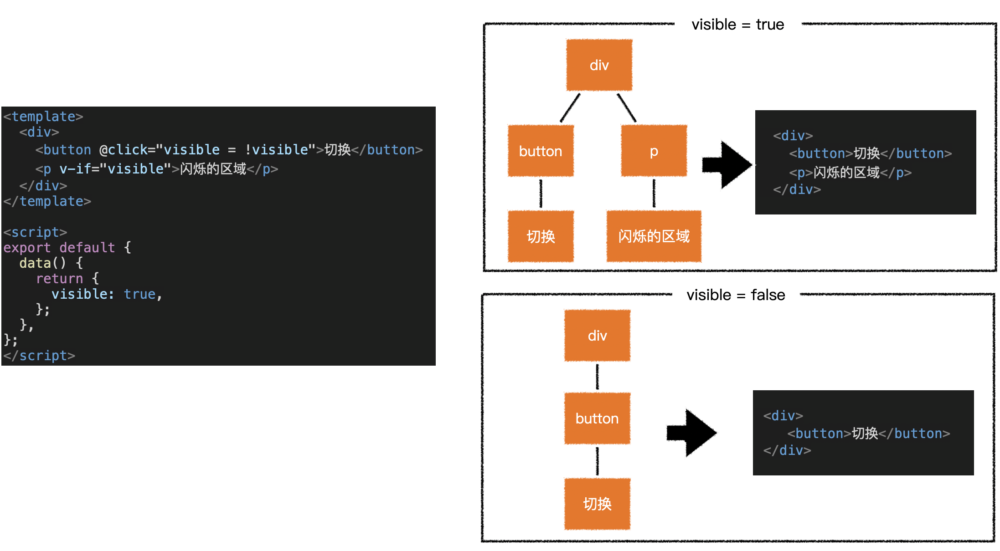

---

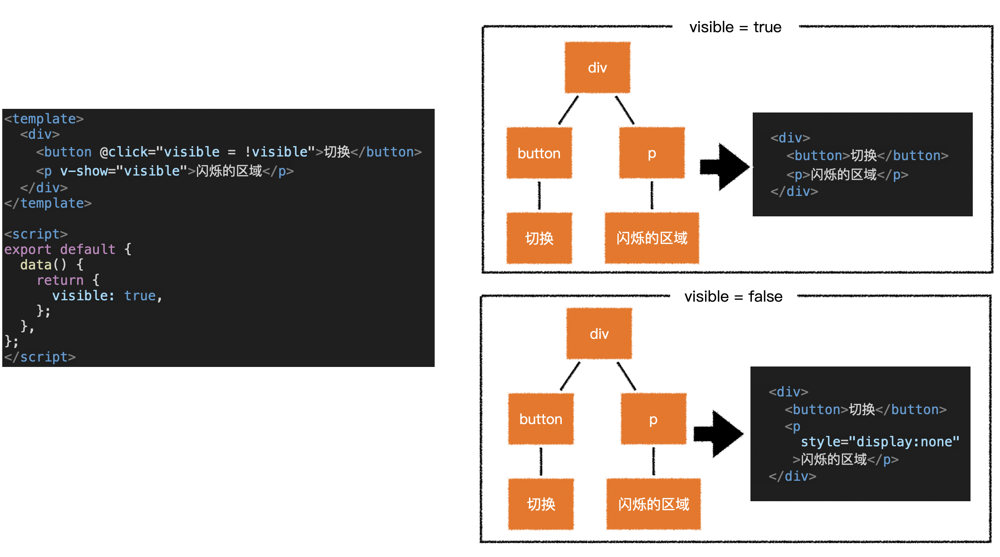

**面试题:** v-if 和 v-show 有什么区别？

-   ==v-if==
    能够控制是否生成 vnode，也就间接控制了是否生成对应的 dom。当 v-if 为 true 时，会生成对应的 vnode，并生成对应的 dom 元素；当其为 false 时，不会生成对应的 vnode，自然不会生成任何的 dom 元素。
-   ==v-show==
    始终会生成 vnode，也就间接导致了始终生成 dom。它只是控制 dom 的 display 属性，当 v-show 为 true 时，不做任何处理；当其为 false 时，生成的 dom 的 display 属性为 none。

使用 v-if 可以有效的减少树的节点和渲染量，但也会导致树的不稳定；而使用 v-show 可以保持树的稳定，但不能减少树的节点和渲染量。

**因此，在实际开发中，显示状态变化频繁的情况下应该使用 v-show，以保持树的稳定；显示状态变化较少时应该使用 v-if，以减少树的节点和渲染量。**

## 列表渲染

-   用 v-for 把一个数组对应为一组元素

    > 我们可以用 `v-for` 指令基于一个数组来渲染一个列表。`v-for` 指令需要使用 `item in items` 形式的特殊语法，其中 `items` 是源数据数组，而 `item` 则是被迭代的数组元素的**别名**。

    ```html
    <ul id="example-1">
    	<li v-for="(item,index) in items" :key="item.message">{{ parentMessage }} - {{ index }} - {{ item.message }}</li>
    </ul>
    ```

    ```js
    var example1 = new Vue({
    	el: '#example-1',
    	data: {
    		items: [{ message: 'Foo' }, { message: 'Bar' }],
    	},
    });
    ```

-   在 v-for 里使用对象

    ```html
    <div v-for="(value, name, index) in object">{{ index }}. {{ name }}: {{ value }}</div>
    ```

    > 在遍历对象时，会按 `Object.keys()` 的结果遍历，但是**不能**保证它的结果在不同的 JavaScript 引擎下都一致。

-   **维护状态**

    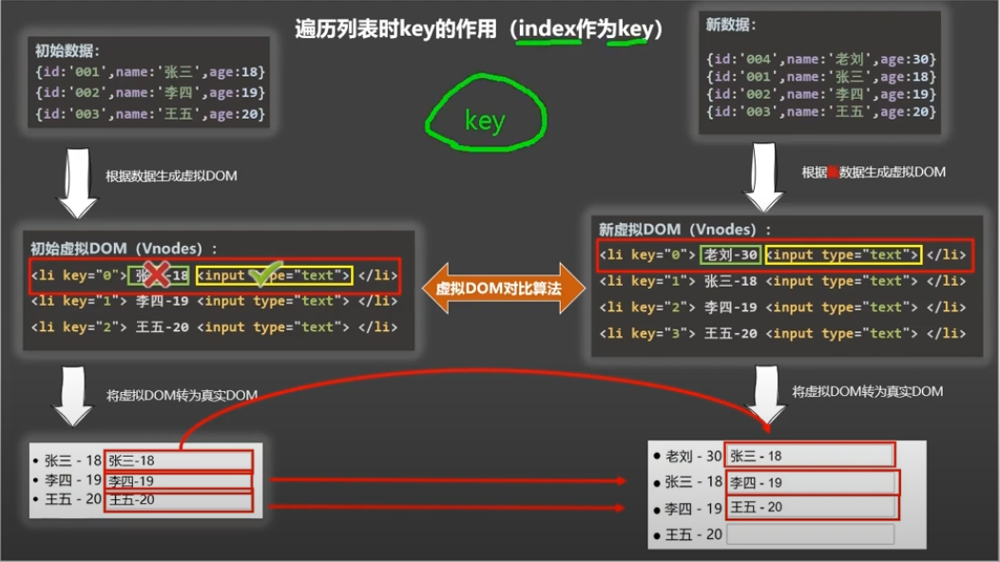

    > 当 Vue 正在更新使用 `v-for` 渲染的元素列表时，它默认使用 **就地更新** 的策略。如果数据项的顺序被改变，==Vue 将不会移动 DOM 元素来匹配数据项的顺序，而是就地更新每个元素==，并且确保它们在==每个索引位置==正确渲染。这个类似 Vue 1.x 的 `track-by="$index"`。
    >
    > 这个默认的模式是高效的，但是**只适用于不依赖子组件状态或临时 DOM 状态 (例如：表单输入值) 的列表渲染输出**。
    >
    > 为了给 Vue 一个提示，以便它能跟踪每个节点的身份，从而重用和重新排序现有元素，你需要为每**项提供一个唯一 `key` attribute**：
    >
    > ```html
    > <div v-for="item in items" v-bind:key="item.id">
    > 	<!-- 内容 -->
    > </div>
    > ```

    **面试题:** vue 中 key 有什么作用？（==key 的内部原理==）

    1.  虚拟 DOM 中 key 的作用：

        > key 是虚拟 DOM 对象的标识，当状态中的数据发生变化时，Vue 会根据【新数据】生成【新的虚拟 DOM】，随后进行【新虚拟 DOM】与【旧虚拟 DOM】的差异比较

    2.  比较规则：

        > 1. 旧虚拟 DOM 中找到了与新虚拟 DOM 相同的 key：
        >
        >     - 若虚拟 DOM 中内容没变，直接使用之前的真实 DOM！
        >     - 若虚拟 DOM 中内容变了，则生成新的真实 DOM，随后替换掉页面中之前的真实 DOM
        >
        > 2. 旧虚拟 DOM 中未找到与新虚拟 DOM 相同的 key：
        >     - 创建新的真实 DOM，随后渲染到页面

    3.  用 index 作为 key 可能引发的问题：

        > 1. 若对数据进行：逆序添加、逆序删除等破坏顺序操作：
        >
        >     会产生没有必要的真实 DOM 更新 ===> 界面效果没问题，但效率低
        >
        > 2. 如果结构中还包含输入类的 DOM：
        >
        >     会产生错误 DOM 更新 ===> 界面有问题

    4.  开发中如何选择 key：

        > 1. 最好使用每条数据的唯一标识作为 key
        > 2. 如果不存在对数据的逆序添加、逆序删除等破坏顺序操作，仅用于渲染列表展示，使用 index 作为 key 是没有问题的

-   [**数组** 更新检测](#数据代理)

    -   变更方法

        > **==不能通过索引修改数组元素的内容==**
        >
        > **Vue 将被侦听的数组的变更方法进行了包裹**，所以它们也将会触发视图更新。这些被包裹过的方法包括：

        -   `push()`
        -   `pop()`
        -   `shift()`
        -   `unshift()`
        -   `splice()`
        -   `sort()`
        -   `reverse()`

        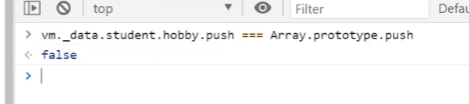

    -   替换数组

        > `filter()`、`concat()` 和 `slice()`。它们**不会变更原始数组**，而**总是返回一个新数组**。当使用非变更方法时，**==可以用新数组替换旧数组==**

    -   注意事项

        > 由于 JavaScript 的限制，Vue **不能检测**数组和对象的变化。[深入响应式原理](https://v2.cn.vuejs.org/v2/guide/reactivity.html#检测变化的注意事项)中有相关的讨论。

-   显示过滤/排序后的结果

    > 有时，我们想要显示一个数组经过 **过滤** 或 **排序** 后的版本，而不实际变更或重置原始数据。在这种情况下，可以创建一个计算属性，来返回过滤或排序后的数组。

    1.  过滤
    1.  排序

-   在 v-for 里使用范围值

-   在 \<template> 上使用 v-for

-   v-for 与 v-if 一同使用

    > 注意我们**不**推荐在同一元素上使用 `v-if` 和 `v-for`。更多细节可查阅[风格指南](https://v2.cn.vuejs.org/v2/style-guide/#避免-v-if-和-v-for-用在一起-必要)。

    ==当它们处于同一节点，v-for 的优先级比 v-if 更高，这意味着 v-if 将分别重复运行于每个 v-for 循环中。==当你只想为 **部分** 项渲染节点时，这种优先级的机制会十分有用，如下：

    ```html
    <li v-for="todo in todos" v-if="!todo.isComplete">{{ todo }}</li>
    ```

    上面的代码将只渲染未完成的 todo。

    而如果你的目的是有条件地跳过循环的执行，那么可以将 `v-if` 置于外层元素 (或 `<template>`) 上。如：

    ```html
    <ul v-if="todos.length">
    	<li v-for="todo in todos">{{ todo }}</li>
    </ul>
    <p v-else>No todos left!</p>
    ```

-   在组件上使用 v-for

## 事件处理

### 事件的基本使用

-   **使用 v-on:xxx 或者 @xxx 绑定事件。其中 xxx 为事件名**；
-   事件的回调需要配置在 methods 对象中，最终会在 vm 上；
-   methods 中配置的函数，不要使用箭头函数!否则 this 就不是 vm 了；
-   methods 中配置的函数，都是被 Vue 所管理的函数。this 的指向是 vm 或者 组件实例对象；
-   **@click="demo" 和 @click="demo(\$event)" 效果一致，但是后者可以传递其他参数。**

### 事件修饰符

Vue 中的[事件修饰符](https://www.youtube.com/watch?v=u5hsbvN1fUM&list=PLmOn9nNkQxJEARHuEpVayY6ppiNlkvrnb&index=15)：

> 修饰符可以连续写 @click.stop.prevent (点击事件-先阻止冒泡在阻止默认行为)

1.  prevent：阻止默认事件（常用）；
2.  stop：阻止事件冒泡（常用）；
3.  once：事件只触发一次（常用）；
4.  capture：使用时间的捕获模式；
5.  self：只有 event.target 是当前操作的元素时才触发事件；
6.  passive：事件的默认行为立即执行，无需等待事件回调执行完毕。

### 键盘事件

> [键盘事件](https://www.youtube.com/watch?v=C1Geqej3S5k&list=PLmOn9nNkQxJEARHuEpVayY6ppiNlkvrnb&index=16)

1. Vue 中常用的按键别名

    - 回车 => enter

    - 删除 => delete (捕获 “删除” 和 “退格”键)

    - 退出 => esc

    - 空格 => space

    - 换行 => tab

    - 上 => up

    - 下 => down

    - 左 => left

    - 右 => right

2. Vue 未提供别名的按键，可以使用按键原始的 key 值去绑定，但注意要转为 kebab-case（短横线命名）
3. 系统修饰键（用法特殊）ctrl、alt、shift、meta 1. 配合 keyup 使用：按下修饰键的同时，再按下其他键，随后释放其他键，事件触发。 2. 配合 keydown 使用：正常触发事件。
4. 也可以使用 keyCode 去指定具体按键（不推荐）。
5. Vue.config.keyCodes.自定义键名 = 键码 , 可以去定制按键别名

> @keyup.ctrl.y 连用

## 表单输入绑定

### 基本用法

你可以用 `v-model` 指令在表单 `<input>`、`<textarea>` 及 `<select>` 元素上创建双向数据绑定。它会根据控件类型自动选取正确的方法来更新元素。尽管有些神奇，但 `v-model` 本质上不过是语法糖。它负责监听用户的输入事件以更新数据，并对一些极端场景进行一些特殊处理。

> `v-model` 会忽略所有表单元素的 `value`、`checked`、`selected` attribute 的初始值而总是将 Vue 实例的数据作为数据来源。你应该通过 JavaScript 在组件的 `data` 选项中声明初始值。

`v-model` 在内部为不同的输入元素使用不同的 property 并抛出不同的事件：

-   text 和 textarea 元素使用 `value` property 和 `input` 事件；
-   checkbox 和 radio 使用 `checked` property 和 `change` 事件；
-   select 字段将 `value` 作为 prop 并将 `change` 作为事件。

> 对于需要使用[输入法](https://zh.wikipedia.org/wiki/输入法) (如中文、日文、韩文等) 的语言，你会发现 `v-model` 不会在输入法组合文字过程中得到更新。如果你也想处理这个过程，请使用 `input` 事件。

### 值绑定

对于单选按钮，复选框及选择框的选项，`v-model` 绑定的值通常是静态字符串 (对于复选框也可以是布尔值)：

```html
<!-- 当选中时，`picked` 为字符串 "a" -->
<input type="radio" v-model="picked" value="a" />

<!-- `toggle` 为 true 或 false -->
<input type="checkbox" v-model="toggle" />

<!-- 当选中第一个选项时，`selected` 为字符串 "abc" -->
<select v-model="selected">
	<option value="abc">ABC</option>
</select>
```

但是有时我们可能想把值绑定到 Vue 实例的一个动态 property 上，这时可以用 `v-bind` 实现，并且这个 property 的值可以不是字符串。

```html
<input type="radio" v-model="pick" v-bind:value="a" /> // 当选中时 // vm.pick === vm.a
```

**注意**

1. 若：\<input type="text"/>, 则 v-model 收集的是 value 值，用户输入的就是 value 值。
2. 若：\<input type="radio"/>, 则 v-model 收集的是 value 值，**且要给标签配置 value 值**。
3. 若：\<input type="checkbox"/>

    1. 若没有配置 input 的 ==value 属性==，那么收集的就是 checked（勾选 or 未勾选，是布尔值）
    2. 配置 input 的 value 属性：
        1. v-model 的初始值是非数组，那么收集的就是 checked（勾选 or 未勾选，是布尔值）
        2. v-model 的初始值是数组，那么收集的就是 value 组成的数组

### 修饰符

[`.lazy`](https://v2.cn.vuejs.org/v2/guide/forms.html#lazy)

> 在默认情况下，`v-model` 在每次 `input` 事件触发后将输入框的值与数据进行同步 (除了[上述](https://v2.cn.vuejs.org/v2/guide/forms.html#vmodel-ime-tip)输入法组合文字时)。你可以添加 `lazy` 修饰符，从而转为在 `change` 事件*之后*进行同步：

```html
<!-- 在“change”时而非“input”时更新 -->
<input v-model.lazy="msg" />
```

[`.number`](https://v2.cn.vuejs.org/v2/guide/forms.html#number)

> 如果想自动将用户的输入值转为数值类型，可以给 `v-model` 添加 `number` 修饰符：

```html
<input v-model.number="age" type="number" />
```

这通常很有用，因为即使在 `type="number"` 时，HTML 输入元素的值也总会返回字符串。如果这个值无法被 `parseFloat()` 解析，则会返回原始的值。

[`.trim`](https://v2.cn.vuejs.org/v2/guide/forms.html#trim)

> 如果要自动过滤用户输入的首尾空白字符，可以给 `v-model` 添加 `trim` 修饰符：

```html
<input v-model.trim="msg" />
```

## 生命周期

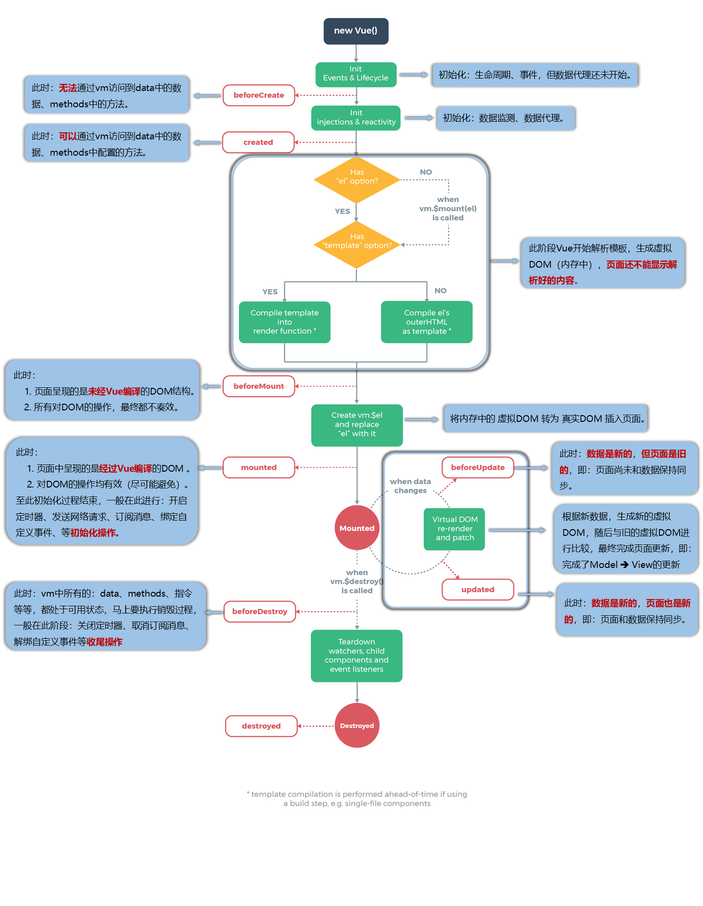

常用生命周期钩子：

1. **mounted** ： 发送 Ajax 请求、启动定时任务、绑定自定义事件、订阅消息等（初始化操作）
2. **beforeDestroy：==清除定时器、解绑自定义事件、取消订阅消息等（收尾工作）。==**

关于**销毁 Vue 实例**

1. 销毁后借助 Vue 开发者工具看不到任何信息
2. **==销毁后==自定义事件会失效，==但是原生 DOM 事件依然有效==**
3. **==一般不会在 beforeDestroy 操作数据，因为即便操作数据，也不会触发更新流程了==**

**图片以外的三个生命周期钩子：**

1. nextTick
2. activated（keep-alive 中）
3. deactivated （keep-alive 中）

## 组件

> **实现应用中 ==局部== 功能 ==代码== 和 ==资源== 的 ==集合==**

组件的出现是为了实现以下两个目标:

1. 降低整体复杂度，提升代码的可读性和可维护性
2. 提升局部代码的可复用性

绝大部分情况下，一个组件就是页面中某个区域，组件包含该区域的:

-   功能（JS 代码）

-   内容（模板代码）

-   样式（CSS 代码）

    > 要在组件中包含样式，需要构建工具的支撑

### 创建组件

组件是根据一个**==普通的配置对象==**创建的

> 配置对象上的方法 **并不等于(bind 绑定 this 返回的是新方法)** vc 实例上的方法
>
> **Vue 会自动为 methods 绑定 this，指向组件实例**

所以要开发一个组件，只需要写一个配置对象即可，该配置对象和 vue 实例的配置是**几乎一样**的

```js
// 单文件 组件配置对象
let myComp = {
	name: '', // 影响开发者工具中的组件名字
	data() {
		return { ... };
	},
	template: `....`,
};
// 非单文件
const myComp = Vue.extend({ opts });
```

值得注意的是，组件配置对象和 有以下几点差异（**Vue 实例对与组件实例**）:

-   **无 el**

-   **`data`必须是一个函数，==该函数返回的对象作为数据==**

    > vue data 是函数的原因:
    >
    > 1. 防止 data 复用；
    > 2. data 独立性；
    > 3. 作用域；
    > 4. js 的特性。
    >
    > 总结来说，如果 data 是一个函数的话，这样每复用一次组件，就会返回一份新的 data(类似于给每个组件实例创建一个私有的数据空间，让各个组件实例维护各自的数据)。

    **数据在哪儿 操作数据的方法就在哪儿**

-   **由于没有`el`配置，组件的虚拟 DOM 树必须定义在`template`或`render`中**

备注：

> **可以使用 name 配置项指定组件在开发者工具中呈现的名字**

#### VC 构造函数

1. **Vue.extend** 返回的组件本质是一个**名为 ==VueComponent== 的构造函数**，且不是程序员定义的，是 Vue.extend 生成的。

2. 组件标签 Vue 解析时会帮我们创建组件的实例对象，即执行 new VueComponent(opts)。

3. **每次调用 Vue.extend，返回的都是一个全新的 VueComponent ！**

4. this 指向：

    1. **组件配置中：**

        data 函数、methods、watch、component 中 他们的 this 均是 VueComponent 实例对象（**组件实例对象** vc）

    2. **new Vue() 配置中：**

        data 函数、methods、watch、component 中 他们的 this 均是 Vue 实例对象（**vm**）

#### 内置关系

==**( Vue.extend 返回) VueComponent.prototype.\_\_proto\_\_ =\== Vue.prototype**==

> **组件实例对象（vc）可以访问 Vue 原型上 的属性方法（以此实现 [事件总线](#事件总线)）**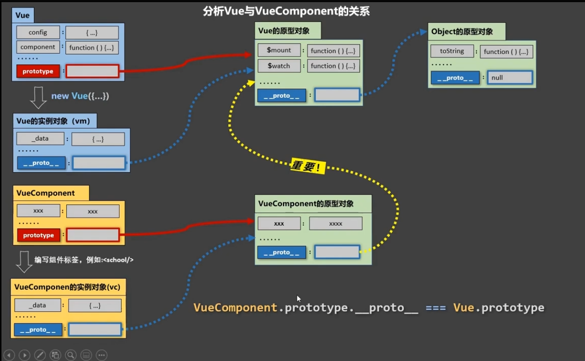

### 注册组件

注册组件分为两种方式，一种是**全局注册**，一种是**局部注册**

#### 全局注册

一旦全局注册了一个组件，整个应用中任何地方都可以使用该组件

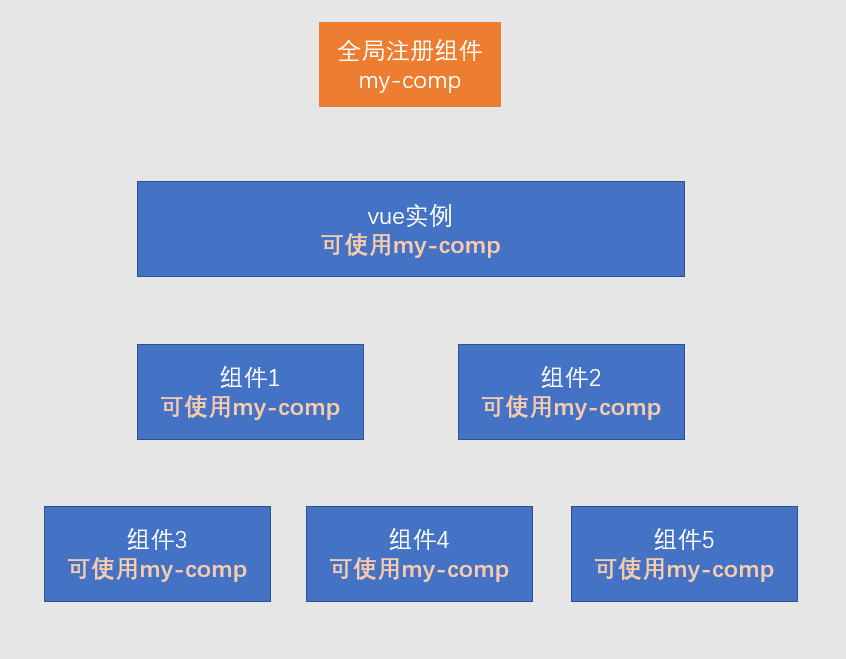

全局注册的方式是:

```js
// 参数1: 组件名称，将来在模板中使用组件时，会使用该名称
// 参数2: 组件配置对象
// 该代码运行后，即可在模板中使用组件
Vue.component('my-comp', myComp);
```

在模板中，可以使用组件了

```html
<my-comp />
<!-- 或 -->
<my-comp></my-comp>
```

> 但在一些工程化的大型项目中，很多组件都不需要全局使用。
> 比如一个登录组件，只有在登录的相关页面中使用，如果全局注册，将导致构建工具无法优化打包
> **因此，==除非组件特别通用，否则不建议使用全局注册==**

#### 局部注册

局部注册就是哪里要用到组件，就在哪里注册

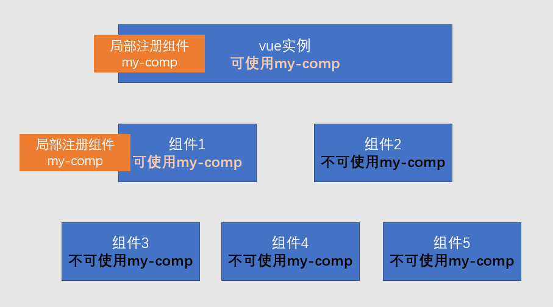

局部注册的方式是，在要使用组件的组件或实例中加入一个配置:

```js
// 这是另一个要使用my-comp的组件
let otherComp = {
  components:{
    // 属性名为组件名称，模板中将使用该名称
    // 属性值为组件配置对象
    "my-comp": myComp
  },
  template: `
    <div>
      <!-- 该组件的其他内容 -->
      <my-comp></my-comp>
    </div>
  `;
}
```

### 应用组件

在模板中使用组件特别简单，把组件名当作 HTML 元素名使用即可。

但要注意以下几点:

1. **组件必须有结束**

组件可以自结束，也可以用结束标记结束，但必须要有结束

> **不使用脚手架时，自结束会导致后续组件不能渲染**

下面的组件使用是错误的:

```html
<my-comp></my-comp>
```

2. **组件的命名**

无论你使用哪种方式注册组件，组件的命名需要遵循规范。

组件可以使用`kebab-case 短横线命名法`，也可以使用`PascalCase 大驼峰命名法`

下面两种命名均是可以的

```js
let otherComp = {
	components: {
		'my-comp': myComp, // 方式1
		MyComp: myComp, //方式2
	},
};
```

> 实际上，使用`小驼峰命名法 camelCase`也是可以识别的，只不过不符合官方要求的规范

==使用 PascalCase 方式命名还有一个额外的好处，即可以在模板中使用两种组件名==

```js
let otherComp = {
	components: {
		MyComp: myComp,
	},
};
```

模板中:

```html
<!-- 可用 -->
<my-comp />
<MyComp />
```

因此，在使用组件时，为了方便，往往使用以下代码:

```js
let MyComp = {
	//组件配置
};

let OtherComp = {
	components: {
		MyComp, // ES6速写属性
	},
};
```

### 组件树

一个组件创建好后，往往会在各种地方使用它。它可能多次出现在 vue 实例中，也可能出现在其他组件中。

于是就形成了一个组件树

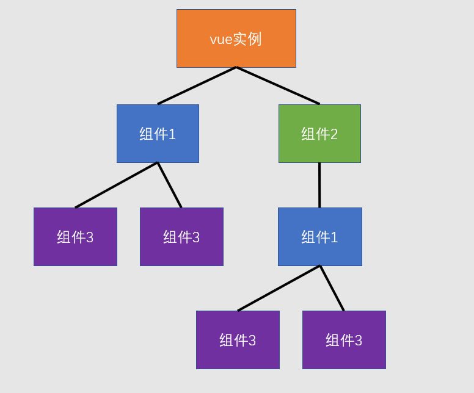

### 组件通信

大部分组件要完成自身的功能，都需要一些额外的信息

比如一个头像组件，需要告诉它头像的地址，这就需要在使用组件时向组件传递数据

传递数据的方式有很多种，最常见的一种是使用 **==组件属性 component props==**

首先在组件中申明可以接收哪些属性:

```js
let MyComp = {
	props: ['p1', 'p2', 'p3'],
	// 和vue实例一样，使用组件时也会创建组件的实例
	// 而组件的属性会被提取到组件实例中，因此可以在模板中使用
	template: `
    <div>
      {{p1}}, {{p2}}, {{p3}}
    </div>
  `,
};
```

在使用组件时，向其传递属性:

```js
let OtherComp = {
	components: {
		MyComp,
	},
	data() {
		return {
			a: 1,
		};
	},
	template: `
    <my-comp :p1="a" :p2="2" p3="3"/>
  `,
};
```

**注意: 在组件中，==属性 (_props_) 是只读的==，绝不可以更改，这叫做单向数据流**

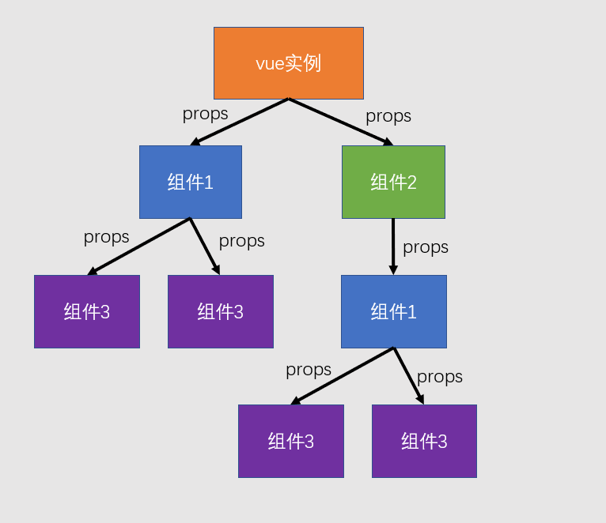

#### props 与 ref

**ref**

1. 作用：

    > 用于给节点打标识 （被用来给元素或者子组件注册引用信息（类似 id））
    >
    > 应用在 html 标签上获取的是真实 DOM 元素，应用在组件标签上是组件实例对象（vc）

2. 读取方式：this.$refs.xxx

```js
<Header ref="header" />;
this.$refs.header.$on('addTodo', this.addTodo);
```

**props**

1. 作用：

    > 用于父组件给子组件传递数据

2. 读取方式一: 只指定名称

    **props: ['name', 'age', 'setName']**

3. 读取方式二: 指定名称和类型

    **props: { name: String, age: Number, setNmae: Function }**

4. 读取方式三: 指定名称/类型/必要性/默认值

    **props: { name: {type: String, required: true, default:xxx}, }**

**==注意==**：==[props 是只读的](#单向数据流)==，Vue 底层会监测你对 props 的修改，如果进行了修改就会发出警告，若业务需要修改，可以复制 props 的内容到 data 中，然后修改 data 中的数据

> **props 和 methods 重名时 props 优先级高**

##### 单向数据流

> 所有的 prop 都使得其父子 prop 之间形成了一个**单向下行绑定**：父级 prop 的更新会向下流动到子组件中，但是反过来则不行。这样会防止从子组件意外变更父级组件的状态，从而导致你的应用的数据流向难以理解。

额外的，每次父级组件发生变更时，子组件中所有的 prop 都将会刷新为最新的值。这意味着你 **不** 应该在一个子组件内部改变 prop。如果你这样做了，Vue 会在浏览器的控制台中发出警告。

这里有两种常见的试图变更一个 prop 的情形：

1. **这个 prop 用来传递一个初始值；这个子组件接下来希望将其作为一个本地的 prop 数据来使用。**在这种情况下，最好定义一个本地的 data property 并将这个 prop 用作其初始值：

    ```js
    props: ['initialCounter'],
    data: function () {
      return {
        counter: this.initialCounter
      }
    }
    ```

2. **这个 prop 以一种原始的值传入且需要进行转换。**在这种情况下，最好使用这个 prop 的值来定义一个计算属性：

    ```js
    props: ['size'],
    computed: {
      normalizedSize: function () {
        return this.size.trim().toLowerCase()
      }
    }
    ```

> **==注意==**在 JavaScript 中对象和数组是通过引用传入的，所以对于一个数组或对象类型的 prop 来说，在子组件中改变变更这个对象或数组本身**将会**影响到父组件的状态。

#### 事件通信

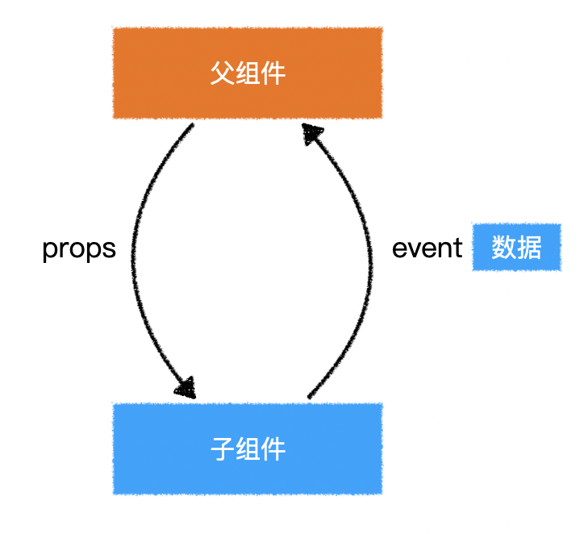

抛出事件：子组件在某个时候发生了一件事，但自身无法处理，于是通过事件的方式通知父组件处理

事件参数：子组件抛出事件时，传递给父组件的数据

注册事件：父组件申明，当子组件发生某件事的时候，自身将做出一些处理

**事件名**

> 不同于组件和 prop，事件名不存在任何自动化的大小写转换。而是触发的事件名需要**完全匹配**监听这个事件所用的名称。举个例子，如果触发一个 camelCase 名字的事件：

```js
this.$emit('myEvent');
```

则监听这个名字的 kebab-case 版本是不会有任何效果的：

```html
<!-- 没有效果 -->
<my-component v-on:my-event="doSomething"></my-component>
```

不同于组件和 prop，事件名不会被用作一个 JavaScript 变量名或 property 名，所以就没有理由使用 camelCase 或 PascalCase 了。并且 `v-on` 事件监听器在 DOM 模板中会被自动转换为全小写 (因为 HTML 是大小写不敏感的)，所以 `v-on:myEvent` 将会变成 `v-on:myevent`——导致 `myEvent` 不可能被监听到。

因此，我们推荐你**始终使用 kebab-case 的事件名**。

**自定义组件的 v-model**

> 2.2.0+ 新增

一个组件上的 **`v-model` 默认会利用名为 `value` 的 prop 和名为 `input` 的事件**，但是像单选框、复选框等类型的输入控件可能会将 `value` attribute 用于[不同的目的](https://developer.mozilla.org/en-US/docs/Web/HTML/Element/input/checkbox#Value)。`model` 选项可以用来避免这样的冲突：

```js
Vue.component('base-checkbox', {
	model: {
		prop: 'checked',
		event: 'change',
	},
	props: {
		checked: Boolean,
	},
	template: `
    <input
      type="checkbox"
      v-bind:checked="checked"
      v-on:change="$emit('change', $event.target.checked)"
    >
  `,
});
```

现在在这个组件上使用 `v-model` 的时候：

```html
<base-checkbox v-model="lovingVue"></base-checkbox>
```

这里的 `lovingVue` 的值将会传入这个名为 `checked` 的 prop。同时当 `<base-checkbox>` 触发一个 `change` 事件并附带一个新的值的时候，这个 `lovingVue` 的 property 将会被更新。

> **==注意==**你仍然需要在组件的 `props` 选项里声明 `checked` 这个 prop

**将原生事件绑定到组件**

> 你可能有很多次想要在一个组件的根元素上直接监听一个**原生事件**。这时，你可以使用 `v-on` 的 **`.native` 修饰符**

**.sync 修饰符**

> 2.3.0+ 新增

在有些情况下，我们可能需要对一个 prop 进行“双向绑定”。不幸的是，真正的双向绑定会带来维护上的问题，因为子组件可以变更父组件，且在父组件和子组件两侧都没有明显的变更来源。

这也是为什么我们推荐以 `update:myPropName` 的模式触发事件取而代之。举个例子，在一个包含 `title` prop 的假设的组件中，我们可以用以下方法表达对其赋新值的意图：

```js
this.$emit('update:title', newTitle);
```

然后父组件可以监听那个事件并根据需要更新一个本地的数据 property。例如：

```html
<text-document v-bind:title="doc.title" v-on:update:title="doc.title = $event"></text-document>
```

为了方便起见，我们为这种模式提供一个缩写，即 `.sync` 修饰符：

```html
<text-document v-bind:title.sync="doc.title"></text-document>
```

> **==注意==**带有 `.sync` 修饰符的 `v-bind` **不能**和表达式一起使用 (例如 `v-bind:title.sync=”doc.title + ‘!’”` 是无效的)。取而代之的是，你只能提供你想要绑定的 property 名，类似 `v-model`。

当我们用一个对象同时设置多个 prop 的时候，也可以将这个 `.sync` 修饰符和 `v-bind` 配合使用：

```html
<text-document v-bind.sync="doc"></text-document>
```

这样会把 `doc` 对象中的每一个 property (如 `title`) 都作为一个独立的 prop 传进去，然后各自添加用于更新的 `v-on` 监听器。

> 将 `v-bind.sync` 用在一个字面量的对象上，例如 `v-bind.sync=”{ title: doc.title }”`，是无法正常工作的，因为在解析一个像这样的复杂表达式的时候，有很多边缘情况需要考虑。

**用法**

-   子组件通过`$emit触发`自定义事件，`$emit`第二个参数为传递的数值
-   父组件绑定监听器获取到子组件传递过来的参数

**==面试题==：父组件调用子组件自定义事件时，是谁在监听这个事件？**

答案： 子组件本身，也就是谁触发事件谁就监听，子组件会通过父组件获取 监听器，最终编译成 this.\$emit(evenName,params) this.$on(eventName,handelrFn)

-   **绑定**

父组件中如下

```js
// 父组件给Header组件实例（Vc）绑自定义事件 add
<Header @add="addTodo"/>
<Header @add.once="addTodo"/> // 只触发一次

// 或者
<Header ref="header"/>
...
mounted(){
  this.$refs.header.$on('add', function(){...}) // 回调函数中的this是Header组件实例对象（vc）
  this.$refs.header.$on('add', this.addTodo)
  this.$refs.header.$once('add', this.addTodo) // 只触发一次
}
```

-   **触发-$emit**

子组件如下

```js
// 子组件（Header）触发add事件
this.$emit('add', todoObj);
```

使用事件抛出一个值

```html
<button v-on:click="$emit('enlarge-text', 0.1)">Enlarge text</button>
```

然后当在父级组件监听这个事件的时候，我们可以通过 `$event` 访问到被抛出的这个值：

```html
<blog-post ... v-on:enlarge-text="postFontSize += $event"></blog-post>
```

或者，如果这个事件处理函数是一个方法：

```html
<blog-post ... v-on:enlarge-text="onEnlargeText"></blog-post>
```

那么这个值将会作为第一个参数传入这个方法：

```js
methods: {
  onEnlargeText: function (enlargeAmount) {
    this.postFontSize += enlargeAmount
  }
}
```

-   **解绑-$off**

子组件中如下

```js
// 子组件（Header）解绑add事件
this.$off('add'); // 一个解绑
this.$off(['add', 'XXX']); // 多个解绑
this.$off(); // 所有的自定义事件全部解绑
```

#### 事件总线

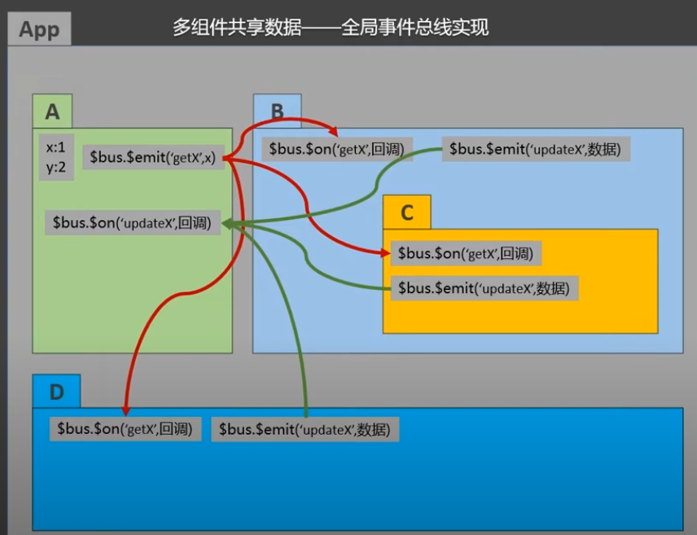

-   组件通信方式，适用于任何组件之间通信
-   创建一个中央事件总线 `EventBus`

```js
new Vue({
	...
  beforeCreate() {
		// 尽量早的执行挂载全局事件总线对象的操作
		Vue.prototype.$bus = this;
	},
  ...
});
```

-   使用事件总线

    -   接收数据：A 组件想接收数据，则 A 组件中给 $bus 绑定自定义事件，事件的回调留在 A 组件

    ```js
    methods(){
        test(data){...}
    },
    ...
    mounted(){
        this.$bus.$on("xxx",this.test)
    }
    ```

    -   提供数据：`this.$bus.$emit('xxx',数据)`

-   最好在 beforDestroy 钩子中使用$off 解绑当前组件所用到的事件

**==注意：事件总线貌似可以解决该问题，但需要在组件中手动的维护监听，极其不方便，而且事件总线的目的在于「通知」，而不是「共享数据」==**

**优化事件总线：**

Bus.js

```js
// 创建一个中央时间总线类
class Bus {
  constructor() {
    this.callbacks = {};   // 存放事件的名字
  }
  $on(eventName, fn) {
    this.callbacks[eventName] = this.callbacks[eventName] || [];
    this.callbacks[eventName].push(fn);
  }
  $emit(eventName, args) {
    if (this.callbacks[eventName]) {
      this.callbacks[eventName].forEach((cb) => cb(args));
    }
  }
  // 取消监听
  $off(eventName) {
    if (!callbacks[eventName]) {
      return;
    }
    delete callbacks[eventName];
  },
}
// main.js
Vue.prototype.$bus = new Bus() // 将$bus挂载到vue实例的原型上
// 另一种方式
Vue.prototype.$bus = new Vue() // Vue已经实现了Bus的功能
```

Children1.vue

```js
this.$bus.$emit('foo');
```

Children2.vue

```js
this.$bus.$on('foo', this.handle);
```

#### provide 与 inject

-   在祖先组件定义`provide`属性，返回传递的值
-   在后代组件通过`inject`接收组件传递过来的值

祖先组件

```js
provide(){
    return {
        foo:'foo'
    }
}
```

后代组件

```js
inject: ['foo']; // 获取到祖先组件传递过来的值
```

**==面试题==：provide 和 inject 原理**

答案：provide 其实不是真正的在根组件中注入，而是 子组件中的 inject 先根据 key 值 生成数组，然后根据数组的长度依次遍历，并且向上级查找有没有 provide 这个配置选项，如果有那么就会看有没有 跟当前 key 值 匹配，如果匹配的话 就会把 value 值赋值给这个 key。如果没有 provide ，那么他会继续往上找

#### 消息订阅与发布

理解

1. 这种方式的思想与全局事件总线很相似

2. 它包含以下操作:

    1. 订阅消息 --对应绑定事件监听

    2. 发布消息 --分发事件

    3. 取消消息订阅 --解绑事件监听

3. 需要引入一个消息订阅与发布的第三方实现库: PubSubJS

使用 **PubSubJS**

1. 在线文档: https://github.com/mroderick/PubSubJS

2. 下载: `npm install -S pubsub-js`

3. 相关语法

    1. `import PubSub from 'pubsub-js'` // 引入

    2. `PubSub.subscribe(‘msgName’, functon(msgName, data){ }) `

    3. `PubSub.publish(‘msgName’, data)` // 发布消息, 触发订阅的回调函数调用

    4. `PubSub.unsubscribe(token)` // 取消消息的订阅

手写

```js
// 发布订阅模式
class EventEmitter {
	constructor() {
		// 事件对象，存放订阅的名字和事件  如:  { click: [ handle1, handle2 ]  }
		this.events = {};
	}
	// 订阅事件的方法
	on(eventName, callback) {
		if (!this.events[eventName]) {
			// 一个名字可以订阅多个事件函数
			this.events[eventName] = [callback];
		} else {
			// 存在则push到指定数组的尾部保存
			this.events[eventName].push(callback);
		}
	}
	// 触发事件的方法
	emit(eventName, ...rest) {
		// 遍历执行所有订阅的事件
		this.events[eventName] && this.events[eventName].forEach((f) => f.apply(this, rest));
	}
	// 移除订阅事件
	remove(eventName, callback) {
		if (this.events[eventName]) {
			this.events[eventName] = this.events[eventName].filter((f) => f != callback);
		}
	}
	// 只执行一次订阅的事件，然后移除
	once(eventName, callback) {
		// 绑定的时fn, 执行的时候会触发fn函数
		const fn = (...rest) => {
			callback.apply(this, rest); // fn函数中调用原有的callback
			this.remove(eventName, fn); // 删除fn, 再次执行的时候之后执行一次
		};
		this.on(eventName, fn);
	}
}
```

### 动态组件

有的时候，在不同组件之间进行动态切换是非常有用的，比如在一个多标签的界面里：

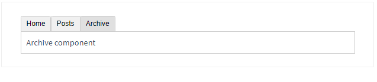

上述内容可以通过 Vue 的 `<component>` 元素加一个特殊的 `is` attribute 来实现：

```html
<!-- 组件会在 `currentTabComponent` 改变时改变 -->
<component v-bind:is="currentTabComponent"></component>
```

在上述示例中，`currentTabComponent` 可以包括

-   **已注册组件的名字，**

    **或**

-   **一个组件的选项对象**

你可以在[这里](https://codesandbox.io/s/github/vuejs/v2.vuejs.org/tree/master/src/v2/examples/vue-20-dynamic-components)查阅并体验完整的代码，或在[这个版本](https://codesandbox.io/s/github/vuejs/v2.vuejs.org/tree/master/src/v2/examples/vue-20-dynamic-components-with-binding)了解绑定组件选项对象，而不是已注册组件名的示例。

请留意，这个 attribute 可以用于常规 HTML 元素，但这些元素将被视为组件，这意味着所有的 attribute **都会作为 DOM attribute 被绑定**。对于像 `value` 这样的 property，若想让其如预期般工作，你需要使用 [`.prop` 修饰器](https://v2.cn.vuejs.org/v2/api/#v-bind)。

#### keep-alive

-   **Props**：

    -   `include` - 字符串或正则表达式。只有名称匹配的**==组件名（name 属性）==**会被缓存。
    -   `exclude` - 字符串或正则表达式。任何名称匹配的**==组件名（name 属性）==**都不会被缓存。
    -   `max` - 数字。最多可以缓存多少组件实例。

-   **用法**：

    **==keep-alive 包裹动态组件时，会缓存不活动的组件实例，而不是销毁它们==**。和 `<transition>` 相似。

    `<keep-alive>` 是一个抽象组件：它自身不会渲染一个 DOM 元素，也不会出现在组件的父组件链中。

    当组件在 `<keep-alive>` 内被切换，它的 **==activated==** 和 **==deactivated==** 这 **==[两个生命周期钩子函数](#生命周期)==** 将会被对应执行（**该钩子在服务器端渲染期间不被调用。**）。

    -   **activated**

        > 被 keep-alive 缓存的组件 **激活** 时调用。(显示)

    -   **deactivated**

        > 被 keep-alive 缓存的组件 **失活** 时调用。(缓存)

    > 在 2.2.0 及其更高版本中，`activated` 和 `deactivated` 将会在 `<keep-alive>` 树内的所有嵌套组件中触发。

    主要用于保留组件状态或避免重新渲染。

    ```html
    <!-- 基本 -->
    <keep-alive>
    	<component :is="view"></component>
    </keep-alive>

    <!-- 多个条件判断的子组件 -->
    <keep-alive>
    	<comp-a v-if="a > 1"></comp-a>
    	<comp-b v-else></comp-b>
    </keep-alive>

    <!-- 和 `<transition>` 一起使用 -->
    <transition>
    	<keep-alive>
    		<component :is="view"></component>
    	</keep-alive>
    </transition>
    ```

    注意，`<keep-alive>` 是用在其一个直属的子组件被开关的情形。如果你在其中有 `v-for` 则不会工作。如果有上述的多个条件性的子元素，`<keep-alive>` 要求同时只有一个子元素被渲染。

-   **`include` and `exclude`**

    > 2.1.0 新增

    `include` 和 `exclude` prop 允许组件有条件地缓存。二者都可以用逗号分隔字符串、正则表达式或一个数组来表示：

    ```html
    <!-- 逗号分隔字符串 -->
    <keep-alive include="a,b">
    	<component :is="view"></component>
    </keep-alive>

    <!-- 正则表达式 (使用 `v-bind`) -->
    <keep-alive :include="/a|b/">
    	<component :is="view"></component>
    </keep-alive>

    <!-- 数组 (使用 `v-bind`) -->
    <keep-alive :include="['a', 'b']">
    	<component :is="view"></component>
    </keep-alive>
    ```

    **==匹配首先检查组件自身的 name 选项，如果 name 选项不可用，则匹配它的局部注册名称 (父组件 components 选项的键值)。匿名组件不能被匹配。==**

-   **`max`**

    > 2.5.0 新增

    最多可以缓存多少组件实例。一旦这个数字达到了，在新实例被创建之前，已缓存组件中最久没有被访问的实例会被销毁掉。

    ```
    <keep-alive :max="10">
      <component :is="view"></component>
    </keep-alive>
    ```

    **`<keep-alive>` 不会在函数式组件中正常工作，因为它们没有缓存实例。**

-   **参考**：[动态组件 - keep-alive](https://v2.cn.vuejs.org/v2/guide/components-dynamic-async.html#在动态组件上使用-keep-alive)

### 插槽

> **slot 本质**上是返回 VNode 的 函数
>
> ```
> {
> default:(XXX){},
> soltName:(XXX){},
> }
> ```

通过`slot`插槽向组件内部指定位置传递内容，完成这个复用组件在不同场景的应用

比如 布局组件、表格列、下拉选、弹框显示内容等

#### 默认插槽

子组件用`<slot>`标签来确定渲染的位置，标签里面可以放`DOM`结构，当父组件使用的时候没有往插槽传入内容，标签内`DOM`结构就会显示在页面

父组件在使用的时候，直接在子组件的标签内写入内容即可

-   子组件`Child.vue`

```html
<template>
	<slot>
		<p>插槽后备的内容</p>
	</slot>
</template>
```

-   父组件

```html
<Child>
	<div>默认插槽</div>
</Child>
```

#### 具名插槽

子组件用`name`属性来表示插槽的名字，不传为默认插槽

父组件中在使用时在默认插槽的基础上加上`slot`属性，值为子组件插槽`name`属性值

-   子组件`Child.vue`

```html
<template>
	<slot>插槽后备的内容（default插槽）/slot>
	<slot name="content">插槽后备的内容（content插槽）</slot>
</template>
```

-   父组件

```html
<child>
	<template v-slot:default>具名插槽</template>
	<!-- 具名插槽⽤插槽名做参数 -->
	<template v-slot:content>内容...</template>
</child>
```

#### 作用域插槽

子组件在作用域上**==绑定属性==**来将子组件的信息传给父组件使用，这些属性会被挂在父组件`v-slot`接受的对象上

父组件中在使用时通过 **==v-slot:（简写：#）==**获取子组件的信息，在内容中使用

-   子组件`Child.vue`

```html
<template>
	<slot name="footer" testProps="子组件的值">
		<h3>没传footer插槽</h3>
	</slot>
</template>
```

-   父组件

```html
<child>
	<!-- 把v-slot的值指定为作⽤域上下⽂对象 -->
	<template v-slot:default="slotProps"> 来⾃⼦组件数据：{{slotProps.testProps}} </template>
	<template #footer="slotProps"> 来⾃⼦组件数据：{{slotProps.testProps}} </template>
</child>
```

**==小结：==**

-   `v-slot`属性只能在`<template>`上使用，但在只有默认插槽时可以在组件标签上使用
-   默认插槽名为`default`，可以省略 default 直接写`v-slot`
-   **缩写为`#`时不能不写参数，写成`#default`**
-   **可以通过解构获取 `v-slot={user}`，还可以重命名`v-slot="{user: newName}"`和定义默认值`v-slot="{user = '默认值'}"`**

#### 原理分析

> **`slot`本质上是返回`VNode`的函数，一般情况下，`Vue`中的组件要渲染到页面上需要经过`template -> render function -> VNode -> DOM` 过程，**
>
> **[跳转](https://vue3js.cn/interview/vue/slot.html#四、原理分析)**

### 作用域样式

**作用域样式对子组件根元素的影响**

> 影响子组件的根元素样式

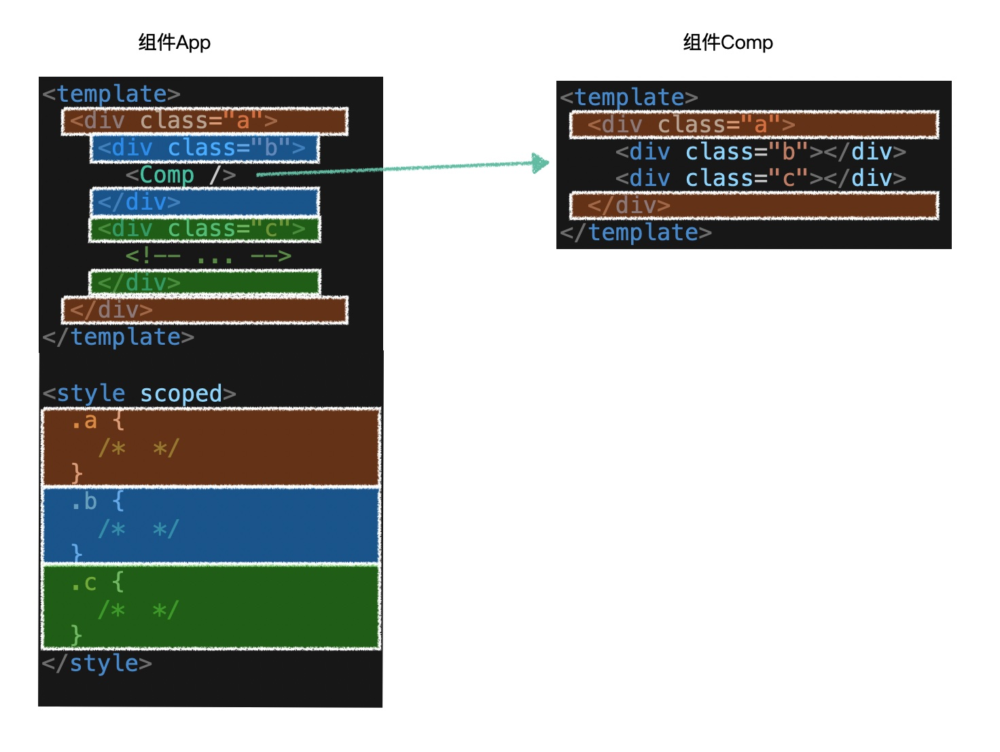

## 过渡&动画

### 进入/离开&列表过渡

#### 概述

Vue 在插入、更新或者移除 DOM 时，提供多种不同方式的应用过渡效果。包括以下工具：

-   在 CSS 过渡和动画中自动应用 class
-   可以配合使用第三方 CSS 动画库，如 Animate.css
-   在过渡钩子函数中使用 JavaScript 直接操作 DOM
-   可以配合使用第三方 JavaScript 动画库，如 Velocity.js

#### 单元素/组件的过渡

Vue 提供了 `transition` 的封装组件，在下列情形中，可以给任何元素和组件添加进入/离开过渡

-   条件渲染 (使用 `v-if`)
-   条件展示 (使用 `v-show`)
-   动态组件
-   组件根节点

这里是一个典型的例子：

```vue
<template>
	<div id="demo">
		<button v-on:click="show = !show">Toggle</button>
		<transition name="fade">
			<p v-if="show">hello</p>
		</transition>
	</div>
</template>

<script>
new Vue({
	el: '#demo',
	data: {
		show: true,
	},
});
</script>

<style>
.fade-enter-active,
.fade-leave-active {
	transition: opacity 0.5s;
}
.fade-enter, .fade-leave-to /* .fade-leave-active below version 2.1.8 */ {
	opacity: 0;
}
</style>
```

当插入或删除包含在 `transition` 组件中的元素时，Vue 将会做以下处理：

1. 自动嗅探目标元素是否应用了 CSS 过渡或动画，如果是，在恰当的时机添加/删除 CSS 类名。
2. 如果过渡组件提供了 [JavaScript 钩子函数](https://v2.cn.vuejs.org/v2/guide/transitions.html#JavaScript-钩子)，这些钩子函数将在恰当的时机被调用。
3. 如果没有找到 JavaScript 钩子并且也没有检测到 CSS 过渡/动画，DOM 操作 (插入/删除) 在下一帧中立即执行。(**==注意==**：此指浏览器逐帧动画机制，和 Vue 的 `nextTick` 概念不同)

##### 过渡的类名

1. `v-enter`：定义进入过渡的开始状态。在元素被插入之前生效，在元素被插入之后的下一帧移除。
2. `v-enter-active`：定义进入过渡生效时的状态。在整个进入过渡的阶段中应用，在元素被插入之前生效，在过渡/动画完成之后移除。这个类可以被用来定义进入过渡的过程时间，延迟和曲线函数。
3. `v-enter-to`：**2.1.8 版及以上**定义进入过渡的结束状态。在元素被插入之后下一帧生效 (与此同时 `v-enter` 被移除)，在过渡/动画完成之后移除。
4. `v-leave`：定义离开过渡的开始状态。在离开过渡被触发时立刻生效，下一帧被移除。
5. `v-leave-active`：定义离开过渡生效时的状态。在整个离开过渡的阶段中应用，在离开过渡被触发时立刻生效，在过渡/动画完成之后移除。这个类可以被用来定义离开过渡的过程时间，延迟和曲线函数。
6. `v-leave-to`：**2.1.8 版及以上**定义离开过渡的结束状态。在离开过渡被触发之后下一帧生效 (与此同时 `v-leave` 被删除)，在过渡/动画完成之后移除。

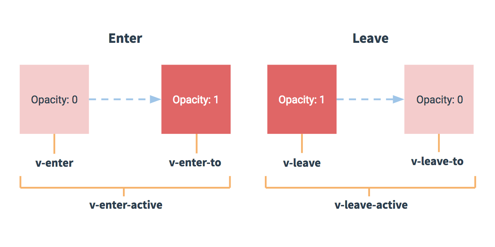

对于这些在过渡中切换的类名来说，如果你使用一个没有名字的 `<transition>`，则 **==v-==** 是这些类名的**==默认前缀==**。如果你使用了 `<transition name="my-transition">`，那么 `v-enter` 会替换为 `my-transition-enter`。

`v-enter-active` 和 `v-leave-active` 可以控制进入/离开过渡的不同的缓和曲线

##### 过渡 & 动画

##### 自定义类名

我们可以通过以下 attribute 来自定义过渡类名：

-   `enter-class`
-   `enter-active-class`
-   `enter-to-class` (2.1.8+)
-   `leave-class`
-   `leave-active-class`
-   `leave-to-class` (2.1.8+)

他们的优先级高于普通的类名，这对于 Vue 的过渡系统和其他第三方 CSS 动画库，如 [Animate.css](https://daneden.github.io/animate.css/) 结合使用十分有用。

##### Js 钩子

> [可以在 attribute 中声明 JavaScript 钩子](https://v2.cn.vuejs.org/v2/guide/transitions.html#JavaScript-钩子)

```html
<transition v-on:before-enter="beforeEnter" v-on:enter="enter" v-on:after-enter="afterEnter" v-on:enter-cancelled="enterCancelled" v-on:before-leave="beforeLeave" v-on:leave="leave" v-on:after-leave="afterLeave" v-on:leave-cancelled="leaveCancelled">
	<!-- ... -->
</transition>
```

当只用 JavaScript 过渡的时候，**在 `enter` 和 `leave` 中必须使用 `done` 进行回调**。否则，它们将被同步调用，过渡会立即完成。

推荐对于仅使用 JavaScript 过渡的元素添加 `v-bind:css="false"`，Vue 会跳过 CSS 的检测。这也可以避免过渡过程中 CSS 的影响。

#### 初始渲染过渡

可以通过 **==appear==** attribute 设置节点在初始渲染的过渡

```html
<transition appear>
	<!-- ... -->
</transition>
```

#### 列表过渡

那么怎么同时渲染整个列表，比如使用 `v-for`？在这种场景中，使用 [**transition-group**](https://v2.cn.vuejs.org/v2/guide/transitions.html#列表过渡) 组件。在我们深入例子之前，先了解关于这个组件的几个特点：

-   不同于 `<transition>`，它会以一个真实元素呈现：默认为一个 `<span>`。你也可以通过 `tag` attribute 更换为其他元素。
-   [过渡模式](https://v2.cn.vuejs.org/v2/guide/transitions.html#过渡模式)不可用，因为我们不再相互切换特有的元素。
-   内部元素**总是需要**提供唯一的 `key` attribute 值。
-   CSS 过渡的类将会应用在内部的元素中，而不是这个组/容器本身。

#### 可复用的过渡

过渡可以通过 Vue 的组件系统实现复用。要创建一个可复用过渡组件，你需要做的就是将 `<transition>` 或者 `<transition-group>` 作为根组件，然后将任何子组件放置在其中就可以了。

#### 动态过渡

在 Vue 中即使是过渡也是数据驱动的！动态过渡最基本的例子是通过 `name` attribute 来绑定动态值。

```html
<transition v-bind:name="transitionName">
	<!-- ... -->
</transition>
```

[**例子**](https://v2.cn.vuejs.org/v2/guide/transitions.html#动态过渡)

### 状态过渡

> [状态过度](https://v2.cn.vuejs.org/v2/guide/transitioning-state.html)

Vue 的过渡系统提供了非常多简单的方法设置进入、离开和列表的动效。那么对于数据元素本身的动效呢，比如：

-   数字和运算
-   颜色的显示
-   SVG 节点的位置
-   元素的大小和其他的 property

这些数据要么本身就以数值形式存储，要么可以转换为数值。有了这些数值后，我们就可以结合 Vue 的响应式和组件系统，使用第三方库来实现切换元素的过渡状态。

## mixin 混入

混入 (mixin) 提供了一种非常灵活的方式，来分发 Vue 组件中的可复用功能。一个混入对象可以包含任意组件选项。当组件使用混入对象时，所有混入对象的选项将被“混合”进入该组件本身的选项。

### [mixins](https://v2.cn.vuejs.org/v2/api/#mixins)

-   **类型**：`Array<Object>`

-   **详细**：

    > `mixins` 选项接收一个混入对象的数组。这些混入对象可以像正常的实例对象一样包含实例选项，这些选项将会被合并到最终的选项中，使用的是和 `Vue.extend()` 一样的选项合并逻辑。也就是说，如果你的混入包含一个 created 钩子，而创建组件本身也有一个，那么两个函数都会被调用。

    Mixin 钩子按照传入顺序依次调用，并在调用组件自身的钩子之前被调用。

```js
var mixin = {
	created: function () {
		console.log(1);
	},
};
var vm = new Vue({
	created: function () {
		console.log(2);
	},
	mixins: [mixin],
});
// => 1
// => 2
```

### 选择合并

> 当组件和混入对象含有同名选项时，这些选项将以恰当的方式进行“合并”。

-   **数据对象**在内部会进行递归合并，并在发生冲突时以组件数据优先。

-   **同名钩子函数**将合并为一个数组，因此都将被调用。另外，混入对象的钩子将在组件自身钩子**之前**调用
-   值为对象的选项，例如 `methods`、`components` 和 `directives`，将被合并为同一个对象。两个对象键名冲突时，取组件对象的键值对。

### 全局混入

> 混入也可以进行全局注册。使用时格外小心！一旦使用全局混入，它将影响**==每一个==**之后创建的 Vue 实例。使用恰当时，这可以用来为自定义选项注入处理逻辑。

## 指令

### 内部指令

-   **==[v-bind](https://v2.cn.vuejs.org/v2/api/#v-bind)==**

    -   **缩写**：**`:`**

    -   **预期**：`any (with argument) | Object (without argument)`

    -   **参数**：`attrOrProp (optional)`

    -   **修饰符**：

        -   `.prop` - 作为一个 DOM property 绑定而不是作为 attribute 绑定。([差别在哪里？](https://stackoverflow.com/questions/6003819/properties-and-attributes-in-html#answer-6004028))
        -   `.camel` - (2.1.0+) 将 kebab-case attribute 名转换为 camelCase。(从 2.1.0 开始支持)
        -   `.sync` (2.3.0+) 语法糖，会扩展成一个更新父组件绑定值的 `v-on` 侦听器。

    -   **用法**：

        动态地绑定一个或多个 attribute，或一个组件 prop 到表达式。

        在绑定 `class` 或 `style` attribute 时，支持其它类型的值，如数组或对象。

        在绑定 prop 时，prop 必须在子组件中声明。可以用修饰符指定不同的绑定类型。

        没有参数时，可以绑定到一个包含键值对的对象。注意此时 `class` 和 `style` 绑定不支持数组和对象。

    -   **示例**：

-   [**==v-model==**](https://v2.cn.vuejs.org/v2/api/#v-model)

    -   **预期**：随表单控件类型不同而不同。
    -   **限制**：
        -   `<input>`
        -   `<select>`
        -   `<textarea>`
        -   components
    -   **修饰符**：
        -   [`.lazy`](https://v2.cn.vuejs.org/v2/guide/forms.html#lazy) - 取代 `input` 监听 `change` 事件
        -   [`.number`](https://v2.cn.vuejs.org/v2/guide/forms.html#number) - 输入字符串转为有效的数字
        -   [`.trim`](https://v2.cn.vuejs.org/v2/guide/forms.html#trim) - 输入首尾空格过滤

-   v-for

-   **[==v-on==](https://v2.cn.vuejs.org/v2/api/#v-on)**

    -   **缩写**：`@`

    -   **预期**：`Function | Inline Statement | Object`

    -   **参数**：`event` 事件

    -   **修饰符**：

        -   `.stop` - 调用 `event.stopPropagation()`。 **阻止事件继续冒泡**
        -   `.prevent` - 调用 `event.preventDefault()`。**阻止浏览器的默认行为**
        -   `.capture` - 添加事件侦听器时使用 capture 模式。**使用事件捕获模式**
        -   `.self` - 只当事件是从侦听器绑定的元素本身触发时才触发回调。
        -   `.{keyCode | keyAlias}` - 只当事件是从特定键触发时才触发回调。
        -   [`.native` - **==监听组件根元素的原生事件==**。](#将原生事件绑定到组件)
        -   `.once` - 只触发一次回调。
        -   `.left` - (2.2.0) 只当点击鼠标左键时触发。
        -   `.right` - (2.2.0) 只当点击鼠标右键时触发。
        -   `.middle` - (2.2.0) 只当点击鼠标中键时触发。
        -   `.passive` - (2.3.0) 以 `{ passive: true }` 模式添加侦听器

    -   **用法**：

        绑定事件监听器。事件类型由参数指定。表达式可以是一个方法的名字或一个内联语句，如果没有修饰符也可以省略。

        用在普通元素上时，只能监听[**原生 DOM 事件**](https://developer.mozilla.org/zh-CN/docs/Web/Events)。用在自定义元素组件上时，也可以监听子组件触发的**自定义事件**。

        在监听原生 DOM 事件时，方法以事件为唯一的参数。如果使用内联语句，语句可以访问一个 `$event` property：`v-on:click="handle('ok', $event)"`。

        从 `2.4.0` 开始，`v-on` 同样支持不带参数绑定一个事件/监听器键值对的对象。注意当使用对象语法时，是不支持任何修饰器的。

    -   **示例**：

        ```html
        <!-- 方法处理器 -->
        <button v-on:click="doThis"></button>
    
        <!-- 动态事件 (2.6.0+) -->
        <button v-on:[event]="doThis"></button>
    
        <!-- 内联语句 -->
        <button v-on:click="doThat('hello', $event)"></button>
    
        <!-- 缩写 -->
        <button @click="doThis"></button>
    
        <!-- 动态事件缩写 (2.6.0+) -->
        <button @[event]="doThis"></button>
    
        <!-- 停止冒泡 -->
        <button @click.stop="doThis"></button>
    
        <!-- 阻止默认行为 -->
        <button @click.prevent="doThis"></button>
    
        <!-- 阻止默认行为，没有表达式 -->
        <form @submit.prevent></form>
    
        <!--  串联修饰符 -->
        <button @click.stop.prevent="doThis"></button>
    
        <!-- 键修饰符，键别名 -->
        <input @keyup.enter="onEnter" />
    
        <!-- 键修饰符，键代码 -->
        <input @keyup.13="onEnter" />
    
        <!-- 点击回调只会触发一次 -->
        <button v-on:click.once="doThis"></button>
    
        <!-- 对象语法 (2.4.0+) -->
        <button v-on="{ mousedown: doThis, mouseup: doThat }"></button>
        ```

        在子组件上监听自定义事件 (当子组件触发“my-event”时将调用事件处理器)：[触发-$emit](#触发-$emit)

        ```html
        <my-component @my-event="handleThis"></my-component>
    
        <!-- 内联语句 -->
        <my-component @my-event="handleThis(123, $event)"></my-component>
    
        <!-- 组件中的原生事件 -->
        <my-component @click.native="onClick"></my-component
        ```

-   v-if

-   v-else

-   v-show

-   v-text

    > 更新元素的 `textContent`。如果要更新部分的 `textContent`，需要使用 `{{ Mustache }}` 插值。

-   v-html

    > 在网站上动态渲染任意 HTML 是非常危险的，因为容易导致 [XSS 攻击](https://en.wikipedia.org/wiki/Cross-site_scripting)。只在可信内容上使用 `v-html`，**永不**用在用户提交的内容上。

    **==在[单文件组件](https://v2.cn.vuejs.org/v2/guide/single-file-components.html)里，scoped 的样式不会应用在 v-html 内部，因为那部分 HTML 没有被 Vue 的模板编译器处理。==如果你希望针对 `v-html` 的内容设置带作用域的 CSS，你可以替换为 [CSS Modules](https://vue-loader.vuejs.org/en/features/css-modules.html) 或用一个额外的全局 `<style>` 元素手动设置类似 BEM 的作用域策略。**

-   v-cloak

    > 这个指令保持在元素上直到关联实例结束编译。和 CSS 规则如 `[v-cloak] { display: none }` 一起用时，**==这个指令可以隐藏未编译的 Mustache 标签直到实例准备完毕==**。

    ```css
    <!-- 属性选择器 -- > [v-cloak] {
    	display: none;
    }
    ```

    ```html
    <div v-cloak>{{ message }}</div>
    ```

    **不会显示，直到编译结束**。

-   v-once

    > **不需要表达式**
    >
    > 只渲染元素和组件**一次**。随后的重新渲染，元素/组件及其所有的子节点将被视为**静态内容**并跳过。这可以用于优化更新性能。

-   v-pre

    > 过这个元素和它的子**元素的编译过程。可以用来显示原始 Mustache 标签。**跳过大量没有指令的节点会加快编译。

-   **[==v-slot==](#插槽)**

    -   **缩写**：`#`

    -   **预期**：可放置在函数参数位置的 JavaScript 表达式 (在[支持的环境下](https://v2.cn.vuejs.org/v2/guide/components-slots.html#解构插槽-Props)可使用解构)。可选，即只需要在为插槽传入 prop 的时候使用。

    -   **参数**：插槽名 (可选，默认值是 `default`)

    -   **限用于**

        -   `<template>`
        -   [组件](https://v2.cn.vuejs.org/v2/guide/components-slots.html#独占默认插槽的缩写语法) (对于一个单独的带 prop 的默认插槽)

    -   **用法**：

        提供具名插槽或需要接收 prop 的插槽。

    -   **示例**：

        ```html
        <!-- 具名插槽 -->
        <base-layout>
        	<template v-slot:header> Header content </template>
        
        	Default slot content
        
        	<template v-slot:footer> Footer content </template>
        </base-layout>
        
        <!-- 接收 prop 的具名插槽 -->
        <infinite-scroll>
        	<template v-slot:item="slotProps">
        		<div class="item">{{ slotProps.item.text }}</div>
        	</template>
        </infinite-scroll>
        
        <!-- 接收 prop 的默认插槽，使用了解构 -->
        <mouse-position v-slot="{ x, y }"> Mouse position: {{ x }}, {{ y }} </mouse-position>
        ```

### 自定义指令

> 对普通 DOM 元素进行底层操作

在`vue`中提供了一套为数据驱动视图更为方便的操作，这些操作被称为指令系统

我们看到的`v-`开头的行内属性，都是指令，不同的指令可以完成或实现不同的功能

除了核心功能默认内置的指令 (`v-model` 和 `v-show`)，`Vue` 也允许注册自定义指令

指令使用的几种方式：

```js
//会实例化一个指令，但这个指令没有参数
`v-xxx` // -- 将值传到指令中
`v-xxx="value"` // -- 将字符串传入到指令中，如`v-html="'<p>内容</p>'"`
`v-xxx="'string'"` // -- 传参数（`arg`），如`v-bind:class="className"`
`v-xxx:arg="value"` // -- 使用修饰符（`modifier`）
`v-xxx:arg.modifier="value"`;
```

==注意==：

> ==**指令（directives）内的 this 指向 window;**==
>
> **指令定义时不加 v- ，但是使用是要加 v-；**
>
> **指令名如果是多个单词，要使用 kebab-case（user-name）命名方式。不要用 cameCas（userName）e 命名。**

#### 函数式

```js
// 注册一个全局自定义指令 directive `v-focus`
Vue.directive('focus', {
	// 当被绑定的元素插入到 DOM 中时……
	inserted: function (el) {
		// 聚焦元素
		el.focus();
	},
});
```

```js
// 注册局部指令，组件中也接受一个 directives 的选项
directives: {
  focus: (el,binding) {
      el.focus()
  }
}
```

##### **函数式何时调用**

1. 指令与 元素 成功绑定时（一上来）bind

    > **==元素不一定在页面上==**

2. **指令所在的模板**被重新解析时 update

> **函数式相当于同时写了对象式中的 bind 和 update**

#### 对象式

```js
directives: {
  focus: {
    inserted: function (el,binding) {
      el.focus()
    }
  }
}
```

一个指令定义对象可以提供如下几个 **钩子函数** (均为可选)：

-   **[bind](#函数式何时调用)** （指令与元素成功绑定时，**==还未插入页面==**）

    > 只调用一次，指令第一次绑定到元素时调用。在这里可以进行一次性的初始化设置。

-   **inserted** （指令所在**元素被插入页面**时）

    > ==**被绑定元素插入父节点时调用 (仅保证父节点存在，但不一定已被插入文档中)**==。

-   **[update](#函数式何时调用)** （指令所在模板重新解析时）

    > 所在组件的 VNode 更新时调用，**但是可能发生在其子 VNode 更新之前**。指令的值可能发生了改变，也可能没有。但是你可以通过比较更新前后的值来忽略不必要的模板更新 (详细的钩子函数参数见下)。

-   componentUpdated：指令所在组件的 `VNode` 及其子 `VNode` 全部更新后调用
-   unbind：只调用一次，指令与元素解绑时调用

##### 钩子函数参数

-   `el`：指令所绑定的元素，可以用来直接操作 DOM。
-   `binding`：一个对象，包含以下 property：
    -   `name`：指令名，不包括 `v-` 前缀。
    -   **==value==**：指令的绑定值，例如：`v-my-directive="1 + 1"` 中，绑定值为 `2`。
    -   `oldValue`：指令绑定的前一个值，仅在 `update` 和 `componentUpdated` 钩子中可用。无论值是否改变都可用。
    -   **==expression==**：字符串形式的指令表达式。例如 `v-my-directive="1 + 1"` 中，表达式为 `"1 + 1"`。
    -   **==arg==：传给指令的参数，可选。例如 `v-my-directive:foo` 中，参数为 `"foo"`。**
    -   `modifiers`：一个包含修饰符的对象。例如：`v-my-directive.foo.bar` 中，修饰符对象为 `{ foo: true, bar: true }`。
-   `vnode`：Vue 编译生成的虚拟节点。移步 [VNode API](https://v2.cn.vuejs.org/v2/api/#VNode-接口) 来了解更多详情。
-   `oldVnode`：上一个虚拟节点，仅在 `update` 和 `componentUpdated` 钩子中可用。

除了 `el` 之外，其它参数都应该是只读的，切勿进行修改。如果需要在钩子之间共享数据，建议通过元素的 [`dataset`](https://developer.mozilla.org/zh-CN/docs/Web/API/HTMLElement/dataset) 来进行。

#### 动态指令参数

指令的参数可以是动态的。例如，在 `v-mydirective:[argument]="value"` 中，`argument` 参数可以根据组件实例数据进行更新！这使得自定义指令可以在应用中被灵活使用。

例如你想要创建一个自定义指令，用来通过固定布局将元素固定在页面上。我们可以像这样创建一个通过指令值来更新竖直位置像素值的自定义指令：

```js
<div id="baseexample">
	<p>Scroll down the page</p>
	<p v-pin="200">Stick me 200px from the top of the page</p>
</div>;
Vue.directive('pin', {
	bind: function (el, binding, vnode) {
		el.style.position = 'fixed';
		el.style.top = binding.value + 'px';
	},
});

new Vue({
	el: '#baseexample',
});
```

这会把该元素固定在距离页面顶部 200 像素的位置。但如果场景是我们需要把元素固定在左侧而不是顶部又该怎么办呢？这时使用动态参数就可以非常方便地根据每个组件实例来进行更新。

```html
<div id="dynamicexample">
	<h3>Scroll down inside this section ↓</h3>
	<p v-pin:[direction]="200">I am pinned onto the page at 200px to the left.</p>
</div>
```

```js
Vue.directive('pin', {
	bind: function (el, binding, vnode) {
		el.style.position = 'fixed';
		var s = binding.arg == 'left' ? 'left' : 'top';
		el.style[s] = binding.value + 'px';
	},
});
new Vue({
	el: '#dynamicexample',
	data: function () {
		return {
			direction: 'left',
		};
	},
});
```

结果：[CodePen 在线示例](https://codepen.io/team/Vue/embed/rgLLzb/?height=300&theme-id=32763&default-tab=result)

这样这个自定义指令现在的灵活性就足以支持一些不同的用例了。

[**关于自定义指令还有很多应用场景：**](https://juejin.cn/post/7067051410671534116#heading-4)

-   表单防止重复提交
-   图片懒加载
-   一键 Copy 的功能
-   拖拽指令
-   页面水印
-   权限校验等等应用场景

## render

> [render](https://v2.cn.vuejs.org/v2/api/#render)

-   **类型**：`(createElement: () => VNode) => VNode`

-   **详细**：

    字符串模板的代替方案，允许你发挥 JavaScript 最大的编程能力。该渲染函数接收一个 `createElement` 方法作为第一个参数用来创建 `VNode`。

    如果组件是一个函数组件，渲染函数还会接收一个额外的 `context` 参数，为没有实例的函数组件提供上下文信息。

    Vue 选项中的 `render` 函数若存在，则 Vue 构造函数不会从 `template` 选项或通过 `el` 选项指定的挂载元素中提取出的 HTML 模板编译渲染函数。

-   **参考**：[渲染函数](https://v2.cn.vuejs.org/v2/guide/render-function.html)

**关于不同版本的 Vue：**

1. vue.js 与 vue.runtime.xxx.js 的区别：
    1. vue.js 是完整版的 Vue，包含：核心功能+模板解析器
    2. vue.runtime.xxx.js 是运行版的 Vue，只包含：核心功能，没有模板解析器
2. 因为 vue.runtime.xxx.js 没有模板解析器，所以不能使用 template 配置项，需要使用 render 函数接收到的 createElement 函数去指定具体内容。

## 插件

> 1. Vue 插件是一个包含 install 方法的对象
> 2. 通过 install 方法给 Vue 或 Vue 实例添加方法, 定义全局指令等

**==插件通常用来为 Vue 添加全局功能==**。插件的功能范围没有严格的限制，一般有下面几种：

1. 添加全局方法或者 property。如：[vue-custom-element](https://github.com/karol-f/vue-custom-element)
2. 添加全局资源：指令/过滤器/过渡等。如 [vue-touch](https://github.com/vuejs/vue-touch)
3. 通过全局混入来添加一些组件选项。如 [vue-router](https://github.com/vuejs/vue-router)
4. 添加 Vue 实例方法，通过把它们添加到 `Vue.prototype` 上实现。
5. 一个库，提供自己的 API，同时提供上面提到的一个或多个功能。如 [vue-router](https://github.com/vuejs/vue-router)

### 使用插件

通过全局方法 **==Vue.use()==** [使用插件](https://v2.cn.vuejs.org/v2/guide/plugins.html#使用插件)。它需要在你调用 `new Vue()` 启动应用之前完成：

```js
// 调用 `MyPlugin.install(Vue)`
Vue.use(MyPlugin);

new Vue({
	// ...组件选项
});
```

也可以传入一个可选的选项对象：

```js
Vue.use(MyPlugin, { someOption: true });
```

`Vue.use` 会自动阻止多次注册相同插件，届时即使多次调用也只会注册一次该插件。

Vue.js 官方提供的一些插件 (例如 `vue-router`) 在检测到 `Vue` 是可访问的全局变量时会自动调用 `Vue.use()`。然而在像 CommonJS 这样的模块环境中，你应该始终显式地调用 `Vue.use()`：

```js
// 用 Browserify 或 webpack 提供的 CommonJS 模块环境时
var Vue = require('vue');
var VueRouter = require('vue-router');

// 不要忘了调用此方法
Vue.use(VueRouter);
```

> [awesome-vue](https://github.com/vuejs/awesome-vue#components--libraries) 集合了大量由社区贡献的插件和库。

### 开发插件

Vue.js 的插件应该暴露一个 `install` 方法。这个方法的第一个参数是 `Vue` 构造器，第二个参数是一个可选的选项对象：

```js
// Vue.use(MyPlugin, options);

MyPlugin.install = function (Vue, options) {
	// 1.全局方法或 property
	Vue.myGlobalMethod = function () {
		// 逻辑...
	};
	// 2.全局自定义指令
	Vue.directive('my-directive', {
		bind(el, binding, vnode, oldVnode) {
			// 逻辑...
		},
	});
	// 3.注入组件选项
	Vue.mixin({
		created: function () {
			// 逻辑...
		},
	});
	// 4.添加实例方法 （vm、vc都能使用）
	Vue.prototype.$myMethod = function (methodOptions) {
		// 逻辑...
	};
	// 5.全局过滤器
	Vue.filter('dateFormatter', function (value) {
		// 逻辑...
	});
};
```

## 过滤器

Vue.js 允许你自定义过滤器，可被用于一些常见的文本格式化。过滤器可以用在两个地方：**==双花括号插值== 和 ==v-bind== 表达式** (后者从 2.1.0+ 开始支持)。过滤器应该被添加在 JavaScript 表达式的尾部，**由“管道”符号指示**：

```html
<!-- 在双花括号中 -->
{{ message | capitalize }}

<!-- 在 `v-bind` 中 -->
<div v-bind:id="rawId | formatId"></div>
```

你可以 **在一个组件的选项中定义本地的过滤器**：

```js
filters: {
  capitalize: function (value) {
    if (!value) return ''
    value = value.toString()
    return value.charAt(0).toUpperCase() + value.slice(1)
  }
}
```

或者在 **创建 Vue 实例之前全局定义过滤器**：

```js
Vue.filter('capitalize', function (value) {
	if (!value) return '';
	value = value.toString();
	return value.charAt(0).toUpperCase() + value.slice(1);
});

new Vue({
	// ...
});
```

==**当全局过滤器和局部过滤器重名时，会采用局部过滤器。**==

过滤器是 JavaScript 函数，因此可以接收参数：

```js
{
	{
		message | filterA('arg1', arg2);
	}
}
```

这里，`filterA` 被定义为接收三个参数的过滤器函数。其中 `message` 的值作为第一个参数，普通字符串 `'arg1'` 作为第二个参数，表达式 `arg2` 的值作为第三个参数。

---

---

---

# Vuex

> 专门在 Vue 中实现集中式状态（数据）管理的一个 Vue 插件，对 vue 应用中多个组件的**==共享==**状态进行集中式的管理（读/写），也是一种组件间通信的方式，且适用于任意组件间通信。

## 什么时候使用 Vuex

1. 多个组件依赖于同一状态
2. 来自不同组件的行为需要变更同一状态

## Vuex 工作原理图

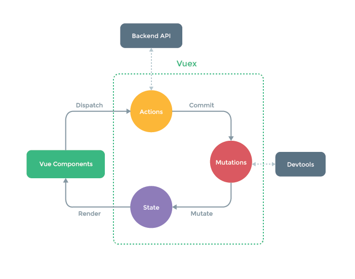

## 核心概念

### State

Vuex 使用**单一状态树**——是的，用一个对象就包含了全部的应用层级状态。至此它便作为一个“唯一数据源 ([SSOT](https://en.wikipedia.org/wiki/Single_source_of_truth))”而存在。这也意味着，每个应用将仅仅包含一个 store 实例。单一状态树让我们能够直接地定位任一特定的状态片段，在调试的过程中也能轻易地取得整个当前应用状态的快照。

#### **mapState**

当一个组件需要获取多个状态的时候，将这些状态都声明为计算属性会有些重复和冗余。**我们可以使用 `mapState` 辅助函数帮助我们生成计算属性**

对象写法：

```js
// 在单独构建的版本中辅助函数为 Vuex.mapState
import { mapState } from 'vuex';
export default {
	// ...
	computed: mapState({
		// 箭头函数可使代码更简练
		count: (state) => state.count,
		// 传字符串参数 'count' 等同于 `state => state.count`
		countAlias: 'count',
		// 为了能够使用 `this` 获取局部状态，必须使用常规函数
		countPlusLocalState(state) {
			return state.count + this.localCount;
		},
	}),
};
```

当映射的计算属性的名称与 state 的子节点名称相同时，我们也可以给 `mapState` 传一个**字符串数组**。简写：

```js
computed: mapState([
	// 映射 this.count 为 store.state.count
	'count',
]);
```

### Getter

> Vuex 允许我们在 store 中定义“getter”（可以认为是 store 的 **计算属性**）。

-   **通过属性访问**

Getter 会暴露为 `store.getters` 对象，你可以以属性的形式访问这些值：

```js
store.getters.doneTodos; // -> [{ id: 1, text: '...', done: true }]
```

Getter 也可以接受其他 getter 作为第二个参数：

```js
getters: {
  // ...
  doneTodosCount (state, getters) {
    return getters.doneTodos.length
  }
}
store.getters.doneTodosCount // -> 1
```

我们可以很容易地在任何组件中使用它：

```js
computed: {
  doneTodosCount () {
    return this.$store.getters.doneTodosCount
  }
}
```

注意，getter 在通过属性访问时是作为 Vue 的响应式系统的一部分缓存其中的。

-   **通过方法访问**

你也可以通过让 getter 返回一个函数，来实现给 getter 传参。在你对 store 里的数组进行查询时非常有用。

```js
getters: {
  // ...
  getTodoById: (state) => (id) => {
    return state.todos.find(todo => todo.id === id)
  }
}
...
store.getters.getTodoById(2) // -> { id: 2, text: '...', done: false }
```

**==注意==，getter 在通过方法访问时，每次都会去进行调用，而不会缓存结果。**

#### **mapGetters**

`mapGetters` 辅助函数仅仅是将 store 中的 getter 映射到局部计算属性：

```js
import { mapGetters } from 'vuex';

export default {
	// ...
	computed: {
		// 使用对象展开运算符将 getter 混入 computed 对象中
		...mapGetters([
			'doneTodosCount',
			'anotherGetter',
			// ...
		]),
	},
};
```

如果你想将一个 getter 属性另取一个名字，使用对象形式：

```js
...mapGetters({
  // 把 `this.doneCount` 映射为 `this.$store.getters.doneTodosCount`
  doneCount: 'doneTodosCount'
})
```

### Mutation

> 在 Vuex 中，**mutation 都是同步事务**

更改 Vuex 的 store 中的状态的唯一方法是提交 mutation。Vuex 中的 mutation 非常类似于事件：每个 mutation 都有一个字符串的**事件类型 (type)和一个回调函数 (handler)**。这个回调函数就是我们实际进行状态更改的地方，并且它会接受 state 作为第一个参数：

```js
const store = createStore({
	state: {
		count: 1,
	},
	mutations: {
		increment(state, payload) {
			// 变更状态
			state.count++;
		},
	},
});
```

你不能直接调用一个 mutation 处理函数。这个选项更像是事件注册：“当触发一个类型为 `increment` 的 mutation 时，调用此函数。”要唤醒一个 mutation 处理函数，你需要以相应的 type 调用 **store.commit** 方法：

```js
store.commit('increment', payload);
```

#### mapMutations

你可以在组件中使用 `this.$store.commit('xxx')` 提交 mutation，或者使用 `mapMutations` 辅助函数将组件中的 methods 映射为 `store.commit` 调用（需要在根节点注入 `store`）。

```js
import { mapMutations } from 'vuex';

export default {
	// ...
	methods: {
		...mapMutations([
			'increment', // 将 `this.increment()` 映射为 `this.$store.commit('increment')`

			// `mapMutations` 也支持载荷：参数需要在绑定事件时传递
			'incrementBy', // 将 `this.incrementBy(amount)` 映射为 `this.$store.commit('incrementBy', amount)`
		]),
		...mapMutations({
			add: 'increment', // 将 `this.add()` 映射为 `this.$store.commit('increment')`
		}),
	},
};
```

### Action

Action 类似于 mutation，不同在于：

-   Action 提交的是 mutation，而不是直接变更状态。
-   Action 可以包含任意异步操作。

Action 通过 `store.dispatch` 方法触发：

```js
store.dispatch('increment');
```

`store.dispatch` 可以处理被触发的 action 的处理函数返回的 Promise，并且 `store.dispatch` 仍旧返回 Promise：

```js
actions: {
  actionA ({ commit }) {
    return new Promise((resolve, reject) => {
      setTimeout(() => {
        commit('someMutation')
        resolve()
      }, 1000)
    })
  }
}
```

现在你可以：

```js
store.dispatch('actionA').then(() => {
	// ...
});
```

#### mapActions

你在组件中使用 `this.$store.dispatch('xxx')` 分发 action，或者使用 `mapActions` 辅助函数将组件的 methods 映射为 `store.dispatch` 调用（需要先在根节点注入 `store`）：

```js
import { mapActions } from 'vuex';

export default {
	// ...
	methods: {
		...mapActions([
			'increment', // 将 `this.increment()` 映射为 `this.$store.dispatch('increment')`

			// `mapActions` 也支持载荷：
			'incrementBy', // 将 `this.incrementBy(amount)` 映射为 `this.$store.dispatch('incrementBy', amount)`
		]),
		...mapActions({
			add: 'increment', // 将 `this.add()` 映射为 `this.$store.dispatch('increment')`
		}),
	},
};
```

### Module

> **让代码更好维护，让多种数据分类更加明确**

由于使用单一状态树，应用的所有状态会集中到一个比较大的对象。当应用变得非常复杂时，store 对象就有可能变得相当臃肿。

为了解决以上问题，Vuex 允许我们将 store 分割成 **模块（module）**。每个模块拥有自己的 state、mutation、action、getter、甚至是嵌套子模块——从上至下进行同样方式的分割：

```js
const moduleA = {
  state: () => ({ ... }),
  mutations: { ... },
  actions: { ... },
  getters: { ... }
}

const moduleB = {
  state: () => ({ ... }),
  mutations: { ... },
  actions: { ... }
}

const store = createStore({
  modules: {
    a: moduleA,
    b: moduleB
  }
})

store.state.a // -> moduleA 的状态
store.state.b // -> moduleB 的状态
```

#### 命名空间

默认情况下，模块内部的 action 和 mutation 仍然是注册在**全局命名空间**的——这样使得多个模块能够对同一个 action 或 mutation 作出响应。Getter 同样也默认注册在全局命名空间，但是目前这并非出于功能上的目的（仅仅是维持现状来避免非兼容性变更）。**必须注意，不要在不同的、无命名空间的模块中定义两个相同的 getter 从而导致错误。**

如果希望你的模块具有更高的封装度和复用性，你可以通过添加 **`namespaced: true`** 的方式使其成为带命名空间的模块。

**==当模块被注册后，它的所有 getter、action 及 mutation 都会自动根据模块注册的路径调整命名==**。

```js
const store = createStore({
  modules: {
    account: {
      namespaced: true,
      // 模块内容（module assets）
      state: () => ({ ... }), // 模块内的状态已经是嵌套的了，使用 `namespaced` 属性不会对其产生影响
      getters: {
        isAdmin () { ... } // -> getters['account/isAdmin']
      },
      actions: {
        login () { ... } // -> dispatch('account/login')
      },
      mutations: {
        login () { ... } // -> commit('account/login')
      },
      modules: { // 嵌套模块
        myPage: { // 继承父模块的命名空间
          state: () => ({ ... }),
          getters: {
            profile () { ... } // -> getters['account/profile']
          }
        },
        posts: { // 进一步嵌套命名空间
          namespaced: true,
          state: () => ({ ... }),
          getters: {
            popular () { ... } // -> getters['account/posts/popular']
          }
        }
      }
    }
  }
})
```

启用了命名空间的 getter 和 action 会收到局部化的 `getter`，`dispatch` 和 `commit`。换言之，你在使用模块内容（module assets）时不需要在同一模块内额外添加空间名前缀。更改 `namespaced` 属性后不需要修改模块内的代码。

#### 命名空间的绑定函数

当使用 `mapState`、`mapGetters`、`mapActions` 和 `mapMutations` 这些函数来绑定带命名空间的模块时，写起来可能比较繁琐：

```js
computed: {
  ...mapState({
    a: state => state.some.nested.module.a,
    b: state => state.some.nested.module.b
  }),
  ...mapGetters([
    'some/nested/module/someGetter', // -> this['some/nested/module/someGetter']
    'some/nested/module/someOtherGetter', // -> this['some/nested/module/someOtherGetter']
  ])
},
methods: {
  ...mapActions([
    'some/nested/module/foo', // -> this['some/nested/module/foo']()
    'some/nested/module/bar' // -> this['some/nested/module/bar']()
  ])
}
```

对于这种情况，你可以将模块的空间名称字符串作为第一个参数传递给上述函数，这样所有绑定都会自动将该模块作为上下文。于是上面的例子可以简化为：

```js
computed: {
  ...mapState('some/nested/module', {
    a: state => state.a,
    b: state => state.b
  }),
  ...mapGetters('some/nested/module', [
    'someGetter', // -> this.someGetter
    'someOtherGetter', // -> this.someOtherGetter
  ])
},
methods: {
  ...mapActions('some/nested/module', [
    'foo', // -> this.foo()
    'bar' // -> this.bar()
  ])
}
```

而且，你可以通过使用 `createNamespacedHelpers` 创建基于某个命名空间辅助函数。它返回一个对象，对象里有新的绑定在给定命名空间值上的组件绑定辅助函数：

```js
import { createNamespacedHelpers } from 'vuex';

const { mapState, mapActions } = createNamespacedHelpers('some/nested/module');

export default {
	computed: {
		// 在 `some/nested/module` 中查找
		...mapState({
			a: (state) => state.a,
			b: (state) => state.b,
		}),
	},
	methods: {
		// 在 `some/nested/module` 中查找
		...mapActions(['foo', 'bar']),
	},
};
```

# VueRouter

## SPA

> `SPA` 即为 single page application 的缩写，意为单页面应用，其作为一种网页应用模型。

简单来说，就是在同一个页面，通过 ajax 更新部分内容而非整个页面重新载入，达到较好的使用体验，并且可以节省网站资源。

**原理**

`js`会感知到`url`的变化，通过这一点可以用`js`动态地将当前页面的内容清除，然后将下一个页面的内容挂载到当前页面上。这个时候的路由不再是后端来做了，而是前端来做，判断页面显示相应的组件，清除不需要的。

**单页应用与多页应用的区别**

|                  | 单页面应用（SPA）           | 多页面应用（MPA）                     |
| :--------------- | :-------------------------- | :------------------------------------ |
| 组成             | 一个主页面和多个页面片段    | 多个主页面                            |
| 刷新方式         | 局部刷新                    | 整页刷新                              |
| url 模式         | 哈希模式                    | 历史模式                              |
| SEO 搜索引擎优化 | 难实现，可使用 SSR 方式改善 | 容易实现                              |
| 数据传递         | 容易                        | 通过 url、cookie、localStorage 等传递 |
| 页面切换         | 速度快，用户体验良好        | 切换加载资源，速度慢，用户体验差      |
| 维护成本         | 相对容易                    | 相对复杂                              |

**单页应用优缺点**

优点：

-   具有桌面应用的即时性、网站的可移植性和可访问性
-   用户体验好、快，内容的改变不需要重新加载整个页面
-   良好的前后端分离，分工更明确

缺点：

-   不利于搜索引擎的抓取
-   首次渲染速度相对较慢

## router

> 路由(英文: router)就是对应关系， 路由分为前端路由和后端路由。

通俗的讲前端路由就是，Hash 地址与组件之间的对应关系。

1. 路由就是 **一组 key-value** 的对应关系
2. 多个路由，需要经过 **路由器** 的管理

用 Vue + Vue Router 创建单页应用非常简单：通过 Vue.js，我们已经用组件组成了我们的应用。当加入 Vue Router 时，我们需要做的就是将我们的组件映射到路由上，让 Vue Router 知道在哪里渲染它们。下面是一个基本的例子：

```html
<script src="https://unpkg.com/vue@3"></script>
<script src="https://unpkg.com/vue-router@4"></script>

<div id="app">
	<h1>Hello App!</h1>
	<p>
		<!--使用 router-link 组件进行导航 -->
		<!--通过传递 `to` 来指定链接 -->
		<!--`<router-link>` 将呈现一个带有正确 `href` 属性的 `<a>` 标签-->
		<router-link to="/">Go to Home</router-link>
		<router-link to="/about">Go to About</router-link>
	</p>
	<!-- 路由出口 -->
	<!-- 路由匹配到的组件将渲染在这里 -->
	<router-view></router-view>
</div>
```

**`router-link`**

> 请注意，我们没有使用常规的 `a` 标签，而是使用一个自定义组件 `router-link` 来创建链接。这使得 Vue Router 可以在不重新加载页面的情况下更改 URL，处理 URL 的生成以及编码。我们将在后面看到如何从这些功能中获益。

**`router-view`**

> `router-view` 将显示与 url 对应的组件。你可以把它放在任何地方，以适应你的布局。

```js
// 1. 定义路由组件.
// 也可以从其他文件导入
const Home = { template: '<div>Home</div>' };
const About = { template: '<div>About</div>' };
// 2. 定义一些路由
// 每个路由都需要映射到一个组件。
const routes = [
	{ path: '/', component: Home },
	{ path: '/about', component: About },
];
// 3. 创建路由实例并传递 `routes` 配置
// 你可以在这里输入更多的配置
const router = VueRouter.createRouter({
	// 4. 内部提供了 history 模式的实现。为了简单起见，我们在这里使用 hash 模式。
	history: VueRouter.createWebHashHistory(),
	routes,
});
// 5. 创建并挂载根实例
const app = Vue.createApp({});
//确保 _use_ 路由实例使
//整个应用支持路由。
app.use(router);

app.mount('#app');

// 现在，应用已经启动了！
```

通过调用 `app.use(router)`，我们会触发第一次导航且可以在任意组件中以 `this.$router` 的形式访问它，并且以 `this.$route` 的形式访问当前路由：

```js
// Home.vue
export default {
	computed: {
		username() {
			// 我们很快就会看到 `params` 是什么
			return this.$route.params.username;
		},
	},
	methods: {
		goToDashboard() {
			if (isAuthenticated) {
				this.$router.push('/dashboard');
			} else {
				this.$router.push('/login');
			}
		},
	},
};
```

要在 `setup` 函数中访问路由，请调用 `useRouter` 或 `useRoute` 函数。我们将在 [Composition API](https://router.vuejs.org/zh/guide/advanced/composition-api.html#在-setup-中访问路由和当前路由) 中了解更多信息。

在整个文档中，我们会经常使用 **`router`** 实例，请记住

==**this.$router 与直接使用通过 createRouter 创建的 router 实例完全相同。**==

**我们使用 this.$router 的原因是，我们不想在每个需要操作路由的组件中都导入路由。**

**==注意==**

1. 路由组件通常放在 `pages` 文件夹，一般组件通常放在 `components` 文件夹
2. 通过切换，隐藏了路由组件，默认是被销毁的，需要的时候再去挂载
3. 每个组件都有自己的 `$route`属性，里面储存自己的路由信息
4. 整个应用只有一个 router ，可以通过组件的 `$router` 属性获取到

## 嵌套路由

1. 我们需要在路由中使用 **`children`** 配置

```js
const routes = [
	{
		path: '/user/:id',
		component: User,
		children: [
			{
				// 当 /user/:id/profile 匹配成功
				path: 'profile', // ！！！ 不需要斜杠 / ！！！
				component: UserProfile,
			},
			{
				// 当 /user/:id/posts 匹配成功
				// UserPosts 将被渲染到 User 的 <router-view> 内部
				path: 'posts',
				component: UserPosts,
			},
		],
	},
];
```

2. 跳转（**需要写完整路径**）：

```html
<router-link to="/user/:id/profile">profile</router-link>
```

**注意，以 `/` 开头的嵌套路径将被视为根路径。这允许你利用组件嵌套，而不必使用嵌套的 URL。**

此时，按照上面的配置，当你访问 `/user/eduardo` 时，在 `User` 的 `router-view` 里面什么都不会呈现，因为没有匹配到嵌套路由。也许你确实想在那里渲染一些东西。在这种情况下，你可以提供一个空的嵌套路径：

```js
const routes = [
	{
		path: '/user/:id',
		component: User,
		children: [
			// 当 /user/:id 匹配成功
			// UserHome 将被渲染到 User 的 <router-view> 内部
			{ path: '', component: UserHome },
			// ...其他子路由
		],
	},
];
```

## 编程式导航

> 除了使用 `<router-link>` 创建 a 标签来定义导航链接，我们还可以借助 router 的实例方法，通过编写代码来实现。

### 导航到不同的位置

**注意：在 Vue 实例中，你可以通过 `$router` 访问路由实例。因此你可以调用 ==this.$router.push==。**

想要导航到不同的 URL，可以使用 `router.push` 方法。这个方法会向 history 栈添加一个新的记录，所以，当用户点击浏览器后退按钮时，会回到之前的 URL。

当你点击 `<router-link>` 时，内部会调用这个方法，所以点击 `<router-link :to="...">` 相当于调用 `router.push(...)` ：

| 声明式                    | 编程式             |
| :------------------------ | :----------------- |
| `<router-link :to="...">` | `router.push(...)` |

该方法的参数可以是一个字符串路径，或者一个描述地址的对象。例如：

```js
// 字符串路径
router.push('/users/eduardo');
// 带有路径的对象
router.push({ path: '/users/eduardo' });
// 命名的路由，并加上参数，让路由建立 url
router.push({ name: 'user', params: { username: 'eduardo' } });
// 带查询参数，结果是 /register?plan=private
router.push({ path: '/register', query: { plan: 'private' } });
// 带 hash，结果是 /about#team
router.push({ path: '/about', hash: '#team' });
```

**==注意==**：如果提供了 `path`，`params` 会被忽略，上述例子中的 `query` 并不属于这种情况。取而代之的是下面例子的做法，你需要提供路由的 `name` 或手写完整的带有参数的 `path` ：

```js
const username = 'eduardo';
// 我们可以手动建立 url，但我们必须自己处理编码
router.push(`/user/${username}`); // -> /user/eduardo
// 同样
router.push({ path: `/user/${username}` }); // -> /user/eduardo
// 如果可能的话，使用 `name` 和 `params` 从自动 URL 编码中获益
router.push({ name: 'user', params: { username } }); // -> /user/eduardo
// ！！！`params` 不能与 `path` 一起使用
router.push({ path: '/user', params: { username } }); // -> /user
```

当指定 `params` 时，可提供 `string` 或 `number` 参数（或者对于[可重复的参数](https://router.vuejs.org/zh/guide/essentials/route-matching-syntax.html#repeatable-params)可提供一个数组）。**任何其他类型（如 `undefined`、`false` 等）都将被自动字符串化**。对于[可选参数](https://router.vuejs.org/zh/guide/essentials/route-matching-syntax.html#repeatable-params)，你可以提供一个空字符串（`""`）来跳过它。

**由于属性 `to` 与 `router.push` 接受的对象种类相同，所以两者的规则完全相同。**

`router.push` 和所有其他导航方法都会 **返回一个 _Promise_** ，让我们可以等到导航完成后才知道是成功还是失败。我们将在 [Navigation Handling](https://router.vuejs.org/zh/guide/advanced/navigation-failures.html) 中详细介绍。

### 替换当前位置

> 它的作用类似于 `router.push`，唯一不同的是，它在导航时不会向 history 添加新记录，正如它的名字所暗示的那样——它取代了当前的条目。

| 声明式                            | 编程式                |
| :-------------------------------- | :-------------------- |
| `<router-link :to="..." replace>` | `router.replace(...)` |

也可以直接在传递给 `router.push` 的 `routeLocation` 中增加一个属性 `replace: true` ：

```js
router.push({ path: '/home', replace: true });
// 相当于
router.replace({ path: '/home' });
```

### 横跨历史

该方法采用一个整数作为参数，表示在历史堆栈中前进或后退多少步，类似于 `window.history.go(n)`。

```js
// 向前移动一条记录，与 router.forward() 相同
router.go(1);
// 返回一条记录，与 router.back() 相同
router.go(-1);
// 前进 3 条记录
router.go(3);
// 如果没有那么多记录，静默失败
router.go(-100);
router.go(100);
```

### 篡改历史

你可能已经注意到，

`router.push`、`router.replace` 和 `router.go` 是

[`window.history.pushState`、`window.history.replaceState` 和 `window.history.go`](https://developer.mozilla.org/en-US/docs/Web/API/History) 的翻版，它们确实模仿了 `window.history` 的 API。

因此，如果你已经熟悉 [Browser History APIs](https://developer.mozilla.org/en-US/docs/Web/API/History_API)，在使用 Vue Router 时，操作历史记录就会觉得很熟悉。

**值得一提的是，无论在创建路由器实例时传递什么样的 [`history` 配置](https://router.vuejs.org/zh/api/#history)，Vue Router 的导航方法( `push`、`replace`、`go` )都能始终正常工作。**

## 命名路由

> **给路由定义不同的名字，根据名字进行匹配**

除了 `path` 之外，你还可以为任何路由提供 `name`。这有以下优点：

-   没有硬编码的 URL
-   `params` 的 自动编码/解码。
-   防止你在 url 中出现打字错误。
-   绕过路径排序（如显示一个）

```js
const routes = [
	{
		path: '/user/:username',
		name: 'user',
		component: User,
	},
];
```

**要链接到一个命名的路由，可以向 `router-link` 组件的 `to` 属性传递一个对象：**

```html
<router-link :to="{ name: 'user', params: { username: 'erina' }}"> User </router-link>
```

这跟代码 **调用 `router.push()` 是一回事：**

```js
router.push({ name: 'user', params: { username: 'erina' } });
```

在这两种情况下，路由将导航到路径 `/user/erina`。

## 命名视图

> **给不同的`router-view`定义名字，通过名字进行对应组件的渲染**

可以在界面中拥有多个单独命名的视图，而不是只有一个单独的出口。如果 router-view 没有设置名字，那么默认为 default。

```html
<router-view class="view one"></router-view>
<router-view class="view two" name="a"></router-view>
<router-view class="view three" name="b"></router-view>
```

一个视图使用一个组件渲染，因此对于同个路由，多个视图就需要多个组件。确保正确使用 components 配置 (带上 s)：

```js
const router = new VueRouter({
	routes: [
		{
			path: '/',
			components: {
				default: Foo,
				a: Bar,
				b: Baz,
			},
		},
	],
});
```

## [router-link 的 replace 属性](#替换当前位置)

> 控制路由跳转时操作浏览器历史记录模式

浏览器历史记录写入两种方式：

1. **push**：追加历史记录
2. **replace**：替换当前记录

**==注意==**：路由跳转默认为 push

使用 `<router-link replace :to="" ></router-link>` 开启 replace 模式

## 路由传参

### query 参数

> `query`的方式,跳转的`url`后面携带的一些具体的参数

比如下面的携带`id`,和`name

==**to 字符串的写法**==

```html
<router-link :to="`/new/detail?id=${item.id}&name=${item.name}`">{{item.name}}</router-link>
```

==**to 对象的写法**==

```html
<router-link
	:to="
    {
      path: '/new/detail',
      query:{
        id: item.id,
        name: item.name
    }
}"
	>{{item.name}}
</router-link>
```

那组件的另一边如何去接收传递过去的参数呢,

**通过 this.$route.query 的方式进行接收**

```html
<p>{{this.$route.query.id}} {{this.$route.query.name}}</p>
```

### params 参数

> 这个路由的`params`参数,简单一点来说就是**==路径的的参数==**,并不是像`query`一样那么直观

_路径参数_ 用冒号 `:` 表示。

```js
const routes = [
	// 动态字段以冒号开始
	{ path: '/new/detail/:id/:name', component: User },
];
```

```html
<!--跳转并携带params参数,to的字符串写法  ！！！最后面的/1/IT资源网是params参数,它是动态的！！！-->
<router-link :to="/new/detail/1/IT资源网">新闻</router-link>

<router-link :to="{name: 'detailPage',params: {id:1,name:'IT资源网'}}"></router-link>
```

**==特别注意==**:

> 路由携带`params`参数时,若使用`to`的对象写法,则不能使用`path`配置项,==**必须使用 name 配置**==

组件如何接收:

==**通过 this.$route.params**可以进行接收==

```html
<p>{{this.$route.params.id}} {{this.$route.params.name}}</p>
```

#### 区别

1. `params`传参,必须使用命名路由方式传参

```html
<router-link
	:to="
{
    path: '/new/detail', // 如果是params,动态路由方式,这种方式是不生效的
    params: {
    id: item.id,
    name: item.name
    }
}
"
	>{{item.name}}</router-link
>
```

2. `params`传参,不会显示在地止栏上,会保存在内存中,刷新会丢失，可以配合本地存储`localStorage`进行使用

3. `query`的参数会显示在地止栏上,不会丢失

### 路由的 props 配置

在你的组件中使用 `$route` 会与路由紧密耦合，这限制了组件的灵活性，因为它只能用于特定的 URL。虽然这不一定是件坏事，但我们可以 **通过 props 配置**来解除这种行为：

```js
const User = {
	template: '<div>User {{ $route.params.id }}</div>',
};
const routes = [{ path: '/user/:id', component: User }];
```

替换成

```js
const User = {
	// 组件
	props: ['id', 'title'], // 请确保添加一个与路由参数完全相同的 prop 名
	template: '<div>User {{ id }}</div>',
};
const routes = [
	{
		// 路由配置
		path: '/user/:id/:title',
		component: User,
		props: true,
	},
];
```

#### 布尔模式

当 `props` 设置为 `true` 时，**route.params** 将被设置为 ==**组件的 props**==。

#### 对象模式

当 `props` 是一个对象时，它将原样设置为组件 props。当 **props 是==静态==** 的时候很有用。

```js
const routes = [
	{
		path: '/promotion/from-newsletter',
		component: Promotion,
		props: { newsletterPopup: false },
	},
];
```

#### 函数模式

你可以创建一个返回 props 的函数（**回调函数**）。这允许你将参数转换为其他类型，将静态值与基于路由的值相结合等等。

```js
const routes = [
  {
    path: '/search',
    component: SearchUser,
    props: route => ({ query: route.query.q })
    // 或者
    props: route => ({ {query: 'vue'} })
  }
]
```

URL `/search?q=vue` 将传递 `{query: 'vue'}` 作为 props 传给 `SearchUser` 组件。

请尽可能保持 `props` 函数为无状态的，因为它只会在路由发生变化时起作用。如果你需要状态来定义 props，请使用包装组件，这样 vue 才可以对状态变化做出反应。

#### 命名视图

对于有命名视图的路由，你必须为每个命名视图定义 `props` 配置：

```js
const routes = [
	{
		path: '/user/:id',
		components: {
			default: User,
			sidebar: Sidebar,
		},
		props: {
			default: true,
			sidebar: false,
		},
	},
];
```

### 总结

其中传参有两种方式：

-   `query`， 通过`url`后面跟着参数，通过`this.$route.query`进行接收参数

-   `params`，是在路由规则配置中的`path`路径中，以冒号`:`形式动态路由参数的配置，通过`this.$route.params`方式进行接收参数

**路由组件的`props`配置则是更好的接收参数,让接收参数更加的灵活**

## 不同的历史模式

### hash 模式

> 在浏览器中符号“#”，#以及#后面的字符称之为 hash， 用 window.location.hash 读取。
>
> 特点：hash 虽然在 URL 中，但不被包括在 HTTP 请求中；用来指导浏览器动作，对服务端安全无用，hash 不会重加载页面。

**路由的哈希模式其实是利用了 window.onhashchange 事件，也就是说你的 url 中的哈希值（#后面的值）如果有变化，就会自动调用 hashchange 的监听事件，在 hashchange 的监听事件内可以得到改变后的 url，这样能够找到对应页面进行加载**

`createWebHashHistory()` 创建：

```js
import { createRouter, createWebHashHistory } from 'vue-router'
const router = createRouter({
  history: createWebHashHistory(),
  routes: [...],
})
```

它在内部传递的实际 URL 之前使用了一个哈希字符（`#`）。由于这部分 URL 从未被发送到服务器，所以它不需要在服务器层面上进行任何特殊处理。不过，**它在 SEO 中确实有不好的影响**。如果你担心这个问题，可以使用 HTML5 模式。

### history 模式

> history 采用 HTML5 的新特性；且提供了两个新方法： pushState()， replaceState() 可以对浏览器 **历史记录栈进行修改**，以 及 popState 事件的监听到状态变更 **pushState 方法、replaceState 方法，只能导致 history 对象发生变化，从而改变当前地址栏的 URL，但浏览器不会向后端发送请求，也不会触发 popstate 事件的执行**

**popstate 事件的执行是在点击浏览器的前进后退按钮的时候，才会被触发**

用 `createWebHistory()` 创建 HTML5 模式，推荐使用这个模式：

```js
import { createRouter, createWebHistory } from 'vue-router'
const router = createRouter({
  history: createWebHistory(),
  routes: [...],
})
```

当使用这种历史模式时，URL 会看起来很 "正常"，例如 `https://example.com/user/id`。漂亮!

不过，问题来了。由于我们的应用是一个单页的客户端应用，如果没有适当的服务器配置，用户在浏览器中直接访问 `https://example.com/user/id`，就会得到一个 404 错误。这就尴尬了。

不用担心：要解决这个问题，你需要做的就是在你的服务器上添加一个简单的回退路由。如果 URL 不匹配任何静态资源，它应提供与你的应用程序中的 `index.html` 相同的页面。漂亮依旧!

### 总结

hash 模式：

1. 地址中永远带着#号，不美观 。
2. 若以后将地址通过第三方手机 app 分享，若 app 校验严格，则地址会被标记为不合法。
3. 兼容性较好。

history 模式：

1. 地址干净，美观 。
2. 兼容性和 hash 模式相比略差。
3. 应用部署上线时需要后端人员支持，解决刷新页面服务端 404 的问题。

---

## 路由守卫

> 正如其名，vue-router 提供的导航守卫主要用来通过跳转或取消的方式守卫导航（**权限控制**）。

这里有很多方式植入路由导航中：全局的，单个路由独享的，或者组件级的。

### 全局前置守卫

你可以使用 `router.beforeEach` 注册一个全局前置守卫：

> 初始化的时候被调用，每次路由切换之前被调用

```js
const router = createRouter({ ... })
router.beforeEach((to, from) => {
  // ...
  // 返回 false 以取消导航
  return false
})
```

当一个导航触发时，全局前置守卫按照创建顺序调用。守卫是异步解析执行，此时导航在所有守卫 resolve 完之前一直处于**等待中**。

**参数：**

-   **`to`**: 即将要进入的目标 [用一种标准化的方式](https://router.vuejs.org/zh/api/#routelocationnormalized)
-   **`from`**: 当前导航正要离开的路由 [用一种标准化的方式](https://router.vuejs.org/zh/api/#routelocationnormalized)

**返回值：**

-   `false`: 取消当前的导航。如果浏览器的 URL 改变了(可能是用户手动或者浏览器后退按钮)，那么 URL 地址会重置到 `from` 路由对应的地址。
-   一个[路由地址](https://router.vuejs.org/zh/api/#routelocationraw): 通过一个路由地址跳转到一个不同的地址，就像你调用 [`router.push()`](https://router.vuejs.org/zh/api/#push) 一样，你可以设置诸如 `replace: true` 或 `name: 'home'` 之类的配置。当前的导航被中断，然后进行一个新的导航，就和 `from` 一样。

```js
router.beforeEach(async (to, from) => {
	if (
		// 检查用户是否已登录
		!isAuthenticated &&
		// ❗️ 避免无限重定向
		to.name !== 'Login'
	) {
		// 将用户重定向到登录页面
		return { name: 'Login' };
	}
});
```

如果遇到了意料之外的情况，可能会抛出一个 `Error`。这会取消导航并且调用 [`router.onError()`](https://router.vuejs.org/zh/api/#onerror) 注册过的回调。

如果什么都没有，`undefined` 或返回 `true`，**则导航是有效的**，并调用下一个导航守卫

以上所有都同 **`async` 函数** 和 Promise 工作方式一样：

```js
router.beforeEach(async (to, from) => {
	// canUserAccess() 返回 `true` 或 `false`
	const canAccess = await canUserAccess(to);
	if (!canAccess) return '/login';
});
```

**可选的第三个参数 next**

在之前的 Vue Router 版本中，也是可以使用 _第三个参数_ `next` 的。这是一个常见的错误来源，可以通过 [RFC](https://github.com/vuejs/rfcs/blob/master/active-rfcs/0037-router-return-guards.md#motivation) 来消除错误。然而，它仍然是被支持的，这意味着你可以向任何导航守卫传递第三个参数。在这种情况下，==**确保 next** 在任何给定的导航守卫中都被**严格调用一次**==。它可以出现多于一次，但是只能在所有的逻辑路径都不重叠的情况下，否则钩子永远都不会被解析或报错。这里有一个在用户未能验证身份时重定向到`/login`的**错误用例**：

```js
// BAD
router.beforeEach((to, from, next) => {
	if (to.name !== 'Login' && !isAuthenticated) next({ name: 'Login' });
	// 如果用户未能验证身份，则 `next` 会被调用两次
	next();
});
```

下面是正确的版本:

```js
// GOOD
router.beforeEach((to, from, next) => {
	if (to.name !== 'Login' && !isAuthenticated) next({ name: 'Login' });
	else next();
});
```

### 全局后置守卫

> ==它们对于**分析、更改页面标题、声明页面等辅助功能**以及许多其他事情都很有用。==

你也可以注册全局后置钩子，然而和守卫不同的是，这些钩子不会接受 `next` 函数也不会改变导航本身：

```js
router.afterEach((to, from) => {
  sendToAnalytics(to.fullPath)
    ...
  document.title = to.meta.title || "主页"
})
```

它们也反映了 [navigation failures](https://router.vuejs.org/zh/guide/advanced/navigation-failures.html) 作为第三个参数：

```js
router.afterEach((to, from, failure) => {
	if (!failure) sendToAnalytics(to.fullPath);
});
```

### 全局解析守卫

你可以用 `router.beforeResolve` 注册一个全局守卫。这和 `router.beforeEach` 类似，因为它在**每次导航**时都会触发

不同的是，解析守卫刚好会在导航被确认之前、**所有组件内守卫和异步路由组件被解析之后**调用。

这里有一个例子，确保用户可以访问[自定义 meta](https://router.vuejs.org/zh/guide/advanced/meta.html) 属性 `requiresCamera` 的路由：

```js
router.beforeResolve(async (to) => {
	if (to.meta.requiresCamera) {
		try {
			await askForCameraPermission();
		} catch (error) {
			if (error instanceof NotAllowedError) {
				// ... 处理错误，然后取消导航
				return false;
			} else {
				// 意料之外的错误，取消导航并把错误传给全局处理器
				throw error;
			}
		}
	}
});
```

`router.beforeResolve` 是获取数据或执行任何其他操作（如果用户无法进入页面时你希望避免执行的操作）的理想位置。

### 独享路由守卫

你可以直接在**路由配置上** 定义 **`beforeEnter` 守卫**：

```js
const routes = [
	{
		path: '/users/:id',
		component: UserDetails,
		beforeEnter: (to, from) => {
			// reject the navigation
			return false;
		},
	},
];
```

`beforeEnter` 守卫 **==只在进入路由时触发==**，**不会在 `params`、`query` 或 `hash` 改变时触发**。

例如，从 `/users/2` 进入到 `/users/3` 或者从 `/users/2#info` 进入到 `/users/2#projects`。它们只有在 **从一个不同的** 路由导航时，才会被触发。

你也可以将一个函数数组传递给 `beforeEnter`，这在为不同的路由重用守卫时很有用：

```js
function removeQueryParams(to) {
	if (Object.keys(to.query).length) return { path: to.path, query: {}, hash: to.hash };
}
function removeHash(to) {
	if (to.hash) return { path: to.path, query: to.query, hash: '' };
}
const routes = [
	{
		path: '/users/:id',
		component: UserDetails,
		beforeEnter: [removeQueryParams, removeHash],
	},
	{
		path: '/about',
		component: UserDetails,
		beforeEnter: [removeQueryParams],
	},
];
```

请注意，你也可以通过使用 [**路径 meta 字段**](https://router.vuejs.org/zh/guide/advanced/meta.html) 和 [**全局导航守卫**](https://router.vuejs.org/zh/guide/advanced/navigation-guards.html#global-before-guards) 来实现类似的行为。

### 组件内的守卫

> 最后，你可以在路由组件内直接定义路由导航守卫(传递给路由配置的)

你可以为路由组件添加以下配置：

-   `beforeRouteEnter` **通过路由规则**，**进入该组件**时调用
-   `beforeRouteUpdate` 在**当前路由改变**，但是该**组件被复用**时调用
-   `beforeRouteLeave` **通过路由规则**，**离开该组件**时调用

```js
const UserDetails = {
	template: `...`,
	beforeRouteEnter(to, from, next) {
		// 在渲染该组件的对应路由被验证前调用
		// 不能获取组件实例 `this` ！
		// 因为当守卫执行时，组件实例还没被创建！
	},
	beforeRouteUpdate(to, from, next) {
		// 在当前路由改变，但是该组件被复用时调用
		// 举例来说，对于一个带有动态参数的路径 `/users/:id`，在 `/users/1` 和 `/users/2` 之间跳转的时候，
		// 由于会渲染同样的 `UserDetails` 组件，因此组件实例会被复用。而这个钩子就会在这个情况下被调用。
		// 因为在这种情况发生的时候，组件已经挂载好了，导航守卫可以访问组件实例 `this`
	},
	beforeRouteLeave(to, from, next) {
		// 在导航离开渲染该组件的对应路由时调用
		// 与 `beforeRouteUpdate` 一样，它可以访问组件实例 `this`
	},
};
```

**`beforeRouteEnter` 守卫 不能 访问 `this`，==因为守卫在导航确认前被调用，因此即将登场的新组件还没被创建==。**

不过，你**可以通过传一个回调给 `next` 来访问组件实例**。在导航被确认的时候执行回调，并且把组件实例作为回调方法的参数：

```js
beforeRouteEnter (to, from, next) {
  next(vm => {
    // 通过 `vm` 访问组件实例
  })
}
```

**==注意==** ：**`beforeRouteEnter` 是支持给 `next` ==传递回调==的唯一守卫。**对于 `beforeRouteUpdate` 和 `beforeRouteLeave` 来说，`this` 已经可用了，所以*不支持* 传递回调，因为没有必要了：

```js
beforeRouteUpdate (to, from) {
  // just use `this`
  this.name = to.params.name
}
```

这个 **离开守卫** 通常用来**预防用户在还未保存修改前突然离开**。该导航可以通过返回 `false` 来取消。

```js
beforeRouteLeave (to, from) {
  const answer = window.confirm('Do you really want to leave? you have unsaved changes!')
  if (!answer) return false
}
```

### 完整的导航解析流程

1. 导航被触发。
2. 在失活的组件里调用 **`beforeRouteLeave`** 守卫。
3. 调用全局的 **`beforeEach`** 守卫。
4. 在重用的组件里调用 `beforeRouteUpdate` 守卫(2.2+)。
5. 在路由配置里调用 **`beforeEnter`**。
6. 解析异步路由组件。
7. 在被激活的组件里调用 **`beforeRouteEnter`**。
8. 调用全局的 **`beforeResolve`** 守卫(2.5+)。
9. 导航被确认。
10. 调用全局的 **`afterEach`** 钩子。
11. 触发 DOM 更新。
12. 调用 **`beforeRouteEnter`** 守卫中传给 **`next`** 的回调函数，创建好的组件实例会作为回调函数的参数传入。

## 路由元信息

有时，你可能希望将任意信息附加到路由上，如过渡名称、谁可以访问路由等。这些事情可以通过接收属性对象的`meta`属性来实现，并且它可以在路由地址和导航守卫上都被访问到。定义路由的时候你可以这样配置 `meta` 字段：

```js
const routes = [
  {
    path: '/posts',
    component: PostsLayout,
    children: [
      {
        path: 'new',
        component: PostsNew,
        // 只有经过身份验证的用户才能创建帖子
        meta: { requiresAuth: true }
      },
      {
        path: ':id',
        component: PostsDetail
        // 任何人都可以阅读文章
        meta: { requiresAuth: false }
      }
    ]
  }
]
```

首先，我们称呼 `routes` 配置中的每个路由对象为 **路由记录**。路由记录可以是嵌套的，因此，当一个路由匹配成功后，它可能匹配多个路由记录。

例如，根据上面的路由配置，`/posts/new` 这个 URL 将会匹配父路由记录 (`path: '/posts'`) 以及子路由记录 (`path: 'new'`)。

一个路由匹配到的所有路由记录会暴露为 `$route` 对象(还有在导航守卫中的路由对象)的`$route.matched` 数组。

我们需要遍历这个数组来检查路由记录中的 `meta` 字段，**但是 Vue Router 还为你提供了一个 `$route.meta` 方法（版本 3.x 没有此方法）**，它是一个非递归合并**所有 `meta`** 字段的（从父字段到子字段）的方法。

```js
router.beforeEach((to, from) => {
	// 而不是去检查每条路由记录
	// to.matched.some(record => record.meta.requiresAuth)
	if (to.meta.requiresAuth && !auth.isLoggedIn()) {
		// 此路由需要授权，请检查是否已登录
		// 如果没有，则重定向到登录页面
		return {
			path: '/login',
			// 保存我们所在的位置，以便以后再来
			query: { redirect: to.fullPath },
		};
	}
});
```

## 数据获取

有时候，进入某个路由后，需要从服务器获取数据。例如，在渲染用户信息时，你需要从服务器获取用户的数据。我们可以通过两种方式来实现：

-   **导航完成之后获取**：先完成导航，然后在接下来的组件生命周期钩子中获取数据。在数据获取期间显示“加载中”之类的指示。

    > 当你使用这种方式时，我们会马上导航和渲染组件，然后在组件的 **created 钩子**中获取数据。这让我们有机会在数据获取期间展示一个 loading 状态，还可以在不同视图间展示不同的 loading 状态。

-   **导航完成之前获取**：导航完成前，在路由进入的守卫中获取数据，在数据获取成功后执行导航。

    > 我们在导航转入新的路由前获取数据。我们可以在接下来的组件的 **`beforeRouteEnter` 守卫**中获取数据，当数据获取成功后只调用 `next` 方法

## 路由懒加载

当打包构建应用时，JavaScript 包会变得非常大，影响页面加载。如果我们能把不同路由对应的组件分割成不同的代码块，然后当路由被访问的时候才加载对应组件，这样就会更加高效。

Vue Router 支持开箱即用的[动态导入](https://developer.mozilla.org/en-US/docs/Web/JavaScript/Reference/Statements/import#Dynamic_Imports)，这意味着你可以用动态导入代替静态导入：

```js
// 将
// import UserDetails from './views/UserDetails.vue'
// 替换成
const UserDetails = () => import('./views/UserDetails.vue');

const router = createRouter({
	// ...
	routes: [{ path: '/users/:id', component: UserDetails }],
});
```

`component` (和 `components`) 配置接收一个返回 Promise 组件的函数，Vue Router **只会在第一次进入页面时才会获取这个函数**，然后使用缓存数据。这意味着你也可以使用更复杂的函数，只要它们返回一个 Promise ：

```js
const UserDetails = () =>
	Promise.resolve({
		/* 组件定义 */
	});
```

一般来说，对所有的路由**都使用动态导入**是个好主意。

**==注意==**： **不要**在路由中使用[异步组件](https://v3.vuejs.org/guide/component-dynamic-async.html#async-components)。异步组件仍然可以在路由组件中使用，但路由组件本身就是动态导入的。

如果你使用的是 webpack 之类的打包器，它将自动从[代码分割](https://webpack.js.org/guides/code-splitting/)中受益。

如果你使用的是 Babel，你将需要添加 [syntax-dynamic-import](https://babeljs.io/docs/plugins/syntax-dynamic-import/) 插件，才能使 Babel 正确地解析语法。

### 把组件按组分块

#### 使用 webpack

有时候我们想把某个路由下的所有组件都打包在同个异步块 (chunk) 中。只需要使用[命名 chunk](https://webpack.js.org/guides/code-splitting/#dynamic-imports)，一个特殊的注释语法来提供 chunk name (需要 Webpack > 2.4)：

```js
const UserDetails = () => import(/* webpackChunkName: "group-user" */ './UserDetails.vue');
const UserDashboard = () => import(/* webpackChunkName: "group-user" */ './UserDashboard.vue');
const UserProfileEdit = () => import(/* webpackChunkName: "group-user" */ './UserProfileEdit.vue');
```

webpack 会将任何一个异步模块与相同的块名称组合到相同的异步块中。

#### 使用 Vite

在 Vite 中，你可以在[`rollupOptions`](https://vitejs.dev/config/#build-rollupoptions)下定义分块：

```js
// vite.config.js
export default defineConfig({
	build: {
		rollupOptions: {
			// https://rollupjs.org/guide/en/#outputmanualchunks
			output: {
				manualChunks: {
					'group-user': ['./src/UserDetails', './src/UserDashboard', './src/UserProfileEdit'],
				},
			},
		},
	},
});
```

## 导航故障

## 动态路由

### 添加路由

动态路由主要通过两个函数实现。**`router.addRoute()`** 和 **`router.removeRoute()`**。它们**只**注册一个新的路由，也就是说，==如果新增加的路由与当前位置相匹配，就需要你用 **router.push() 或 router.replace()** 来**手动导航**==，才能显示该新路由。我们来看一个例子：

想象一下，只有一个路由的以下路由：

```js
const router = createRouter({
	history: createWebHistory(),
	routes: [{ path: '/:articleName', component: Article }],
});
```

进入任何页面，`/about`，`/store`，或者 `/3-tricks-to-improve-your-routing-code` 最终都会呈现 `Article` 组件。如果我们在 `/about` 上添加一个新的路由：

```js
router.addRoute({ path: '/about', component: About });
```

页面仍然会显示 `Article` 组件，我们需要手动调用 `router.replace()` 来改变当前的位置，并覆盖我们原来的位置（而不是添加一个新的路由，最后在我们的历史中两次出现在同一个位置）：

```js
router.addRoute({ path: '/about', component: About });
// 我们也可以使用 this.$route 或 route = useRoute() （在 setup 中）
router.replace(router.currentRoute.value.fullPath);
```

记住，如果你需要等待新的路由显示，可以使用 `await router.replace()`。

### 在导航守卫中添加路由

如果你决定在导航守卫内部添加或删除路由，你不应该调用 `router.replace()`，而是通过返回新的位置来触发重定向：

```js
router.beforeEach((to) => {
	if (!hasNecessaryRoute(to)) {
		router.addRoute(generateRoute(to));
		// 触发重定向
		return to.fullPath;
	}
});
```

上面的例子有两个假设：第一，新添加的路由记录将与 `to` 位置相匹配，实际上导致与我们试图访问的位置不同。第二，`hasNecessaryRoute()` 在添加新的路由后返回 `false`，以避免无限重定向。

因为是在重定向中，所以我们是在替换将要跳转的导航，实际上行为就像之前的例子一样。而在实际场景中，添加路由的行为更有可能发生在导航守卫之外，例如，当一个视图组件挂载时，它会注册新的路由。

### 删除路由

有几个不同的方法来删除现有的路由：

-   通过添加一个名称冲突的路由。如果添加与现有途径名称相同的途径，会先删除路由，再添加路由：

    ```js
    router.addRoute({ path: '/about', name: 'about', component: About });
    // 这将会删除之前已经添加的路由，因为他们具有相同的名字且名字必须是唯一的
    router.addRoute({ path: '/other', name: 'about', component: Other });
    ```

-   通过调用 `router.addRoute()` 返回的回调：

    ```js
    const removeRoute = router.addRoute(routeRecord);
    removeRoute(); // 删除路由如果存在的话
    ```

    当路由没有名称时，这很有用。

-   通过使用 **`router.removeRoute()`** 按名称删除路由：

    ```js
    router.addRoute({ path: '/about', name: 'about', component: About });
    // 删除路由
    router.removeRoute('about');
    ```

    **==注意==**：如果你想使用这个功能，但又想避免名字的冲突，可以在路由中使用 `Symbol` 作为名字。

==当路由被删除时，**所有的别名和子路由也会被同时删除**==

### 添加嵌套路由

要将嵌套路由添加到现有的路由中，可以将路由的 _name_ 作为第一个参数传递给 `router.addRoute()`，这将有效地添加路由，就像通过 `children` 添加的一样：

```js
router.addRoute({ name: 'admin', path: '/admin', component: Admin });
router.addRoute('admin', { path: 'settings', component: AdminSettings });
```

这等效于：

```js
router.addRoute({
	name: 'admin',
	path: '/admin',
	component: Admin,
	children: [{ path: 'settings', component: AdminSettings }],
});
```

### 查看现有路由

Vue Router 提供了两个功能来查看现有的路由：

-   [**`router.hasRoute()`**](https://router.vuejs.org/zh/api/interfaces/Router.html#Methods-hasRoute)：检查路由是否存在。
-   [**`router.getRoutes()`**](https://router.vuejs.org/zh/api/interfaces/Router.html#Methods-getRoutes)：获取一个包含所有路由记录的数组。

---
