# 工程化

> **工程化，为复杂应用而生**
>
> 本文为保持简单，牺牲了某些语言的准确性

# 模块化

## 为什么需要模块化

当前端工程到达一定规模后，就会出现下面的问题:

-   全局变量污染

-   依赖混乱

上面的问题，共同导致了**代码文件难以细分**

模块化就是为了解决上面两个问题出现的

模块化出现后，我们就可以把臃肿的代码细分到各个小文件中，便于后期维护管理

## 前端模块化标准

前端主要有两大模块化标准:

-   CommonJS，简称 **CMJ**，这是一个**社区**规范，出现时间较早，目前仅 node 环境支持
-   ES Module，简称 **ESM**，这是随着 ES6 发布的**官方**模块化标准，目前浏览器和新版本 node 环境均支持

> node 环境
>
> 下载地址: https://nodejs.org/zh-cn/
>
> 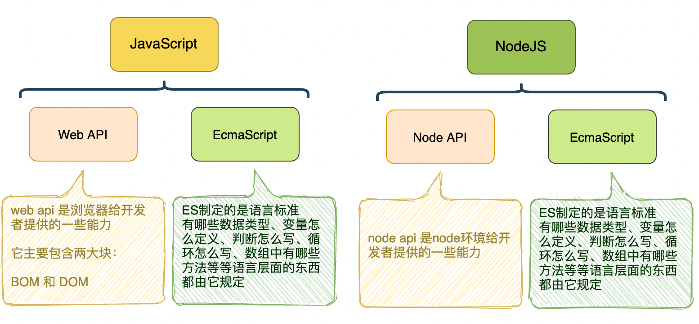

## CommonJS

> 标准类型: 社区规范
>
> 支持环境: node
>
> 依赖类型: 动态依赖 ==依赖延迟声明==

### CommonJS 规范

CommonJS 使用 ==exports== 导出模块，==require== 导入模块

具体规范如下:

1. 如果一个 JS 文件中存在`exports`或`require`，该 JS 文件是一个模块
2. 模块内的所有代码均为隐藏代码，包括全局变量、全局函数，这些全局的内容均不应该对全局变量造成任何污染
3. 如果一个模块需要暴露一些 API 提供给外部使用，需要通过`exports`导出，`exports`是一个空的对象，你可以为该对象添加任何需要导出的内容
4. 如果一个模块需要导入其他模块，通过`require`实现，`require`是一个函数，传入模块的路径即可返回该模块导出的整个内容

### CommonJS 如何实现模块化

node 天生支持 CommonJS 模块化标准

node 规定:

1. node 中的每个 js 文件都是一个 CMJ 模块，通过 node 命令运行的模块，叫做入口模块

2. 为了隐藏模块中的代码，nodejs 执行模块时，会将模块中的所有代码放置到一个函数中执行，以保证不污染全局变量。

    ```js
    (function () {
    	//模块中的代码
    })();
    ```

3. 为了保证顺利的导出模块内容，nodejs 做了以下处理

    1. 在模块开始执行前，初始化一个值`module.exports = {}`
    2. `module.exports`即模块的导出值
    3. 为了方便开发者便捷的导出，nodejs 在初始化完`module.exports`后，又声明了一个变量`exports = module.exports`

    ==最终返回的是 module.exports== **(所以 如果代码 给 module.exports 赋值 那么 exports 将导出失败)**

    ```js
    (function (module) {
    	module.exports = {};
    	var exports = module.exports;
    	//模块中的代码
    	let count = 0;
    	exports.getNumber = () => {
    		return count;
    	};
    	exports.abc = 123;

    	return module.exports; // ！！！ 所以 如果代码 给module.exports赋值 那么exports将导出失败
    })();
    ```

4. 一个模块可以导入其他模块，使用函数 ==require("要导入的模块路径")== 即可完成，该函数返回目标模块的导出结果

    1. 导入模块时，可以省略`.js`
    2. 导入模块时，必须以`./`或`../`开头

5. ==导入只会执行一次,后续都是缓存== **一个模块在被导入时会运行一次，然后它的导出结果会被 node 缓存起来，后续对该模块导入时，不会重新运行，直接使用缓存结果**

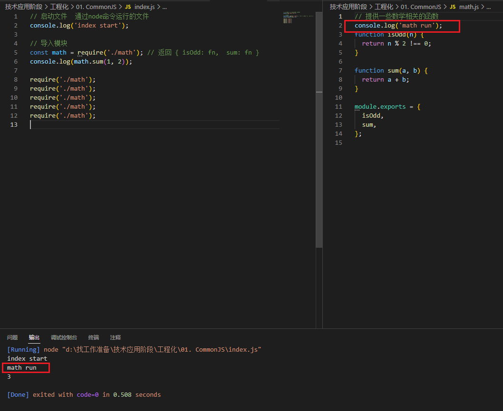

### 特点

- 所有代码都运行在模块作用域，不会污染全局作用域
- 模块是同步加载的，即只有加载完成，才能执行后面的操作
- 模块在首次执行后就会缓存，再次加载只返回缓存结果，如果想要再次执行，可清除缓存
- `require`返回的值是被输出的值的拷贝，模块内部的变化也不会影响这个值

## AMD、CMD

### 浏览器端模块化的难题

**CommonJS 的工作原理**

当使用`require(模块路径)`导入一个模块时，node 会做以下两件事情（不考虑模块缓存）:

1. 通过模块路径找到本机文件，并读取文件内容
2. 将文件中的代码放入到一个函数环境中执行，并将执行后 module.exports 的值作为 require 函数的返回结果

正是这两个步骤，使得 CommonJS 在 node 端可以良好的被支持

可以认为，**CommonJS 是同步的**，必须要等到加载完文件并执行完代码后才能继续向后执行

**当浏览器遇到 CommonJS**

当想要把 CommonJS 放到浏览器端时，就遇到了一些挑战

1. 浏览器要加载 JS 文件，需要远程从服务器读取，而网络传输的效率远远低于 node 环境中读取本地文件的效率。由于 CommonJS 是同步的，这会极大的降低运行性能
2. 如果需要读取 JS 文件内容并把它放入到一个环境中执行，需要浏览器厂商的支持，可是浏览器厂商不愿意提供支持，最大的原因是 CommonJS 属于社区标准，并非官方标准

**新的规范**

基于以上两点原因，浏览器无法支持模块化

可这并不代表模块化不能在浏览器中实现

要在浏览器中实现模块化，只要能解决上面的两个问题就行了

解决办法其实很简单:

1. 远程加载 JS 浪费了时间？做成异步即可，加载完成后调用一个回调就行了
2. 模块中的代码需要放置到函数中执行？编写模块时，直接放函数中就行了

基于这种简单有效的思路，出现了 AMD 和 CMD 规范，有效的解决了浏览器模块化的问题。

### AMD

全称是 Asynchronous Module Definition，即异步模块加载机制

require.js 实现了 AMD 规范

在 AMD 中，导入和导出模块的代码，都必须放置在 define 函数中

```js
<script data-main="./js/index.js" src="./js/require.js"></script>; // data-main 入口文件
define([依赖的模块列表], function (模块名称列表) {
	//模块内部的代码
	return 导出的内容;
});

define(['b', 'a'], function (b, a) {
	//等b.js加载完成后运行该函数
	//模块内部的代码
	console.log(b, a);
});
define((require, exports, module) => {
	var a = require('a'),
		b = require('b');
	console.log(b, a);
});
```

### CMD

全称是 Common Module Definition，公共模块定义规范

sea.js 实现了 CMD 规范

在 CMD 中，导入和导出模块的代码，都必须放置在 define 函数中

```js
<script src="./js/sea.js"></script>
<script>
    seajs.use("./js/index") // 入口文件
</script>

define(function(require, exports, module){
  //模块内部的代码
})

define((require, exports, module) => {
    require.async("a", function(a){ // 导入采用异步
        console.log(a)
    })
    require.async("b", function(b){
        console.log(b)
    })
})
```

## ES Module

> 标准类型: 官方标准
> 支持环境: node，浏览器
> 依赖类型: 静态依赖，动态依赖

ECMA 组织参考了众多社区模块化标准，终于在 2015 年，随着 ES6 发布了官方的模块化标准，后成为 ES6 模块化

ES6 模块化具有以下的特点

1. 使用依赖**预声明**的方式导入模块
    1. 依赖延迟声明 (commonJs)
        1. 优点: 某些时候可以提高效率
        2. 缺点: 无法在一开始确定模块依赖关系（比较模糊）
    2. 依赖预声明
        1. 优点: 在一开始可以确定模块依赖关系
        2. 缺点: 某些时候效率较低
2. 灵活的多种导入导出方式
3. 规范的路径表示法: 所有路径必须以./或../开头

### 导入导出

目前，浏览器使用以下方式引入一个 ES6 模块文件

```html
<script src="入口文件" type="module">
```

ES Module 分为两种导出方式:

-   具名导出（基本导出），可以导出多个
-   默认导出，只能导出一个

#### 基本导出

类似于 **exports.xxx = xxxx**

基本导出可以有多个，每个必须有名称

基本导出的语法如下:

```js
export 声明表达式

export {具名符号}
```

由于基本导出必须具有名称，所以要求导出内容必须跟上**声明表达式**或**具名符号**

#### 基本导入

由于使用的是**依赖预加载**，因此，导入任何其他模块，导入代码必须放置到所有代码之前

对于基本导出，如果要进行导入，使用下面的代码

```js
import { 导入的符号列表 } from '模块路径';
```

注意以下细节:

-   ==导入时，可以通过关键字 **as** 对导入的符号进行重命名==
-   ==导入时使用的符号是常量，不可修改==
-   ==可以使用\*号导入所有的基本导出，形成一个对象==

#### 默认导出

每个模块，除了允许有多个基本导出之外，还允许有一个默认导出

默认导出类似于 CommonJS 中的 **module.exports** ，由于只有一个，因此无需具名

具体的语法是

```js
export default 默认导出的数据

export {默认导出的数据 as default}
```

由于每个模块仅允许有一个默认导出，因此，每个模块不能出现多个默认导出语句

#### 默认导入

需要想要导入一个模块的默认导出，需要使用下面的语法

```js
import 接收变量名 from '模块路径';
```

由于默认导入时变量名是自行定义的，因此没有别名一说

如果希望同时导入某个模块的默认导出和基本导出，可以使用下面的语法

```js
import 接收默认导出的变量, { 接收基本导出的变量 } from '模块路径';
```

注: 如果使用\*号，会将所有基本导出和默认导出聚合到一个对象中，默认导出会作为属性 default 存在

```js
export const a = 1; // 具名，常用  类似于commonJs exports.a = 1
export function b() {} // 具名，常用
export const c = () => {}; // 具名，常用
const d = 2;
export { d }; // 具名
const k = 10;
export { k as temp }; // 具名

// export default 3 // 默认，常用
// export default function() {} // 默认，常用
// const e = 4;
// export { e as default } // 默认

const f = 4,
	g = 5,
	h = 6;
export { f, g, h as default }; // 基本 + 默认

// 以上代码将导出下面的对象
/*
{
	a: 1,
	b: fn,
	c: fn,
	d: 2,
	temp: 10,
	f: 4,
	g: 5,
	default: 6
}
*/
```

针对具名导出和默认导出，有不同的导入语法

```js
// 仅运行一次该模块，不导入任何内容
import '模块路径';
// 常用，导入属性 a、b，放到变量a、b中。a->a, b->b
import { a, b } from '模块路径';
// 常用，导入属性 default，放入变量c中。default->c
import c from '模块路径';
// 常用，default->c，a->a, b->b
import c, { a, b } from '模块路径';
// 常用，将模块对象放入到变量obj中
import * as obj from '模块路径';

// 导入属性a、b，放到变量temp1、temp2 中
import { a as temp1, b as temp2 } from '模块路径';
// 导入属性default，放入变量a中，default是关键字，不能作为变量名，必须定义别名
import { default as a } from '模块路径';
//导入属性default、b，放入变量a、b中
import { default as a, b } from '模块路径';
// 以上均为静态导入

import('模块路径'); // 动态导入，返回一个Promise，完成时的数据为模块对象
```

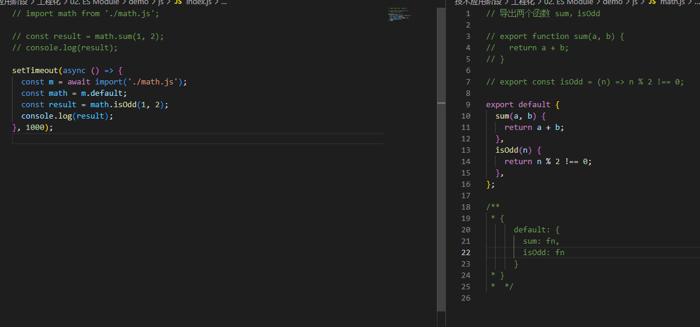

#### ES6 模块化的其他细节

1. **尽量导出不可变值**

当导出一个内容时，尽量保证该内容是不可变的（大部分情况都是如此）

因为，虽然导入后，无法更改导入内容，但是在导入的模块内部却有可能发生更改，这将导致一些无法预料的事情发生

2. **可以使用无绑定的导入用于执行一些初始化代码**

如果我们只是想执行模块中的一些代码，而不需要导入它的任何内容，可以使用无绑定的导入:

```js
import '模块路径';
```

3. **可以使用绑定再导出，来重新导出来自另一个模块的内容**

有的时候，我们可能需要 **==用一个模块封装多个模块==** ，然后有选择的将多个模块的内容分别导出，可以使用下面的语法轻松完成

```js
export { 绑定的标识符 } from '模块路径';
```

## 总结

1. AMD/CMD/CommonJs 是 js 模块化开发的规范，对应的实现是 require.js/sea.js/Node.js

2. CommonJs 主要针对服务端，AMD/CMD/ES Module 主要针对浏览器端，容易混淆的是 AMD/CMD。（顺便提一下，针对服务器端和针对浏览器端有什么本质的区别呢？服务器端一般采用同步加载文件，也就是说需要某个模块，服务器端便停下来，等待它加载再执行。这里如果有其他后端语言，如 java。而浏览器端要保证效率，需要采用异步加载，这就需要一个预处理，提前将所需要的模块文件并行加载好。）

3. AMD/CMD 区别，虽然都是并行加载 js 文件，但还是有所区别，AMD 是预加载，在并行加载 js 文件同时，还会解析执行该模块（因为还需要执行，所以在加载某个模块前，这个模块的依赖模块需要先加载完成）；而 CMD 是懒加载，虽然会一开始就并行加载 js 文件，但是不会执行，而是在需要的时候才执行。

4. AMD/CMD 的优缺点.一个的优点就是另一个的缺点， 可以对照浏览。
   AMD 优点: 加载快速，尤其遇到多个大文件，因为并行解析，所以同一时间可以解析多个文件。
   AMD 缺点: 并行加载，异步处理，加载顺序不一定，可能会造成一些困扰，甚至为程序埋下大坑。

    CMD 优点: 因为只有在使用的时候才会解析执行 js 文件，因此，每个 JS 文件的执行顺序在代码中是有体现的，是可控的。

    CMD 缺点: 执行等待时间会叠加。因为每个文件执行时是同步执行（串行执行），因此时间是所有文件解析执行时间之和，尤其在文件较多较大时，这种缺点尤为明显。（PS: 重新看这篇文章，发现这里写的不是很准确。确切来说，JS 是单线程，所有 JS 文件执行时间叠加在 AMD 和 CMD 中是一样的。但是 CMD 是使用时执行，没法利用空闲时间，而 AMD 是文件加载好就执行，往往可以利用一些空闲时间。这么来看，CMD 比 AMD 的优点还是很明显的，毕竟 AMD 加载好的时候也未必就是 JS 引擎的空闲时间！）

5. **==CommonJS 和 ES Module 区别: CommonJS 模块输出的是一个值的拷贝，ES6 模块输出的是值的引用==**

	`CommonJS` 和`AMD` 模块，都只能在运行时确定这些东西。比如，`CommonJS`模块就是对象，输入时必须查找对象属性

	```js
	// CommonJS模块
	let { stat, exists, readfile } = require('fs');
	
	// 等同于
	let _fs = require('fs');
	let stat = _fs.stat;
	let exists = _fs.exists;
	let readfile = _fs.readfile;
	```

	**`ES6`设计思想是尽量的静态化，使得编译时就能确定模块的依赖关系，以及输入和输出的变量** 

	```js
	// ES6模块
	import { stat, exists, readFile } from 'fs';
	```

	上述代码，只加载3个方法，其他方法不加载，即 `ES6` 可以在编译时就完成模块加载

	由于编译加载，使得静态分析成为可能。包括现在流行的`typeScript`也是依靠静态分析实现功能

6. 如何使用？CommonJs 的话，因为 NodeJS 就是它的实现，所以使用 node 就行，也不用引入其他包。AMD 则是通过`<script>`标签引入 require.js，CMD 则是引入 sea.js

# nvm (node version manger)

## 卸载 node

### windows

进入添加和删除程序进行卸载

### mac

https://www.jianshu.com/p/88cd55296983

## 下载安装 nvm

### windows

链接: https://pan.baidu.com/s/1uoxlk8CVNHV2KTCwIGbQMQ?pwd=yi5m

提取码: yi5m

### mac

修改 HOSTS（建议使用 SwitchHosts）

```
? raw.githubusercontent.com
? objects.githubusercontent.com
? pkg-containers.githubusercontent.com
```

> ？位置需要通过 https://www.ipaddress.com/ 查询 ip

打开终端运行下面的命令

```shell
curl -o- https://raw.githubusercontent.com/nvm-sh/nvm/v0.39.2/install.sh | bash
```

## nvm 的基本使用

```shell
nvm install --lts # 下载最新的稳定版
nvm use <版本号> # 临时切换版本
nvm alias default <版本号> #永久切换版本（版本别名，default就是默认使用的版本）
nvm uninstall <版本号> # 删除指定版本
nvm ls # 查看本地所有版本
nvm ls-remote --lts # 查看线上所有稳定版

# 修改源
npm config set registry https://registry.npm.taobao.org --global
npm config set disturl https://npm.taobao.org/dist --global
```

windows:

```bash
nvm install <版本号> # 下载指定版本
nvm use <版本号> # 切换版本
nvm uninstall <版本号> # 删除指定版本
nvm list available # 查看线上所有版本
```

## node 常用命令

```bash
npm init # 初始化node环境，-y可以快速初始化
npm i <package> # 下载指定库，看情况添加 -S或者-D，全局安装-g
npm uninstall <package> # 删除node包，删除全局-g
npm list --depth 0 # 查看当前目录下载的node包
npm list -g --depth 0 # 查看全局安装的node包
```

# 包管理器

npm 官网: https://www.npmjs.com/

npm 全命令: https://docs.npmjs.com/cli/v7/commands

## 概念

1. 什么是**包**？

    包（package）是一个或多个 js 模块的集合，它们共同完成某一类功能

    可以简单的认为每一个工程就是一个包

    有些包是为了给别人用的，这种包也叫第三方库

2. 什么是**包管理器**？

    包管理器是一个管理包的工具，前端常见的包管理器有 **npm、yarn、cnpm、pnpm** 等

    包管理器具备以下能力:

    - 让开发者可以轻松的下载包
    - 让开发者可以轻松的升级和卸载包
    - 能够自动管理包的依赖

3. 什么是**cli**

    cli 是一个命令行工具，它提供一个终端命令，通过该命令可以完成一些功能

## node 查找包的顺序

```js
require('a');
```

1. 查找是否有内置模块 a
2. 查找当前目录的 node_modules 中是否有 a
3. 依次查找上级目录的 node_modules 中是否有 a，直到根目录

## npm

> node package manager

### 配置源

#### 查看源

```shell
npm config get registry
```

#### 配置淘宝镜像源

```shell
npm config set registry https://registry.npm.taobao.org
```

#### 配置官方源

```shell
npm config set registry https://registry.npmjs.org/
```

### 初始化

```shell
npm init # 初始化工程，帮助生成 package.json 文件
npm init -y # 初始化工程，全部使用默认配置生成 package.json 文件
```

### 安装

#### 本地安装

会将包下载到当前命令行所在目录的 node_modules 中

绝大部分安装都使用本地安装

```shell
# 下面的 install 可以替换为 i
npm install 包名
npm install --save 包名
npm install 包名@版本号
```

若仅作为开发依赖，则添加参数`-D`

```shell
# 下面的 install 可以替换为 i
npm install -D 包名
npm install -D 包名@版本号
```

若要还原安装

```shell
# 下面的 install 可以替换为 i
npm install
npm install --production # 仅还原dependencies中的依赖
```

#### 全局安装

会将包下载到一个全局的位置

只有需要使用某个全局命令时，才需要进行全局安装

```shell
# 下面的 install 可以替换为 i
npm install -g 包名
npm install -g 包名@版本号
```

### 包配置

目前遇到的问题:

1. 拷贝工程后如何还原？
2. 如何区分开发依赖和生产依赖？
3. 如果自身的项目也是一个包，如何描述包的信息

以上这些问题都需要通过包的**配置文件**解决

#### 配置文件

npm 将每个使用 npm 的工程本身都看作是一个包，包的信息需要通过一个名称固定的配置文件来描述

**配置文件的名称固定为: package.json**

可以手动创建该文件，而更多的时候，是通过命令`npm init`创建的

配置文件中可以描述大量的信息，包括:

-   name: 包的名称，该名称必须是**英文单词字符**，支持连接符
-   version: 版本
    -   版本规范: 主版本号.次版本号.补丁版本号
    -   主版本号: 仅当程序发生了重大变化时才会增长，如新增了重要功能、新增了大量的 API、技术架构发生了重大变化
    -   次版本号: 仅当程序发生了一些小变化时才会增长，如新增了一些小功能、新增了一些辅助型的 API
    -   补丁版本号: 仅当解决了一些 bug 或 进行了一些局部优化时更新，如修复了某个函数的 bug、提升了某个函数的运行效率
-   description: 包的描述
-   homepage: 官网地址
-   author: 包的作者，必须是有效的 npm 账户名，书写规范是 `account <mail>`，例如: `zhangsan <zhangsan@gmail.com>`，不正确的账号和邮箱可能导致发布包时失败
-   repository: 包的仓储地址，通常指 git 或 svn 的地址，它是一个对象
    -   type: 仓储类型，git 或 svn
    -   url: 地址
-   main: 包的入口文件，使用包的人默认从该入口文件导入包的内容
-   keywords: 搜索关键字，发布包后，可以通过该数组中的关键字搜索到包

使用`npm init --yes`或`npm init -y`可以在生成配置文件时自动填充默认配置

#### 保存依赖关系

大部分时候，我们仅仅是开发项目，并不会把它打包发布出去，尽管如此，我们仍然需要 package.json 文件

**package.json 文件最重要的作用，是记录当前工程的依赖**

-   dependencies: 生产环境的依赖包
-   devDependencies: 仅开发环境的依赖包

配置好依赖后，使用下面的命令即可安装依赖

```shell
## 本地安装所有依赖 dependencies + devDependencies
npm install
npm i

## 仅安装生产环境的依赖 dependencies
npm install --production
```

这样一来，代码移植就不是问题了，只需要移植源代码和 package.json 文件，不用移植 node_modules 目录，然后在移植之后通过命令即可重新恢复安装

为了更加方便的添加依赖，npm 支持在使用 install 命令时，加入一些额外的参数，用于将安装的依赖包保存到 package.json 文件中

涉及的命令如下

```shell
## 安装依赖到生产环境
npm i 包名
npm i --save 包名
npm i -S 包名

## 安装依赖到开发环境
npm i --save-dev 包名
npm i -D 包名
```

```json
{
	"dependencies": {
		// 本地普通依赖
		"qrcode": "^1.4.4" // 依赖包qrcode，版本1.4.4，主版本号不变，此版本号和补丁版本可增
	},
	"devDenpendencies": {
		// 开发依赖
		"webpack": "^5.0.0"
	}
}
```

> 自动保存的依赖版本，例如`^15.1.3`，这种书写方式叫做语义版本号（semver version），具体规则后续讲解

### 卸载

#### 本地卸载

卸载本地的安装包

```shell
# 下面的 uninstall 均可替换为 un
npm uninstall 包名
```

#### 全局卸载

卸载全局的安装包

```shell
# 下面的 uninstall 均可替换为 un
npm uninstall -g 包名
```

### 查看包所有的版本

```shell
# view 可以替换为 v
npm view 包名 versions
```

### 语义版本

思考: 如果你编写了一个包 A，依赖另外一个包 B，你在编写代码时，包 B 的版本是 2.4.1，你是希望使用你包的人一定要安装包 B，并且是 2.4.1 版本，还是希望他可以安装更高的版本，如果你希望它安装更高的版本，高的什么程度呢？

回顾: 版本号规则

版本规范: 主版本号.次版本号.补丁版本号

-   主版本号: 仅当程序发生了重大变化时才会增长，如新增了重要功能、新增了大量的 API、技术架构发生了重大变化
-   次版本号: 仅当程序发生了一些小变化时才会增长，如新增了一些小功能、新增了一些辅助型的 API
-   补丁版本号: 仅当解决了一些 bug 或 进行了一些局部优化时更新，如修复了某个函数的 bug、提升了某个函数的运行效率

有的时候，我们希望: 安装我的依赖包的时候，次版本号和补丁版本号是可以有提升的，但是主版本号不能变化

有的时候，我们又希望: 安装我的依赖包的时候，只有补丁版本号可以提升，其他都不能提升

甚至我们希望依赖包保持固定的版本，尽管这比较少见

这样一来，就需要在配置文件中描述清楚具体的依赖规则，而不是直接写上版本号那么简单。

这种规则的描述，即**语义版本**

语义版本的书写规则非常丰富，下面列出了一些常见的书写方式

| 符号 |         描述         |     示例      |                              示例描述                              |
| :--: | :------------------: | :-----------: | :----------------------------------------------------------------: |
|  >   |     大于某个版本     |    >1.2.1     |                          大于 1.2.1 版本                           |
|  >=  |   大于等于某个版本   |    >=1.2.1    |                        大于等于 1.2.1 版本                         |
|  <   |     小于某个版本     |    <1.2.1     |                          小于 1.2.1 版本                           |
|  <=  |   小于等于某个版本   |    <=1.2.1    |                        小于等于 1.2.1 版本                         |
|  -   |   介于两个版本之间   | 1.2.1 - 1.4.5 |                      介于 1.2.1 和 1.4.5 之间                      |
|  x   |    不固定的版本号    |     1.3.x     |              只要保证主版本号是 1，次版本号是 3 即可               |
|  ~   |    补丁版本号可增    |    ~1.3.4     |        保证主版本号是 1，次版本号是 3，补丁版本号大于等于 4        |
|  ^   | 此版本和补丁版本可增 |    ^1.3.4     | 保证主版本号是 1，次版本号可以大于等于 3，补丁版本号可以大于等于 4 |
|  \*  |       最新版本       |      \*       |                          始终安装最新版本                          |

### 避免还原的差异

版本依赖控制始终是一个两难的问题

如果允许版本增加，可以让依赖包的 bug 得以修复（补丁版本号），可以带来一些意外的惊喜（次版本号），但同样可能带来不确定的风险（新的 bug）

如果不允许版本增加，可以获得最好的稳定性，但失去了依赖包自我优化的能力

而有的时候情况更加复杂，如果依赖包升级后，依赖也发生了变化，会有更多不确定的情况出现

基于此，npm 在安装包的时候，会自动生成一个 package-lock.json 文件，该文件记录了安装包时的确切依赖关系

当移植工程时，如果移植了 package-lock.json 文件，恢复安装时，会按照 package-lock.json 文件中的确切依赖进行安装，最大限度的避免了差异

### [扩展]npm 的差异版本处理

如果两个包依赖同一个包的不同版本，如下图

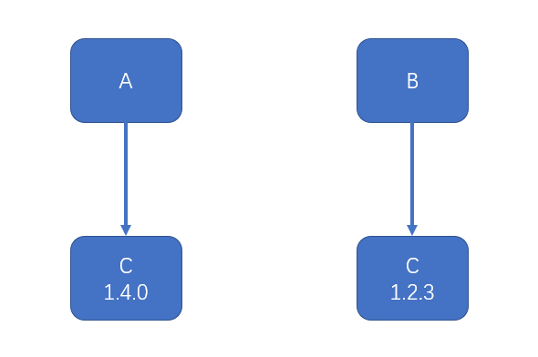

面对这种情况，在 node_modules 目录中，不会使用扁平的目录结构，而会形成嵌套的目录，如下图:

<!-- flat dependency -->

```
├── node_modules
│   ├── a
│   │   ├── node_modules
│   │   │   ├── c
│   │   │   |   |—— c包的文件
│   │   │── a包的文件
│   ├── b
│   │   ├── node_modules
│   │   │   ├── c
│   │   │   |   |—— c包的文件
│   │   │── b包的文件
```

### npm 脚本 （npm scripts）

在开发的过程中，我们可能会反复使用很多的 CLI 命令，例如:

-   启动工程命令（node 或 一些第三方包提供的 CLI 命令）
-   部署工程命令（一些第三方包提供的 CLI 命令）
-   测试工程命令（一些第三方包提供的 CLI 命令）

这些命令纷繁复杂，根据第三方包的不同命令也会不一样，非常难以记忆

于是，npm 非常贴心的支持了脚本，只需要在 package.json 中配置 scripts 字段，即可配置各种脚本名称

之后，我们就可以运行简单的指令来完成各种操作了

运行方式是 `npm run 脚本名称`

不仅如此，npm 还对某些常用的脚本名称进行了简化，下面的脚本名称是不需要使用 run 的:

-   start
-   stop
-   test

一些细节:

-   脚本中可以省略 npx
-   start 脚本有默认值: node server.js

### 运行环境配置

我们书写的代码一般有三种运行环境:

1. 开发环境
2. 生产环境
3. 测试环境

有的时候，我们可能需要在 node 代码中根据不同的环境做出不同的处理

如何优雅的让 node 知道处于什么环境，是极其重要的

通常我们使用如下的处理方式:

node 中有一个全局变量 global (可以类比浏览器环境的 window)，该变量是一个对象，对象中的所有属性均可以直接使用

global 有一个属性是 process，该属性是一个对象，包含了当前运行 node 程序的计算机的很多信息，其中有一个信息是 env，是一个对象，包含了计算机中所有的系统变量

通常，我们通过系统变量 NODE_ENV 的值，来判定 node 程序处于何种环境

有两种方式设置 NODE_ENV 的值

1. 永久设置
2. 临时设置

我们一般使用临时设置

因此，我们可以配置 scripts 脚本，在设置好了 NODE_ENV 后启动程序

> 为了避免不同系统的设置方式的差异，可以使用第三方库 cross-env 对环境变量进行设置

```js
var a = '没有环境变量';
console.log(process.env.NODE_ENV);
if (process.env.NODE_ENV === 'development') {
	a = '开发环境';
} else if (process.env.NODE_ENV === 'production') {
	a = '生产环境';
} else if (process.env.NODE_ENV === 'test') {
	a = '测试环境';
}
console.log(a);
```

#### 在 node 中读取 package.json

有的时候，我们可能在 package.json 中配置一些自定义的字段，这些字段需要在 node 中读取
在 node 中，可以直接导入一个 json 格式的文件，它会自动将其转换为 js 对象

```json
{
	"name": "chapter2",
	"version": "1.0.0",
	"description": "",
	"main": "index.js",
	"scripts": {
		"start": "cross-env NODE_ENV=development node index.js",
		"build": "cross-env NODE_ENV=production node index.js",
		"test": "cross-env NODE_ENV=test node index.js"
	},
	"author": "",
	"license": "ISC",
	"devDependencies": {
		"cross-env": "^6.0.3"
	},
	"a": 123
}
```

```js
//node 读取package.json文件中的版本号
const config = require('./package.json');
console.log(config.version);
console.log(config.a);
```

### 其他 npm 命令

#### 安装

1. 精确安装最新版本

```shell
npm install --save-exact 包名
npm install -E 包名
```

2. 安装指定版本

```shell
npm install 包名@版本号
```

#### 查询

1. 查询包安装路径

```shell
npm root [-g]
```

2. 查看包信息

```shell
npm view 包名 [子信息]
## view aliases：v info show
```

3. 查询安装包

```shell
npm list [-g] [--depth=依赖深度]
## list aliases: ls  la  ll
```

#### 更新

1. 检查有哪些包需要更新

```shell
npm outdated
```

2. 更新包 (**可以用 npm 更新 npm 到更高版本**)

```shell
npm update [-g] [包名]
## update 别名（aliases）：up、upgrade
```

#### 卸载包

```shell
npm uninstall [-g] 包名
## uninstall aliases: remove, rm, r, un, unlink
```

#### npm 配置

npm 的配置会对其他命令产生或多或少的影响

安装好 npm 之后，最终会产生两个配置文件，一个是用户配置，一个是系统配置，当两个文件的配置项有冲突的时候，用户配置会覆盖系统配置

通常，我们不关心具体的配置文件，而只关心最终生效的配置

通过下面的命令可以查询目前生效的各种配置

```shell
npm config ls [-l] [--json]
```

另外，可以通过下面的命令操作配置

1. 获取某个配置项

```shell
npm config get 配置项
```

2. 设置某个配置项

```shell
npm config set 配置项=值
```

3. 移除某个配置项

```shell
npm config delete 配置项
```

## yarn

> yarn 官网: https://www.yarnpkg.com/zh-Hans/

### 介绍

yarn 是由 Facebook、Google、Exponent 和 Tilde 联合推出了一个新的 JS 包管理工具，**它仍然使用 npm 的 registry**，不过提供了全新 CLI 来对包进行管理

过去，yarn 的出现极大的抢夺了 npm 的市场，甚至有人戏言，npm 只剩下一个 registry 了。

之所以会出现这种情况，是因为在过去，npm 存在下面的问题:

-   依赖目录嵌套层次深: 过去，npm 的依赖是嵌套的，这在 windows 系统上是一个极大的问题，由于众所周知的原因，windows 系统无法支持太深的目录
-   下载速度慢
    -   由于嵌套层次的问题，所以 npm 对包的下载只能是串行的，即前一个包下载完后才会下载下一个包，导致带宽资源没有完全利用
    -   多个相同版本的包被重复的下载
-   控制台输出繁杂: 过去，npm 安装包的时候，每安装一个依赖，就会输出依赖的详细信息，导致一次安装有大量的信息输出到控制台，遇到错误极难查看
-   工程移植问题: 由于 npm 的版本依赖可以是模糊的，可能会导致工程移植后，依赖的确切版本不一致。

针对上述问题，yarn 从诞生那天就已经解决，它用到了以下的手段:

-   使用扁平的目录结构
-   并行下载
-   使用本地缓存
-   控制台仅输出关键信息
-   使用 yanr-lock 文件记录确切依赖

不仅如此，yarn 还优化了以下内容:

-   增加了某些功能强大的命令
-   让既有的命令更加语义化
-   本地安装的 CLI 工具可以使用 yarn 直接启动
-   ==将全局安装的目录当作一个普通的工程，生成 package.json 文件，便于全局安装移植==

yarn 的出现给 npm 带来了巨大的压力，很快，npm 学习了 yarn 先进的理念，不断的对自身进行优化，到了目前的 npm6 版本，几乎完全解决了上面的问题:

-   目录扁平化
-   并行下载
-   本地缓存
-   使用 package-lock 记录确切依赖
-   增加了大量的命令别名
-   内置了 npx，可以启动本地的 CLI 工具
-   极大的简化了控制台输出

**总结**

npm6 之后，可以说 npm 已经和 yarn 非常接近，甚至没有差距了。很多新的项目，又重新从 yarn 转回到 npm。

### yarn 的核心命令

1. **初始化**

初始化: `yarn init [--yes/-y]`

2. **安装**

添加指定包: `yarn [global] add package-name [--dev/-D] [--exact/-E]`

安装 package.json 中的所有依赖: `yarn install [--production/--prod]`

3. **脚本和本地 CLI**

运行脚本: `yarn run 脚本名`

> start、stop、test 可以省略 run

运行本地安装的 CLI: `yarn run CLI名`

4. **查询**

查看 bin 目录: `yarn [global] bin`

查询包信息: `yarn info 包名 [子字段]`

列举已安装的依赖: `yarn [global] list [--depth=依赖深度]`

> yarn 的 list 命令和 npm 的 list 不同，yarn 输出的信息更加丰富，包括顶级目录结构、每个包的依赖版本号

5. **更新**

列举需要更新的包: `yarn outdated`

更新包: `yarn [global] upgrade [包名]`

6. **卸载**

卸载包: `yarn remove 包名`

### yarn 的特别礼物

在终端命令上，yarn 不仅仅是对 npm 的命令做了一个改名，还增加了一些原本没有的命令，这些命令在某些时候使用起来非常方便

1. **yarn check**

使用`yarn check`命令，可以验证 package.json 文件的依赖记录和 lock 文件是否一致

这对于防止篡改非常有用

2. **yarn audit**

使用`yarn audit`命令，可以检查本地安装的包有哪些已知漏洞，以表格的形式列出，漏洞级别分为以下几种:

-   INFO: 信息级别
-   LOW: 低级别
-   MODERATE: 中级别
-   HIGH: 高级别
-   CRITICAL: 关键级别

3. **yarn why**

使用`yarn why 包名`命令，可以在控制台打印出为什么安装了这个包，哪些包会用到它

4. **yarn create**

非常有趣的命令

所谓脚手架，就是使用一个命令来搭建一个工程结构

过去，我们都是使用如下的做法:

1. 全局安装脚手架工具
2. 使用全局命令搭建脚手架

由于大部分脚手架工具都是以`create-xxx`的方式命名的，比如 react 的官方脚手架名称为`create-react-app`

因此，可以使用`yarn create`命令来一步完成安装和搭建

例如:

```shell
yarn create react-app my-app
# 等同于下面的两条命令
yarn global add create-react-app
create-react-app my-app
```

## cnpm

> 官网地址: https://npm.taobao.org/

为解决国内用户连接 npm registry 缓慢的问题，淘宝搭建了自己的 registry，即淘宝 npm 镜像源

过去，npm 没有提供修改 registry 的功能，因此，淘宝提供了一个 CLI 工具即 cnpm，它支持除了`npm publish`以外的所有命令，只不过连接的是淘宝镜像源

如今，npm 已经支持修改 registry 了，可能 cnpm 唯一的作用就是和 npm 共存，即如果要使用官方源，则使用 npm，如果使用淘宝源，则使用 cnpm

## pnpm

pnpm 是一种新起的包管理器，从 npm 的下载量看，目前还没有超过 yarn，但它的实现方式值得主流包管理器学习，某些开发者极力推荐使用 pnpm

从结果上来看，它具有以下优势:

1. 目前，安装效率高于 npm 和 yarn 的最新版

2. 极其简洁的 node_modules 目录

3. 避免了开发时使用**间接依赖**的问题 `pnpm 间接依赖会报错`

4. 能极大的降低磁盘空间的占用

### 安装和使用

全局安装 pnpm

```shell
npm install -g pnpm
```

之后在使用时，只需要把 npm 替换为 pnpm 即可

如果要执行安装在本地的 CLI，可以使用 pnpx，它和 npx 的功能完全一样，唯一不同的是，在使用 pnpx 执行一个需要安装的命令时，会使用 pnpm 进行安装

> 比如`npx mocha`执行本地的`mocha`命令时，如果`mocha`没有安装，则 npx 会自动的、临时的安装 mocha，安装好后，自动运行 mocha 命令

### pnpm 原理

1. 同 yarn 和 npm 一样，pnpm 仍然使用缓存来保存已经安装过的包，以及使用 pnpm-lock.yaml 来记录详细的依赖版本

==缓存放在工程所在盘的根目录==

2. 不同于 yarn 和 npm， pnpm 使用**符号链接和硬链接**（可将它们想象成快捷方式）的做法来放置依赖，从而规避了从缓存中拷贝文件的时间，使得安装和卸载的速度更快

3. 由于使用了**符号链接和硬链接**，pnpm 可以规避 windows 操作系统路径过长的问题，因此，它选择使用树形的依赖结果，有着几乎完美的依赖管理。也因为如此，项目中只能使用直接依赖，而不能使用间接依赖

### 注意事项

由于 pnpm 会改动 node_modules 目录结构，使得每个包只能使用直接依赖，而不能使用间接依赖，因此，如果使用 pnpm 安装的包中包含间接依赖，则会出现问题(**现在不会了，除非使用了绝对路径**)

由于 pnpm 超高的安装卸载效率，越来越多的包开始修正之前的间接依赖代码

### pnpm 原理[拓展]

#### 概念

> 要彻底理解 pnpm 是怎么做的，需要有一些操作系统知识

1. **文件的本质**

在操作系统中，文件实际上是一个指针，只不过它指向的不是内存地址，而是一个外部存储地址（这里的外部存储可以是硬盘、U 盘、甚至是网络）

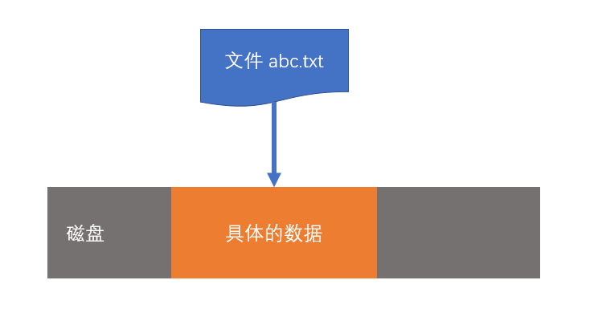

当我们删除文件时，删除的实际上是指针，因此，无论删除多么大的文件，速度都非常快。

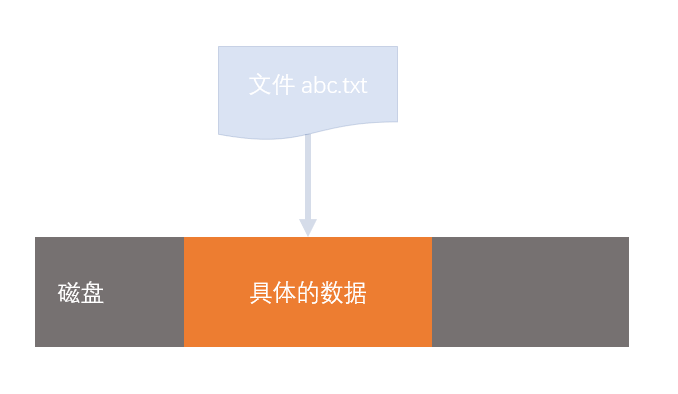

2. **文件的拷贝**

如果你复制一个文件，是将该文件指针指向的内容进行复制，然后产生一个新文件指向新的内容

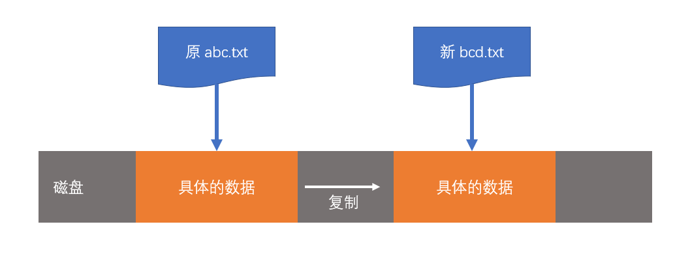

3. **硬链接 hard link**

硬链接的概念来自于 Unix 操作系统，它是指将一个文件 A 指针复制到另一个文件 B 指针中，文件 B 就是文件 A 的硬链接

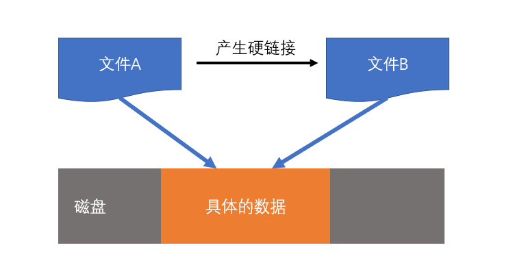

通过硬链接，不会产生额外的磁盘占用，并且，两个文件都能找到相同的磁盘内容

硬链接的数量没有限制，可以为同一个文件产生多个硬链接

windows Vista 操作系统开始，支持了创建硬链接的操作，在 cmd 中使用下面的命令可以创建硬链接

```shell
mklink /h 链接名称 目标文件
```

由于文件夹（目录）不存在文件内容，所以文件夹（目录）不能创建硬链接

> 由于种种原因，在 windows 操作系统中，通常不要跨越盘符创建硬链接

4. **符号链接 symbol link**

符号链接又称为软连接，如果为某个文件或文件夹 A 创建符号连接 B，则 B 指向 A。

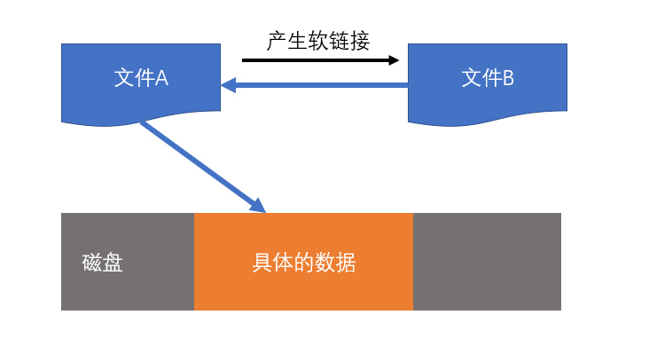

windows Vista 操作系统开始，支持了创建符号链接的操作，在 cmd 中使用下面的命令可以创建符号链接:

```shell
mklink /d 链接名称 目标文件
# /d表示创建的是目录的符号链接，不写则是文件的符号链接
```

> 早期的 windows 系统不支持符号链接，但它提供了一个工具 junction 来达到类似的功能

**符号链接和硬链接的区别**

1. 硬链接仅能链接文件，而符号链接可以链接目录
2. 硬链接在链接完成后仅和文件内容关联，和之前链接的文件没有任何关系。而符号链接始终和之前链接的文件关联，和文件内容不直接相关

5) **快捷方式**

快捷方式类似于符号链接，是 windows 系统早期就支持的链接方式。

它不仅仅是一个指向其他文件或目录的指针，其中还包含了各种信息: 如权限、兼容性启动方式等其他各种属性

由于快捷方式是 windows 系统独有的，在跨平台的应用中一般不会使用

6. **node 环境对硬链接和符号链接的处理**

**硬链接**: 硬链接是一个实实在在的文件，node 不对其做任何特殊处理，也无法区别对待，实际上，node 根本无从知晓该文件是不是一个硬链接

**符号链接**: 由于符号链接指向的是另一个文件或目录，当 node 执行符号链接下的 JS 文件时，会使用原始路径。

#### pnpm 原理

pnpm 使用符号链接和硬链接来构建 node_modules 目录

下面用一个例子来说明它的构建方式

假设两个包 a 和 b，a 依赖 b:

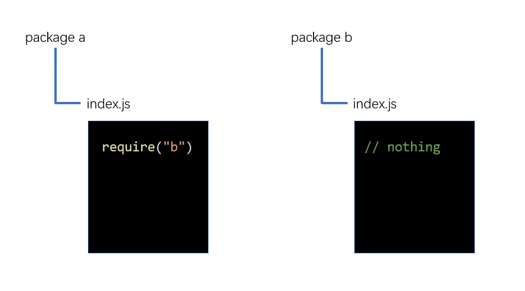

假设我们的工程为 proj，直接依赖 a，则安装时，pnpm 会做下面的处理

1. 查询依赖关系，得到最终要安装的包: a 和 b
2. 查看 a 和 b 是否已经有缓存，如果没有，下载到缓存中，如果有，则进入下一步
3. 创建 node_modules 目录，并对目录进行结构初始化

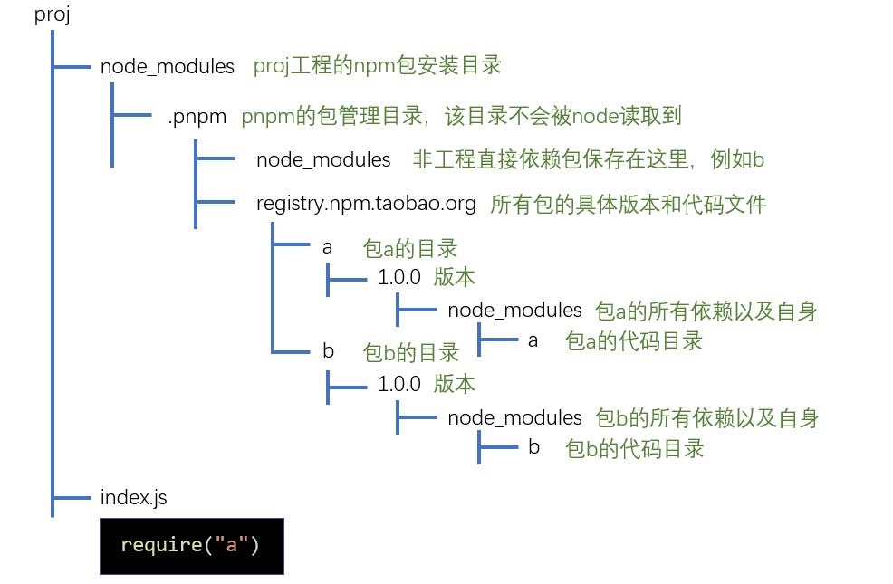

4. 从缓存的对应包中使用硬链接放置文件到相应包代码目录中

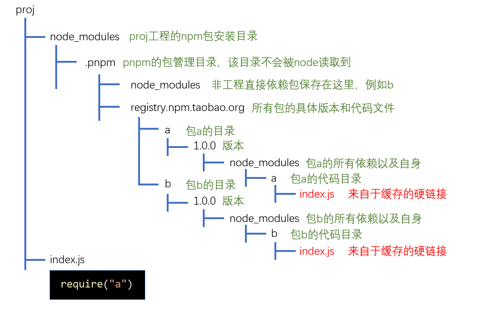

5. 使用符号链接，将每个包的**直接依赖**放置到自己的目录中

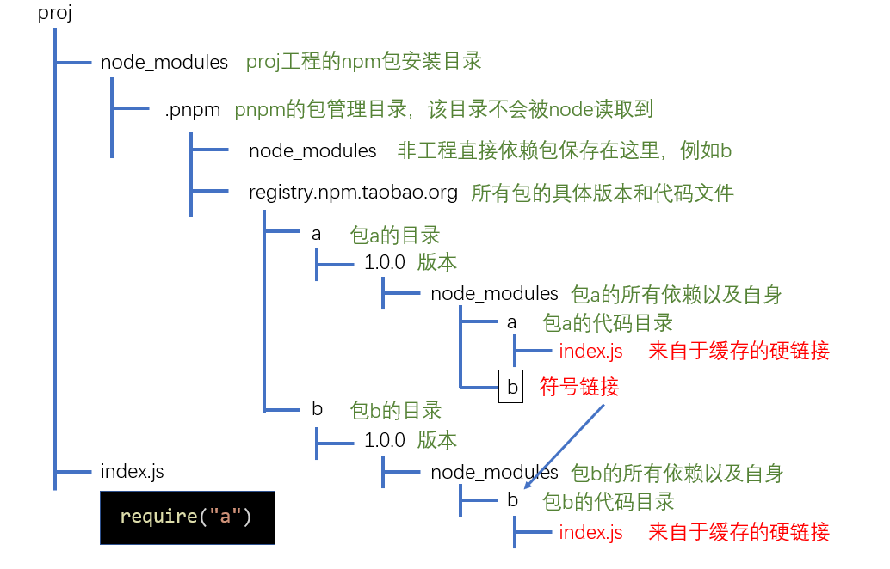

这样做的目的，是为了保证 a 的代码在执行过程中，可以读取到它们的直接依赖

6. 新版本的 pnpm 为了解决一些书写不规范的包（读取间接依赖）的问题，又将所有的工程非直接依赖，使用符号链接加入到了 .pnpm/node_modules 中

在本例中好像没有必要，但是如果 b 依赖 c，a 又要直接用 c，这种不规范的用法现在 pnpm 通过这种方式支持了。

> 但对于那些使用绝对路径的奇葩写法，可能永远也无法支持

7. 在工程的 node_modules 目录中使用符号链接，放置直接依赖

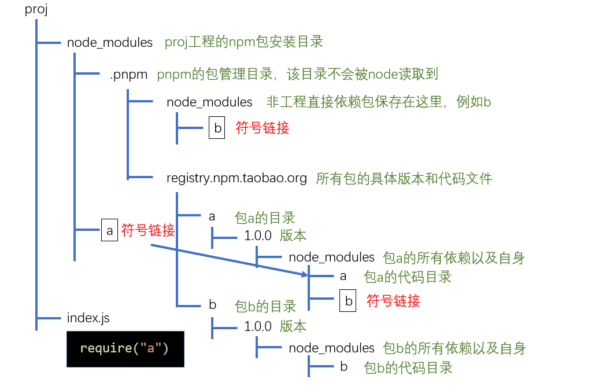

8. 完成

# Less

**Less**是一种更加简洁的样式代码，它非常像 CSS，但又不太一样，它让编写样式变得更容易

下面是 css 代码和 Less 代码的对比，它们都表达了一样的含义

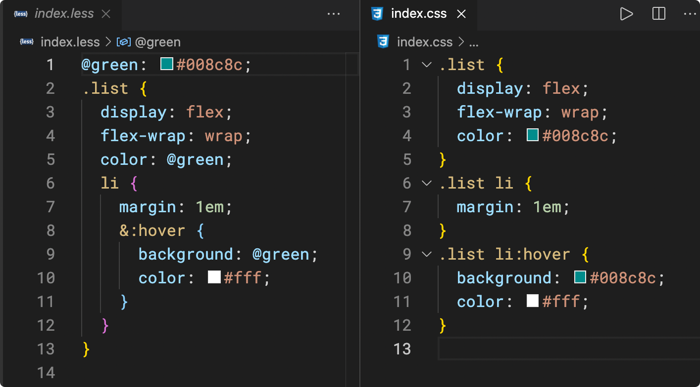

**Less 代码虽好，但它无法被浏览器识别**，因此需要一个工具将其转换为血统纯正的 css 代码

由于**node 环境具有读写文件的能力**，于是在 node 环境中可以轻松的完成文件的转换

`npm`上有一个包叫做`less`，它运行在 node 环境中，通过它可以完成对 Less 代码的转换

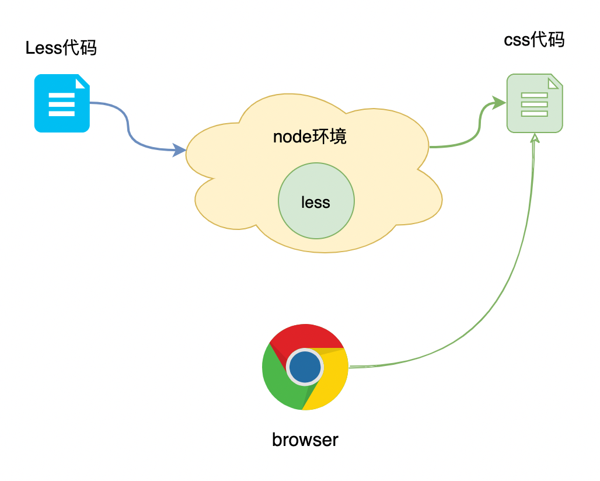

**可以看出，node 环境在前端工程化中，充当了一个辅助的角色，它并不直接运行前端代码，而是让我们编写前端代码更加舒适便利，在后续的课程中，你还会不断的体会到这一点**

**转换代码，称之为编译(compile)，转换代码的工具，称之为编译器(compiler)**

## 体验 Less

1. 新建`index.less`文件，编写下面的`less`代码

    ```less
    @green: #008c8c;
    .list {
    	display: flex;
    	flex-wrap: wrap;
    	color: @green;
    	li {
    		margin: 1em;
    		&:hover {
    			background: @green;
    			color: #fff;
    		}
    	}
    }
    ```

2. 使用`npm`下载`less`

    `less`包提供了一个`cli`工具`lessc`，你可以有两种方案使用它

    **方案一: 全局安装 less**

    这种方案可以让你在任何终端目录使用`lessc`命令，但不利于版本控制

    **方案二: 本地安装 less**

    这种方案会把`less`安装到工程目录的`node_modules`中，你无法全局使用`lessc`命令，但可以在当前工程目录中使用`npx lessc`运行该命令

    **npx**

    > 是 npm 提供的一个小工具，（用来执行 node_modules/bin/可执行文件），定义为 npm 包的执行者。
    > 是一个由 Node.js 官方提供的用于快速执行 npm 包中的可执行文件的工具。 它可以帮助我们在不全局安装某些包的情况下，直接运行该包提供的命令行工具。npx 会在执行时，检查本地项目中是否安装了对应的依赖，如果没有安装则会自动下载安装，并执行命令。

    相比 npm，npx 会自动安装依赖包并执行某个命令。

    - 它可以帮助我们在不全局安装某些包的情况下，直接运行该包提供的命令行工具；
    - npx 在执行时，检查本地项目中是否安装了对应的依赖，如果没有安装则会自动下载安装，并执行命令；
    - 如果本地已经存在该依赖，则直接执行命令；

    > npx 会把远端的包下载到本地吗?
    > npx 不会像 npm 或 yarn 一样将包下载到本地的 node_modules 目录中。相反，它会在执行命令时，在本地缓存中寻找并下载包，然后执行该包中的命令。这样可以避免在开发过程中在全局安装大量的包，同时也可以确保使用的是最新版本的包。
    >
    > npx 执行完成之后， 下载的包是否会被删除？
    > 是的，npx 会在执行完命令后删除下载的包。这是因为 npx 会在执行命令之前，将需要执行的包下载到一个临时目录中，并在执行完毕后删除该目录。这样可以避免在本地留下不必要的依赖包。如果需要保留依赖包，可以使用–no-cleanup 选项来禁止删除下载的包。

    **如果配置`package.json`脚本，无须使用`npx`**

    如果可以，应该尽量使用本地安装，而非全局安装

3. 使用`lessc`命令，对编写的`less`文件进行编译

    ```shell
    # 将 index.less 编译成为 index.css
    lessc index.less index.css
    ```

4. 新建一个页面，引用编译结果`index.css`

> 目前，编写 less 代码会遇到一点小麻烦，就是每次编写后，都需要运行命令进行编译
>
> 这个麻烦只是暂时的，将来很快就可以解决

## Less 的核心语法

> Less 官网: https://lesscss.org/
>
> Less 民间中文网: https://less.bootcss.com/

Less 提供了非常多的功能，帮助我们更加轻松的编写 css 代码

其中，我们最常用的功能有下面 3 个:

-   [变量](https://less.bootcss.com/#%E5%8F%98%E9%87%8F%EF%BC%88variables%EF%BC%89)
-   [嵌套](https://less.bootcss.com/#%E5%B5%8C%E5%A5%97%EF%BC%88nesting%EF%BC%89)
-   [混合](https://less.bootcss.com/#%E6%B7%B7%E5%90%88%EF%BC%88mixins%EF%BC%89)

另外，你需要关注 Less 的特殊[注释](https://less.bootcss.com/#%E6%B3%A8%E9%87%8A%EF%BC%88comments%EF%BC%89)

```less
// 这样的注释只存在于less源代码中

/* 这是普通的css注释，它会生成到编译结果中 */
```

# script 标签中 defer 和 async 的区别

> script 是会阻碍 HTML 解析的，只有下载好并执行完脚本才会继续解析 HTML

defer 和 async 有一个共同点: **下载**此类脚本都不会阻止页面呈现（异步加载），区别在于:

1. async 执行与文档顺序无关，先加载哪个就先执行哪个；defer 会按照文档中的顺序执行
2. async 脚本加载完成后立即执行，可以在 DOM 尚未完全下载完成就加载和执行；而 defer 脚本需要等到文档所有元素解析完成之后才执行

 

# webpack 粗略

## 核心

**webpack 是用来搭建前端工程的**

它运行在 node 环境中，它所做的事情，简单来说，就是**打包**

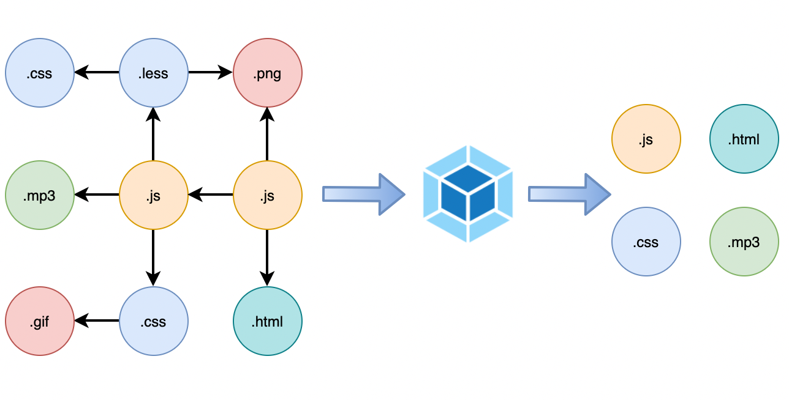

具体来说，就是以某个模块作为入口，根据入口分析出所有模块的依赖关系，然后对各种模块进行合并、压缩，形成最终的打包结果

**在 webpack 的世界中，一切皆是模块**

## 体验

> 老师提供的工程，以`src/main.js`作为入口文件
>
> 按照习惯，所有的模块均放置在`src`目录中

1. 安装依赖

2. 编写多个模块

    随意编写一些模块，可以是 js、图片、音视频，以入口模块为起点，形成依赖关系

3. 运行`npm run build`命令，进行打包

4. 查看打包结果

    打包结果放置在 dist 目录中

通过上面的体验，可以发现，webpack 给我们带来了至少以下好处:

-   可以大胆的使用任意模块化标准

    无须担心兼容性问题，因为 webpack 完成打包后，已经没有了任何模块化语句

-   可以将一些非 JS 代码也视为模块

    这样可以对 css、图片等资源进行更加细粒度的划分

-   在前端开发中，也可以使用 npm

    webpack 不会运行你的源代码，无论是你自己写的模块，还是通过 npm 安装的模块，webpack 一视同仁，统统视为依赖，最终合并到打包结果中

-   非常适合开发单页应用

    单页应用是前端用户体验最好的 web 应用

    所谓单页应用，是指只有一个 html 页面，页面中没有任何内容，所有的内容均靠 js 生成

    要优雅的实现单页应用，最好依托于前端框架，比如 vue、react

webpack 给我们开发带来的变化远不止于此，接下来一一体验

## 页面模板

对于单页应用而言，只有一个空白的页面，所有内容都靠 JS 代码创建

webpack 会自动生成一个页面，并且在页面中会自动加入对 js 和 css 的引用

它生成页面时，参考的是`public/index.html`，其称之为页面模板

## public 目录

webpack 会非常暴力的将 public 目录中的所有文件（除页面模板外），复制到打包结果中

## 开发服务器

如果每次修改完代码，都要经过`打包->运行`，未免太过麻烦

在开发阶段，我们可以运行`npm run serve`命令获得更好的打包体验

该命令会让`webpack`启动一个**开发服务器**。

在这个阶段，webpack 并不会形成打包结果文件，而是把打包的内容放到内存中，当我们请求服务器时，服务器从内存中给予我们打包结果

与此同时，当源码发生变动时，webpack 会自动重新打包，同时刷新页面以访问到最新的打包结果

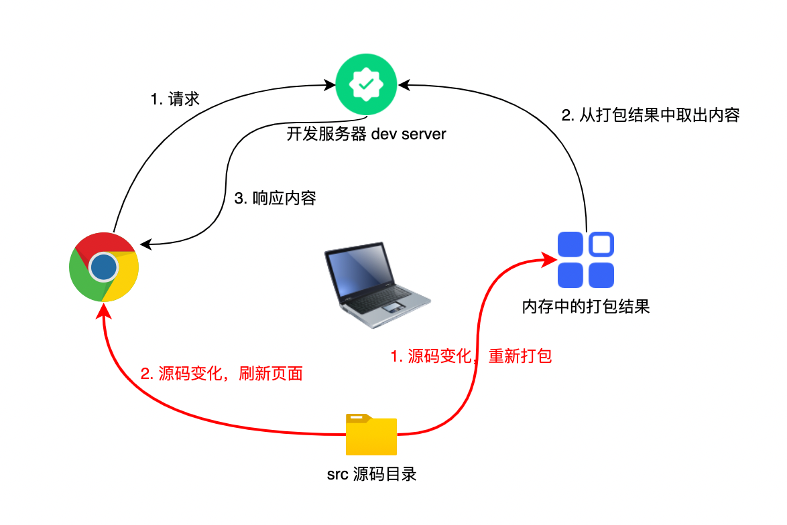

## 文件缓存

可以看到，除了页面外，其他的资源在打包完成后，文件名多了一些奇奇怪怪的字符

例如: `js/app-9ea93.js`

其中，`9ea93`这样的字符称之为`hash`，它会随着模块内容的变化而变化

**源码内容不变，hash 不变；源码内容变化，hash 变化**

之所以这样做，是因为生产环境中，浏览器会对除页面外的静态资源进行缓存

如果不设置 hash 值，一旦代码更新，浏览器还会使用之前缓存的结果，无法使用最新的代码

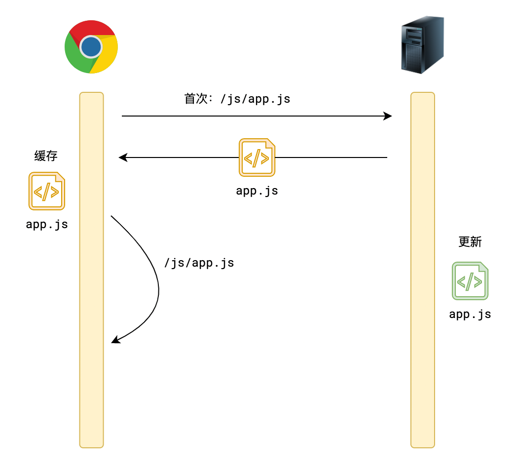

有了 hash 值之后，即可解决此问题

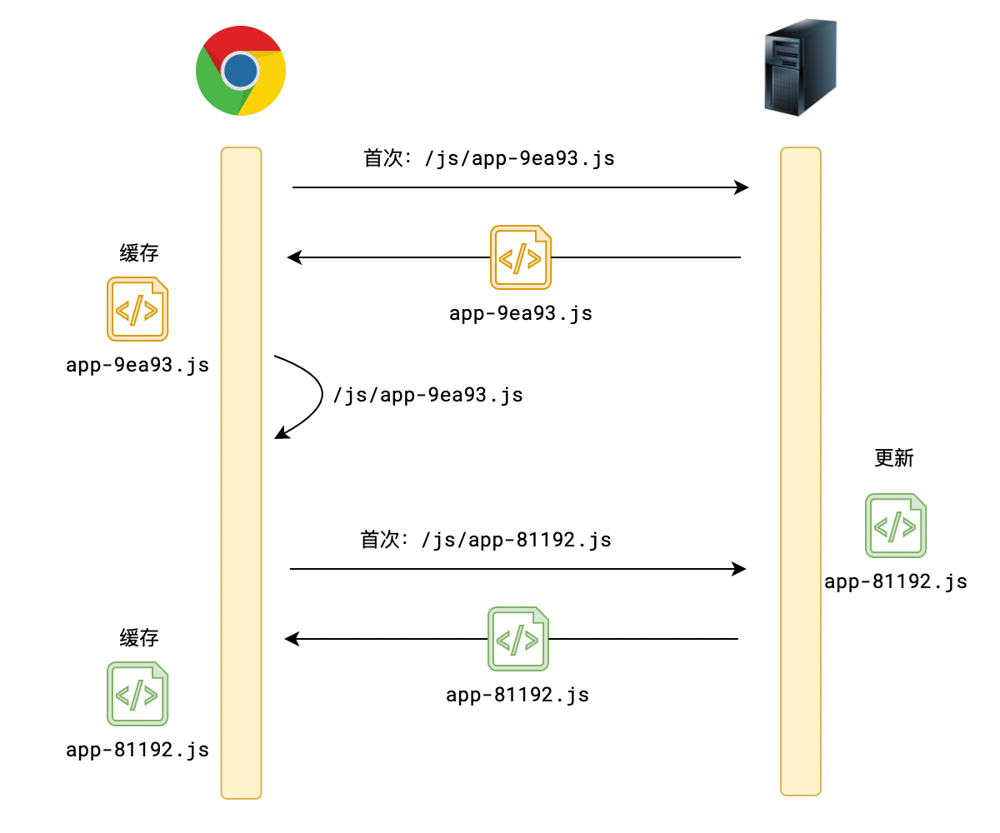

webpack 会在打包时自动处理 hash 值，并不会对我们写代码造成任何影响，但作为一个前端开发者，有必要了解这一点

## 资源路径

**除代码和样式模块外，其他模块被视为资源模块**

值得特别注意的是，**资源模块在源代码中的路径和打包后的路径是不一样的**，这就导致我们在编写代码的时候，根本无法知晓最终的路径

最常见的例子，就是在 css 中使用背景图片

```css
.container {
	/* 背景图使用了源码中的路径 */
	backgroud: url('.././img/engineeringImg/1.png');
}
```

它能正常工作吗？

它能！

因为 webpack 非常智能的发现了这一点，对于 css 中的路径，webpack 在打包时，会将其自动转换为打包结果的路径，比如，上面的代码在打包完成后，可能被转换为下面的格式

```css
.container {
	/* css中的资源路径会被自动替换，我们无须关心 */
	background: url(/img/1492ea.png);
}
```

但如果我们要通过 js 动态的使用路径，webpack 是无法识别的

```js
// 打包前
const url = '././img/engineeringImg/1.png'; // 该路径无法被转换
img.src = url;

// 打包后
const url = '././img/engineeringImg/1.png'; // ❌
img.src = url;
```

正确的做法是，通过模块化的方式导入资源，并获取资源路径

```js
// 打包前
import url from '././img/engineeringImg/1.png'; // 打包后，url得到的将是真实的路径
img.src = url;

// 打包后
const url = '/img/1492ea.png'; // ✅
img.src = url;
```

## 缺省的文件和后缀名

导入模块时，所有 js 模块均可省略`.js`，若导入的模块文件名为`index.js`，可省略文件名

```js
import './home'; // 若存在home.js，可省略js
import './movie'; // 若movie是一个目录，此次导入的是 ./movie/index.js
```

## 路径别名

随着体量的增长，不可避免的，会形成层级极深的目录

```shell
root
	|- src
		|- a
				|- a1
						|- a2
							 |- index.js
		|- b
				|- b1
						|- index.js
```

如果需要在`./src/a/a1/a2/index.js`中导入`./src/b/b1/index.js`，则可能产生下面特别恶心的代码

```js
import '../../../b/b1/index.js';
```

webpack 提供了别名供我们快速定位到`./src`目录，通常，该别名为`@`

上面的导入代码可简化为

```js
import '@/b/b1'; // @表示src目录，同时省略了index.js
```

## js 兼容性

当 webpack 读取到 js 代码时，会自动对其进行兼容性处理

具体的处理方案涉及到两个配置文件:

-   `babel.config.js`: 通过配置该文件，可以设置对哪些 js 代码进行降级处理
-   `.browserslistrc`: 通过配置该文件，可以设置在降级时，要兼容哪些浏览器，兼容的范围越光，降级产生的代码就越多，自然，打包后的体积就越大

你无须知晓具体的配置方式

## 打包压缩

webpack 在打包时，会对所有 js 和 css 代码进行压缩

对于 js，除了压缩之外，还会对其中的各种名称进行混淆

```js
(self.webpackChunkmovie_list=self.webpackChunkmovie_list||[]).push([[587],{3587:(r,t,n)=>{"use strict";n.r(t),n(5666),n(1539),n(8674),n(9600),n(1249),n(2222);var e=n(9755),a=n.n(e);var o;function i(r){o.html(r.map((function(r){return'<li>\n  <a href="'.concat(r.url,'" target="_blank">\n    \n  </a>\n  <a href="').concat(r.url,'" target="_blank" class="').concat("qmUYQv1xlJhGMQKz-kfAp",'">').concat(r.title,'</a>\n  <p class="').concat("_3yV5wC-URYTUP0sPvaE0ZR",'">').concat(r.rate,"</p>\n  </li>")})).join(""))}o=a()("<ul>").addClass("_1fsrc5VinfYHBXCF1s58qS").appendTo("#app");var c=n(8138);const u=
```

混淆的作用一方面是为了进一步压缩包体积，另一方面是为了让我们的代码更难被其他人理解利用

## 源码地图 source map

我们运行的是 webpack 打包后的结果，而打包后的结果是很难阅读的

但这样一来会带来新的问题，如果代码报错，我们就难以知道到底是那一行代码写的有问题

此时源码地图就发挥了作用

可以发现，js 代码打包后都会跟上一个同名的、==后缀为 .map 的文件==，该文件就保存了原始代码的内容

请放心，这个内容人类是看不懂的，但浏览器可以看懂

当代码报错时，==浏览器会定位到源码地图中的对应代码==，而不是把真实报错的代码展示给我们

你无须关心这一点，但可以自然的从其中获得巨大的便利

## css 工程化

webpack 能够识别**所有**的样式代码，包括`css`、`less`、`sass`、`stylus`

在打包时，会将它们转换成纯正的`css`

除此之外，它还具备以下的神奇能力

### 自动厂商前缀

css 有很多兼容性问题，解决这些兼容性问题的最常见办法，就是加上厂商前缀。

比如:

```css
/* 兼容性不好的代码 */
.container {
	display: flex;
	transition: 1s;
}

/* 兼容性好的代码 */
.container {
	display: -webkit-box;
	display: -webkit-flex;
	display: flex;
	-webkit-transition: 1s;
	transition: 1s;
}
```

webpack 会根据`.browserlistrc`中指定的浏览器范围，**按需、自动**加上厂商前缀

我们开发无须关心

### css module

css 文件多了后，你怎么保证它们里面没有冲突的类样式？

靠层级选择器？就不担心效率？

靠命名规范？就不担心脑袋爆炸？

要靠就靠 css module

当样式文件以`xxx.mdoule.xxx`的方式命名时，webpack 会将该文件当成一个开启了`css module`的文件

比如: `index.module.less`、`movie.module.css`，都是开启了`css module`的文件

**文件中的所有类名都会被 hash 化**

```less
// 源码
.container {
}
.list {
}
.item {
}

// 打包结果，绝无可能重名
._2GFVidHvoHtfgtrdifua24 {
}
._1fsrc5VinfYHBXCF1s58qS {
}
.urPUKUukdS_UTSuWRI5-5 {
}
```

现在就一个问题，我们在使用类名时，如何知道它打包结果的类名呢？

```js
import './index.module.less';
dom.classList.add('container'); // ❌ 最终的类名可不是这个
```

正确的方式如下:

```js
// styles 是一个对象，里面映射了源码类名和打包类名的关系
import styles from './index.module.less';
dom.classList.add(styles.container); // ✅ 属性container中记录的就是container转换后的类名
```

## 跨域代理

**大部分时候，为了安全，服务器都是不允许跨域访问的**

所以，将来部署应用的时候，通常会使用下面的方式进行部署

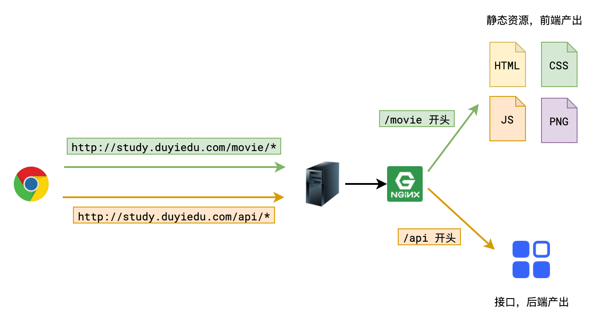

你无须彻底理解上图，只需要知道: **最终部署之后，不存在跨域问题**

但是，**跨域问题在开发阶段是存在的**！

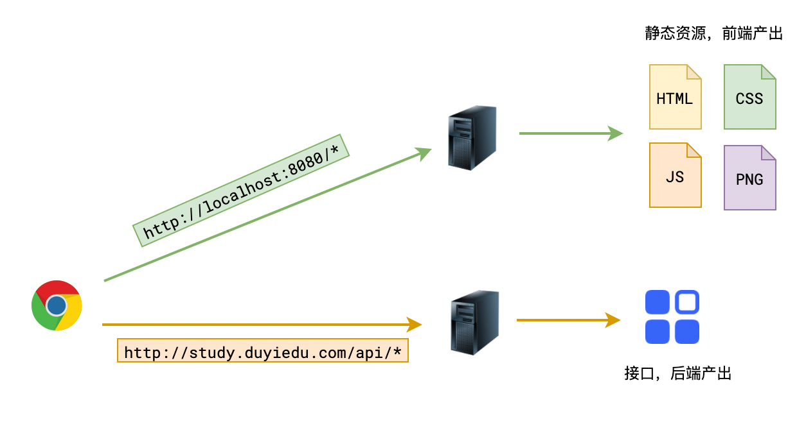

所以，我们要做的，**仅仅是消除开发阶段的跨域问题，便于在开发阶段查看效果**

如何实现:

1. 在`webpack.config.js`中，找到下面的部分，设置代理

    ```js
    devServer: {
      proxy: {
        '/api': { // 当请求地址以 api 开头时，代理到另一个地址
          target: 'http://study.duyiedu.com', // 代理的目标地址
          changeOrigin: true, // 更改请求头中的host，无须深究，为避免出问题，最好写上
        },
      },
    },
    ```

2. 在`ajax`请求时，仅需给上请求路径即可

    ```js
    axios.get('http://study.duyiedu.com/api/movies'); // ❌ 无须指定源
    axios.get('/api/movies')； // ✅
    ```

来看看这样做的效果是什么

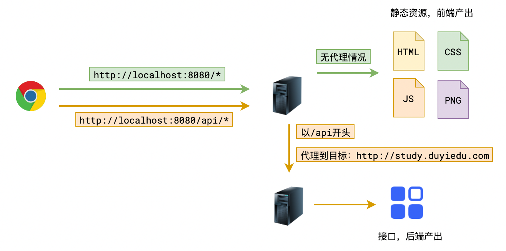

这样一来，在跨域问题上，就做到了**开发环境和生产环境的统一**

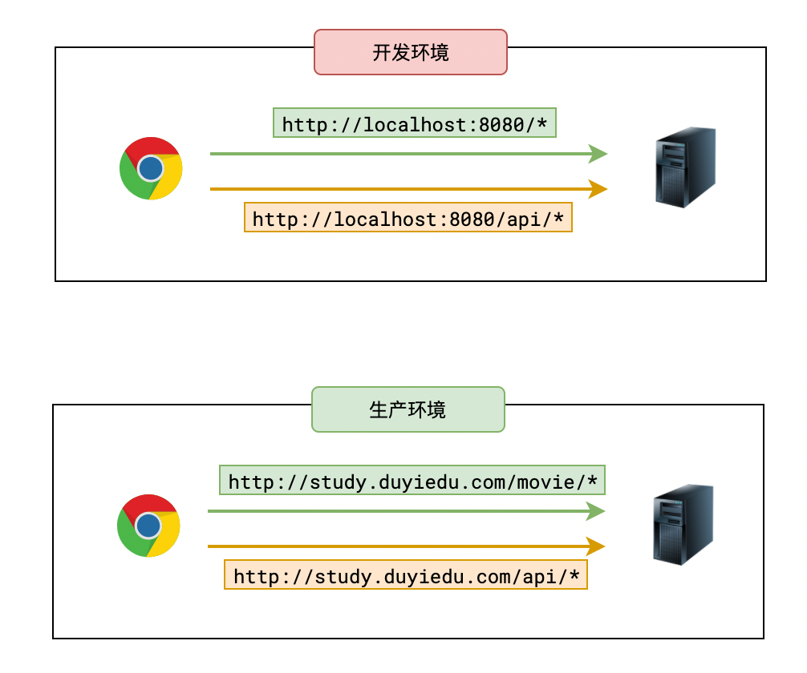

## webpack 没有那么神奇

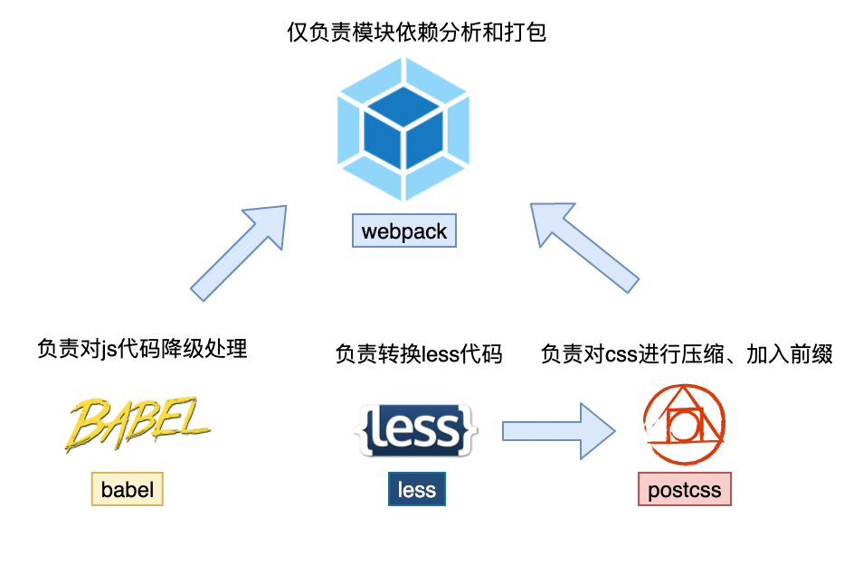

webpack 通过插件（plugin）和加载器（loader）将这些技术整合在一起

`上图的技术 + 乱七八糟一大堆其他技术 + 老师的配置 = 呈现给你的工程`

目前，你无须理解这一些，保持敬畏即可

最后，说明一下工程中看不懂的文件:

-   `.browserslistrc`，表达适配的浏览器范围，会被工程化中的其他技术所使用
-   `babel.config.js`，`babel`的配置文件，做 js 降级处理
-   `postcss.config.js`，`postcss`的配置文件，做 css 代码转换
-   `webpack.config.js`，`webpack`的配置文件，整合其他工程化技术，以及配置打包细节、开发服务器、路径别名等等

# Webpack 深入

## 核心概念

### 5 大核心概念

| 概念 | 作用 | 说明 |
| --- | --- | --- |
| **Entry** | 入口 | 指定 webpack 从哪个文件开始打包 |
| **Output** | 输出 | 指定打包后的文件输出到哪里、如何命名 |
| **Loader** | 加载器 | webpack 本身只能处理 JS/JSON，通过 loader 处理其他类型文件 |
| **Plugin** | 插件 | 扩展 webpack 功能（打包优化、资源管理、注入环境变量等） |
| **Mode** | 模式 | `development`（开发）/ `production`（生产）/ `none` |

### 基础配置

```js
// webpack.config.js
const path = require('path');
const HtmlWebpackPlugin = require('html-webpack-plugin');

module.exports = {
  entry: './src/main.js',
  output: {
    path: path.resolve(__dirname, 'dist'),
    filename: 'js/[name].[contenthash:8].js',
    clean: true,
  },
  module: {
    rules: [
      { test: /\.css$/, use: ['style-loader', 'css-loader'] },
      { test: /\.less$/, use: ['style-loader', 'css-loader', 'less-loader'] },
      {
        test: /\.(png|jpe?g|gif|svg|webp)$/,
        type: 'asset',
        parser: { dataUrlCondition: { maxSize: 10 * 1024 } },
        generator: { filename: 'images/[hash:8][ext]' }
      },
      { test: /\.(woff2?|eot|ttf|otf)$/, type: 'asset/resource' },
      {
        test: /\.js$/,
        exclude: /node_modules/,
        use: { loader: 'babel-loader', options: { presets: ['@babel/preset-env'] } }
      }
    ]
  },
  plugins: [
    new HtmlWebpackPlugin({ template: './public/index.html' })
  ],
  mode: 'development'
};
```

### Loader 执行顺序

**从右到左、从下到上**

```js
// 执行顺序: less-loader → css-loader → style-loader
use: ['style-loader', 'css-loader', 'less-loader']
```

### 常用 Loader

| Loader | 作用 |
| --- | --- |
| `babel-loader` | JS 兼容性处理（ES6+ → ES5） |
| `css-loader` | 解析 CSS 中的 `@import` 和 `url()`，转为 JS 对象 |
| `style-loader` | 将 CSS 注入到 DOM 的 `<style>` 标签中 |
| `less-loader` | 编译 Less → CSS |
| `sass-loader` | 编译 Sass/Scss → CSS |
| `postcss-loader` | CSS 后处理（自动前缀、兼容等） |
| `thread-loader` | 多进程打包，加快构建速度 |
| `vue-loader` | 解析 `.vue` 单文件组件 |

### 常用 Plugin

| Plugin | 作用 |
| --- | --- |
| `HtmlWebpackPlugin` | 自动生成 HTML 并注入打包后的资源 |
| `MiniCssExtractPlugin` | 将 CSS 提取为独立文件（替代 style-loader） |
| `CssMinimizerPlugin` | 压缩 CSS |
| `TerserPlugin` | 压缩 JS（生产模式默认启用） |
| `ESLintPlugin` | 代码检查 |
| `DefinePlugin` | 定义全局常量（如环境变量） |
| `CopyWebpackPlugin` | 复制静态资源到打包目录 |
| `BundleAnalyzerPlugin` | 打包分析可视化 |

## 开发模式配置

```js
// webpack.dev.js
const { merge } = require('webpack-merge');
const common = require('./webpack.common.js');

module.exports = merge(common, {
  mode: 'development',
  devtool: 'eval-cheap-module-source-map',
  devServer: {
    host: 'localhost',
    port: 3000,
    open: true,
    hot: true,
    proxy: {
      '/api': {
        target: 'http://localhost:8080',
        changeOrigin: true,
        pathRewrite: { '^/api': '' }
      }
    }
  }
});
```

## 生产模式配置

```js
// webpack.prod.js
const MiniCssExtractPlugin = require('mini-css-extract-plugin');
const CssMinimizerPlugin = require('css-minimizer-webpack-plugin');

module.exports = merge(common, {
  mode: 'production',
  devtool: 'source-map',
  output: {
    filename: 'js/[name].[contenthash:8].js',
    chunkFilename: 'js/[name].[contenthash:8].chunk.js',
    clean: true
  },
  module: {
    rules: [
      { test: /\.css$/, use: [MiniCssExtractPlugin.loader, 'css-loader', 'postcss-loader'] }
    ]
  },
  plugins: [
    new MiniCssExtractPlugin({ filename: 'css/[name].[contenthash:8].css' })
  ],
  optimization: {
    minimizer: [new CssMinimizerPlugin(), '...'],
    splitChunks: {
      chunks: 'all',
      cacheGroups: {
        vendors: { test: /[\\/]node_modules[\\/]/, name: 'vendors', priority: -10 }
      }
    }
  }
});
```

## 性能优化

### 提升构建速度

**1. HMR 热模块替换**

```js
devServer: { hot: true }
// JS 需要手动处理（CSS 已由 style-loader 自动处理）
if (module.hot) {
  module.hot.accept('./module.js', () => { /* 回调 */ });
}
```

**2. OneOf** — 每个文件只匹配一个 loader 规则

**3. Include / Exclude** — 缩小 loader 处理范围

**4. Cache** — 缓存 Babel 编译结果

```js
{ loader: 'babel-loader', options: { cacheDirectory: true, cacheCompression: false } }
```

**5. 多进程打包（Thread）**

```js
const threads = require('os').cpus().length;
{ test: /\.js$/, use: [{ loader: 'thread-loader', options: { workers: threads } }, 'babel-loader'] }
```

### 减少代码体积

**1. Tree Shaking** — 自动移除未使用代码（ES Module + production 默认开启）

```json
// package.json
{ "sideEffects": ["*.css", "*.less"] }
```

**2. Code Splitting** — 代码分割

```js
optimization: { splitChunks: { chunks: 'all' } }
// 动态导入
const module = await import('./heavy-module.js');
```

**3. 图片压缩** — `image-minimizer-webpack-plugin`

### 文件指纹策略

| hash 类型 | 说明 | 适用 |
| --- | --- | --- |
| `hash` | 整个项目的 hash，任何文件改变都变 | - |
| `chunkhash` | 同一 chunk 共享 | JS |
| `contenthash` | 基于文件内容，**推荐** | CSS、资源 |

---

# Vite

## 概述

Vite 是下一代前端构建工具，开发环境基于原生 ESM，速度极快。

### Vite vs Webpack

| 对比 | Webpack | Vite |
| --- | --- | --- |
| 开发启动 | **先打包**再启动（慢） | **按需编译**，秒启动 |
| HMR 速度 | 随项目增大变慢 | **始终快速**（基于 ESM） |
| 底层 | 全量打包 | 开发: esbuild；生产: Rollup |
| 配置 | 复杂 | 开箱即用 |

### Vite 为什么快

1. **开发环境不打包**：利用浏览器原生 ESM
2. **按需编译**：只编译当前页面用到的模块
3. **esbuild 预构建**：Go 写的 esbuild 比 JS 工具快 10-100 倍
4. **HMR 精确更新**：基于 ESM 只更新变化的模块

### 配置文件

```js
// vite.config.js
import { defineConfig } from 'vite';
import vue from '@vitejs/plugin-vue';

export default defineConfig({
  plugins: [vue()],
  resolve: { alias: { '@': '/src' } },
  server: {
    port: 3000,
    proxy: {
      '/api': {
        target: 'http://localhost:8080',
        changeOrigin: true,
        rewrite: (path) => path.replace(/^\/api/, '')
      }
    }
  },
  build: {
    rollupOptions: {
      output: { manualChunks: { vue: ['vue', 'vue-router', 'pinia'] } }
    }
  }
});
```

---

# Babel

## 作用

将 ES6+ 代码转换为向后兼容的 JS。

### 编译流程

```
源代码 → 解析(Parser) → AST → 转换(Transform) → 新AST → 生成(Generator) → 目标代码
```

### 核心配置

```js
// babel.config.js
module.exports = {
  presets: [
    ['@babel/preset-env', {
      targets: '> 1%, last 2 versions, not dead',
      useBuiltIns: 'usage',
      corejs: 3
    }]
  ],
  plugins: ['@babel/plugin-transform-runtime']
};
```

---

# ESLint

## 作用

ESLint 是 JS/TS 的静态代码分析工具，用于发现和修复代码中的问题（语法错误、风格不一致、潜在 bug 等）。

## 基本配置

```js
// .eslintrc.js
module.exports = {
  env: { browser: true, es2021: true, node: true },
  extends: ['eslint:recommended'],
  parserOptions: {
    ecmaVersion: 'latest',
    sourceType: 'module'
  },
  rules: {
    'no-console': 'warn',       // 0=off, 1=warn, 2=error
    'no-unused-vars': 'warn',
    'eqeqeq': 'error',          // 必须使用 ===
    'no-var': 'error'            // 禁止使用 var
  }
};
```

## 常用命令

```bash
npx eslint .                    # 检查当前目录
npx eslint --fix .              # 自动修复
npx eslint --ext .js,.vue src/  # 指定扩展名和目录
```

## Vue 项目中的 ESLint

```js
// .eslintrc.js（Vue 项目）
module.exports = {
  extends: [
    'eslint:recommended',
    'plugin:vue/vue3-recommended'   // Vue 3 推荐规则
  ],
  parser: 'vue-eslint-parser',
  parserOptions: {
    parser: '@babel/eslint-parser'
  }
};
```

---

# Prettier

## 作用

Prettier 是代码格式化工具，专注于代码风格（缩进、引号、分号等），与 ESLint 互补：

- **ESLint**：代码质量 + 部分格式
- **Prettier**：纯格式化

## 基本配置

```json
// .prettierrc
{
  "semi": true,
  "singleQuote": true,
  "tabWidth": 2,
  "trailingComma": "es5",
  "printWidth": 100,
  "arrowParens": "always",
  "endOfLine": "lf"
}
```

## 与 ESLint 配合

安装：

```bash
npm i -D eslint-config-prettier eslint-plugin-prettier
```

配置：

```js
// .eslintrc.js
module.exports = {
  extends: [
    'eslint:recommended',
    'plugin:prettier/recommended'  // 放在最后，关闭与 Prettier 冲突的 ESLint 规则
  ]
};
```

---

# Git Hooks（husky + lint-staged）

## 为什么需要

防止不规范的代码被提交到仓库。在 `git commit` 时自动执行 ESLint 检查和 Prettier 格式化。

## 配置步骤

```bash
# 1. 安装
npm i -D husky lint-staged

# 2. 初始化 husky
npx husky init

# 3. 编辑 .husky/pre-commit
echo "npx lint-staged" > .husky/pre-commit
```

## lint-staged 配置

```json
// package.json
{
  "lint-staged": {
    "*.{js,jsx,ts,tsx,vue}": [
      "eslint --fix",
      "prettier --write"
    ],
    "*.{css,less,scss}": [
      "prettier --write"
    ]
  }
}
```

## 工作流程

```
git add → git commit → 触发 pre-commit hook → lint-staged
                                                   ↓
                                        只对暂存区文件执行
                                        ESLint --fix + Prettier
                                                   ↓
                                        通过 → 提交成功
                                        失败 → 提交中断，需修复后重新提交
```

---
