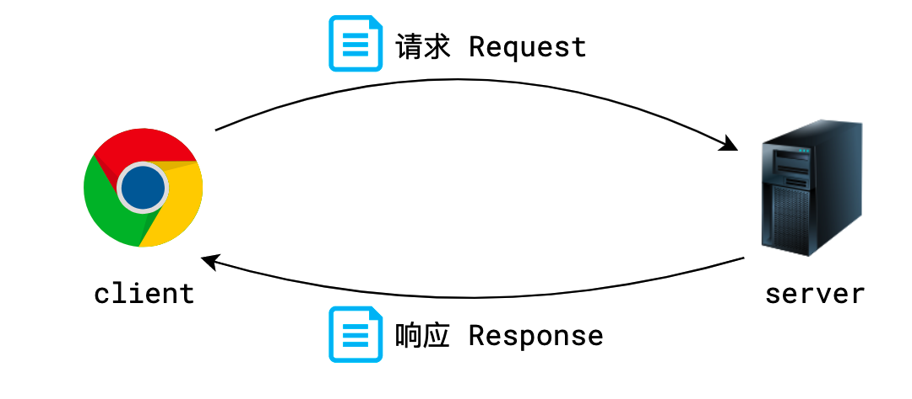
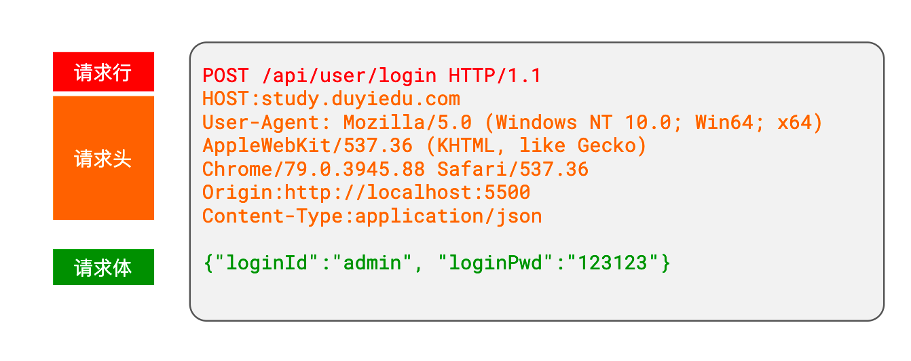
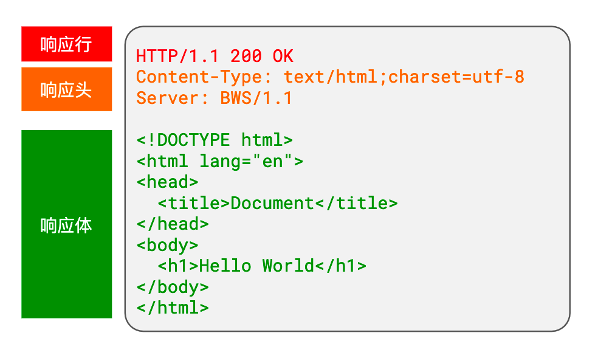
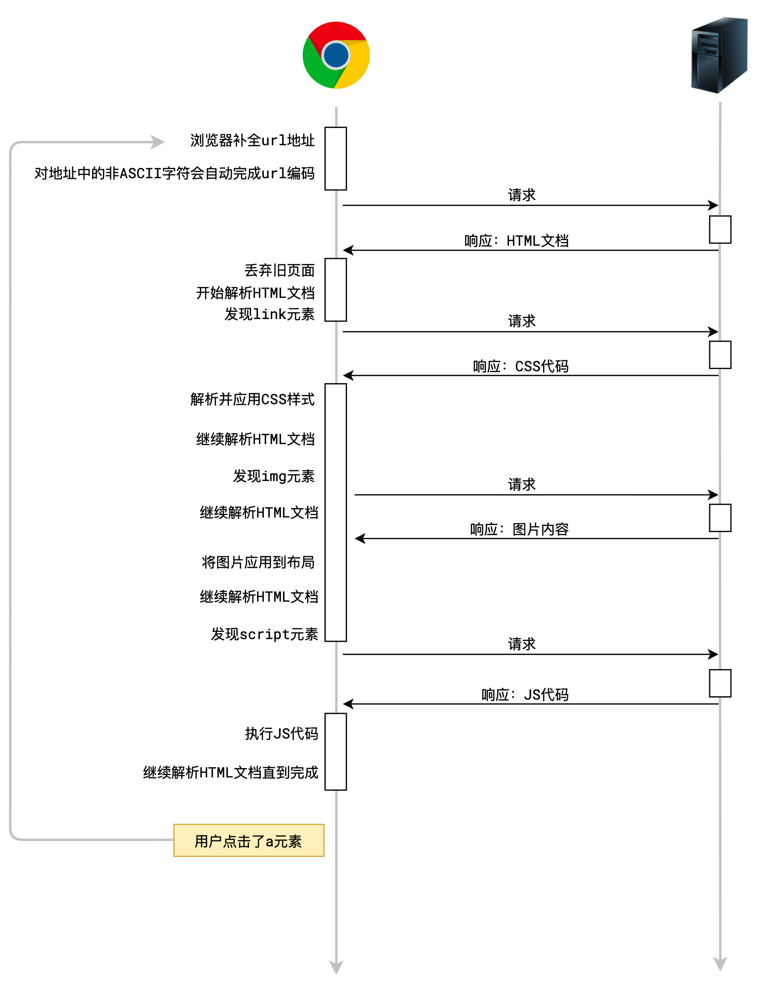

## URL


### 协议 Protocal / Schema

它表示客户端希望用什么方式和服务器沟通，现在只需要知道这里固定写 http 或 https 即可

> 小知识：
>
> 1. 如果在浏览器的地址栏省略了协议，浏览器会自动为你补全
> 2. 可以在 Chrome 浏览器的地址栏点击右键，显示完整的地址
> 3. https 协议比 http 协议更安全，但往往出现在线上，本地的服务器通常不会是 https

### 主机 Host

它表示客户端希望在哪台计算机上寻找资源

这里有两种写法：IP 地址和域名

1. IP 地址。IP 地址是一个网络中计算机的唯一编号，通常，一个 IP 对应一台计算机。

    > 记住特殊 IP 地址： 127.0.0.1，它表示本机 IP

2. 域名。域名类似 IP 地址的别名，把不容易记忆的数字变为容易记忆的单词。当使用域名访问时，会自动转换为 IP 地址。

    > 记住特殊域名：localhost，它表示的 IP 地址是 127.0.0.1

### 端口 Port

它表示客户端希望在哪个应用程序中寻找资源

每个服务器程序，都会监听一个或多个端口，只有找到对应的端口，才能找到这个服务器程序。

**端口号是可选的**，若不填写，则：

1. 如果使用的是 http 协议，默认端口号为 80
2. 如果使用的是 https 协议，默认端口号为 443

### 路径 Path

服务器上往往有许许多多的资源，每个资源都有自己的访问路径

**路径是可选的**，若不填写，则路径为 /

### 参数 Query / Param

某些资源可以根据需要呈现不同的内容，比如一篇新闻列表的页面，可以指定它呈现第几页的新闻，而「第几页」就属于一些额外信息，这些额外信息可以通过参数传递

比如，我们访问一个新闻列表的页面，同时希望它展示第 5 页，每页展示 10 条新闻，我们**可能**得到下面的 url 地址：

```
http://duyiedu.com/news?page=1&limit=10
```

上面这个 url 地址中，`page=1&limit=10`就是参数部分，这部分可以包含多个参数，不同的参数之间使用`&`符号分割

**参数是可选的**

### hash

在网络通信中，hash 没有什么用，它往往作为浏览器的锚链接出现。

## http

通过 url 地址，能够在茫茫互联网中准确的找到自己想要的服务。

但光找到服务还是不够，双方需要「用同一种语言」来对话，否则都听不懂对方在说什么。

这个「语言」就是协议，而互联网中最常见的协议就是 http 协议

> https 是在 http 协议基础上发展起来的，它增加了安全性，其他和 http 协议完全一致

http 是基于 请求-响应 的方式完成通信的，每一次通信都是由客户端向服务器发出请求，传递一些消息过去，然后经过服务器程序处理后，响应给客户端一些消息。

http 协议规定：

1. 每次 请求-响应 都是**独立**的，相互之间互不干扰。这种模式的协议我们称之为**无状态协议**

    http 的无状态会带来一些问题，这些问题我们会在后续的课程中讨论

2. 每次 请求-响应 传递的消息都是**纯文本（字符串）**，而且文本格式必须按照 http 协议规定的格式书写。



### 请求的消息格式

请求消息格式有三部分组成



-   请求行：高度概括了客户端想要干什么
-   请求头：描述了请求的一些额外信息
-   请求体：包含了要给服务器传递的正文数据。**请求体是可以省略的**

#### 请求行

请求行是整个 http 报文的第一行字符串，它包含三个部分：请求方法 **路径 + 参数 + hash 协议和版本**

重点关注**请求方法**

请求方法是一个单词，它表达了客户端的「动作」，比如：

-   GET：获取
-   POST：提交

在 http 协议中，并没有规定只能使用上面两种动作，甚至没有规定每种动作会带来怎样的变化

而在实际的应用中，我们逐渐有了一些约定俗成的规范：

1. 动作通常有：GET（获取资源）、POST（提交消息）、PUT（修改数据）、DELETE（删除数据）。其中，GET 和 POST 最为常见。
2. GET 和 DELETE 请求不能有请求体，而 POST 和 PUT 请求可以有请求体

**浏览器遵循了上面的规范，这带来了 GET 和 POST 的诸多区别** 比如，由于 GET 请求没有请求体，所以要传递数据只能把数据放到 url 的参数中

在浏览器中，获取数据一般使用的都是 GET 请求，比如：

-   在地址栏输入地址并按下回车
-   点击了某个 a 元素
-   获取图片、音频、视频
-   获取 css、js、字体等文件

**事实上，浏览器自动发出的请求基本都是 GET 请求，而 POST 请求需要开发者手动处理，比如在 form 表单中设置 method 为 POST**

#### 请求头 header

请求头是一系列的键值对，里面包含了诸多和业务无关的信息

浏览器每次请求服务器都会自动附带很多的请求头，其实这些请求头大部分服务器是不需要的

> 你可以说不要，但不能说我没给

我们只需关注下面几个请求头即可：

1. Host：url 地址中的主机

2. User-Agent：客户端的信息描述

3. Content-Type: 请求体的消息是什么格式，如果没有请求体，这个字段无意义

    该字段的常见取值为：

    - application/x-www-form-urlencoded

        表示请求体的数据格式和 url 地址中参数的格式一样，比如

        ```
        loginId=admin&loginPwd=123123
        ```

    - application/json

        表示请求体的数据是 json 格式，比如

        ```json
        { "loginId": "admin", "loginPwd": "123123" }
        ```

    - multipart/form-data

        一种特殊的请求体格式，上传文件一般选择该格式

#### 请求体 body

包含业务数据的字符串

理论上，请求体可以是任意格式的字符串，但习惯上，服务器普遍能识别以下格式：

-   application/x-www-form-urlencoded：`属性名=属性值&属性名=属性值...`
-   application/json：`{"属性名":"属性值", "属性名":"属性值"}`
-   multipart/form-data：使用某个随机字符串作为属性之间的分隔符，通常用于文件上传

由于请求体格式的多样性，服务器在分析请求体时可能无法知晓具体的格式，从而不知道如何解析请求体，因此，服务器往往要求在请求头中附带一个属性`Content-Type`来描述请求体使用的格式

例如

```
Content-Type: application/x-www-form-urlencoded
Content-Type: application/json
Content-Type: multipart/form-data
```

### 响应的消息格式

服务器（通常由后端开发）收到请求的消息后，会运行后端代码对请求进行处理，处理完成后，会给予响应。

服务器的响应格式包含三个部分



#### 响应行

响应行是整个响应字符串的第一行。

响应行包含两个部分：

-   协议版本：表示服务器打算和客户端用什么协议通信
-   **状态码、状态消息**：表示服务器对当前请求的表态

**通常**，状态码和状态消息是一一对应的，比如状态码 200 的消息就是 OK

不同的请求可能会得到不同的状态码，至于到底会得到哪个状态码，由后端程序决定。

状态码分为五类：

| 分类  | 分类描述                                       |
| :---- | :--------------------------------------------- |
| 1\*\* | 信息，服务器收到请求，需要请求者继续执行操作   |
| 2\*\* | 成功，操作被成功接收并处理                     |
| 3\*\* | 重定向，需要进一步的操作以完成请求             |
| 4\*\* | 客户端错误，请求包含语法错误或无法完成请求     |
| 5\*\* | 服务器错误，服务器在处理请求的过程中发生了错误 |

通常认为，0~399 之间的状态码都是正常的，其他是不正常的

常见的状态码有：

1. 200 OK：一切正常。

2. 301 Moved Permanently：资源已被永久重定向。 **浏览器会缓存**

    `你的请求我收到了，但是呢，你要的东西不在这个地址了，我已经永远的把它移动到了一个新的地址，麻烦你取请求新的地址，地址我放到了响应头的Location中了`

3. 302 Found：资源已被临时重定向。

    `你的请求我收到了，但是呢，你要的东西不在这个地址了，我临时的把它移动到了一个新的地址，麻烦你取请求新的地址，地址我放到了请求头的Location中了`

4. 304 Not Modified：文档内容未被修改。

    `你的请求我收到了，你要的东西跟之前是一样的，没有任何的变化，所以我就不给你结果了，你自己就用以前的吧。啥？你没有缓存以前的内容，关我啥事`

5. 400 Bad Request：语义有误，当前请求无法被服务器理解。

    `你给我发的是个啥啊，我听都听不懂`

6. 403 Forbidden：服务器拒绝执行。

    `你的请求我已收到，但是我就是不给你东西`

7. 404 Not Found：资源不存在。

    `你的请求我收到了，但我没有你要的东西`

8. 500 Internal Server Error：服务器内部错误。

    `你的请求我已收到，但这道题我不会，解不出来，先睡了`

#### 响应头 header

和请求头一样，响应头也是由很多个键值对组成的，具体有哪些键值对，完全取决于服务器程序

目前，对我们最重要的键值对是`Content-Type`，它有多种取值，表示响应体的数据类型。

在 B/S 模式中，浏览器会自动根据响应头中`Content-Type`的取值，决定如何处理响应体。

1. `text/plain`: 普通的纯文本，浏览器通常会将响应体原封不动的显示到页面上
2. `text/html`：html 文档，浏览器通常会将响应体作为页面进行渲染
3. `text/javascript` 或 `application/javascript`：js 代码，浏览器通常会使用 JS 执行引擎将它解析执行
4. `text/css`：css 代码，浏览器会将它视为样式
5. `image/jpeg`：浏览器会将它视为 jpg 图片
6. `attachment`：附件，浏览器看到这个类型，通常会触发下载功能
7. 其他`MIME`类型

#### 响应体 body

响应的主体内容

## 浏览器页面处理流程

当在浏览器地址栏中输入一个 url 地址，并按下回车后，会发生什么？

> 试试这个地址：oss.duyiedu.com/test/index.html

**右键-查看网页源代码 显示的是服务器响应结果 而审查显示的是实时的文档结构(响应后可能执行某些 js 代码修改网页元素)**



## AJAX

**AJAX**（Asynchronous [JavaScript](https://developer.mozilla.org/zh-CN/docs/Glossary/JavaScript) And [XML](https://developer.mozilla.org/zh-CN/docs/Glossary/XML) ）是一种使用 [XMLHttpRequest](https://developer.mozilla.org/zh-CN/docs/Glossary/XMLHttpRequest) 技术构建更复杂，动态的网页的编程实践。

> AJAX 允许只更新一个 [HTML](https://developer.mozilla.org/zh-CN/docs/Glossary/HTML) 页面的部分 [DOM](https://developer.mozilla.org/zh-CN/docs/Glossary/DOM)，而无须重新加载整个页面。AJAX 还允许异步工作，这意味着当网页的一部分正试图重新加载时，您的代码可以继续运行（相比之下，同步会阻止代码继续运行，直到这部分的网页完成重新加载）。

通过交互式网站和现代 Web 标准，AJAX 正在逐渐被 JavaScript 框架中的函数和官方的 [`Fetch API`](https://developer.mozilla.org/zh-CN/docs/Web/API/Fetch_API) 标准取代。

**无论是`XHR`还是`Fetch`，它们都是实现 ajax 的技术手段，只是 API 不同。**

### XMLHttpRequest

> `XMLHttpRequest`（XHR）对象用于与服务器交互。通过 XMLHttpRequest 可以在不刷新页面的情况下请求特定 URL，获取数据。这允许网页在不影响用户操作的情况下，更新页面的局部内容。`XMLHttpRequest` 在 [AJAX](https://developer.mozilla.org/zh-CN/docs/Glossary/AJAX) 编程中被大量使用。

#### XHR API

```js
var xhr = new XMLHttpRequest(); //创建发送请求的对象
xhr.onreadystatechange = function () {
	//当请求状态发生改变时运行的函数
	// xhr.readyState： 一个数字，用于判断请求到了哪个阶段
	// 0: 刚刚创建好了请求对象，但还未配置请求（未调用open方法）
	// 1: open方法已被调用
	// 2: send方法已被调用
	// 3: 正在接收服务器的响应消息体
	// 4: 服务器响应的所有内容均已接收完毕
	if (xhr.readyState === 4) {
		console.log('服务器的响应结果已经全部收到');
		const obj = JSON.parse(xhr.responseText);
		const heroes = obj.data;
		const ul = document.querySelector('ul');
		for (const h of heroes) {
			var li = document.createElement('li');
			li.innerText = h.cname;
			ul.appendChild(li);
		}
	}
	// xhr.responseText： 获取服务器响应的消息体文本
	// xhr.getResponseHeader("Content-Type") 获取响应头Content-Type
};
xhr.setRequestHeader('Content-Type', 'application/json'); //设置请求头
xhr.open('请求方法', 'url地址'); //配置请求
xhr.send('请求体内容'); //构建请求体，发送到服务器，如果没有请求体，传递null
```

#### Fetch API

```js
const resp = await fetch('url地址', {
	// 请求配置对象，可省略，省略则所有配置为默认值
	method: '请求方法', // 默认为GET
	headers: {
		// 请求头配置
		'Content-Type': 'application/json',
		a: 'abc',
	},
	body: '请求体内容', // 请求体
}); // fetch会返回一个Promise，该Promise会在接收完响应头后变为fulfilled

resp.headers; // 获取响应头对象
resp.status; // 获取响应状态码，例如200
resp.statusText; // 获取响应状态码文本，例如OK
resp.json(); // 用json的格式解析即将到来的响应体，返回Promise，解析完成后得到一个对象
resp.text(); // 用纯文本的格式解析即将到来的响应体，返回Promise，解析完成后得到一个字符串
```

#### 特别注意

**无论使用哪一种 API，AJAX 始终都是异步的**

## HTTPS

HTTPS = HTTP + TLS/SSL，在 HTTP 和 TCP 之间增加了一层加密层。

### 加密方式

| 方式     | 说明                         | 代表算法        | 特点         |
| -------- | ---------------------------- | --------------- | ------------ |
| 对称加密 | 加密解密用同一把密钥         | AES、DES        | 速度快       |
| 非对称加密 | 公钥加密、私钥解密（反之亦然） | RSA、ECC        | 安全但慢     |
| 混合加密 | 非对称加密传输密钥，对称加密传输数据 | TLS 采用此方式 | 兼顾安全和性能 |

### TLS 握手流程（TLS 1.2，RSA 密钥交换）

```
客户端                                     服务器
  |--- ClientHello (支持的加密套件、随机数A) --->|
  |<-- ServerHello (选定加密套件、随机数B) ------|
  |<-- Certificate (服务器证书) ----------------|
  |<-- ServerHelloDone ------------------------|
  |                                            |
  | [验证证书 → 取出公钥]                       |
  |--- ClientKeyExchange (用公钥加密预主密钥) --->|
  |--- ChangeCipherSpec (后续用对称加密) -------->|
  |--- Finished ------------------------------>|
  |<-- ChangeCipherSpec -----------------------|
  |<-- Finished -------------------------------|
  |                                            |
  |========== 对称加密通信开始 ==================|
```

> 三个随机数（随机数A + 随机数B + 预主密钥）共同生成最终的**会话密钥**

### HTTP vs HTTPS

| 对比项   | HTTP       | HTTPS          |
| -------- | ---------- | -------------- |
| 端口     | 80         | 443            |
| 安全性   | 明文传输   | 加密传输       |
| 证书     | 不需要     | 需要 CA 证书   |
| 性能     | 快         | TLS 握手有开销 |
| SEO      | 无优势     | 有排名加分     |

---

## HTTP 版本对比

### HTTP/1.0 vs HTTP/1.1

| 特性         | HTTP/1.0             | HTTP/1.1                 |
| ------------ | -------------------- | ------------------------ |
| 连接方式     | 每次请求新建 TCP 连接 | **持久连接**（keep-alive）|
| 管道化       | 不支持               | 支持（但响应必须按序，实际用处不大）|
| Host 头      | 无                   | **必须携带 Host 头**     |
| 缓存控制     | Expires、Pragma      | 增加 Cache-Control、ETag |
| 断点续传     | 不支持               | 支持 Range 头            |

### HTTP/1.1 的问题

- **队头阻塞**（Head-of-line blocking）：同一连接中，前一个请求的响应没回来，后面的请求只能等待
- 浏览器通常对同一域名并发 **6-8 个 TCP 连接**来缓解

### HTTP/2

| 特性           | 说明                                             |
| -------------- | ------------------------------------------------ |
| **多路复用**   | 一个 TCP 连接上并行多个请求/响应，彻底解决队头阻塞 |
| 二进制分帧     | 将数据拆分为更小的帧，交错发送                   |
| **头部压缩**   | HPACK 算法压缩请求头，减少冗余                   |
| **服务器推送** | 服务器可以主动推送资源给客户端                   |
| 优先级         | 可以为请求设置优先级                             |

### HTTP/3

- 基于 **QUIC** 协议（UDP 之上），而非 TCP
- 解决了 TCP 层面的队头阻塞问题
- 0-RTT 建连，更快的连接建立
- 连接迁移：网络切换（如 WiFi → 4G）不会断连

---

## TCP

### TCP 三次握手（建立连接）

```
客户端                          服务器
  |                               |
  |--- SYN (seq=x) ------------->|   ① 客户端发送 SYN
  |                               |      客户端 → SYN_SENT
  |<-- SYN+ACK (seq=y, ack=x+1) |   ② 服务器回复 SYN+ACK
  |                               |      服务器 → SYN_RCVD
  |--- ACK (ack=y+1) ----------->|   ③ 客户端发送 ACK
  |                               |      双方 → ESTABLISHED
```

**为什么是三次，不是两次？**

- 防止已失效的连接请求到达服务器。如果只有两次握手，服务器收到过期的 SYN 就会建立连接，浪费资源
- 三次握手确认双方的**发送和接收能力**都正常

### TCP 四次挥手（断开连接）

```
客户端                             服务器
  |                                  |
  |--- FIN (seq=u) ---------------->|   ① 客户端请求断开
  |                                  |      客户端 → FIN_WAIT_1
  |<-- ACK (ack=u+1) --------------|   ② 服务器确认
  |                                  |      客户端 → FIN_WAIT_2
  |                                  |      服务器可能还有数据要发...
  |<-- FIN (seq=w) -----------------|   ③ 服务器也请求断开
  |                                  |      服务器 → LAST_ACK
  |--- ACK (ack=w+1) -------------->|   ④ 客户端确认
  |                                  |      客户端 → TIME_WAIT (等待 2MSL)
  |                                  |      服务器 → CLOSED
```

**为什么是四次，不是三次？**

- TCP 是**全双工**的，关闭连接需要双方各自关闭
- 服务器收到 FIN 后可能还有数据没发完，所以先回 ACK，等数据发完再发 FIN

**TIME_WAIT 为什么等 2MSL？**

- 确保最后一个 ACK 能到达服务器（如果丢了，服务器会重发 FIN）
- 让本次连接的所有报文在网络中消失，防止影响新连接

### TCP vs UDP

| 对比     | TCP                  | UDP                |
| -------- | -------------------- | ------------------ |
| 连接     | 面向连接             | 无连接             |
| 可靠性   | 可靠（重传、排序）   | 不可靠             |
| 传输方式 | 字节流               | 数据报             |
| 速度     | 相对慢               | 快                 |
| 头部开销 | 20 字节              | 8 字节             |
| 应用场景 | HTTP、FTP、邮件      | DNS、视频、游戏    |

### TCP 如何保证可靠传输

1. **校验和**：检测数据是否损坏
2. **序列号**：保证数据按序到达
3. **确认应答（ACK）**：收到数据后确认
4. **超时重传**：超时未收到 ACK 则重发
5. **流量控制**：滑动窗口机制，防止发送方发太快
6. **拥塞控制**：慢启动 → 拥塞避免 → 快重传 → 快恢复

---

## DNS

### DNS 解析流程

```
1. 浏览器 DNS 缓存
2. 操作系统 DNS 缓存（hosts 文件）
3. 本地 DNS 服务器（路由器/ISP）
4. 根域名服务器 → 顶级域名服务器（.com）→ 权威域名服务器
5. 返回 IP 地址，各级缓存
```

### DNS 记录类型

| 类型  | 说明                       |
| ----- | -------------------------- |
| A     | 域名 → IPv4 地址           |
| AAAA  | 域名 → IPv6 地址           |
| CNAME | 域名 → 另一个域名（别名） |
| MX    | 邮件服务器记录             |
| TXT   | 文本记录（常用于验证）     |

---

## CDN

**CDN**（Content Delivery Network）内容分发网络

### 原理

将源站内容缓存到全球各地的**边缘节点**，用户访问时，DNS 解析返回最近节点的 IP，从最近的节点获取资源。

### 工作流程

```
1. 用户请求 cdn.example.com/image.png
2. DNS 解析 → CDN 智能调度 → 返回最近节点 IP
3. 边缘节点有缓存 → 直接返回
4. 边缘节点无缓存 → 回源请求 → 缓存后返回
```

### 适用场景

- 静态资源加速（JS、CSS、图片、字体）
- 视频/直播分发
- 网站全站加速

---

## WebSocket

### 特点

- **全双工**通信：客户端和服务器可以同时发送数据
- 基于 TCP，通过 HTTP 协议升级（Upgrade）建立连接
- 数据格式轻量，性能开销小
- 没有同源限制

### 与 HTTP 对比

| 对比     | HTTP               | WebSocket          |
| -------- | ------------------- | ------------------ |
| 通信方式 | 请求-响应（单向）   | 全双工（双向）     |
| 连接     | 短连接/长连接       | 持久连接           |
| 头部开销 | 每次都带完整头部    | 握手后头部很小     |
| 适用场景 | 普通请求            | 实时通信（聊天、协作、行情）|

### 基本用法

```js
const ws = new WebSocket('ws://example.com/socket');

ws.onopen = () => {
  ws.send('Hello Server');
};

ws.onmessage = (event) => {
  console.log('收到:', event.data);
};

ws.onclose = () => {
  console.log('连接关闭');
};
```

---

## Cookie / Session / Token

### Cookie

- 服务器通过 `Set-Cookie` 响应头设置，浏览器自动存储并在后续请求中自动携带
- 大小限制约 **4KB**，每个域名下有数量限制
- 可设置属性：`Expires / Max-Age`（过期时间）、`HttpOnly`（禁止 JS 访问）、`Secure`（仅 HTTPS）、`SameSite`（跨站限制）

### Session

- 服务器端存储的用户会话信息
- 通过 Cookie 中的 **SessionID** 关联
- 缺点：占用服务器内存，分布式环境下需要共享 Session（Redis 方案）

### Token（JWT）

- **无状态**：服务器不存储，信息都在 Token 中
- JWT 结构：`Header.Payload.Signature`（Base64 编码）
  - Header：算法类型
  - Payload：用户信息（不放敏感数据）
  - Signature：签名验证
- 存储位置：localStorage / Cookie
- 优势：适合分布式、跨域、移动端

### 三者对比

| 对比       | Cookie           | Session          | Token (JWT)        |
| ---------- | ---------------- | ---------------- | ------------------ |
| 存储位置   | 客户端           | 服务器           | 客户端             |
| 安全性     | 较低             | 较高             | 较高               |
| 跨域       | 受限             | 受限             | 支持               |
| 服务器压力 | 小               | 大               | 小                 |
| 适用场景   | 简单状态保持     | 传统 Web 应用    | SPA、移动端、分布式 |

---

## 网络分层模型

### OSI 七层 vs TCP/IP 四层

```
OSI 七层模型          TCP/IP 四层模型       常见协议
─────────────────────────────────────────────────
应用层                                      HTTP, HTTPS, FTP,
表示层                 应用层               DNS, WebSocket,
会话层                                      SMTP, SSH
─────────────────────────────────────────────────
传输层                 传输层               TCP, UDP
─────────────────────────────────────────────────
网络层                 网络层               IP, ICMP, ARP
─────────────────────────────────────────────────
数据链路层             网络接口层           以太网, WiFi
物理层
─────────────────────────────────────────────────
```

---
