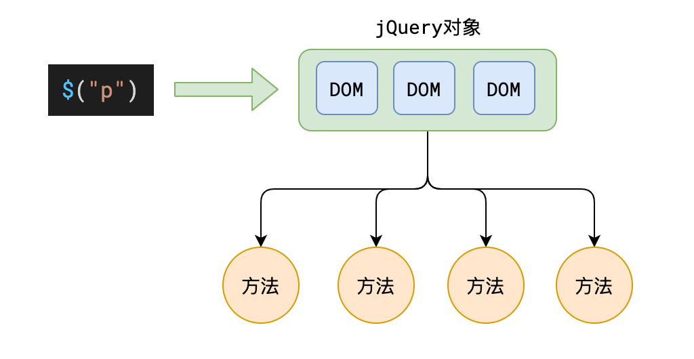
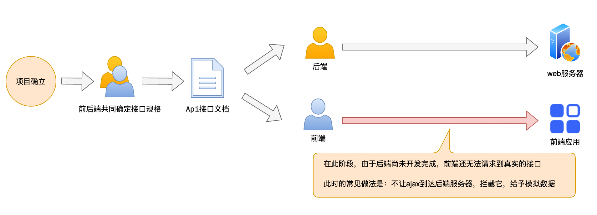
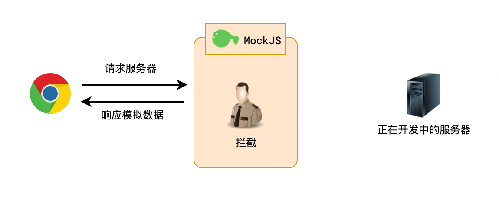
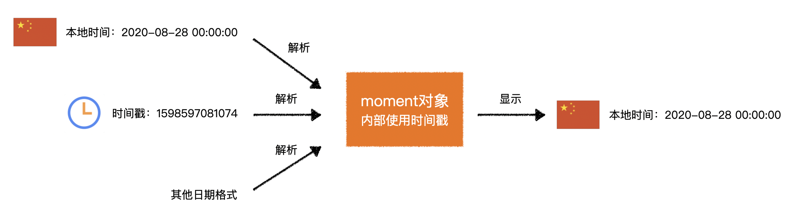

# 第三方库概览

| 名称        | 文档                                                         | 一句话介绍                                                   |
| ----------- | ------------------------------------------------------------ | ------------------------------------------------------------ |
| jQuery      | 官网：https://jquery.com/<br />中文网：https://jquery.cuishifeng.cn/ | 让操作 DOM 变得更容易                                        |
| Lodash      | 官网：https://lodash.com/docs<br />中文网：https://www.lodashjs.com/ | 你能想到的工具函数它都帮你写了                               |
| Animate.css | 官网：https://animate.style/                                 | 常见的 CSS 动画效果都帮你写好了                              |
| Axios       | 官网：https://axios-http.com/zh/                             | 让网络请求变得更简单                                         |
| MockJS      | 官网：http://mockjs.com/                                     | ajax 拦截和模拟数据生成                                      |
| Moment      | 官网：https://momentjs.com/<br />中文网：http://momentjs.cn/ | 让日期处理更容易                                             |
| ECharts     | 官网：https://echarts.apache.org/zh                          | 搞定所有你能想到的图表 📈                                     |
| animejs     | 官网：https://animejs.com/                                   | 简单好用的 JS 动画库                                         |
| editormd    | 官网：https://pandao.github.io/editor.md                     | markdown 编辑器                                              |
| validate    | 官网：http://validatejs.org/                                 | 简单好用的 JS 对象验证库                                     |
| date-fns    | 官网：https://date-fns.org/                                  | 功能和 Moment 几乎相同<br />支持 tree shaking                |
| zepto       | 官网：https://zeptojs.com/                                   | 功能和 jQuery 几乎相同<br />对移动端支持更好<br />包体积更小 |
| nprogress   | 官网：https://github.com/rstacruz/nprogress                  | 简单好用的进度条插件<br />YouTube 就使用的是它               |
| qs          | 官网：https://github.com/ljharb/qs                           | 一个用于解析 url 的小工具                                    |

对于第三方库，除了下载使用，还可以通过 CDN 在线使用

> 科普知识：CDN
>
> CDN 称之为内容分发网络（Content Delivery Network）。
>
> 简单来说，就是提供很多的服务器，用户访问时，自动就近选择服务器给用户提供资源
>
> 

国内使用广泛的免费 CDN 站点：https://www.bootcdn.cn/

# JQuery

> 官网：https://jquery.com/
>
> 中文网：https://jquery.cuishifeng.cn/
>
> CDN：https://cdn.bootcdn.net/ajax/libs/jquery/3.6.0/jquery.min.js

针对 DOM 的操作无非以下几种：

-   获取它
-   创建它
-   监听它
-   改变它

JQuery 可以让上面整个过程更加轻松

## jQuery 函数

jQuery 提供了一个函数，名称为`jQuery`，也可以写作`$`

该函数提供了强大的 DOM 控制能力

通过下面的示例，可以快速理解 jQuery 的核心功能

```js
// 获取类样式为container的所有DOM
const container = $('.container');

// 获取container后面的兄弟元素，元素类样式必须包含list
container.nextAll('.list');

// 删除元素
container.remove();

// 找到所有类样式为list元素的后代li元素，给它们加上类样式item
$('.list li').addClass('item');

// 为所有p元素添加一些style
$('p').css({ color: '#ff0011', background: 'blue' });

// 注册DOMContentLoaded事件
$(function () {
	// ...
});

// 给所有li元素注册点击事件
$('li').click(function () {
	// ...
});

// 创建一个a元素，设置其内容为link，然后将它作为子元素追加到类样式为.list的元素中
$('<a>').text('link').appendTo('.list');
```

下面依次介绍 jQuery 中的核心概念，以便于文档查阅

## jQuery 对象和 DOM 对象

通过 jQuery 得到的元素是一个 jQuery 对象，而不是传统的 DOM

jQuery 对象是一个伪数组，它和 DOM 元素的关系如下



jQuery 对象和 DOM 之间可以互相转换

```js
// jQuery -> DOM
jQuery对象[索引];
jQuery对象.get(索引);

// DOM -> jQuery
$(DOM对象);
```

## 官网文档中的目录

| 目录名                   | 内容                                                                                                                                                        |
| ------------------------ | ----------------------------------------------------------------------------------------------------------------------------------------------------------- |
| 选择器 **$("selector")** | 选择器是一个字符串，用于描述要选中哪些元素                                                                                                                  |
| 筛选                     | 在当前 jQuery 对象的基础上，进一步选中元素                                                                                                                  |
| 文档处理                 | 更改 HTML 文档结构，例如删除元素、清空元素内容、改变元素之间的关系                                                                                          |
| 属性                     | 控制元素属性，例如修改类样式、读取和设置文本框的 value、读取和设置 img 的 src<br />**attr** 、**prop** 分别对应 **dom.getAttribute(name)** 、**dom.属性名** |
| css                      | 控制元素 style 样式，例如改变字体颜色、设置背景、获取元素尺寸、获取和设置滚动位置                                                                           |
| 事件                     | 监听元素的事件，例如监听文档加载完成、监听元素被点击                                                                                                        |
| ajax                     | jQuery 封装了 XHR，使 ajax 访问更加方便<br />这部分功能目前已被其他第三方库全面超越                                                                         |

# Lodash

> 官网：https://lodash.com/docs
>
> 中文网：https://www.lodashjs.com/
>
> CDN：https://cdn.bootcdn.net/ajax/libs/lodash.js/4.17.21/lodash.min.js

Lodash 是一个针对 ES 的古老工具库，它出现在 ES5 之前

Lodash 提供了大量的 API，弥补了 ES 中对象、函数、数组 API 不足的问题

你可以想到的大部分工具函数，都可以在 Lodash 中找到

> 如果你不编写框架或通用库，一般不会用到 Lodash

# Animate.css

> 官网：https://animate.style/
>
> CDN：https://cdn.bootcdn.net/ajax/libs/animate.css/4.1.1/animate.min.css

Animate.css 库提供了大量的动画效果，开发者仅需使用它提供的类名即可

**注意：animate.css 中的动画对行盒无效**

## 基本使用

类名格式为：

```
animate__animated animate__效果名
```

效果名分为以下几个大类，你可以从官网中找到对应的分类，每个分类下有多种效果名可供使用

| 分类               | 含义     |
| ------------------ | -------- |
| Attention seekers  | 强调     |
| Back entrances     | 进入     |
| Back exits         | 退出     |
| Bouncing entrances | 弹跳进入 |
| Bouncing exits     | 弹跳退出 |
| Fading entrances   | 淡入     |
| Fading exits       | 淡出     |
| Flippers           | 翻转     |
| Lightspeed         | 光速     |
| Rotating entrances | 旋转进入 |
| Rotating exits     | 旋转退出 |
| Specials           | 特殊效果 |
| Zooming entrances  | 缩放进入 |
| Zooming exits      | 缩放退出 |
| Sliding entrances  | 滑动进入 |
| Sliding exits      | 滑动退出 |
|                    |          |

## 工具类

Animate.css 还提供了多个工具类，可以控制动画的**延时**、**重复次数**、**速度**

-   延时

    ```css
    /* 默认无延时 */
    animate__delay-1s  /* 延时1秒 */
    animate__delay-2s  /* 延时2秒 */
    animate__delay-3s  /* 延时3秒 */
    animate__delay-4s  /* 延时4秒 */
    animate__delay-5s  /* 延时5秒 */
    ```

-   重复次数

    ```css
    /* 默认重复1次 */
    animate__repeat-2	/* 重复2次 */
    animate__repeat-3	/* 重复3次 */
    animate__infinite	/* 重复无限次 */
    ```

-   速度

    ```css
    /* 默认1秒内完成动画 */
    animate__slow /* 2秒内完成动画 */
    animate__slower	/* 3秒内完成动画 */
    animate__fast	/* 800毫秒内完成动画 */
    animate__faster	/* 500毫秒内完成动画 */
    ```

示例：

```html
<!-- 
使用animate.css
动画名：bounce
速度：快
重复：无限次
延迟：1秒
-->
<h1
	class="
           animate__animated
           animate__bounce
           animate_fast
           animate__infinite
           animate__delay-1s
           "
>
	Hello Animate
</h1>
```

# Axios

> 官网：https://axios-http.com/zh/
>
> CDN：https://cdn.bootcdn.net/ajax/libs/axios/0.21.1/axios.min.js

axios 是一个请求库，在浏览器环境中，它封装了 XHR，提供更加便捷的 API 发送请求

## 基本使用

```js
// 发送 get 请求到 https://study.duyiedu.com/api/herolist，输出响应体的内容
axios.get('https://study.duyiedu.com/api/herolist').then((resp) => {
	console.log(resp.data); // resp.data 为响应体的数据，axios会自动解析JSON格式
});

// 发送 get 请求到 https://study.duyiedu.com/api/user/exists?loginId=abc，输出响应体的内容
axios
	.get('https://study.duyiedu.com/api/user/exists', {
		params: {
			// 这里可以配置 query，axios会自动将其进行Url编码
			loginId: 'abc',
		},
	})
	.then((resp) => {
		console.log(resp.data); // resp.data 为响应体的数据，axios会自动解析JSON格式
	});

// 发送 post 请求到 https://study.duyiedu.com/api/user/reg
// axios 会将第二个参数转换为JSON格式的请求体
axios
	.post('https://study.duyiedu.com/api/user/reg', {
		loginId: 'abc',
		loginPwd: '123123',
		nickname: '棒棒鸡',
	})
	.then((resp) => {
		console.log(resp.data); // resp.data 为响应体的数据，axios会自动解析JSON格式
	});
```

axios 的基本用法为：

```js
axios.get(url地址, [请求配置]);
axios.post(url地址, [请求体对象], [请求配置]);

// 或直接使用 axios 方法，在请求配置中填写请求方法
axios(请求配置);
```

## 实例

axios 允许开发者先创建一个实例，后续通过使用实例进行请求

这样做的好处是可以预先进行某些配置

示例：

```js
// 创建实例
const instance = axios.create({
	baseURL: 'https://study.duyiedu.com/',
});

// 发送 get 请求到 https://study.duyiedu.com/api/herolist，输出响应体的内容
instance.get('/api/herolist').then((resp) => {
	console.log(resp.data); // resp.data 为响应体的数据，axios会自动解析JSON格式
});
```

## 拦截器

有时，我们可能需要对所有的请求或响应做一些统一的处理

比如，在请求时，如果发现本地有 token，需要附带到请求头

又比如，在拿到响应后，我们仅需要取响应体中的 data 属性

再比如，如果发生错误，我们需要做一个弹窗显示

**这些统一的行为就非常适合使用拦截器**

```js
// 添加请求拦截器
axios.interceptors.request.use(function (config) {
	// config 为当前的请求配置
	// 在发送请求之前做些什么
	// 这里，我们添加一个请求头
	const token = localStorage.getItem('token');
	if (token) {
		config.headers.authorization = token;
	}
	return config; // 返回处理后的配置
});

// 添加响应拦截器
axios.interceptors.response.use(
	function (resp) {
		// 2xx 范围内的状态码都会触发该函数。
		// 对响应数据做点什么
		return resp.data.data; // 仅得到响应体中的data属性
	},
	function (error) {
		// 超出 2xx 范围的状态码都会触发该函数。
		// 对响应错误做点什么
		alert(error.message); // 弹出错误消息
	},
);
```

设置好拦截器后，后续的请求和响应都会触发对应的函数

拦截器可以针对 axios 实例进行设置

# MockJS

> 官网：http://mockjs.com/
>
> CDN：https://cdn.bootcdn.net/ajax/libs/Mock.js/1.0.0/mock-min.js

MockJS 有两个作用：

1. 产生模拟数据
2. 拦截 Ajax

下面两张图说明 MockJS 的作用





## 仅模拟数据

```js
Mock.mock(数据模板);
```

数据模板有其特有的书写规范，具体写法见官网

## 拦截+模拟数据

```js
Mock.mock(要拦截的url, 要拦截的请求方法, 数据模板);
```

更多用法见官网

**注意，MockJS 拦截数据的原理是重写了 XHR，因此它仅能拦截 XHR 的数据请求，而无法拦截使用`fetch `发出的请求**

具体的，MockJS 可以拦截：

-   原生`XmlHttpRequest`
-   `jQuery`中的`$.ajax`
-   `axios`

MockJS 可以模拟网络延时，用法为：

```js
Mock.setup({
	timeout: 400, // 网络延时400毫秒
});

Mock.setup({
	timeout: '200-600', // 网络延时200-600毫秒
});
```

# Moment

> 官网：https://momentjs.com/
>
> 中文网：http://momentjs.cn/
>
> CDN：https://cdn.bootcdn.net/ajax/libs/moment.js/2.29.1/moment.min.js
>
> 各种语言包：https://www.bootcdn.cn/moment.js/

Moment 提供了强大的日期处理能力

## 时间基础知识

### 单位

| 单位               | 名称 | 换算                  |
| ------------------ | ---- | --------------------- |
| hour               | 小时 | 1 day = 24 hours      |
| minute             | 分钟 | 1 hour = 60 minutes   |
| second             | 秒   | 1 minute = 60 seconds |
| millisecond （ms） | 毫秒 | 1 second = 1000 ms    |
| nanosecond （ns）  | 纳秒 | 1 ms = 1000 ns        |

### GMT 和 UTC

世界划分为 24 个时区，北京在东 8 区，格林威治在 0 时区。


**GMT**：Greenwish Mean Time 格林威治世界时。太阳时，精确到毫秒。

**UTC**：Universal Time Coodinated 世界协调时。以原子时间为计时标准，精确到纳秒。

> 国际标准中，已全面使用 UTC 时间，而不再使用 GMT 时间

GMT 和 UTC 时间在文本表示格式上是一致的，均为`星期缩写, 日期 月份 年份 时间 GMT`，例如：

```
Thu, 27 Aug 2020 08:01:44 GMT
```

另外，ISO 8601 标准规定，建议使用以下方式表示时间：

```
YYYY-MM-DDTHH:mm:ss.msZ
例如：
2020-08-27T08:01:44.000Z
```

**GMT、UTC、ISO 8601 都表示的是零时区的时间**

### Unix 时间戳

> Unix 时间戳（Unix Timestamp）是 Unix 系统最早提出的概念

它将 UTC 时间 1970 年 1 月 1 日凌晨作为起始时间，到指定时间经过的秒数（毫秒数）

### 程序中的时间处理

**程序对时间的计算、存储务必使用 UTC 时间，或者时间戳**

**在和用户交互时，将 UTC 时间或时间戳转换为更加友好的文本**

思考下面的问题：

1. 用户的生日是本地时间还是 UTC 时间？
2. 如果要比较两个日期的大小，是比较本地时间还是比较 UTC 时间？
3. 如果要显示文章的发布日期，是显示本地时间还是显示 UTC 时间？
4. `北京时间2020-8-28 10:00:00`和`格林威治2020-8-28 02:00:00`，两个时间哪个大，哪个小？
5. `北京的时间戳为0`和`格林威治的时间戳为0`，它们的时间一样吗？
6. 一个中国用户注册时填写的生日是`1970-1-1`，它出生的 UTC 时间是多少？时间戳是多少？

## Moment 的核心用法



Moment 的使用分为两个部分：

1. 获得 Moment 对象
2. 针对 Moment 对象做各种操作

# ECharts

> 官网：https://echarts.apache.org/zh
>
> CDN：https://cdn.bootcdn.net/ajax/libs/echarts/5.1.1/echarts.min.js

具体使用方法见课程讲解
