# 浏览器原理

## 浏览器的进程模型

### 何为进程？

程序运行需要有它自己专属的内存空间, 可以把这块内存空间简单的理解为进程

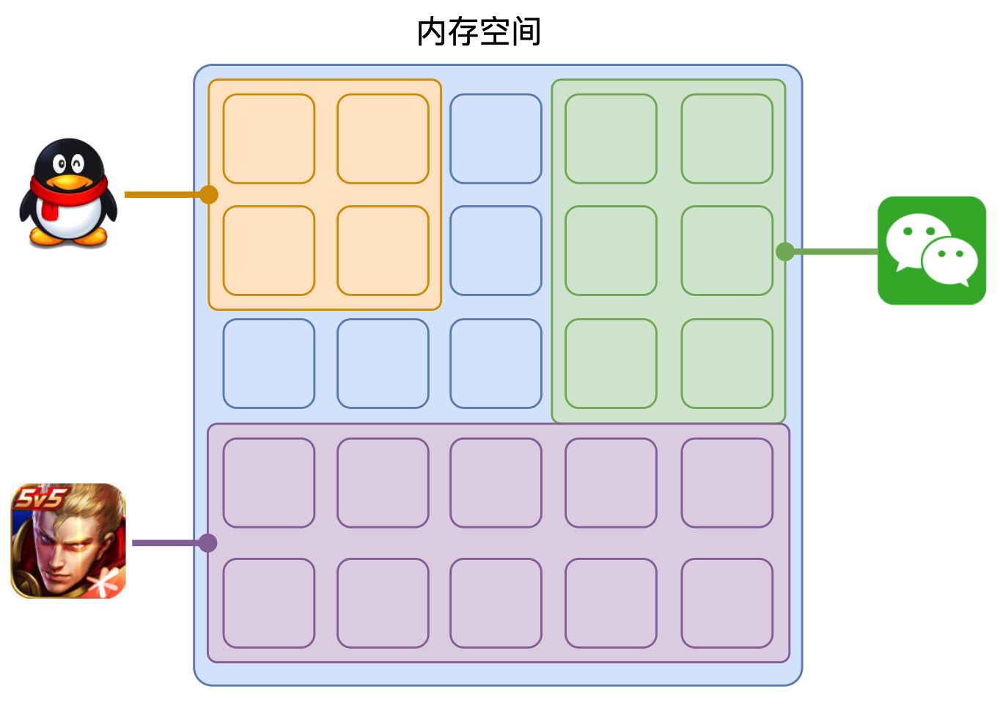

每个应用至少有一个进程, 进程之间相互独立, 即使要通信, 也需要双方同意。

### 何为线程？

有了进程后, 就可以运行程序的代码了。

运行代码的「人」称之为「线程」。

一个进程至少有一个线程, 所以在进程开启后会自动创建一个线程来运行代码, 该线程称之为主线程。

如果程序需要同时执行多块代码, 主线程就会启动更多的线程来执行代码, 所以一个进程中可以包含多个线程。

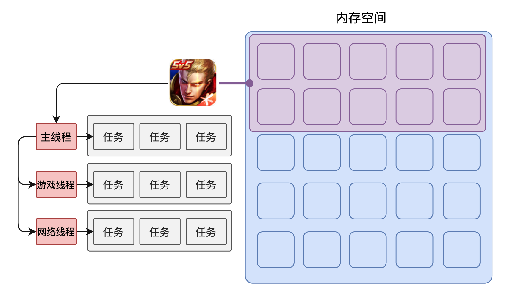

### 浏览器有哪些进程和线程？

**浏览器是一个多进程多线程的应用程序**

浏览器内部工作极其复杂。

为了避免相互影响, 为了减少连环崩溃的几率, 当启动浏览器后, 它会自动启动多个进程。

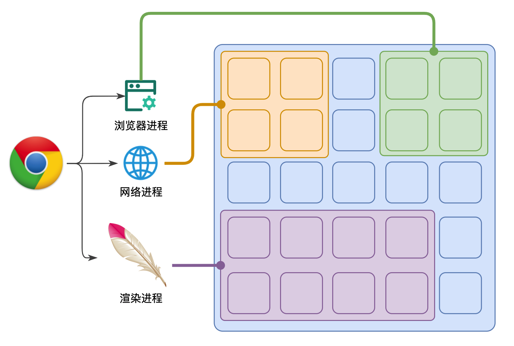

> 可以在浏览器的任务管理器中查看当前的所有进程

其中, 最主要的进程有:

1. **浏览器进程**

    主要负责界面显示(浏览器的界面)、用户交互、子进程管理等。浏览器进程内部会启动多个线程处理不同的任务。

2. **网络进程**

    负责加载网络资源。网络进程内部会启动多个线程来处理不同的网络任务。

3. **GPU 进程**：3D 渲染、合成图层、光栅化

4. **渲染进程**

    渲染进程启动后, 会开启一个**渲染主线程**, 主线程负责执行 HTML、CSS、JS 代码。

    默认情况下, 浏览器会为每个标签页开启一个新的渲染进程, 以保证不同的标签页之间不相互影响。

5. **插件进程**：运行浏览器插件

### 渲染进程中的线程

| 线程 | 职责 |
| --- | --- |
| **渲染主线程（Main Thread）** | 解析 HTML、计算样式、布局、执行 JS、处理事件 |
| **合成线程（Compositor Thread）** | 图层合成，执行 transform/opacity 动画 |
| **光栅化线程（Raster Thread）** | 将图块转为位图 |
| **预解析线程** | 预下载 CSS 和 JS 外部资源 |

---

## 渲染主线程是如何工作的？

渲染主线程是浏览器中最繁忙的线程, 需要它处理的任务包括但不限于:

-   解析 HTML
-   解析 CSS
-   计算样式
-   布局
-   处理图层
-   每秒把页面画 60 次 `FPS`
-   执行全局 JS 代码
-   执行事件处理函数
-   执行计时器的回调函数
-   ......

要处理这么多的任务, 主线程遇到了一个前所未有的难题:如何调度任务？

渲染主线程想出了一个绝妙的主意来处理这个问题: **排队**

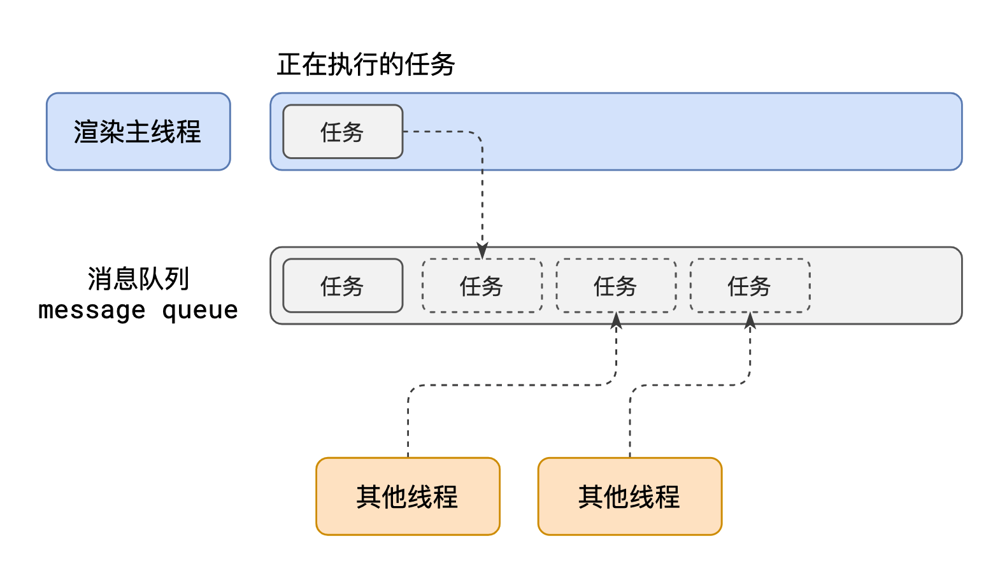

1. 在最开始的时候, 渲染主线程会进入一个无限循环
2. 每一次循环会检查消息队列中是否有任务存在。如果有, 就取出第一个任务执行, 执行完一个后进入下一次循环；如果没有, 则进入休眠状态。
3. 其他所有线程 (包括其他进程的线程) 可以随时向消息队列添加任务。新任务会加到消息队列的末尾。在添加新任务时, 如果主线程是休眠状态, 则会将其唤醒以继续循环拿取任务

**整个过程, 被称之为事件循环（Event Loop）**

---

## 渲染流水线

> 当浏览器的网络线程收到 HTML 文档后，会产生一个渲染任务，并将其传递给渲染主线程的消息队列。
> 在事件循环机制的作用下，渲染主线程取出消息队列中的渲染任务，开启渲染流程。

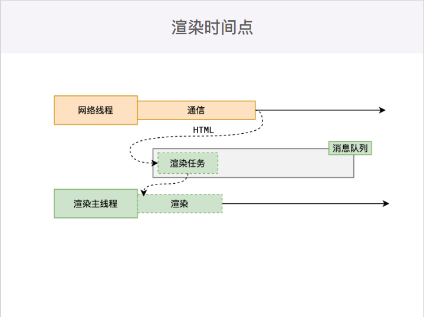

整个渲染流程分为多个阶段，分别是:**HTML 解析、样式计算、布局、分层、绘制、分块、光栅化、画**
每个阶段都有明确的输入输出，上一个阶段的输出会成为下一个阶段的输入。

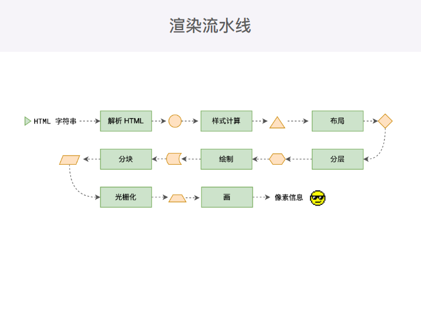

### 1. 解析 HTML（Parse HTML）

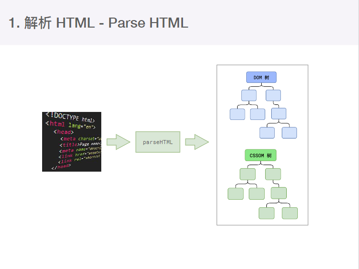

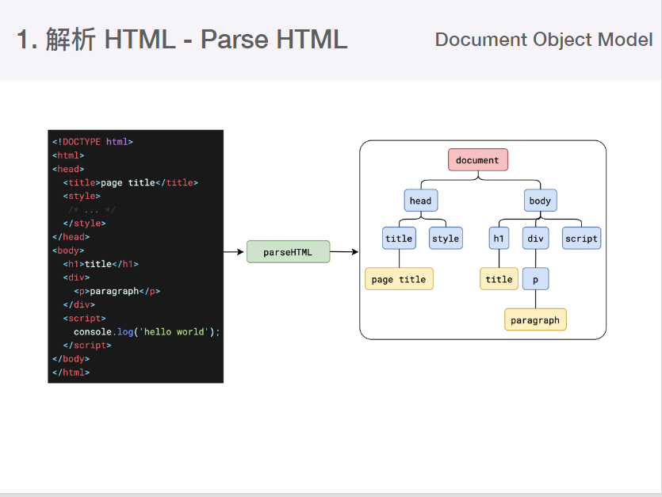

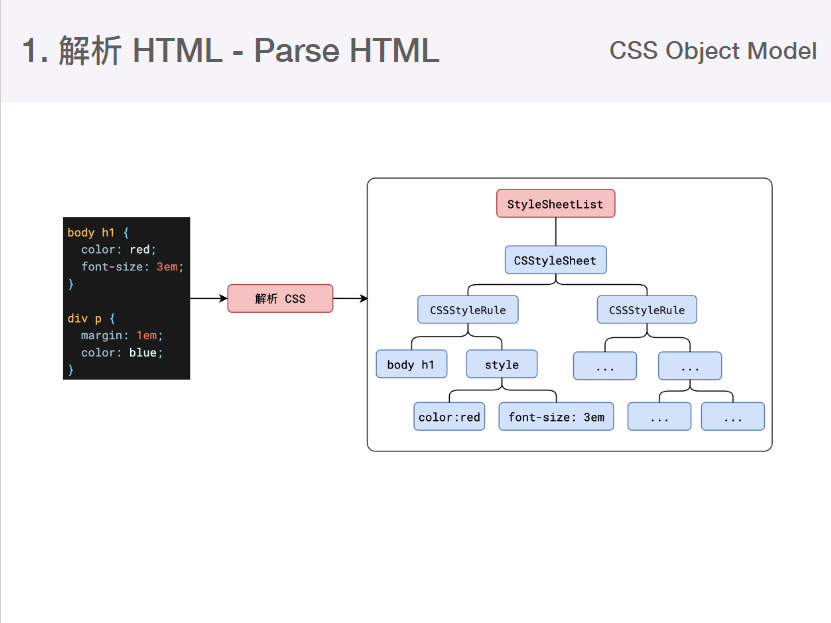

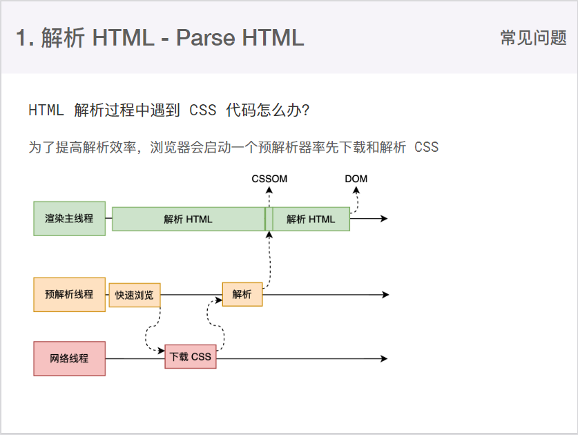

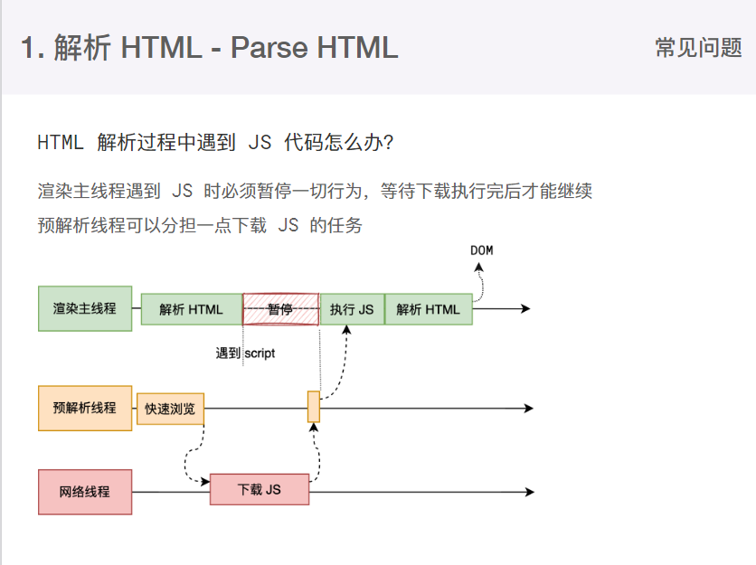

解析过程中遇到 CSS 解析 CSS，遇到 JS 执行 JS。为了提高解析效率，浏览器在开始解析前，会启动一个预解析的线程，率先下载 HTML 中的外部 CSS 文件和外部的 JS 文件。

-   **CSS 不会阻塞 HTML 解析**
    如果主线程解析到 `link` 位置，此时外部的 CSS 文件还没有下载解析好，主线程不会等待，继续解析后续的 HTML。这是因为下载和解析 CSS 的工作是在预解析线程中进行的。

-   **JS 会阻塞 HTML 解析**
    如果主线程解析到 `script` 位置，会停止解析 HTML，转而等待 JS 文件下载好，并将全局代码解析执行完成后，才能继续解析 HTML。这是因为 JS 代码的执行过程可能会修改当前的 DOM 树，所以 DOM 树的生成必须暂停。

**为什么 CSS 放头部，JS 放底部？**

- CSS 放 `<head>`：让浏览器尽早获得样式，避免页面闪烁（FOUC）
- JS 放 `</body>` 前：不阻塞页面渲染，让用户更快看到内容

**script 标签的 async 和 defer：**

| 属性 | 下载 | 执行时机 | 执行顺序 |
| --- | --- | --- | --- |
| 无 | 阻塞 | 立即 | 按文档顺序 |
| `async` | 异步 | 下载完立即 | 不保证 |
| `defer` | 异步 | DOM 解析完后 | 按文档顺序 |

第一步完成后，会得到 DOM 树和 CSSOM 树，浏览器的默认样式、内部样式、外部样式、行内样式均会包含在 CSSOM 树中。

### 2. 样式计算（Recalculate Style）

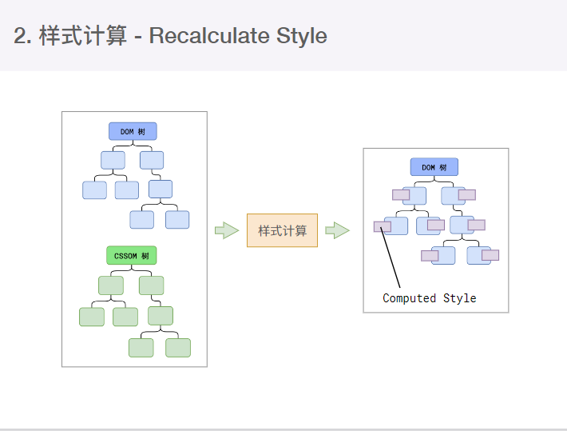

主线程会遍历得到的 DOM 树，依次为树中的每个节点计算出它最终的样式，称之为 Computed Style。

在这一过程中，很多预设值会变成绝对值，比如 `red` 会变成 `rgb(255,0,0)`；相对单位会变成绝对单位，比如 `em` 会变成 `px`

这一步完成后，会得到一棵**带有样式的 DOM 树**。

### 3. 布局（Layout）

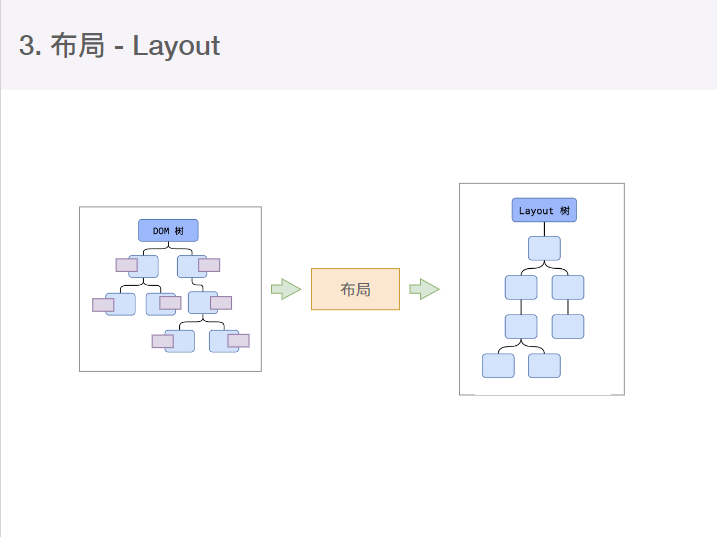

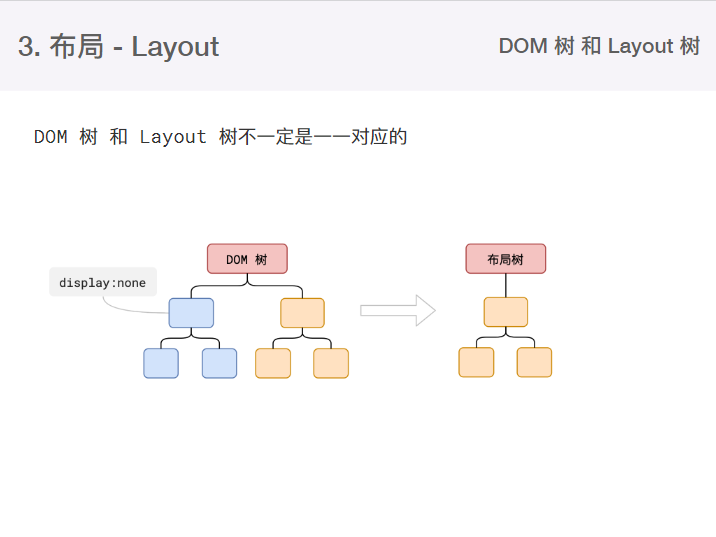

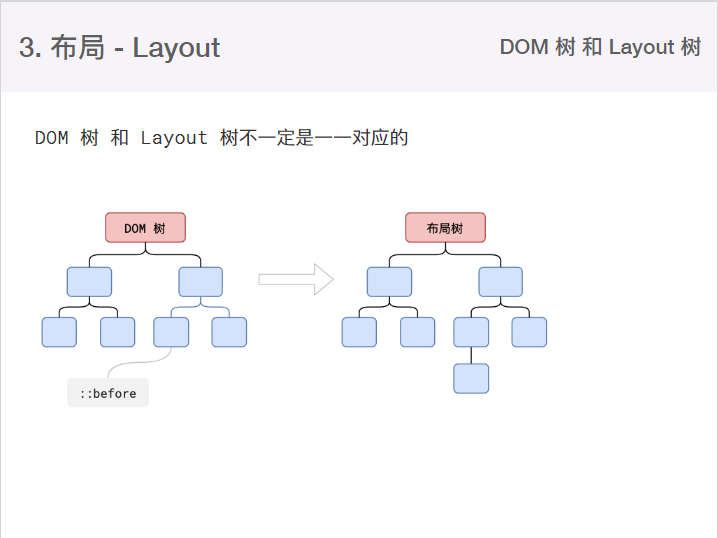

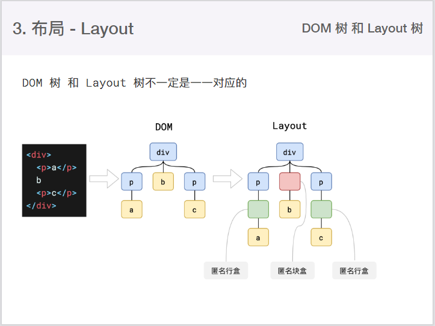

布局阶段会依次遍历 DOM 树的每一个节点，**计算每个节点的几何信息**。例如节点的宽高、相对包含块的位置。

大部分时候，**DOM 树和布局树并非一一对应**：
- `display:none` 的节点没有几何信息，因此不会生成到布局树
- 使用了伪元素选择器，虽然 DOM 树中不存在这些伪元素节点，但它们拥有几何信息，所以会生成到布局树中
- 匿名行盒、匿名块盒等也会导致 DOM 树和布局树无法一一对应

### 4. 分层（Layer）

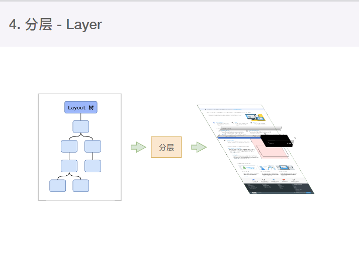

主线程会使用一套复杂的策略对整个布局树进行分层。

分层的好处在于，将来某一个层改变后，仅会对该层进行后续处理，从而提升效率。

滚动条、堆叠上下文、transform、opacity 等样式都会或多或少的影响分层结果，也可以通过 `will-change` 属性更大程度的影响分层结果。

### 5. 绘制（Paint）

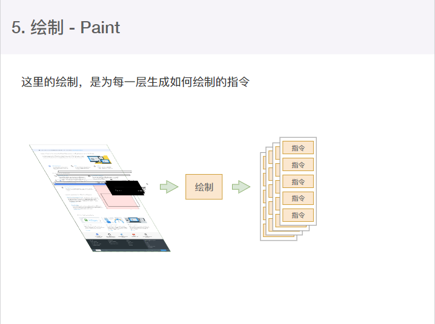

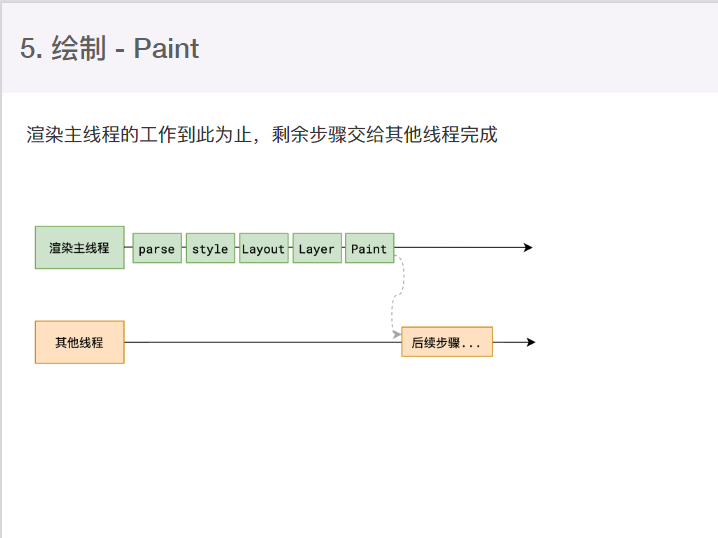

主线程会为每个层单独产生绘制指令集，用于描述这一层的内容该如何画出来。

**主线程的工作到此结束，之后交给合成线程。**

### 6. 分块（Tiling）

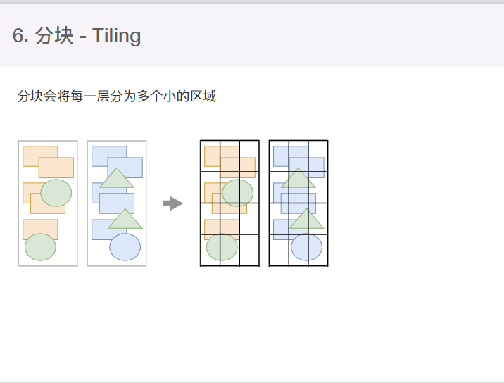

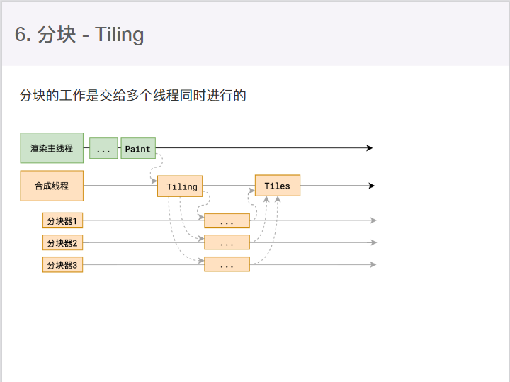

完成绘制后，主线程将每个图层的绘制信息提交给合成线程，剩余工作将由合成线程完成。

合成线程首先对每个图层进行**分块**，将其划分为更多的小区域。它会从线程池中拿取多个线程来完成分块工作。

### 7. 光栅化（Raster）

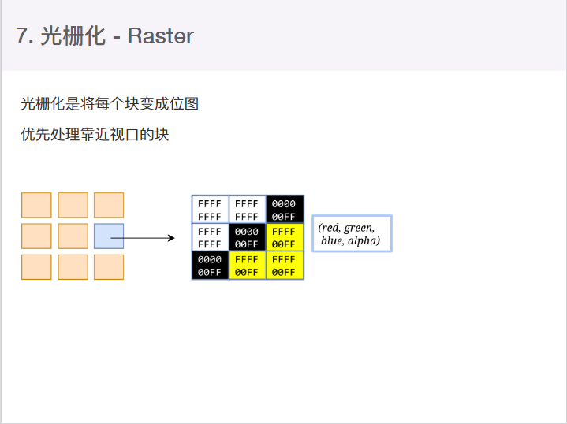

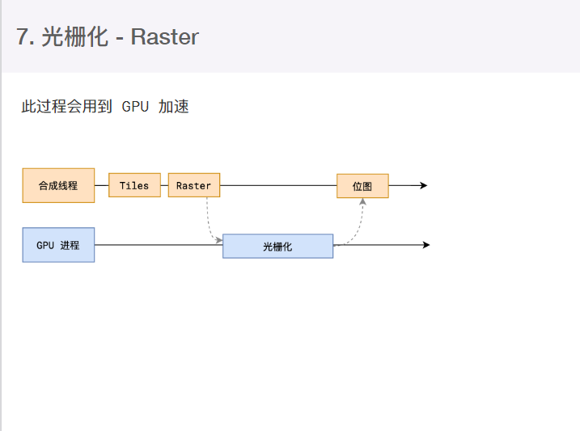

**合成线程会将块信息交给 GPU 进程，以极高的速度完成光栅化**。

GPU 进程会开启多个线程来完成光栅化，并且**优先处理靠近视口区域的块**。

光栅化的结果，就是一块一块的**位图**。

### 8. 画（Draw）

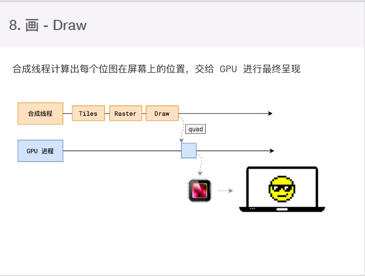

**合成线程拿到每个层、每个块的位图后，生成一个个「指引（quad）」信息**。

指引会标识出每个位图应该画到屏幕的哪个位置，以及会考虑到旋转、缩放等变形。

**变形发生在合成线程，与渲染主线程无关，这就是 transform 效率高的本质原因。**

合成线程会把 quad 提交给 GPU 进程，由 GPU 进程产生系统调用，提交给 GPU 硬件，完成最终的屏幕成像。

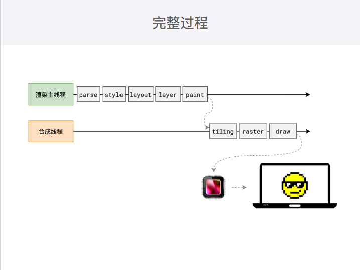

---

## Reflow（回流/重排）

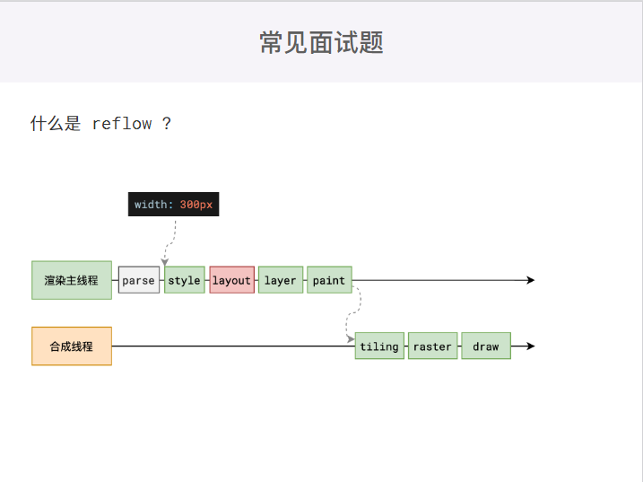

reflow 的本质就是重新计算 layout 树。

当进行了会影响布局树的操作后，需要重新计算布局树，会引发 layout。

为了避免连续的多次操作导致布局树反复计算，浏览器会合并这些操作，当 JS 代码全部完成后再进行统一计算。**所以，改动属性造成的 reflow 是异步完成的。**

**但是，当 JS 获取布局属性时，就可能造成无法获取到最新的布局信息。浏览器在反复权衡下，最终决定获取属性立即 reflow。**

### 触发条件

- DOM 增删可见元素
- 元素几何信息变化（尺寸、位置、内外边距、边框）
- 页面首次渲染
- 浏览器窗口 resize
- **读取布局属性**：`offsetTop`、`offsetLeft`、`offsetWidth`、`scrollTop`、`clientWidth`、`getComputedStyle()` 等

### 浏览器的优化策略

- 浏览器会**合并连续的样式修改**，异步批量执行 reflow
- 但是**读取布局属性会强制触发同步 reflow**（为了返回准确值）

```js
// ❌ 强制同步布局（layout thrashing）
el.style.width = '100px';
console.log(el.offsetWidth); // 读取 → 强制立即 reflow
el.style.height = '200px';
console.log(el.offsetHeight); // 又一次强制 reflow

// ✅ 读写分离
el.style.width = '100px';
el.style.height = '200px';
// 统一读取
requestAnimationFrame(() => {
  console.log(el.offsetWidth);
  console.log(el.offsetHeight);
});
```

### 减少回流

1. 合并样式修改：减少造成回流的次数，尽量将多次操作合并成一个
2. 批量操作 DOM：脱离标准流后操作，完成后再放回
3. 对于复杂的动画，尽量将元素设置为绝对定位，减少对其他元素的影响

---

## Repaint（重绘）

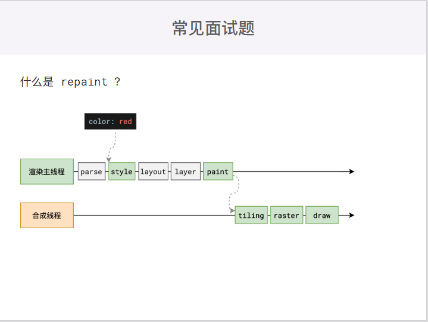

repaint 的本质就是重新根据分层信息计算了绘制指令。

当改动了可见样式后，就需要重新计算，会引发 repaint。

### 触发条件

- 改变元素的**外观属性**（颜色、背景、阴影、圆角等）但不影响几何信息

### 与 Reflow 的关系

- **Reflow 必定引发 Repaint**（元素的布局信息也属于可见样式）
- **Repaint 不一定引发 Reflow**

### 元素隐藏的影响

| 比较 | `display:none` | `visibility:hidden` | `opacity:0` |
| --- | --- | --- | --- |
| DOM 结构 | 否 | 是 | 是 |
| 绑定事件 | 不响应 | 不响应 | 能响应 |
| 回流重绘 | 会引起重排，性能较差 | 会引起重绘，性能较高 | 提升为合成层，不会触发重绘，性能最高 |
| 子代继承 | 不继承 | 继承（子元素可通过设置 `visibility:visible` 显示） | 继承（子元素不能通过 `opacity:1` 取消隐藏） |
| transition | 无效 | 有效 | 有效 |

---

## 为什么 transform 效率高？

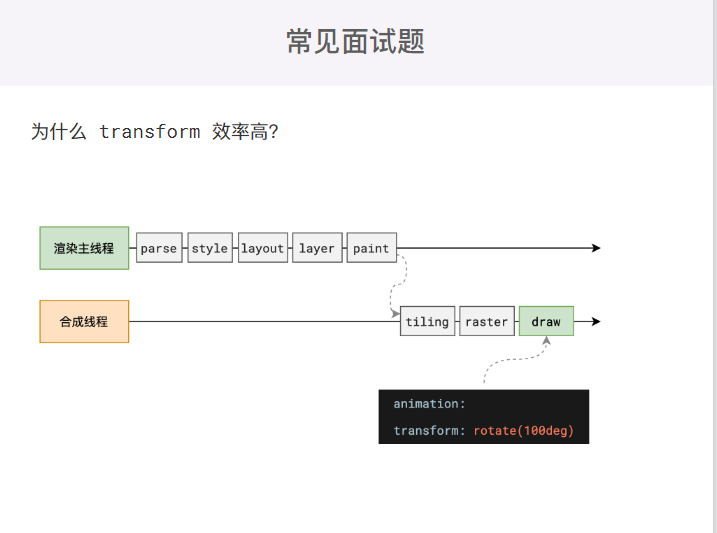

因为 transform 既不会影响布局也不会影响绘制指令，它影响的只是渲染流程的最后一个「draw」阶段。

由于 draw 阶段在**合成线程**中，所以 transform 的变化几乎不会影响渲染主线程。反之，渲染主线程无论如何忙碌，也不会影响 transform 的变化。

```css
/* ✅ 使用 transform 做动画，不触发 reflow/repaint */
.box {
  transition: transform 0.3s;
}
.box:hover {
  transform: translateX(100px);
}

/* ❌ 使用 left 做动画，每帧都触发 reflow */
.box {
  transition: left 0.3s;
}
.box:hover {
  left: 100px;
}
```

---

## 事件循环（Event Loop）

> 事件循环的基本机制（排队、消息队列）已在上方「渲染主线程是如何工作的？」中介绍，本节重点讨论异步、任务队列分类等细节。

### 何为异步？

代码在执行过程中, 会遇到一些无法立即处理的任务, 比如:

- 计时完成后需要执行的任务 —— **`setTimeout`**、**`setInterval`**
- 网络通信完成后需要执行的任务 —— **`XHR`**、**`Fetch`**
- 用户操作后需要执行的任务 —— **`addEventListener`**

如果让渲染主线程等待这些任务的时机达到, 就会导致主线程长期处于「阻塞」的状态, 从而导致浏览器「卡死」

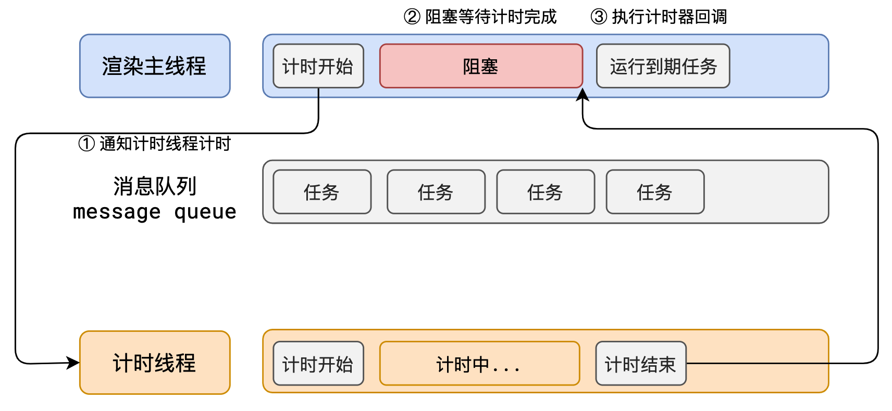

**渲染主线程承担着极其重要的工作, 无论如何都不能阻塞！**

因此, 浏览器选择**异步**来解决这个问题

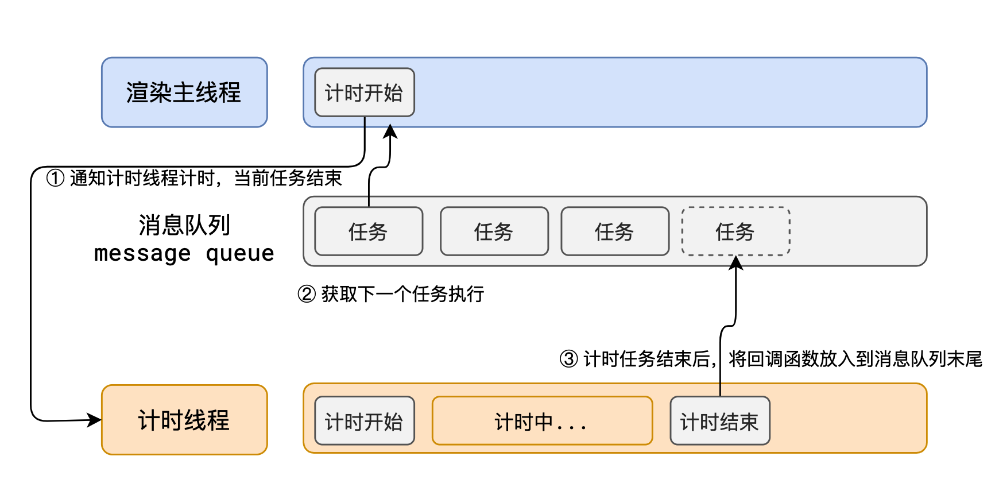

使用异步的方式, **渲染主线程永不阻塞**

> **面试题: 如何理解 JS 的异步？**
>
> JS 是一门单线程的语言, 这是因为它运行在浏览器的渲染主线程中, 而渲染主线程只有一个。渲染主线程承担着诸多的工作, 渲染页面、执行 JS 都在其中运行。
>
> 如果使用同步的方式, 就极有可能导致主线程产生阻塞, 从而导致消息队列中的很多其他任务无法得到执行。这样一来, 一方面会导致繁忙的主线程白白的消耗时间, 另一方面导致页面无法及时更新, 给用户造成卡死现象。
>
> 所以浏览器采用异步的方式来避免。具体做法是当某些任务发生时, 比如计时器、网络、事件监听, 主线程将任务交给其他线程去处理, 自身立即结束任务的执行, 转而执行后续代码。当其他线程完成时, 将事先传递的回调函数包装成任务, 加入到消息队列的末尾排队, 等待主线程调度执行。
>
> 在这种异步模式下, 浏览器永不阻塞, 从而最大限度的保证了单线程的流畅运行。

- **单线程是异步产生的原因**
- **事件循环是异步实现的方式**

### JS 为何会阻碍渲染？

JS 和渲染都在渲染主线程（单线程）上执行。

```html
<h1>Mr.Yuan is awesome!</h1>
<button>change</button>
<script>
  var h1 = document.querySelector('h1');
  var btn = document.querySelector('button');

  // 死循环指定的时间
  function delay(duration) {
    var start = Date.now();
    while (Date.now() - start < duration) {}
  }

  btn.onclick = function () {
    h1.textContent = '袁老师很帅！';
    delay(3000);
  };
</script>
```

点击按钮后会发生什么？**先延时 3s, 然后文本才改变。**

代码明明是先改变的文本再进入死循环, 为何页面 3s 后才会改变？

因为执行完 `h1.textContent = "袁老师很帅"` 后, 浏览器会生成一个**渲染任务**加入消息队列, 但主线程还在执行 `delay(3000)`, 必须等 3s 后主线程空闲才能执行渲染任务。

### 任务队列分类

任务没有优先级, 在消息队列中先进先出, 但**消息队列是有优先级**的。

根据 W3C 的最新解释:

- 每个任务都有一个任务类型, 同一个类型的任务必须在一个队列, 不同类型的任务可以分属于不同的队列。在一次事件循环中, 浏览器可以根据实际情况从不同的队列中取出任务执行。
- [浏览器必须准备好一个微队列, 微队列中的任务优先所有其他任务执行](https://html.spec.whatwg.org/multipage/webappapis.html#perform-a-microtask-checkpoint)

> 随着浏览器的复杂度急剧提升, W3C 不再使用宏队列的说法

在目前 Chrome 的实现中, 至少包含了下面的队列:

| 队列 | 优先级 | 产生来源 |
| --- | --- | --- |
| **微队列（Microtask Queue）** | 最高 | `Promise.then/catch/finally`、`MutationObserver`、`queueMicrotask()` |
| **交互队列（Interaction Queue）** | 高 | 用户操作事件（click、input、scroll 等） |
| **延时队列（Timer Queue）** | 中 | `setTimeout`、`setInterval` |

添加任务到微队列的主要方式:

- **Promise**（`.then`、`.catch`、`.finally`）
- **MutationObserver** — 监听 DOM 变动, 变动时触发回调
- **queueMicrotask()** — 直接向微队列添加任务
- `process.nextTick(cb)` (Node 环境)

```js
// 立即把一个函数添加到微队列
Promise.resolve().then(函数);
```

> **面试题: 阐述一下 JS 的事件循环**
>
> 事件循环（event loop）又叫做消息循环（message loop）, 是浏览器渲染主线程的工作方式。
>
> 在 Chrome 的源码中, 它开启一个不会结束的 for 循环, 每次循环从消息队列中取出第一个任务执行, 而其他线程只需要在合适的时候将任务加入到队列末尾即可。
>
> 过去把消息队列简单分为宏队列和微队列, 这种说法目前已无法满足复杂的浏览器环境, 取而代之的是一种更加灵活多变的处理方式。
>
> 根据 W3C 官方的解释, 每个任务有不同的类型, 同类型的任务必须在同一个队列, 不同的任务可以属于不同的队列。不同任务队列有不同的优先级, 在一次事件循环中, 由浏览器自行决定取哪一个队列的任务。但浏览器必须有一个微队列, 微队列的任务一定具有最高的优先级, 必须优先调度执行。

### 计时器能做到精确计时吗？

**不能**, 因为:

1. 计算机硬件没有原子钟, 无法做到精确计时
2. 操作系统的计时函数本身就有少量偏差, 由于 JS 的计时器最终调用的是操作系统的函数, 也就携带了这些偏差
3. 按照 W3C 的标准, 浏览器实现计时器时, 如果嵌套层级超过 5 层, 则会带有 4 毫秒的最少时间, 这样在计时时间少于 4 毫秒时又带来了偏差
4. **受事件循环的影响, 计时器的回调函数只能在主线程空闲时运行, 因此又带来了偏差**

### requestAnimationFrame

- 在浏览器**下一次重绘之前**执行
- 执行频率与屏幕刷新率一致（通常 60fps ≈ 16.7ms/帧）
- 适合做动画, 比 `setTimeout` 更精确流畅

```js
function animate() {
  element.style.transform = `translateX(${x}px)`;
  x += 1;
  if (x < 300) {
    requestAnimationFrame(animate);
  }
}
requestAnimationFrame(animate);
```

### 代码输出题

```js
// 例1
setTimeout(() => {
  console.log(1); // 延时队列
}, 0);
Promise.resolve().then(function () {
  console.log(2); // 微队列
});
console.log(3);
// 输出: 3 2 1
```

```js
// 例2
function a() {
  console.log(1);
  Promise.resolve().then(function () {
    console.log(2);
  });
}
setTimeout(() => {
  console.log(3);
  Promise.resolve().then(a);
}, 0);
Promise.resolve().then(function () {
  console.log(4);
});
console.log(5);
// 输出: 5 4 3 1 2
```

```js
// 例3
function a() {
  console.log(1);
  Promise.resolve().then(function () {
    console.log(2);
  });
}
setTimeout(() => {
  console.log(3);
}, 0);
Promise.resolve().then(a);
console.log(5);
// 输出: 5 1 2 3
```

```js
// 例4
console.log(1);
setTimeout(() => {
  console.log(2);
}, 0);
new Promise((resolve, reject) => {
  console.log(3);
  reject();
  console.log(4);
})
  .then(
    () => { console.log(5); },
    () => { console.log(6); },
  )
  .finally(() => {
    console.log(7);
  });
console.log(8);
// 输出: 1 3 4 8 6 7 2
```

---

## V8 引擎

### 执行 JS 的流程

```
JS 源码 → 词法分析 → 语法分析 → AST → 解释器(Ignition) → 字节码
                                                           ↓
                                              热点代码 → 编译器(TurboFan) → 机器码
```

1. **Parser（解析器）**：将 JS 源码解析成 **AST**（抽象语法树）
2. **Ignition（解释器）**：将 AST 编译成**字节码**并逐行执行
3. **TurboFan（编译器）**：对**热点代码**（多次执行的函数）进行优化编译，生成机器码
4. **去优化（Deoptimization）**：如果优化假设不成立，回退到字节码执行

### 垃圾回收

**新生代（Scavenge）**：
- 短生命周期的小对象
- 使用**复制算法**：将活跃对象从 From 空间复制到 To 空间，然后交换

**老生代（Mark-Sweep / Mark-Compact）**：
- 长生命周期的大对象
- **标记清除**：标记所有可达对象，清除未标记对象
- **标记整理**：在标记清除基础上，将存活对象向内存一端移动，解决内存碎片

**引用计数的问题：** 循环引用导致无法回收

```js
// 循环引用
function problem() {
  let a = {};
  let b = {};
  a.ref = b;
  b.ref = a;
  // a 和 b 互相引用，引用计数永远不为 0
  // 标记清除算法可以正确处理：从根出发不可达，会被回收
}
```

---

## Web Workers

JS 是单线程的，耗时计算会阻塞 UI 渲染。Web Workers 允许在**后台线程**中运行脚本，不影响主线程。

### 基本用法

```js
// main.js
const worker = new Worker('worker.js');
worker.postMessage({ data: [1, 2, 3, 4, 5] });
worker.onmessage = (e) => {
  console.log('计算结果:', e.data);
};
worker.onerror = (e) => {
  console.error('Worker 出错:', e.message);
};

// worker.js
self.onmessage = (e) => {
  const result = e.data.data.reduce((a, b) => a + b, 0);
  self.postMessage(result);
};
```

### 限制

- **无法操作 DOM**（没有 `window`、`document`）
- 无法使用 `alert()`、`confirm()` 等
- 与主线程通过 `postMessage` / `onmessage` 通信（数据是**拷贝传递**，非共享）
- 可使用 `Transferable Objects` 实现零拷贝传输（如 `ArrayBuffer`）
- 同源限制：Worker 脚本必须与主页面同源

### Worker 类型

| 类型 | 说明 |
| --- | --- |
| Dedicated Worker | 专用 Worker，只能被创建它的脚本使用 |
| Shared Worker | 共享 Worker，多个页面/脚本共享同一个实例 |
| Service Worker | 独立于页面的代理层，用于离线缓存、推送通知等 |

---

## 跨标签页通信

| 方式 | 同源限制 | 实时性 | 说明 |
| --- | --- | --- | --- |
| `BroadcastChannel` | 同源 | 实时 | 专为同源跨 Tab 通信设计 |
| `localStorage` + `storage` 事件 | 同源 | 近实时 | 一个 Tab 修改，其他 Tab 收到 `storage` 事件 |
| `SharedWorker` | 同源 | 实时 | 多个 Tab 共享一个 Worker |
| `postMessage` | 跨域可用 | 实时 | 需要 `window.open` 或 `iframe` 的引用 |
| `Service Worker` | 同源 | 实时 | 通过 `clients.matchAll()` 广播 |

```js
// BroadcastChannel 示例
const channel = new BroadcastChannel('my_channel');

// 发送
channel.postMessage({ type: 'update', data: '...' });

// 接收
channel.onmessage = (e) => {
  console.log(e.data);
};
```

---

## 浏览器缓存

### 强缓存

浏览器直接使用本地缓存，**不发请求**

| 响应头 | 说明 |
| --- | --- |
| `Expires` | 过期时间（绝对时间，HTTP/1.0），受本地时钟影响 |
| `Cache-Control: max-age=3600` | 缓存有效期（相对时间，HTTP/1.1），**优先级高于 Expires** |

`Cache-Control` 常见值：
- `max-age=N`：缓存 N 秒
- `no-cache`：不使用强缓存，每次都协商
- `no-store`：完全不缓存
- `public`：可被代理缓存
- `private`：仅浏览器可缓存

### 协商缓存

强缓存失效后，浏览器发送请求到服务器验证资源是否变化

| 请求头 | 响应头 | 说明 |
| --- | --- | --- |
| `If-Modified-Since` | `Last-Modified` | 基于文件**修改时间**，精度为秒 |
| `If-None-Match` | `ETag` | 基于文件**内容哈希**，精度更高，**优先级高** |

**流程：**
1. 浏览器请求带上 `If-None-Match`（ETag 值）或 `If-Modified-Since`
2. 服务器比对：
   - 未变化 → 返回 **304 Not Modified**（不返回响应体，使用缓存）
   - 已变化 → 返回 **200** + 新资源

### 缓存决策流程

```
请求资源
  ├── 有强缓存且未过期 → 直接使用缓存（200 from cache）
  └── 强缓存过期
       ├── 有协商缓存标识 → 发请求验证
       │    ├── 资源未变 → 304，使用缓存
       │    └── 资源已变 → 200，返回新资源
       └── 无缓存标识 → 200，返回新资源
```

---

## 同源策略与跨域

### 同源策略

**协议 + 域名 + 端口** 三者完全相同才算同源

| URL | 与 `http://example.com` 是否同源 | 原因 |
| --- | --- | --- |
| `http://example.com/page` | 同源 | |
| `https://example.com` | 不同源 | 协议不同 |
| `http://www.example.com` | 不同源 | 域名不同 |
| `http://example.com:8080` | 不同源 | 端口不同 |

### CORS（跨域资源共享）

> 最主流的跨域方案，由**服务端设置**响应头

**简单请求**（满足以下所有条件）：
- 方法为 GET、HEAD、POST
- Content-Type 为 `text/plain`、`multipart/form-data`、`application/x-www-form-urlencoded`
- 无自定义请求头

```
浏览器直接发送请求，附带 Origin 头
服务器响应：Access-Control-Allow-Origin: *
```

**预检请求（Preflight）**：
- 不满足简单请求条件时，浏览器先发一个 OPTIONS 请求

```
OPTIONS /api/data
Access-Control-Request-Method: PUT
Access-Control-Request-Headers: Content-Type, X-Token

→ 服务器响应
Access-Control-Allow-Origin: http://example.com
Access-Control-Allow-Methods: GET, POST, PUT
Access-Control-Allow-Headers: Content-Type, X-Token
Access-Control-Max-Age: 86400  // 预检结果缓存时间
```

### 其他跨域方案

| 方案 | 原理 | 限制 |
| --- | --- | --- |
| JSONP | 利用 `<script>` 不受同源策略限制 | 仅支持 GET |
| 代理服务器 | 同源服务器→目标服务器 | 需要服务端配合 |
| `postMessage` | `window.postMessage()` 跨窗口通信 | 需要对方窗口引用 |
| WebSocket | 不受同源策略限制 | 需要服务端支持 |

```js
// JSONP 实现原理
function jsonp(url, callback) {
  const callbackName = 'jsonp_' + Date.now();
  window[callbackName] = (data) => {
    callback(data);
    delete window[callbackName];
    document.head.removeChild(script);
  };
  const script = document.createElement('script');
  script.src = `${url}?callback=${callbackName}`;
  document.head.appendChild(script);
}
```

---

## 从输入 URL 到页面渲染的全过程

### 1. URL 解析

浏览器解析输入内容, 判断是 URL 还是搜索关键词。如果是 URL, 补全协议（默认 `https://`）, 提取协议、主机、端口、路径、查询参数等。

### 2. DNS 解析（域名 → IP 地址）

```
浏览器 DNS 缓存 → 操作系统缓存 → hosts 文件 → 本地 DNS 服务器
  → 根 DNS 服务器 → 顶级域 DNS（.com） → 权威 DNS 服务器
```

- DNS 使用 **UDP** 协议（默认端口 53）
- DNS 预解析：`<link rel="dns-prefetch" href="//api.example.com">`
- 浏览器会缓存 DNS 结果, 一般 TTL 为 60s 左右

### 3. TCP 三次握手

建立可靠的双向通信连接:

```
客户端                    服务器
  |                         |
  | ---- SYN (seq=x) ----> |   ① 客户端发送 SYN, 进入 SYN_SENT 状态
  |                         |
  | <-- SYN+ACK (seq=y,     |   ② 服务器收到, 回复 SYN+ACK,
  |     ack=x+1) ---------- |      进入 SYN_RCVD 状态
  |                         |
  | ---- ACK (ack=y+1) ---> |   ③ 客户端回复 ACK, 连接建立
  |                         |      双方进入 ESTABLISHED 状态
```

**为什么需要三次？** 防止已失效的连接请求报文突然到达服务器, 造成资源浪费。两次握手无法确认客户端的接收能力。

### 4. TLS 握手（HTTPS）

在 TCP 连接之上建立安全通道:

```
客户端                         服务器
  |                              |
  | ---- ClientHello ----------> |   ① 支持的 TLS 版本、加密套件、随机数 A
  | <--- ServerHello ----------- |   ② 选择的加密套件、随机数 B、数字证书
  |                              |
  |  验证证书 → 提取公钥          |
  | ---- 预主密钥(公钥加密) ----> |   ③ 客户端生成预主密钥, 用服务器公钥加密发送
  |                              |
  |  双方用 随机数A + 随机数B     |
  |  + 预主密钥 → 生成会话密钥    |
  |                              |
  | ---- Finished(加密) -------> |   ④ 后续通信使用对称加密（会话密钥）
  | <--- Finished(加密) -------- |
```

> TLS 1.3 优化为 **1-RTT** 握手, 甚至支持 **0-RTT** 恢复

### 5. 发送 HTTP 请求 & 接收响应

- 浏览器构造 HTTP 请求报文（请求行、请求头、请求体）
- 服务器处理请求, 返回 HTTP 响应（状态码、响应头、响应体）
- 如果响应状态码为 **301/302**, 浏览器跟随 `Location` 头重定向, 重新发起请求

### 6. 浏览器解析渲染

> 详见上方「渲染流水线」章节, 这里概括关键步骤

```
HTML → DOM 树 ─┐
               ├→ 样式计算 → 布局树 → 分层 → 绘制 → 分块 → 光栅化 → 画
CSS → CSSOM ──┘
```

#### 脚本加载顺序: defer vs async

JS 脚本的加载方式直接影响解析和渲染:

```html
<!-- 默认: 同步阻塞 -->
<script src="app.js"></script>

<!-- defer: 异步加载, DOM 解析完再按顺序执行 -->
<script defer src="app.js"></script>

<!-- async: 异步加载, 下载完立即执行(顺序不保证) -->
<script async src="app.js"></script>
```

| 加载方式 | HTML 解析 | 下载时机 | 执行时机 | 执行顺序 | 适用场景 |
| --- | --- | --- | --- | --- | --- |
| `<script>` | **阻塞** | 遇到即下载 | 下载完立即执行 | 按文档顺序 | 需要立即执行的脚本 |
| `defer` | **不阻塞** | 遇到即异步下载 | **DOMContentLoaded 之前**, DOM 解析完毕后 | **按文档顺序** | 依赖 DOM 的脚本, 有依赖关系的多个脚本 |
| `async` | **不阻塞** | 遇到即异步下载 | **下载完立即执行**(会暂停解析) | **不保证顺序** | 独立脚本(统计、广告) |
| 模块 `type="module"` | **不阻塞** | 类似 defer | DOMContentLoaded 之前 | 按依赖关系 | ES Module 脚本 |

```
普通 script:
HTML解析 ──■■■■ 暂停 ■■■■──(下载)──(执行)── 继续解析 ──

defer:
HTML解析 ────────────────────────────── DOM完成后执行
               └ 异步下载 ┘

async:
HTML解析 ──────■■ 暂停 ■■────────────── 继续解析
               └ 异步下载(执行) ┘
```

#### CSS 对解析的影响

- CSS **不阻塞** DOM 解析, 但**阻塞渲染**（需要 CSSOM 才能构建渲染树）
- CSS **阻塞其后 JS 的执行**（因为 JS 可能需要获取样式信息）
- 最佳实践: CSS 放 `<head>` 中尽早加载, JS 放 `</body>` 前或使用 `defer`

#### 预加载与预连接

```html
<!-- 预加载: 提前下载关键资源 -->
<link rel="preload" href="critical.css" as="style">
<link rel="preload" href="main.js" as="script">
<link rel="preload" href="font.woff2" as="font" crossorigin>

<!-- 预连接: 提前建立 TCP + TLS 连接 -->
<link rel="preconnect" href="https://api.example.com">

<!-- 预获取: 空闲时加载下一页可能需要的资源 -->
<link rel="prefetch" href="next-page.js">
```

### 7. TCP 四次挥手

数据传输完成后断开连接:

```
客户端                    服务器
  |                         |
  | ---- FIN (seq=u) -----> |   ① 客户端请求关闭, 进入 FIN_WAIT_1
  |                         |
  | <--- ACK (ack=u+1) ---- |   ② 服务器确认, 进入 CLOSE_WAIT
  |                         |      (可能还有数据要发送)
  |                         |
  | <--- FIN (seq=w) ------ |   ③ 服务器数据发完, 请求关闭
  |                         |
  | ---- ACK (ack=w+1) ---> |   ④ 客户端确认, 进入 TIME_WAIT
  |                         |      等待 2MSL 后关闭
```

**为什么需要四次？** TCP 是全双工通信, 每个方向需要单独关闭。服务器收到 FIN 后可能还有未发完的数据, 所以将 ACK 和 FIN 分两步发送。

**为什么客户端要等 2MSL？** 确保最后一个 ACK 能到达服务器。如果服务器没收到, 会重发 FIN, 客户端可以重新发送 ACK。

### 面试回答要点

完整回答可以按**网络→解析→渲染**三个阶段展开:

1. **网络阶段**: URL 解析 → DNS 查询 → TCP 三次握手 → TLS 握手 → HTTP 请求/响应
2. **解析阶段**: HTML 解析构建 DOM → CSS 解析构建 CSSOM → 遇到 script 根据 defer/async 策略处理
3. **渲染阶段**: 样式计算 → 布局 → 分层 → 绘制 → 分块 → 光栅化 → 合成显示

---

## DOMContentLoaded vs load

| 事件 | 触发时机 | 监听对象 |
| --- | --- | --- |
| `DOMContentLoaded` | HTML **解析完成**, DOM 树构建完毕 | `document` |
| `load` | 所有资源（图片、CSS、iframe 等）**全部加载完成** | `window` |
| `beforeunload` | 用户即将离开页面（可用于提示未保存内容） | `window` |
| `unload` | 页面正在卸载（可用于发送统计数据） | `window` |

```js
document.addEventListener('DOMContentLoaded', () => {
  console.log('DOM 已就绪');
});

window.addEventListener('load', () => {
  console.log('所有资源已加载');
});
```

### DOMContentLoaded 与脚本/样式的关系

- **普通 `<script>`**: 会阻塞 HTML 解析, 所以 DOMContentLoaded 必须等所有同步脚本执行完
- **`defer` 脚本**: DOMContentLoaded 会等 defer 脚本执行完毕后再触发
- **`async` 脚本**: **不保证**在 DOMContentLoaded 之前或之后执行
- **CSS**: DOMContentLoaded 本身不等待 CSS, 但如果 CSS 后面有 `<script>`, 由于 CSS 阻塞 JS 执行, 间接延迟 DOMContentLoaded

```
HTML 解析完毕 → defer 脚本按序执行 → DOMContentLoaded 事件
                                          ↓
                    所有资源加载完成 → load 事件
```

---

## Service Worker

Service Worker 是一种运行在浏览器后台的**独立线程**，充当网页与网络之间的代理。

### 特点

- 独立于页面，**页面关闭后仍可运行**
- **必须 HTTPS**（localhost 除外）
- 不能直接操作 DOM
- 基于 Promise 的异步 API
- 可拦截和处理网络请求

### 生命周期

```
注册 → 安装(install) → 等待(waiting) → 激活(activate) → 控制页面
                ↓                               ↓
          缓存静态资源                     清理旧缓存
```

### 基本用法

```js
// 注册（main.js）
if ('serviceWorker' in navigator) {
  navigator.serviceWorker.register('/sw.js').then((reg) => {
    console.log('SW 注册成功, scope:', reg.scope);
  });
}

// sw.js
const CACHE_NAME = 'v1';
const ASSETS = ['/', '/index.html', '/style.css', '/app.js'];

// 安装阶段：缓存资源
self.addEventListener('install', (e) => {
  e.waitUntil(
    caches.open(CACHE_NAME).then((cache) => cache.addAll(ASSETS))
  );
});

// 激活阶段：清理旧缓存
self.addEventListener('activate', (e) => {
  e.waitUntil(
    caches.keys().then((keys) =>
      Promise.all(keys.filter((k) => k !== CACHE_NAME).map((k) => caches.delete(k)))
    )
  );
});

// 拦截请求：缓存优先策略
self.addEventListener('fetch', (e) => {
  e.respondWith(
    caches.match(e.request).then((cached) => cached || fetch(e.request))
  );
});
```

### 常见缓存策略

| 策略 | 说明 | 适用场景 |
| --- | --- | --- |
| Cache First | 缓存优先，无缓存再请求网络 | 静态资源（CSS/JS/图片） |
| Network First | 网络优先，失败再用缓存 | API 请求、频繁更新的页面 |
| Stale While Revalidate | 先返回缓存，同时后台更新 | 对实时性要求不高的资源 |
| Cache Only | 只用缓存 | 离线应用 |
| Network Only | 只用网络 | 不需要缓存的请求 |

---

## 性能优化相关 API

### Performance API

```js
// 页面性能指标
const timing = performance.getEntriesByType('navigation')[0];
console.log('DNS 查询:', timing.domainLookupEnd - timing.domainLookupStart, 'ms');
console.log('TCP 连接:', timing.connectEnd - timing.connectStart, 'ms');
console.log('首字节时间(TTFB):', timing.responseStart - timing.requestStart, 'ms');
console.log('DOM 解析:', timing.domContentLoadedEventEnd - timing.responseEnd, 'ms');
console.log('页面完全加载:', timing.loadEventEnd - timing.navigationStart, 'ms');
```

### 核心 Web 指标（Core Web Vitals）

| 指标 | 全称 | 含义 | 目标 |
| --- | --- | --- | --- |
| **LCP** | Largest Contentful Paint | 最大内容绘制时间 | < 2.5s |
| **FID** | First Input Delay | 首次输入延迟 | < 100ms |
| **CLS** | Cumulative Layout Shift | 累计布局偏移 | < 0.1 |
| FCP | First Contentful Paint | 首次内容绘制时间 | < 1.8s |
| TTFB | Time to First Byte | 首字节时间 | < 800ms |

### requestIdleCallback

利用浏览器空闲时间执行低优先级任务，**不阻塞关键渲染**。

```js
requestIdleCallback((deadline) => {
  while (deadline.timeRemaining() > 0) {
    // 执行低优先级任务（如日志上报、预加载）
  }
}, { timeout: 2000 }); // 超时后强制执行
```

---
