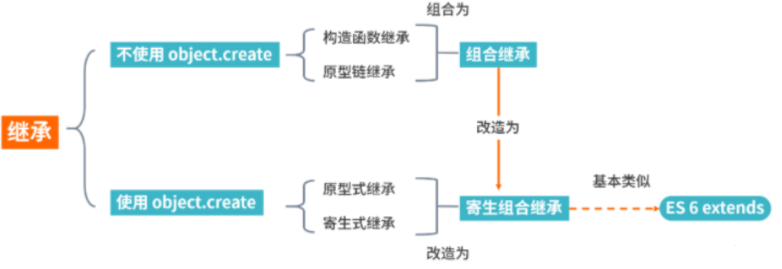

<!-- [toc] -->

---

# JavaScript 面试题

> 高频 JS 面试题精选，涵盖数据类型、作用域、原型链、异步编程等核心知识点。
> 手写代码题 → 见 [手写题.md](../手写题.md)

---

## 1. JS 数据类型有哪些？如何判断？

**8 种数据类型：**
- 基本类型：`string`、`number`、`boolean`、`undefined`、`null`、`symbol`、`bigint`
- 引用类型：`object`（包含 Array、Function、Date、RegExp 等）

**判断方法：**

| 方法 | 适用场景 | 注意 |
| --- | --- | --- |
| `typeof` | 基本类型 | `typeof null === 'object'`（历史 bug） |
| `instanceof` | 判断原型链 | 不能跨 iframe |
| `Object.prototype.toString.call()` | **万能方法** | 返回 `[object Type]` |
| `Array.isArray()` | 判断数组 | 推荐 |

```js
// typeof —— 判断基本类型（null 除外）
typeof 123           // 'number'
typeof 'abc'         // 'string'
typeof true          // 'boolean'
typeof undefined     // 'undefined'
typeof Symbol()      // 'symbol'
typeof 123n          // 'bigint'
typeof null          // 'object' ← 历史 bug
typeof {}            // 'object'
typeof []            // 'object'
typeof function(){}  // 'function'

// instanceof —— 判断引用类型（沿原型链查找）
[] instanceof Array   // true
[] instanceof Object  // true（Array.prototype.__proto__ === Object.prototype）

// Object.prototype.toString.call() —— 最准确的方式
Object.prototype.toString.call(null)      // '[object Null]'
Object.prototype.toString.call([])        // '[object Array]'
Object.prototype.toString.call(/regex/)   // '[object RegExp]'
Object.prototype.toString.call(new Date)  // '[object Date]'

// Array.isArray() —— 专门判断数组
Array.isArray([])  // true
Array.isArray({})  // false
```

---

## 2. == 和 === 的区别

- `===`：严格相等，类型和值都必须相同
- `==`：会进行**类型转换**后比较

```js
null == undefined   // true
null === undefined  // false
NaN == NaN          // false（NaN 不等于任何值）
```

**`==` 的转换规则：**
1. 两边类型相同 → 直接比较
2. `null == undefined` → `true`
3. 数字 vs 字符串 → 字符串转数字
4. 布尔值 → 先转数字（true→1, false→0）
5. 对象 vs 基本类型 → 对象调用 `valueOf()` / `toString()`

```js
'' == false          // true（都转为 0）
[] == false          // true（[] → '' → 0，false → 0）
[] == ![]            // true（![] → false，[] == false → true）
```

---

## 3. 闭包是什么？有什么用？

闭包是指**函数能够访问其词法作用域外部变量**的能力，即使外部函数已经返回。

> 本质：内部函数引用了外部函数的变量，导致外部函数执行完后，变量不会被垃圾回收

```js
function createCounter() {
  let count = 0;
  return {
    increment: () => ++count,
    getCount: () => count
  };
}
const counter = createCounter();
counter.increment(); // 1
counter.increment(); // 2
counter.getCount();  // 2
// count 变量被闭包引用，不会被回收
```

**应用场景：**
1. 数据私有化（模块模式）
2. 函数柯里化
3. 防抖/节流
4. 回调函数

**注意：** 闭包可能导致内存泄漏，不再使用时应将引用设为 `null`

---

## 4. var / let / const 的区别

| 特性 | var | let | const |
| --- | --- | --- | --- |
| 作用域 | 函数作用域 | **块级作用域** | **块级作用域** |
| 变量提升 | 提升并初始化为 undefined | 提升但**不初始化**（暂时性死区） | 同 let |
| 重复声明 | 允许 | 不允许 | 不允许 |
| 重新赋值 | 允许 | 允许 | **不允许**（引用类型属性可改） |
| 全局声明挂到 window | 是 | 否 | 否 |

```js
// 经典面试题：循环中的 var 和 let
for (var i = 0; i < 3; i++) {
  setTimeout(() => console.log(i), 0); // 3 3 3
}

for (let i = 0; i < 3; i++) {
  setTimeout(() => console.log(i), 0); // 0 1 2
}
```

---

## 5. this 指向总结

| 调用方式 | this 指向 | 示例 |
| --- | --- | --- |
| 默认绑定 | 全局对象（严格模式 undefined） | `fn()` |
| 隐式绑定 | 调用对象 | `obj.fn()` |
| 显式绑定 | 指定对象 | `fn.call(obj)` |
| new 绑定 | 新创建的对象 | `new Fn()` |
| 箭头函数 | **外层作用域的 this** | `() => {}` |

**优先级：** new > 显式绑定 > 隐式绑定 > 默认绑定

```js
// 经典面试题
const obj = {
  name: '张三',
  sayName: function () { console.log(this.name); },
  sayNameArrow: () => { console.log(this.name); },
};
obj.sayName();       // '张三'（隐式绑定）
obj.sayNameArrow();  // undefined（箭头函数，this 是外层，即全局）

const fn = obj.sayName;
fn();                // undefined（默认绑定，this 指向全局）
```

---

## 6. 原型和原型链

```
实例.__proto__  ===  构造函数.prototype
构造函数.prototype.constructor  ===  构造函数

Object.prototype.__proto__  ===  null  // 原型链终点
Function.__proto__  ===  Function.prototype  // Function 比较特殊
```

**原型链查找过程：**

```
obj.property
  → obj 本身有吗？
  → obj.__proto__（即构造函数.prototype）有吗？
  → obj.__proto__.__proto__（即 Object.prototype）有吗？
  → Object.prototype.__proto__ === null → 找不到，返回 undefined
```

---

## 7. 深拷贝与浅拷贝

**浅拷贝：** 只复制一层
- `Object.assign()`
- `...` 展开运算符
- `Array.prototype.slice()`

**深拷贝：** 递归复制所有层
- `JSON.parse(JSON.stringify())` —— 不能处理函数、undefined、循环引用、Date、RegExp
- `structuredClone()` —— 原生支持（推荐）
- 手写递归 → 见 [手写题.md](../手写题.md)

---

## 8. Promise 的理解

**三种状态：** pending → fulfilled / rejected（不可逆）

```js
const p = new Promise((resolve, reject) => {
  // resolve(value)  → fulfilled
  // reject(reason)  → rejected
});

p.then(onFulfilled, onRejected).catch(onRejected).finally(onFinally);
```

**静态方法：**
- `Promise.all()`：全部成功才成功，一个失败就失败
- `Promise.allSettled()`：等全部完成，返回每个的状态
- `Promise.race()`：取第一个完成的（无论成功失败）
- `Promise.any()`：取第一个成功的

---

## 9. async/await 的原理

`async/await` 是 Generator + Promise 的语法糖。

```js
async function fn() {
  const res = await fetch('/api/data'); // 等待 Promise 完成
  return res.json();
}
// 等价于
function fn() {
  return fetch('/api/data').then(res => res.json());
}
```

**错误处理：**
```js
try {
  const res = await fetch('/api');
} catch (err) {
  console.error(err);
}
```

---

## 10. 事件循环（Event Loop）

```
调用栈（同步代码）
    ↓ 执行完毕
检查微任务队列（Promise.then、MutationObserver、queueMicrotask）
    ↓ 清空
取一个宏任务执行（setTimeout、setInterval、I/O、UI渲染）
    ↓ 执行完毕
再次检查微任务队列 → 循环
```

**经典题：**
```js
console.log(1);
setTimeout(() => console.log(2), 0);
Promise.resolve().then(() => console.log(3));
console.log(4);
// 输出: 1 → 4 → 3 → 2
```

**根据目前所学，进入事件队列的函数有以下几种:**

- setTimeout 的回调，宏任务（macro task）
- setInterval 的回调，宏任务（macro task）
- Promise 的 then 函数回调，微任务（micro task）
- requestAnimationFrame 的回调，宏任务（macro task）
- 事件处理函数，宏任务(macro task)

---

## 11. 垃圾回收机制

- **标记清除（Mark-Sweep）：** 从根对象开始标记可达对象，清除未标记的
- **引用计数：** 引用为 0 时回收（循环引用会导致内存泄漏）

**V8 分代回收：**
- 新生代：Scavenge（复制算法），存活时间短的对象
- 老生代：Mark-Sweep + Mark-Compact，存活时间长的对象

**常见内存泄漏：**
1. 意外的全局变量
2. 未清除的定时器 / 事件监听
3. 闭包引用不释放
4. DOM 引用未清除

---

## 12. ES6+ 新特性速查

| 特性 | ES 版本 | 说明 |
| --- | --- | --- |
| `let` / `const` | ES6 | 块级作用域 |
| 箭头函数 | ES6 | 无 this/arguments |
| 模板字符串 | ES6 | `` `Hello ${name}` `` |
| 解构赋值 | ES6 | `const { a, b } = obj` |
| 展开运算符 | ES6 | `...arr` |
| Promise | ES6 | 异步编程 |
| Symbol | ES6 | 唯一值 |
| Set / Map | ES6 | 新集合类型 |
| Proxy / Reflect | ES6 | 元编程 |
| Iterator / Generator | ES6 | 迭代器/生成器 |
| Class | ES6 | 构造函数语法糖 |
| Module | ES6 | `import` / `export` |
| `async` / `await` | ES2017 | Promise 语法糖 |
| `Object.entries()` | ES2017 | 对象转键值对数组 |
| 可选链 `?.` | ES2020 | `obj?.a?.b` |
| 空值合并 `??` | ES2020 | `null ?? 'default'` |
| `Promise.allSettled` | ES2020 | 等所有 Promise 结束 |
| `Promise.any` | ES2021 | 任一成功即完成 |
| `Array.at()` | ES2022 | `arr.at(-1)` |
| 顶层 await | ES2022 | 模块顶层使用 await |

---

## 作用域与作用域链

- **全局作用域**：程序最外层
- **函数作用域**：函数内部
- **块级作用域**：`{}` 内部（let / const）

**作用域链**：当前作用域找不到变量，就沿着外层作用域逐层查找，直到全局作用域。查找路径就是作用域链。

---

## 执行上下文与执行栈

**执行上下文（Execution Context）**：JS 执行代码的环境

三种类型：
1. **全局执行上下文**：程序启动时创建
2. **函数执行上下文**：每次调用函数时创建
3. **eval 执行上下文**：eval 中执行

每个执行上下文包含：
- **变量环境**（Variable Environment）：var 声明和函数声明
- **词法环境**（Lexical Environment）：let/const 声明
- **this 绑定**
- **作用域链**

**执行栈（Call Stack）**：后进先出（LIFO），管理执行上下文

---

## 继承方式总结

### 原型链继承

```js
function Parent() {
  this.name = 'parent';
  this.play = [1, 2, 3];
}
function Child() {
  this.name = 'child';
}
Child.prototype = new Parent();
```

**缺点：** 多个实例共享同一个原型对象，引用类型属性会互相影响

### 构造函数继承

```js
function Parent() { this.name = 'parent'; }
Parent.prototype.getName = function () { return this.name; };
function Child() {
  Parent.call(this);
  this.name = 'child';
}
```

**缺点：** 只能继承实例属性和方法，不能继承原型属性或方法

### 组合继承

```js
function Child() {
  Parent.call(this);     // 第二次调用
}
Child.prototype = new Parent(); // 第一次调用
Child.prototype.constructor = Child;
```

**缺点：** Parent 执行了两次，造成性能开销

### 寄生组合式继承（最优）

```js
function clone(parent, child) {
  child.prototype = Object.create(parent.prototype);
  child.prototype.constructor = child;
}
function Parent() { this.name = 'parent'; this.play = [1, 2, 3]; }
Parent.prototype.getName = function () { return this.name; };
function Child() {
  Parent.call(this);
  this.friends = 'child';
}
clone(Parent, Child);
```

ES6 的 `extends` 实际采用的就是寄生组合继承方式。

### 总结



通过 `Object.create` 划分不同继承方式，寄生组合式继承是最优方案，`extends` 的语法糖和寄生组合继承基本类似。

---

## 数组常用方法分类

**会改变原数组：**

| 方法 | 说明 |
| --- | --- |
| `push()` / `pop()` | 末尾添加/删除 |
| `unshift()` / `shift()` | 头部添加/删除 |
| `splice(start, count, ...items)` | 删除/替换/插入 |
| `sort()` | 排序（原地） |
| `reverse()` | 反转 |
| `fill()` | 填充 |

**不改变原数组：**

| 方法 | 说明 |
| --- | --- |
| `map()` | 映射，返回新数组 |
| `filter()` | 过滤 |
| `reduce()` | 累积计算 |
| `find()` / `findIndex()` | 查找 |
| `some()` / `every()` | 判断 |
| `slice(start, end)` | 截取 |
| `concat()` | 合并 |
| `flat()` / `flatMap()` | 扁平化 |
| `includes()` | 是否包含 |
| `indexOf()` / `lastIndexOf()` | 查找索引 |
